# 使用数据识别客户

> 原文：<https://towardsdatascience.com/identifying-customers-using-data-7b5cf626a301?source=collection_archive---------68----------------------->

## 这个项目是作为 Udacity 数据科学家纳米学位项目的一部分进行的。

图片由[马库斯·斯皮斯克](https://unsplash.com/@markusspiske)在 [Unsplash](https://unsplash.com/photos/hqCEQTc5gZA) 上拍摄

在这个竞争激烈的世界里，对一个公司来说，充分了解客户无疑是在竞争中取胜的首要条件。我们将在本文中讨论的项目围绕着这个想法。分析中使用的数据集由德国公司 Arvato 提供，该公司为全球商业客户开发和实施创新解决方案。问题陈述如下:

> 一家邮购公司是 Arvato 的客户之一，销售一些有机产品，并希望获得新的客户。为此，他们计划开展一场营销活动，旨在吸引越来越多的人购买他们的产品。现在的问题是如何有效地做到这一点？

我们不想接触到居住在德国的每一个人(非常耗时和低效)或任意锁定目标人群(有失去潜在客户的风险)。相反，如果我们能够以某种方式将更有可能成为顾客的人与其他人区分开来，任务就完成了！这就是数据的力量发挥作用的地方。该公司拥有其现有客户的属性和人口统计信息。德国人也有类似的一组数据。人们可以将客户数据与一般人群数据进行匹配，以识别具有高概率成为公司客户的个人。

# 战略

你可能已经猜到了，这本质上是一个无监督的学习问题。解决这个问题的一个想法是使用现有顾客和一般人群的可用信息来形成在每种情况下以某一组特征为特征的人群。由于客户和一般人群数据集具有完全相似的结构，因此从这些数据集形成的聚类将是等效的。剩下的问题就简单了。然后，可以使用这些聚类来识别更接近特征空间中的现有客户的普通人群的部分。因此，这些人将成为公司营销活动的目标。

# 分析数据

在这一节中，我们将整个分析分解成小的子步骤。

## 1.数据预处理

这是我们分析中最具挑战性和最耗时的部分，更不用说是最重要的部分。我们在这里考虑的数据集总共有 366 个不同的特征，与每个由 id 号唯一标识的个体相关联。数据的预处理包括以下步骤:

*   每当处理新数据集时，首先要做的就是检查是否有空值。理解基于空值应该保留什么功能以及应该删除什么功能非常重要。这里，我们删除所有超过空值阈值 20%的列和行。

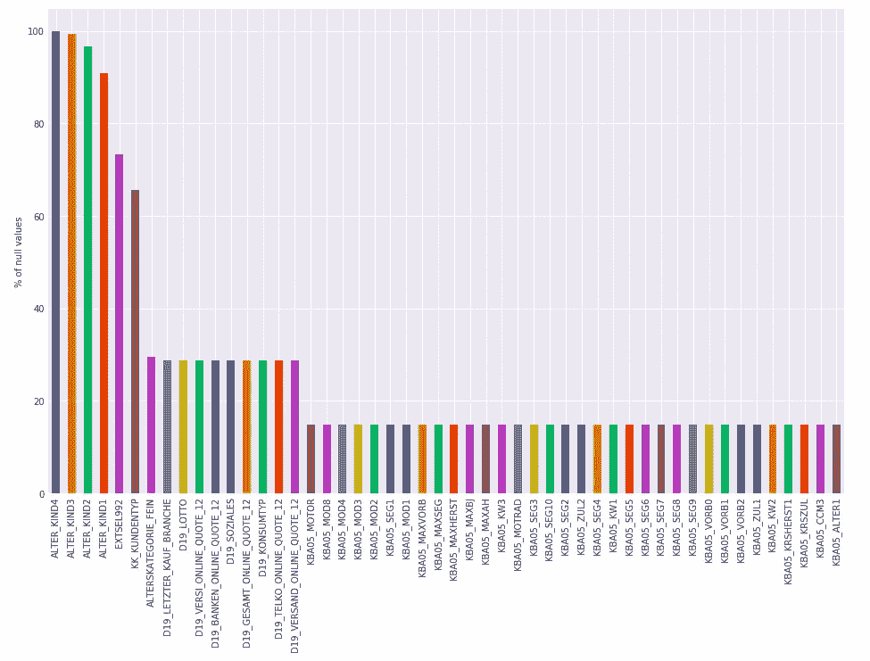

图 1:一些特性中空值的百分比

*   通过查看随数据集一起提供的要素描述文件，我们发现数据集中的一些值被标记为*未知*。

图 2:标记为未知的属性值

我们用 NaNs 代替所有这些未知值。在这之后，我们重新检查每一列和每一行中的空值的百分比，这些值可能会由于这种替换而增加。如果发现任何行/列超过阈值，我们就删除它。

*   如果发现具有高相关性(> 80%)的特征对，则丢弃其中一个以避免信息中的冗余。
*   我们丢弃基数高(> 15)的分类特征，并在必要时对它们进行编码。
*   如果有重复的行，我们删除所有的行，只保留第一个出现的行。
*   我们计算数据集中每个条目的 z 得分，并将 z 得分绝对值大于 3 的条目标记为异常值。如果任何列/行中有显著百分比的异常值(*，例如*)。，> 10%)，我们立即放弃。
*   使用 scikit-learn 库的估算类的策略*最频繁*和*中值*(取决于特性)估算数据集的空值。
*   最后，我们标准化所有的特性。

## 2.降维

即使在数据清理之后，我们发现数据中仍然存在大量的特征。因此，在尽可能多地保留信息的同时，尝试降低数据集的维度是一个好主意。这可以通过使用主成分分析(PCA)技术来实现，在该技术中，我们将数据集从原始特征空间转换到由不相关主成分跨越的新空间。这些主成分是原始特征的线性组合，说明了数据中的差异。在目前的分析中，我们选择了 150 个主成分来解释数据中超过 85%的方差。

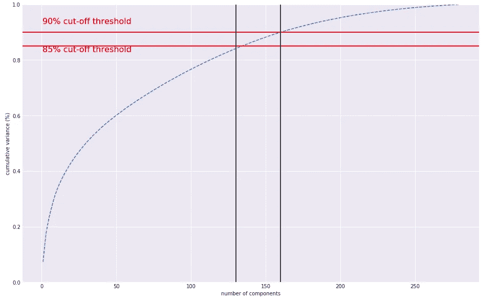

图 3:作为主成分数量函数的累积方差

我们发现正相关和负相关的特征都存在于主成分中。

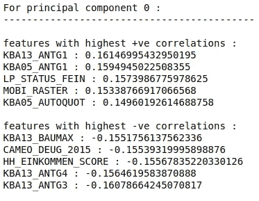

图 4:第一主成分中前 5 个正相关和负相关的特征

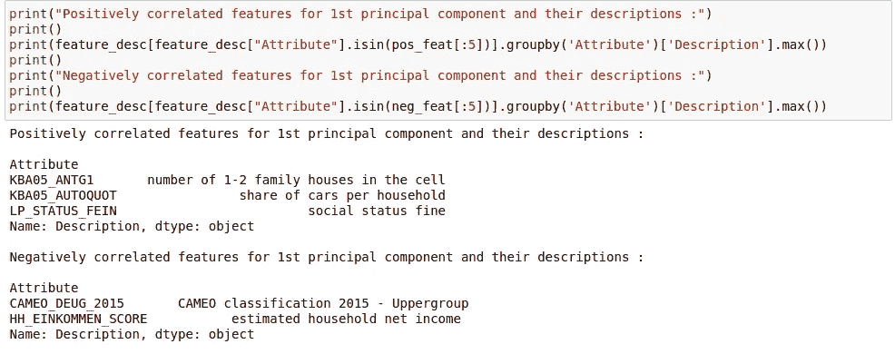

图 5:第一个主成分中的顶部正相关和负相关特征的描述

通过查看特征描述文件，我们发现第一主成分中的顶级特征与个人的财务状况相关，*例如*，他们拥有多少套房子，拥有多少辆汽车，他们属于社会的哪个阶层，总收入等等。

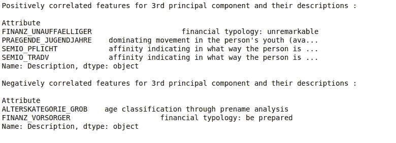

图 6:第三个主成分中最高正相关和负相关特征的描述

另一方面，第三主成分主要由与个人特征相关联的特征支配，*例如*、年龄、传统心态、尽职尽责、社会参与等。

## 3.使聚集

最后，是时候根据人们在特征(或主成分)空间中的距离对他们进行分组，为此，我们使用聚类技术，特别是 *k 均值聚类。*该算法最重要的超参数是要形成的簇的数量，n_clusters。找到这个数的传统方法是使用肘图，肘图是度量*‘组内平方和’*(wcss)作为组数的函数的分布图。随着聚类数量的增加，wcss(质心和聚类中其他数据点之间的平方距离之和)减少。可以从图中选择最佳的聚类数作为一个点，超过该点，度量不再变化或者变化不显著。

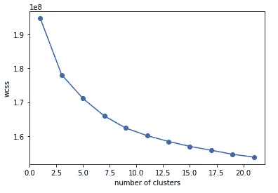

图 7:肘图

对于当前的分析，我们选择 12 个聚类，并对人口和客户数据运行 n_clusters=12 的 k-means 算法，以形成由不同特征集表征的聚类。回想一下，我们的目标是确定哪部分人群与现有客户最相似。可以通过比较每个集群中人口和客户的比例来实现这一点。

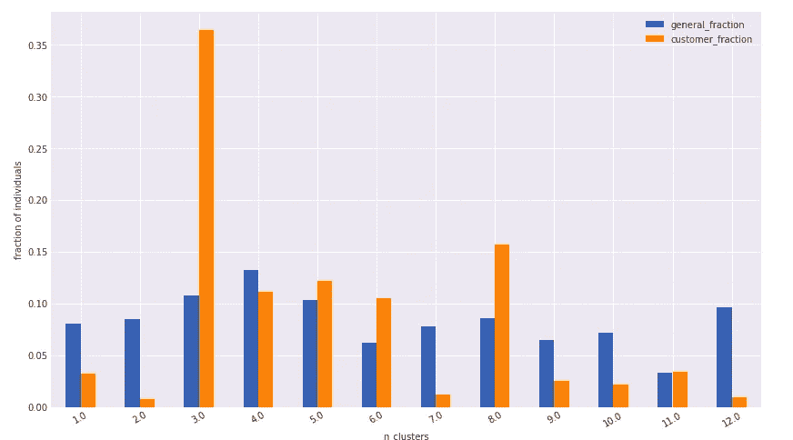

图 8:每个集群中普通人群和客户的比例

如果对于一个聚类，客户部分大于人口部分，则属于该部分特征空间的人更有可能变成公司的客户，因此是公司的目标基础。从上面的图中我们可以看出，在即将到来的营销活动中，公司的目标人群应该是第 3、8、5、6 群，也许是第 11 群(按这个顺序)。

# 构建预测模型

该项目的最后一部分要求我们建立一个模型，给定一组与个人相关的特征，该模型将能够预测该人对该活动做出积极响应的可能性。提供了两个数据集，一个用于训练，一个用于测试模型。数据集严重失衡，只有很少的样本(~ 1%)来自积极类(*即*，做出回应的人)。

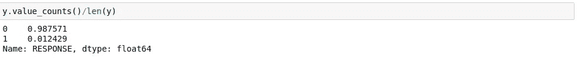

图 9:目标变量 y 中类的比例

因此，与其预测一个人属于哪个阶层，不如计算一个人转化为客户的概率更有意义，这样公司就可以瞄准具有高响应概率的人。因此，我们计算 ROC 曲线下的面积(假阳性率对真阳性率)来评估模型的性能。

在此分析中，我们考虑了 4 种分类算法——逻辑回归、随机森林分类、Adaboost 分类，最后是 XGB 分类，并对每种算法执行网格搜索，以找出具有最佳参数集的最佳模型，该模型在网格搜索过程中对遗漏的数据给出最高分。

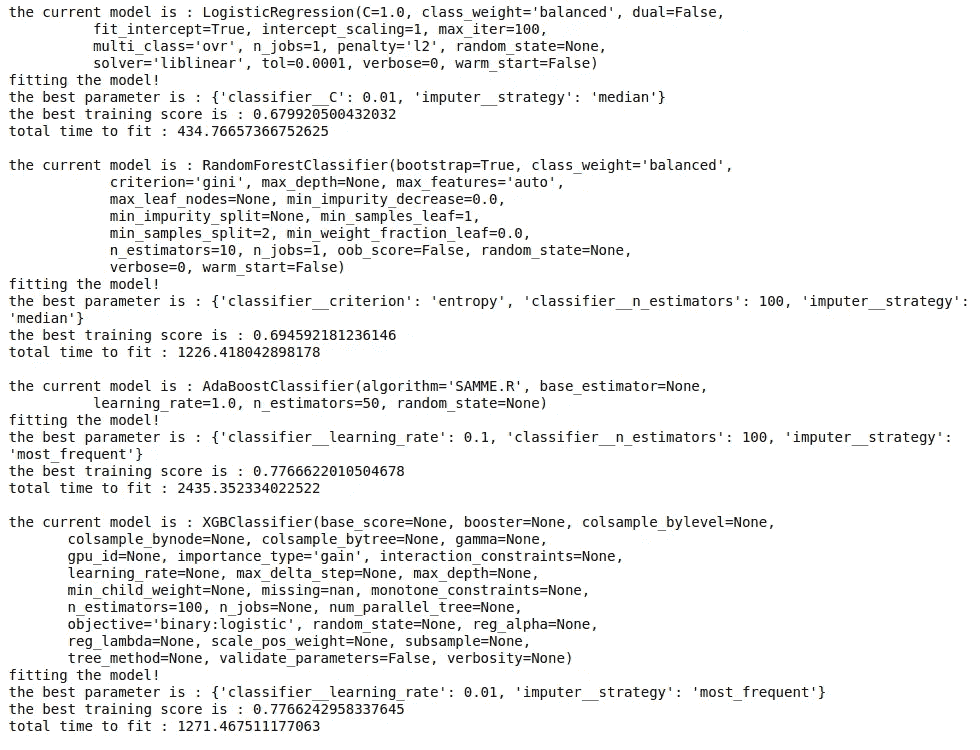

图 10:模型性能的总结

虽然 Adaboost 和 XGB 分类产生几乎相等的 ROC 分数，但我们选择 XGB 分类器，因为它比 Adaboost 分类器花费更少的时间来训练模型。我们模型的一些重要特征(使用 *feature_importance_* 属性计算)显示在下图中:

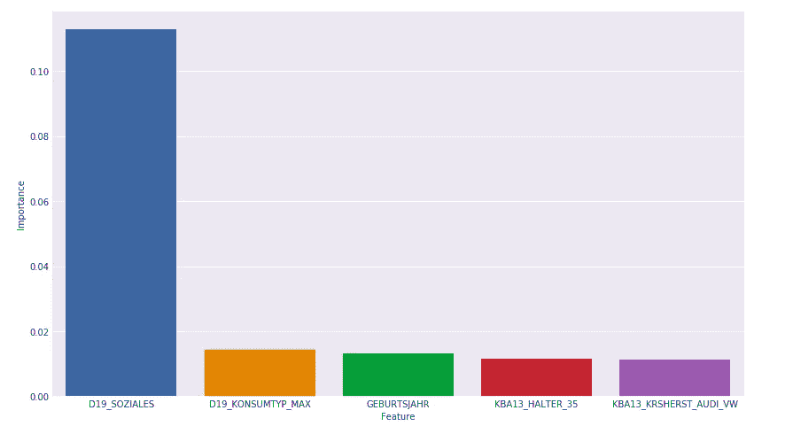

图 11:最终模型的前 5 个特性的重要性

显然，功能“D19_SOZIALES”优于其他功能。虽然我们没有这个功能的描述，但它很可能与个人的社会问题有关(感谢谷歌！).类似“GEBURTSJAHR”、“KBA13_HALTER_35”的下一个重要特征与年龄有关，这是关于个人拼车的信息。

唯一剩下的部分是预测测试数据集中每个个体的响应概率。下表显示了我们在测试数据集上运行模型后得到的几个个体(由 LNR 列中的唯一 id 号标识)的响应概率。

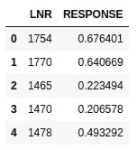

图 12:测试数据集中一些个体的响应概率

# 我们可以在哪里改进？

我们在这个项目中处理的数据集包含大量的特征。这使得我们可以利用它们来获得越来越精确的结果。可能需要进一步关注的一些领域如下:

*   这个项目的主要挑战是数据争论。尽管我们删除了具有大量缺失值的特性，但是我们可以尝试从这些特性中设计新的特性，并编码它们对最终结果的间接影响。
*   空值的插补可以高度定制化。然而，这需要关于相关特征的更多信息。
*   应该尝试对分类模型进行更精细的超参数扫描。另外，考虑其他分类算法也是一种选择。
*   由于我们的数据集是严重不平衡的，所以可以尝试不同的技术来提高少数(*即*，正类，*如*)类的模型性能，简单地过采样少数类和欠采样多数类，使用 SMOTE 技术合成少数类的新示例，等等。

> 你可以在我的 [GitHub 库](https://github.com/nabanitarimpi/Udacity-Aravato-Capstone-Project)上查看分析的全部代码。编码快乐！