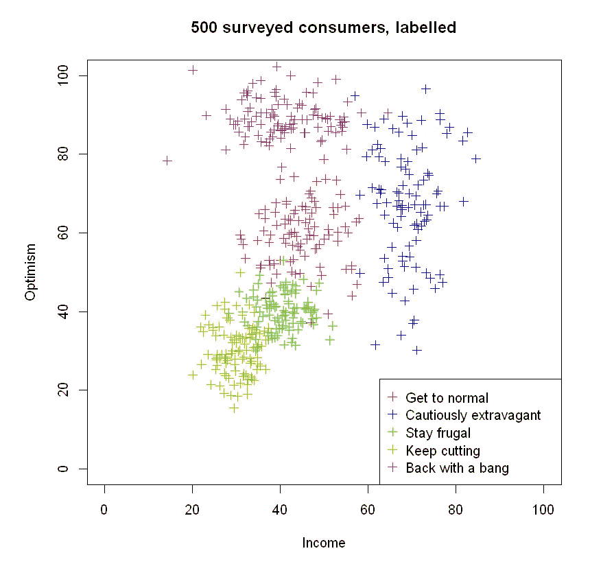
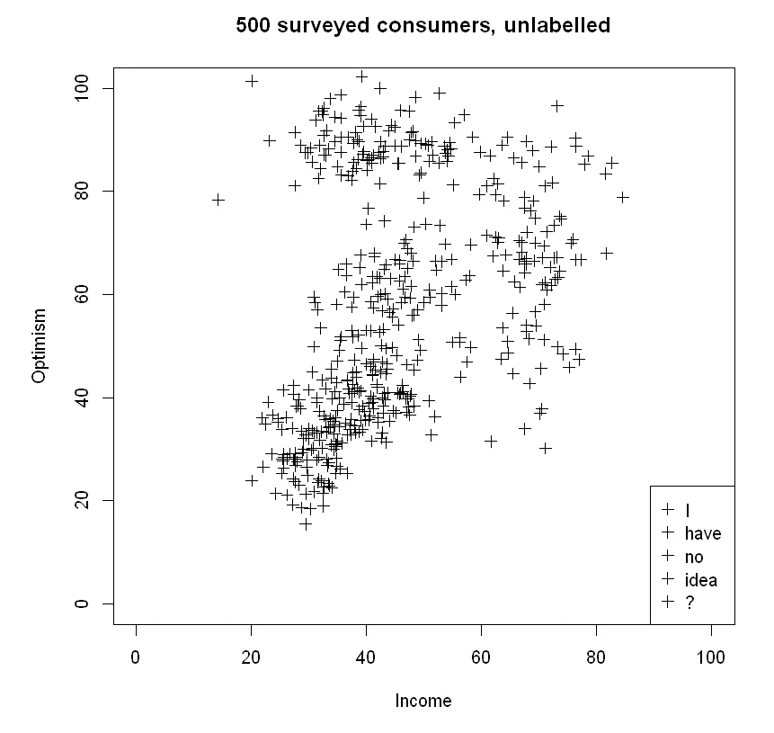
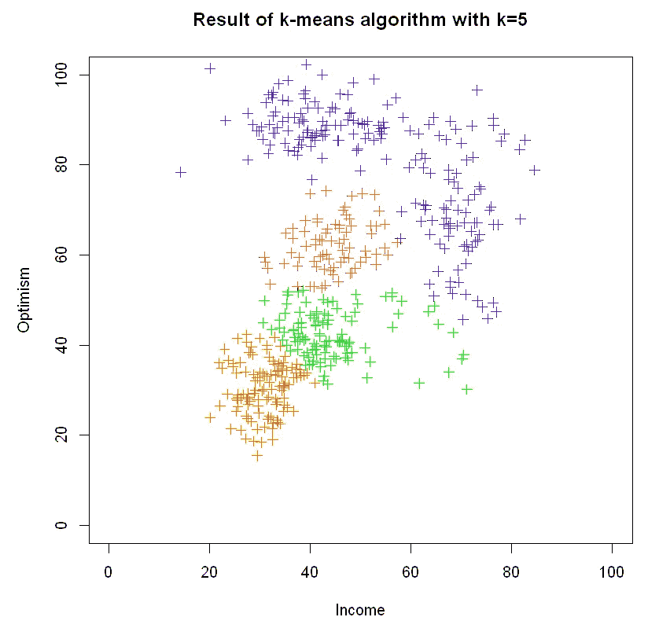
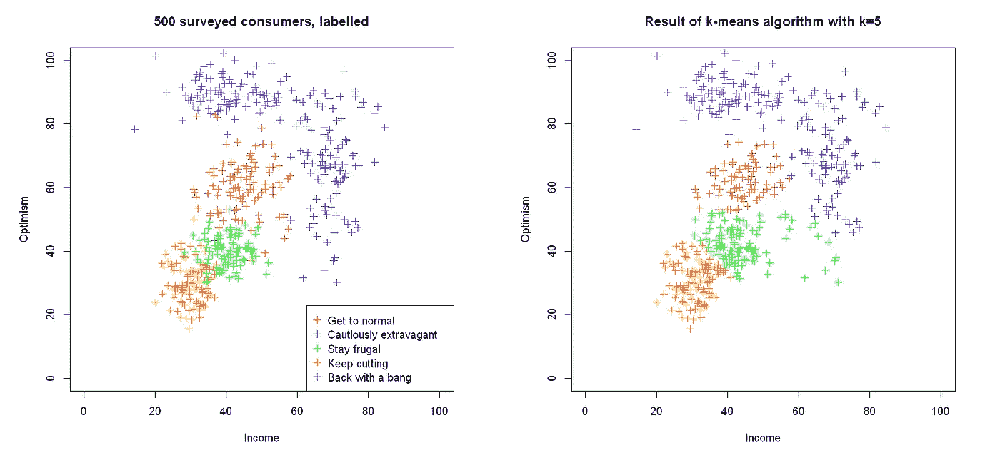

# 用 k 均值识别新兴市场

> 原文：<https://towardsdatascience.com/identifying-emerging-market-segments-with-k-means-bf221147528f?source=collection_archive---------47----------------------->

## 数据如何在疫情过后有所帮助


在 [Unsplash](https://unsplash.com/s/photos/sunrise?utm_source=unsplash&utm_medium=referral&utm_content=creditCopyText) 上由 [OC Gonzalez](https://unsplash.com/@ocvisual?utm_source=unsplash&utm_medium=referral&utm_content=creditCopyText) 拍摄的照片

[EY 的未来消费者指数](https://www.ey.com/en_gl/consumer-products-retail/how-covid-19-could-change-consumer-behavior)是一个 8 分钟的简短读数，汇集了 2020 年 4 月 6 日一周内对美国、加拿大、英国、法国和德国 4859 名消费者的调查结果。利用一些相当时髦的数据可视化技术，EY 提出，在新冠肺炎疫情事件之后，将出现五种不同类型的消费者，每种消费者在购买决策方面都有不同的行为和情绪。其中一些人很悲观——大幅削减支出——而一些人非常乐观，随着社交距离限制的逐渐取消，他们会抓住机会增加支出。

除了一般的定性描述之外，我们还不清楚 EY 到底是如何定义这五种类型的(“回归正常”、“谨慎奢侈”、“保持节俭”、“不断削减”和“大力反击”)。然而，它确实让我思考。ey 考虑的两个关键变量是乐观度和收入。显然，乐观与消费者的消费意愿有关，而收入与他们的消费能力有关——两者都会影响个人的购买决策。假设我们可以获得消费者相对乐观程度和收入的定量数据。我们如何根据这些数据，以严格且可重复的方式将客户分组？

## **k 均值算法**

[k-means 聚类](https://en.wikipedia.org/wiki/K-means_clustering)是一种将多个点分成 k 组的方法。简而言之，该算法搜索 k 个“质心”的空间，并将每个数据点分配给这些质心之一。该算法然后反复迭代，旨在最小化每个点簇内的方差。通过这种方式，我们最终找到了(希望)不同的 k 个组，它们反映了数据中组的真实性质。

举例来说，让我们创建一个数据集，其中有五组，每组 100 名消费者，并在 r 中实现 k-means 算法。假设每组都有一个典型的收入和乐观水平，围绕这些值有一些自然变化。我们可以用图形表示这种情况，如下所示:

```
[...] # Set seed and generate data for 100 consumers from each groupincomes <- cbind(normal_incomes, extravagant_incomes, frugal_incomes, cutting_incomes, bang_incomes)optimisms <- cbind(normal_optimisms, extravagant_optimisms, frugal_optimisms, cutting_optimisms, bang_optimisms)colours <- c("red", "blue", "green", "orange", "purple")# Set up an empty plotting area
plot(NULL, xlim=c(0,100), ylim=c(0,100), xlab="Income", ylab="Optimism", main="500 surveyed consumers, labelled")# Plot data points
for (i in 1:5){
  points(incomes[,i], optimisms[,i], col=colours[i], pch=3)
}[...] # Add legend
```



有两个变量的情况特别容易思考，因为每个点都位于 2D 收入的某个地方——乐观“空间”。然而，k-means 算法可以应用于任意数量的维度，也就是说，我们可以轻松地扩展我们的模型，以包括第三个变量(可能与消费者居住的国家有关，因为不同的政府采取了不同的措施来应对病毒)，第四个变量，甚至更多。

当然，在现实世界中，我们不会事先知道这些群体的特征——我们甚至不知道有多少个群体！所以暂时忘记我到目前为止告诉你的，看看你是否能把下面的数据分组:



没那么简单，是吗？确定一些集群是完全可能的，但是有多少个集群，一个集群在哪里结束，另一个集群在哪里开始？问十个不同的人，你会得到十个不同的答案。但是有了 k-means，我们可以采用一种数学的、数据驱动的方法，每次都会给出相同的答案。让我们应用算法，看看我们得到了什么:

```
[...] # Aggregate data into one matrix with incomes in the first column and optimisms in the second# Fit model using k-means
model <- kmeans(data[,1:2], centers=5)# Retreive centroids
centroids <- model$centers
centroids#     income optimism
# 1 68.76713 58.50722
# 2 43.95596 57.64992
# 3 65.51750 83.71031
# 4 34.73630 34.00436
# 5 39.11255 89.01036# Retreive clusters
clusters <- model$cluster
clusters# [1] 2 2 1 2 2 2 2 2 2 3 2 2 2 2 2 2 2 2 2 2 2 1 2 2 2 2 2 2 2 2 2 2 2 2 5 2 2 2 2 2 2 2 2 2 2 5 2 2 2 2 4 2 2 2 2 2 2 4 2 5 2 2 2 2 2 2 2 2 2 2 5 2 2 5 2 5 1 2 2 2 2 2 4 2 2 2 2 2 2 2 2 2 2 2 2 2 2 2 2 2 1 1 1 1 ...
```

我们可以看到，按照要求，k-means 已经找到了五个质心，并根据每个数据点到质心的距离，将每个数据点分类到五个聚类之一。让我们将我们的结果绘制成图表，以便更好地理解:

```
# Add k-means cluster result to the data
data <- cbind(data, clusters)# Define function to map cluster number to a colour
map_colours <- function(num){
  colours[num]
}# Apply function to data
clusters_colours <- lapply(clusters, map_colours)# Set up empty plotting area    
plot(NULL, xlim=c(0,100), ylim=c(0,100), xlab="Income", ylab="Optimism")# Plot data points
for (i in 1:500){
  points(data[i,1], data[i,2], col=colours[as.integer(data[i,4])], pch=3)
}
```



最后，进行横向比较:



我们可以看到 k-means 总体上做得相当不错——该算法已经能够从乐观程度和收入方面挑出五个群体的一般特征。在这个例子中，我们手头有基本事实，因此我们可以看到 k-means 将一些更悲观的“谨慎奢侈”的消费者分组到“保持节俭”集群的大部分中。虽然我们知道 k-means 在这方面的问题是“错误的”，但这五种类型的消费者之间无疑有重叠的地方。这甚至可能被证明是一种有用的见解——该算法指出了这些消费者之间的相似之处，否则我们可能不会发现。

## **结论**

k-means 算法[确实有其局限性](https://stats.stackexchange.com/questions/133656/how-to-understand-the-drawbacks-of-k-means)，但它可以揭示数据中的模式和趋势，这些模式和趋势可能不会立即被人眼看到。这就是为什么当我们试图理解一个新的和不熟悉的数据集时，聚类算法经常被用在[探索性数据分析](https://en.wikipedia.org/wiki/Exploratory_data_analysis)中。每当我们进行购买时，我们都会继续以惊人的速度产生数据——你可以打赌，随着经济在大流行后的世界中逐渐复苏，将会有无数的分析师使用这样的技术，希望能够弄懂这一切。

# 更多信息和积分

Andrew Hetherington 是英国伦敦的一名见习精算师和数据爱好者。

*   在 [LinkedIn](https://www.linkedin.com/in/andrewmhetherington/) 上与我联系。
*   看看我在 [GitHub](https://github.com/andrewhetherington/python-projects) 上摆弄什么。
*   用于制作本文作品的笔记本可以在[这里](https://github.com/andrewhetherington/python-projects/blob/master/Blog%E2%80%94Emerging%20market%20segments%20with%20k-means/Blog%E2%80%94Detecting%20emerging%20market%20segments%20with%20k-means.ipynb)找到。

图片:由 [OC Gonzalez](https://unsplash.com/@ocvisual?utm_source=unsplash&utm_medium=referral&utm_content=creditCopyText) 在 [Unsplash](https://unsplash.com/s/photos/sunrise?utm_source=unsplash&utm_medium=referral&utm_content=creditCopyText) 上拍摄。

所有的情节和代码输出都是作者使用 [R](https://www.r-project.org/about.html) 和 [RStudio](https://rstudio.com/) 创建的。