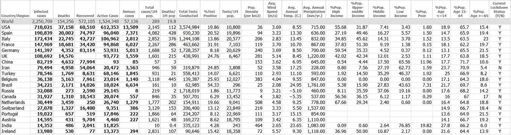
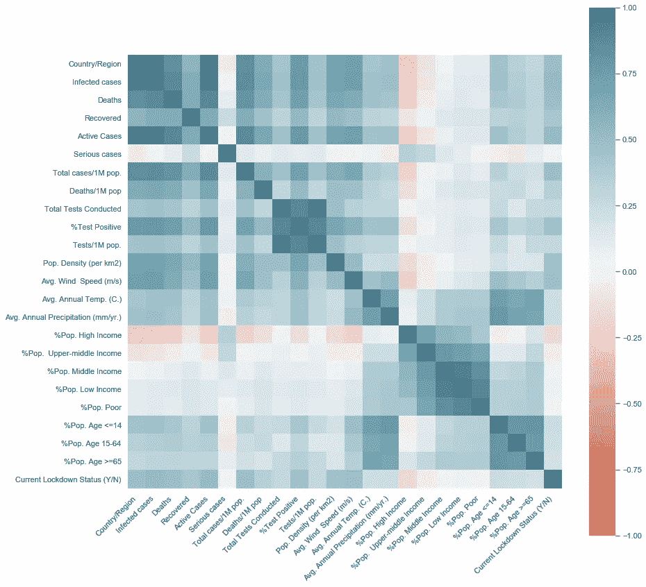
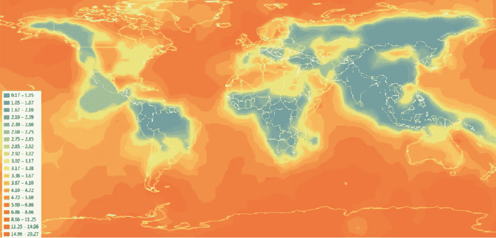
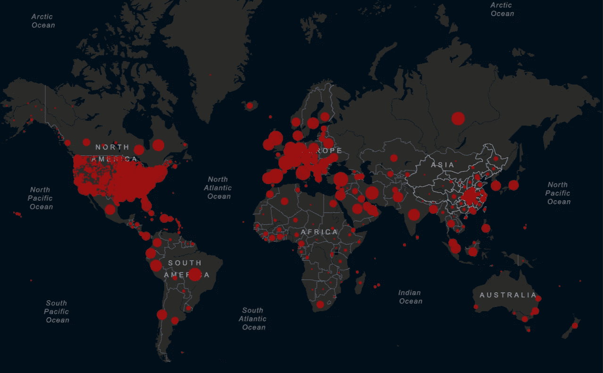
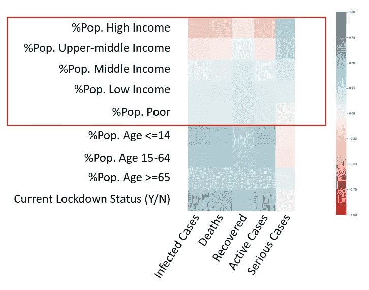

# 分析可能影响冠状病毒传播的因素

> 原文：<https://towardsdatascience.com/identifying-factors-that-leads-to-increased-infection-cases-with-correlation-analysis-e49d75eebbb5?source=collection_archive---------41----------------------->

## 使用 Python 创建和分析相关性矩阵的分步指南

本文将通过这个过程来执行一个简单的相关性分析。我们将使用冠状病毒感染数据以及我们认为可能影响感染病例的其他关键因素来分析 Python 上各因素之间的相关性。

虽然有其他方法也可以揭示因素之间的关系，但相关矩阵是筛选高度相关因素进行分析的最简单工具之一。但是，它也有自己的局限性。因此，重要的是要注意，分析的结果不是过程的结束，而是进一步探索和验证因素之间关系的起点。

# 了解数据集



数据集的前 20 行数据(总共 213 行)

我们将使用的数据集包含 Worldometer [1]按国家(截至 2020 年 4 月 17 日)报告的冠状病毒病例。“空白”单元格表示数据不可用。如果你想要一个更新的版本，请随时用最新的数据更新专栏。您可以在此处获得初始数据集:

[https://gist . githubusercontent . com/Coronavirus-20/ecbb 27016122 e 91 ab4 a 273195d 89 b 0d 9/raw/B3 ce 86 ddfa 4a 93391 DD 1a 08400277 bea 51 a5 f 386/Coronavirus _ 17 apr . CSV](https://gist.githubusercontent.com/Coronavirus-20/ecbb27016122e91ab4a273195d89b0d9/raw/b3ce86ddfa4a93391dd1a08400277bea51a5f386/Coronavirus_17Apr.csv)

从数据集来看，我们假设有几个因素可能会影响冠状病毒数据点，如下所示:

1.  同ＰＯＰＵＬＡＴIＯＮ密度(每公里):全国平均每平方公里人口密度(资料来源:Worldometer，2020 年)
2.  平均值。风速(米/秒):距地面 10 米处的平均风速*(来源:GlobalWindAtlas，2019)*
3.  平均值。全年温度。(c .):以摄氏度记录的年平均温度*(资料来源:Mitchell，T.D .，Carter，T.R .，Jones，P.D .，Hulme，m .，New，m .，2003 年:欧洲和全球月气候综合高分辨率网格:观测记录(1901-2000 年))*
4.  平均值。年降水量(毫米/年。):以毫米为单位的平均年降水量*(资料来源:世界银行，2014)* —最初，我们希望找到*%相对湿度*数据，但由于数据相对有限，因此我们必须使用降水量，因为它与湿度高度相关
5.  %Pop。高收入:日收入超过 50 美元的人口比例*(资料来源:皮尤研究中心，2011 年)*
6.  %Pop。中上收入:日收入 20.01-50 美元的人口比例*(资料来源:皮尤研究中心，2011 年)*
7.  %Pop。中等收入:日收入 10.01-20 美元的人口比例*(资料来源:皮尤研究中心，2011 年)*
8.  %Pop。低收入:日收入 2.01-10 美元的人口比例*(资料来源:皮尤研究中心，2011 年)*
9.  %Pop。穷人:日收入≤2 美元的人口比例*(资料来源:皮尤研究中心，2011 年)*
10.  %Pop。年龄≤ 14 岁:2017 年年龄≤ 14 岁的人口比例*(资料来源:世界银行，2017)*
11.  %Pop。15-64 岁:2017 年 15-65 岁人口的百分比*(资料来源:世界银行，2017)*
12.  %Pop。年龄≥ 65 岁:2017 年年龄≥ 65 岁人口的百分比*(资料来源:世界银行，2017)*
13.  当前锁定状态(Y/N):如果在撰写本文时在该国的任何地区实施了任何类型的锁定，则值为“是”

正如你所看到的，有些数据可能有点太旧了，有些是全国或年度平均值的形式。这是因为这些因素的许多开源详细数据是不可用的。尽管如此，我们仍将利用这些数据来了解现阶段的总体数据趋势。如果可以得出任何有意义的见解，我们总是可以将我们的方法集中在更细粒度的相关因素上。

# 用 Python 分析数据

既然我们已经准备好了数据集，我们将开始在 Python 上分析相关矩阵。首先，我们需要导入以下库。

```
**import** pandas as pd
**import** seaborn as sns
```

然后，我们导入数据集。在这里，我们可以直接从存储库中导入数据集，或者您也可以保存文件并使用' *read_csv* '或' *read_excel* '在本地导入数据集(如果您已经以 excel 格式保存)。

```
# Import the datasetdf = pd.read_csv(r'*FILE_PATH*\*FILE_NAME.csv*') # Data Previewdf.tail()
```

Python 上呈现的示例数据如下:

```
Country/Region              Infected  ...  %Pop. Age >=65  \
0                    World   2250709  ...             NaN   
1                      USA    710021  ...            15.4   
2                    Spain    190839  ...            19.4   
3                    Italy    172434  ...              23   
4                   France    147969  ...            19.7   
..                     ...       ...  ...             ...   
208            South Sudan         4  ...            3.4    
209               Anguilla         3  ...             NaN   
210  Caribbean Netherlands         3  ...             NaN   
211  Saint Pierre Miquelon         1  ...             NaN   
212                  Yemen         1  ...            2.9Current Lockdown Status (Y/N)  
0                              NaN  
1                                Y  
2                                Y  
3                                Y  
4                                Y  
..                             ...  
208                              N  
209                              N  
210                              N  
211                              N  
212                              N
```

正如您所看到的，有些记录包含“NaN”数据，这是因为缺少源级别的数据。然后，我们将不得不替换这些“NaN ”,以便我们可以继续分析数据集。

```
df_fill = df.fillna("")
```

这样，我们将用空白或“0”替换“NaN”。现在，清理完数据后，我们将直接进入数据分析。既然我们的目标是找到可能影响总感染病例或死亡率的因素，那么为什么不尝试相关图来查看每个因素之间的关系。

# 绘制相关矩阵

> 规则 1:相关性≠因果关系。相关性并不意味着因果关系，即使这两个因素之间有很高的相关性。因此，在建立因果联系之前，我们必须对这些因素之间的关系进行更多的研究。

首先，为了绘制因素之间的相关性，我们必须确保所有的值都是数字，以便我们可以计算相关系数。锁定状态等分类数据以“Y”或“N”格式列出。我们需要将它们转换成数字格式。通过因式分解，我们可以将“Y”和“N”分别转换为类似“0”和“1”的值。

```
df_num = df_fill.apply(lambda x: pd.factorize(x)[0])+ 1
```

你会注意到我在末尾加了+1。这是因为我不想将某个类别转换为“0”。我希望它从“1”开始。虽然这不会影响相关性分析，但是当我们在列之间进行操作时，这是很有用的。您不会希望在划分两列时发现某些值被“0”所除。

接下来，我们将绘制每个因素之间的相关性。在这里，我们将使用' *seaborn* '软件包以热图的形式绘制相关性。

```
corr = df_num.corr()ax = sns.heatmap(corr,vmin=-1, vmax=1, center=0,cmap=sns.diverging_palette(20, 220, n=200),square=True)ax.set_xticklabels(ax.get_xticklabels(),rotation=45,horizontalalignment='right');
```

瞧，我们现在得到了数据集的相关矩阵。



相关矩阵的每个网格都填充有不同的蓝色阴影(代表因素之间的正相关程度)和红色阴影(代表因素之间的负相关程度)

如果文本都被塞满了，或者图形太小而没有意义，你可能不得不用“ *figsize* 值来调整图形大小，并重新运行上面的相关代码。

```
sns.set(rc={'figure.figsize':(15,15)})
```

# 相关性分析

在这里，我们将从相关矩阵中筛选出因素并形成假设。有许多网格和区域是非常相关的。而其中一些是提供冗余信息的密切相关的因素(例如“测试阳性”与“活动病例”、“感染病例”与“死亡”等。)，还有其他几个现阶段略显牵强，无关紧要的(例如。当前锁定状态与%Pop。年龄≥ 65 '，'平均。风速(米/秒)与流行。密度(每平方公里)等。).因此，我们寻找介于这两个极端之间的高度相关的因素是很重要的。这些通常是我们可以形成假设来进一步证明因果关系的。一些假设如下:

**答:“平均风速”与“感染病例”**:这两个因素之间的相关性是相当深蓝的。虽然没有直接信息表明这两个因素之间的直接关系，但这种关系可能值得进一步探讨。据报道，来自被感染患者的病毒飞沫可以传播并感染附近的其他病原体。(更新:最近有报道称在空气污染颗粒上发现了病毒株[6])。风速可能会影响这些水滴的飞行距离，反之亦然。

如果观察下面的地图，美国东海岸中部高度受影响地区的平均风速似乎高于西海岸[2]。这似乎与编写本报告时迄今为止发现的病例分布情况有关。

当然，也可能有其他气候因素影响风或空气，这也可能与报告的病例数量相关。例如，有数据表明高湿度可以减缓流感的传播[3]。与相对湿度(%)数据最接近的数据是相关矩阵中的年平均降水量数据。

因此，我们需要找到更精细的数据，然后才能分析和确定感染病例上升与更高风速(或任何气候因素)之间的因果联系。



2015 年全年地面以上 10 米处的全球平均风速[2] —颜色越红表示该区域的平均风速越高。你可以看到美国东海岸、英国、冰岛和地中海大部分是红色或黄色的。



更新:约翰·霍普斯金大学发布的截至 2020 年 4 月 24 日的全球报告病例地图[5]

B. '%Pop。高收入'& '%Pop。“中上收入”与感染数据:这两个相关性呈浅红色。事实上，与感染数据相比，高收入和中高收入人群大多为红色。当您将这一部分与其余三个收入部分一起看时，低收入和贫困部分似乎比中上收入及以上部分与案件数量和活跃案件数量更呈正相关(尽管略有正相关)。

关于人口统计学和报告病例之间关系的假设并不新鲜。有数据表明，富人可能有更多的机会来抵御病毒。例如，与可能在一线工作的低收入阶层相比，上层阶级确实可以在家工作，并且在封锁期间可以维持相对较高的收入[4]。

因此，这些相关数据是我们理解不同收入阶层如何受到流行病影响的起点。如果因果关系完全成立，那么这应该是世界各国政府在这些艰难时期提供援助和支持以帮助那些需要帮助的人的首要任务之一。



最高收入人群与报告病例总数、死亡人数和活跃病例数呈负相关(基于 2020 年 4 月 17 日的报告病例[1])

**C .其他值得注意的关系**:**从这个相关矩阵中我们还可以探索出很多东西。**

1.  ‘砰’的一声。“密度(每平方公里)”与“感染病例”:这一点可能并不令人惊讶。我们知道这种病毒通过密切接触传播。但是，这一点可以与' Avg '结合使用。风速(m/s)”来建立预测感染病例的模型，因为这两个因素与“感染病例”高度相关。
2.  *’%波普。“年龄≥65”与“严重病例”*:这一个可能有点棘手，因为相关系数似乎只有轻微的正相关。这并不一定说明大部分重症患者年龄在 65 岁及以上(切记:相关≠因果)。事实上，甚至有一些关于这种冠状病毒对不同年龄组患者免疫系统的影响的报告，并导致其过度活跃(也称为“细胞因子风暴”)。因此，我们不能仅由此得出因果关系。然而，这条相关信息确实表明，“老年公民比例较高的国家可能面临严重病例的风险”的可能性相当小。
3.  *“当前封锁状态”与感染数据*:许多人会惊讶为什么封锁状态与感染病例正相关。在这里，我们见证了游泳者的身体错觉。由于许多国家在其领土内遇到感染病例后实施封锁，因此封锁数据往往与该特定区域的感染报告流行率相关。因此，我们可以相当肯定，在这种情况下，案件的数量导致封锁，而不是相反。

# 含义

随着封锁的最后期限越来越近，许多人担心感染病例可能会激增，第二波感染会再次出现。因此，至关重要的是，要有一个计划来处理解除封锁前可能发生的情况。

想象一下，如果上述相关性确实有直接的因果联系。然后，我们将不得不重新思考我们应对流行病的方式，尤其是在封锁后。

1.  如果风速确实与感染率有因果关系，那么 6 英尺的社交距离。(1.83 米)可能还不够。对于有风的地方，我们可能需要保持更远的距离，以避免感染。季节性也可能影响感染率，因为春季(大约 3-4 月)或热带地区即将开始的雨季风速可能较高。如果这是真的，与北半球或南半球的国家相比，赤道附近的国家在今年下半年遏制病毒的形势可能会更加严峻。
2.  如果确实有很大一部分感染者来自低收入阶层，那么世界各国政府早就应该开始规划和推出计划，在不同国家解除封锁之前，提前系统地援助穷人。这种援助可能以不同的形式出现，可以减轻他们可能面临的经济和工作保障问题。

当然，戴上口罩，保持距离，防止与面部(尤其是鼻子和眼睛等软组织)的任何接触，不仅重要，而且是在这个可怕的时刻拯救你所爱的人的必要条件。然而，探索其他见解对一般预防措施也是有用的，特别是如果你曾经处于这样一个几乎没有防护设备的位置。

# 下一步是什么？

鉴于这些只是相关性数据，真正的工作将从这里开始。我们需要对这些因素之间的关系进行更多的研究，以证明(或否定)这些假设，然后才能得出关于因果关系的公正结论。

除了研究之外，我们可能还需要更新数据集，以更好地反映当前的情况(更新:污染数据集也可能被添加，因为有报告称在污染颗粒上发现了病毒株[6])。今后，我们可以以时间序列的形式收集数据，以便更好地分析趋势。在这种情况下，城市或月度数据也可能是有用的，因为我们将能够避免使用大面积平均数据的问题，这可能会导致错误。然后，我们可以使用收集到的精确数据，使用相关矩阵或*预测能力评分(PPS)* 进行重新分析，这可能会产生新的见解。

此外，对于某个区域，可以基于所述因素训练简单的预测模型。预测某个地区未来病例数的线性回归模型示例可以写成如下形式:

> *感染病例(第 N+1 天)~平均值。风速(过去 1 周——或潜伏期)+人口密度+当前活跃病例*

这样我们也可以测试这些因素的假设是否成立。如果测试集上的预测准确性很差，那么我们可能必须改变回归模型中的因子(或找到新的因子)。

最后，我希望这篇文章已经帮助您不仅为这个数据集，而且为您可能有的任何自定义数据集创建了简单的相关矩阵。注意安全！

# 参考

[1]: Worldometer。(2020 年 4 月 17 日)。*各国冠状病毒报告病例。*[https://www.worldometers.info/coronavirus/](https://www.worldometers.info/coronavirus/)

[2]:格拉西、维罗内西、申克尔、佩尔、纽科姆、沃尔克温、马丁、胡尔尼。(2015).*使用开源 GIS 数据绘制全球风能潜力图*

【3】:风大。外部温度会影响冠状病毒/新冠肺炎吗？[https://www . windy . com/articles/does-outside-temperature-influence-the-spreading-of-coronavirus-新冠肺炎-11519？13.762，100.532，5](https://www.windy.com/articles/does-outside-temperature-affect-the-spreading-of-coronavirus-covid-19-11519?13.762,100.532,5)

【4】:石英。*冠状病毒预防对富人来说更容易获得。*[https://qz . com/1818862/coronavirus-prevention-is-more-accessible-for-the-rich/](https://qz.com/1818862/coronavirus-prevention-is-far-more-accessible-for-the-rich/)

更新:

[5]:约翰·霍普斯金大学。*约翰·霍普金斯大学(JHU)系统科学与工程中心(CSSE)的新冠肺炎仪表板。*[https://gisanddata . maps . ArcGIS . com/apps/ops dashboard/index . html #/BDA 7594740 FD 40299423467 b48e 9 ECF 6](https://gisanddata.maps.arcgis.com/apps/opsdashboard/index.html#/bda7594740fd40299423467b48e9ecf6)

[6]以色列时报。*意大利科学家在空气污染颗粒上发现冠状病毒*。[https://www . timesofisrael . com/scientists-in-Italy-find-coronavirus-on-air-pollution-particles/](https://www.timesofisrael.com/scientists-in-italy-find-coronavirus-on-air-pollution-particles/)

> 未来历史学生注意:在撰写本文时，冠状病毒感染已超过 200 万例。政府正在加紧实施和延长封锁，以延缓感染的激增。医务人员和设施都很紧张。世界各地的各种研究实验室正在加速疫苗项目，这些项目仍处于试验阶段，可能需要几个月的时间。继续战斗！