# 识别假新闻:骗子数据集及其局限性

> 原文：<https://towardsdatascience.com/identifying-fake-news-the-liar-dataset-713eca8af6ac?source=collection_archive---------36----------------------->

马克斯·穆塞尔曼在 [Unsplash](https://unsplash.com/s/photos/fake-news?utm_source=unsplash&utm_medium=referral&utm_content=creditCopyText) 上拍摄的照片

我正在进入 Metis 数据科学训练营的最后阶段，只剩下一个项目了。我做的前三个项目如下:

*   [MTA 十字转门数据:我对数据科学项目的第一次体验](/mta-turstile-data-my-first-taste-of-a-data-science-project-493b03f1708a)
*   [MyAnimeList 用户评分:网络抓取和线性回归的乐趣](/myanimelist-user-scores-fun-with-web-scraping-and-linear-regression-9dd97900a82b)
*   [是拖网渔船捕鱼吗？模拟全球渔业观察数据集](/is-a-trawler-fishing-modelling-the-global-fishing-watch-dataset-d1ffb3e7624a)

这一次，我的目标是**通过对 2017 年骗子假新闻数据集**应用分类技术、基本自然语言处理(NLP)和话题建模来确定哪条新闻是假的。

## TL；博士:

*   **从骗子数据集中检索并设计了**四个特征，对其中三个应用了**主题建模**
*   骗子数据集缺少**时间特征**；还有**重要的空白**为**演讲者工作和从属关系**
*   随机森林和朴素贝叶斯都显示出过度拟合数据的趋势
*   接下来的步骤是补充**额外的数据集**；适用**不同型号**；使用**更高级的 NLP 工具**；或者进一步**设计特征**。

# 一.背景

[Statista](https://www.statista.com/topics/3251/fake-news/) 提供以下关于美国人口的信息:

*   超过一半的人声称经常在脸书或推特等网站上看到假新闻
*   超过四分之一的人很少相信他们在社交媒体上看到的新闻
*   14%的人说他们故意在网上分享虚假的政治新闻

正如 Statista 所说，这是“令人担忧的”。因此，我们的目标如下:

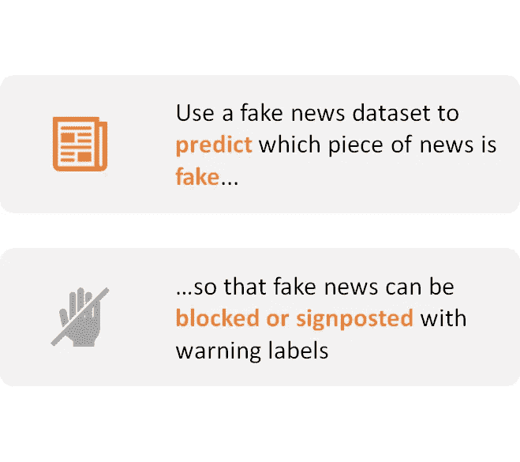

# 二。检索数据

[骗子数据集](https://www.aclweb.org/anthology/P17-2067/)由威廉杨于 2017 年 7 月出版。他又从 PolitiFact 的 API 中检索数据。这个网站收集了美国“发言人”的陈述，并给他们分配了一个从“真实”到“裤子着火”的真实值。杨主要检索了 2007 年至 2016 年期间的陈述。

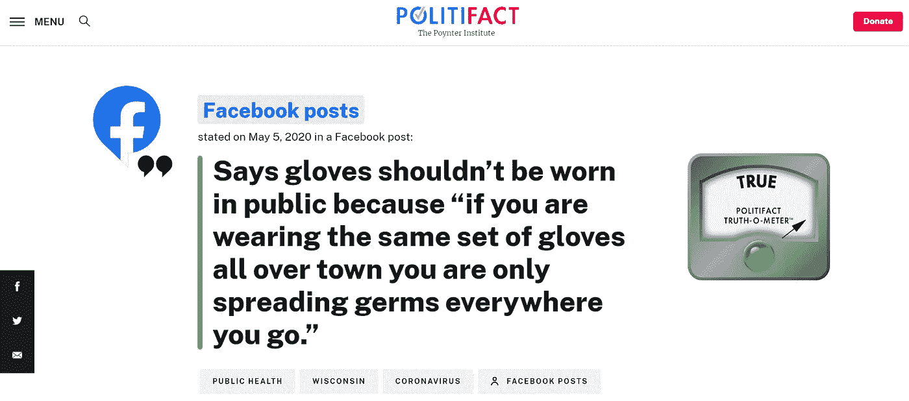

来自 PolitiFact 的事实核查示例

数据集预先分为训练、验证和测试文件。出于我们的目的，我们将按如下方式使用这些文件:

*   **训练数据集:**使用 80/20 分割，对我们的模型进行 5 重交叉验证
*   **验证数据集:**评估我们的模型结果并选择我们的模型
*   **测试数据集:**判断最终模型

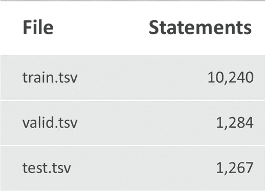

骗子数据集中的 tsv 文件列表

LIAR 数据集具有以下特征:

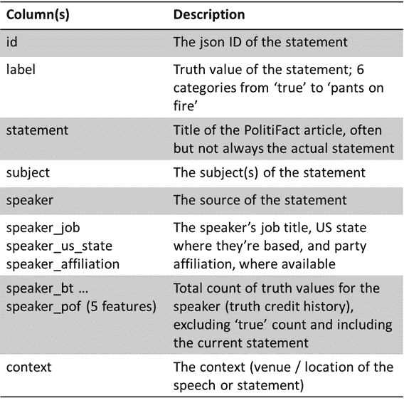

骗子数据集中的要素列表

然后，我放弃了以下功能:

## **a)真实信用记录**

在附带的论文中，杨利用说话人真值的总计数来分类他的数据。我发现这有问题，因为这基本上包括了**未来知识**，这是一个**大禁忌**，尤其是因为数据集不包括报表的日期。这样的时间信息需要包含在每个语句中，以便我们进行适当的时间序列分析。

不，我们不是算命的；我们看不到未来，也不应该用未来的知识来做预测。(胡尔基·奥莰·塔巴克在 [Unsplash](/s/photos/fortune-teller?utm_source=unsplash&utm_medium=referral&utm_content=creditCopyText) 上拍摄)

这是非常不幸的，因为从直觉上来说，一个说话者之前的陈述的真实历史很可能是一个很好的预测者，可以预测这个说话者接下来的陈述是否是真实的。但是我们将不得不将就。

## b)发言人姓名

在说谎者数据集中有 2910 个独特的说话者。我放弃了这一点，因为新的发言者一直在出现，所以将发言者作为一个功能包括在内的价值有限，除非同一发言者将来会发表声明。

当然，某些“发言人”很可能会继续发表声明，尤其是高调的政治家和政府官员；然而，我觉得从长远来看，让预测更一般化会更有价值。

# 三。分析数据

## a)真值偏向“真”和“基本真”

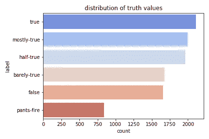

这种分布适用于每一个主题，如下面 20 个最常见的主题所示。

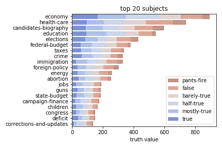

## b)议长的从属关系大多是共和党、民主党或没有

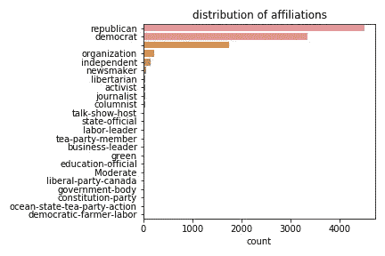

还有 19 个附属机构。

## c)发言人职位减少，但超过四分之一的发言人职位是空白的

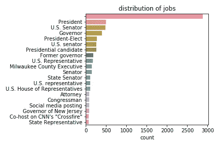

这份前几名的样本可以让我们了解这些工作有多不同。

## d)主题似乎是最重要的特征

我使用 scikit-learn 的默认随机森林分类器的特征重要性得出了这个推论。

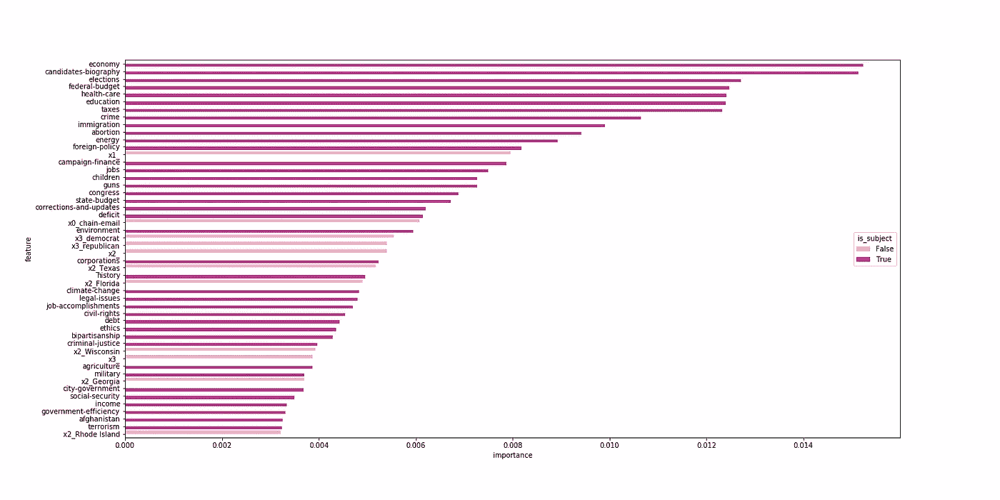

深粉色条代表主题特征，浅粉色条代表来自其他列的特征。注意暗粉色是多么的普遍。

# 四。特征选择

## a)目标特征:标签(真值)

我为我的模型考虑了两种类型的目标:

*   **原 6 个真值:**'真'、'大部分-真'、'半真'、'大部分-假'、'假'和'裤子-火'。
*   **二进制‘真’和‘假’值:**我把‘真’和‘大部分是真’归入‘真’，其余归入‘假’。这是基于 PolitiFact 的[对真实值](https://www.politifact.com/article/2018/feb/12/principles-truth-o-meter-politifacts-methodology-i/#Truth-O-Meter%20ratings)的描述，其中将“真实”和“基本真实”归类为准确的陈述，而其他的则在不同程度上不准确。

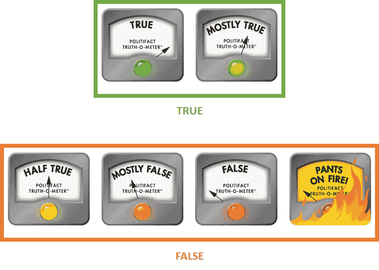

最初的 6 个真值以及我如何分组为二进制目标。图片来自 [PolitiFact](https://www.politifact.com/) (权限待定)。

## **b)主题和演讲者工作**

我考虑了以下方法:

*   使用**全部 141 个主题**或**全部 1185 个扬声器工作岗位**
*   使用 20 或 50 个**最常见的科目或工作**
*   使用 20 或 50 个**最重要的主题或工作**(由默认随机森林的功能重要性决定)

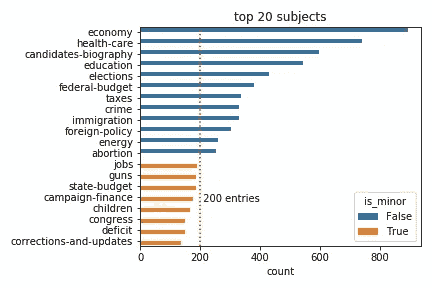

过滤 20 个最常见的主题，并将其余主题归入“其他”的示例

## c)陈述、上下文和演讲者工作

我想看看我是否可以使用主题建模来做以下事情:

*   **推断每条语句的主题**(又名主语)。
*   **将上下文和说话者工作**分组，以便处理更少的维度(对于 2，910 个不同的说话者有 1，185 个不同的说话者工作，对于 10，240 个陈述有 3，970 个不同的上下文)。

下图说明了这种方法。

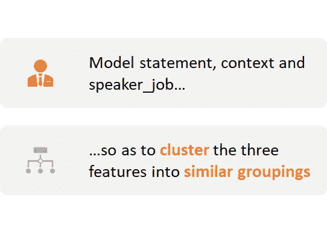

我考虑了以下主题建模方法:

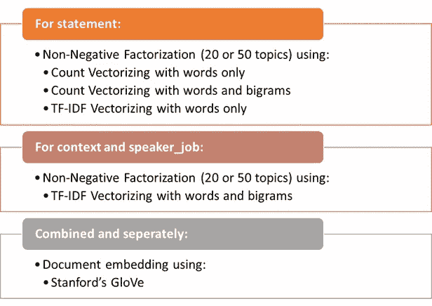

不同的主题建模技术呈现的主题似乎没有明显的差异；而且，在陈述的情况下，产生的主题看起来与说谎者数据集的实际主题非常相似，说明了主题/主题的不同计数。正如后面将要看到的，这些主题对不同模型的性能也没有明显的影响。

最后，我决定采用斯坦福大学的手套单词嵌入法产生的 300 个特征。

## c)说话者从属关系

我使用最初的 21 个发言者的从属关系作为类别。

下面的图表总结了我的方法。

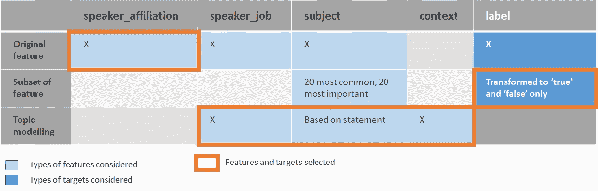

# 动词 （verb 的缩写）型号选择和性能

我考虑了以下模型:

*   **随机森林**(20 次迭代的超参数随机搜索)
*   **多项式朴素贝叶斯**(超参数网格搜索)

最佳执行模型是随机森林。但是它在训练数据集上的 f1 分数是 0.58，从训练和评估数据集的混淆矩阵来判断，它似乎也严重过度拟合:

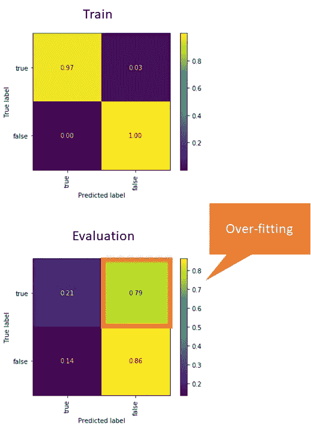

与训练数据集相比，评估数据集的精度极低，这表明过度拟合。

不管我上面选择的特征、目标和模型的组合如何，这种过度拟合的趋势都适用。

# 不及物动词观察

塞巴斯蒂安·赫尔曼在 [Unsplash](https://unsplash.com/s/photos/problem?utm_source=unsplash&utm_medium=referral&utm_content=creditCopyText) 上的照片

模型表现不佳可能有几个原因:

*   缺少日期意味着缺少历史信息。
*   普遍存在**遗漏发言人工作和从属关系**，这意味着这些特征对于确定哪条新闻是假的**可能不是很有用。**
*   骗子数据集中的一些文章**来自错误的数据集** (PolitiFact 的 Flip-o-Meter，而不是它的 Truth-o-Meter)，但却标有真值。结果，那些数据点对于训练模型是没有用的，因为它们被错误地标记了。

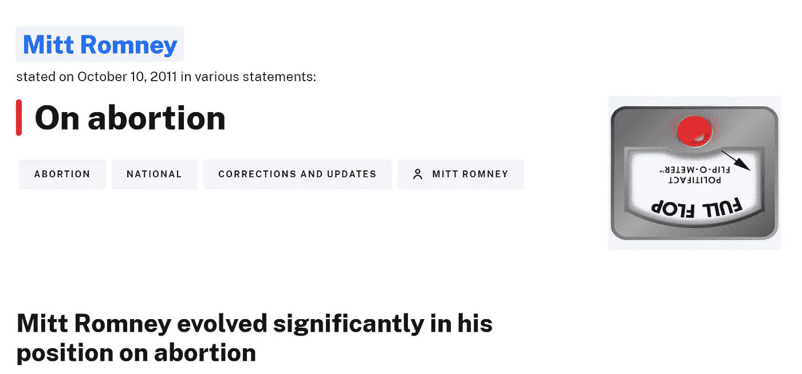

这篇 [PolitiFact 文章](https://www.politifact.com/factchecks/2012/may/15/mitt-romney/mitt-romney-evolved-significantly-his-position-abo/)出现在骗子数据集(5919.json)中，被标记为“虚假”，尽管它实际上是在谈论米特罗姆尼如何在堕胎问题上转变立场，而不是一条具体的新闻(虚假或其他)

此外， [Gosh 和 Shah](https://scholarspace.manoa.hawaii.edu/bitstream/10125/59664/0224.pdf) 在 2019 年的一篇论文中指出:

> “[骗子]数据集…被认为很难对*进行分类，因为缺乏可供验证的来源或知识库”*

# *七。进一步的工作和学习要点*

*显然，骗子数据集不足以确定一条新闻是否是假的。未来的工作可包括以下内容:*

*   *补充**其他假新闻数据集或 API 的**。就这一点而言，PolitiFact 不再有自己的 API，而是许多利用[谷歌事实检查 API](https://toolbox.google.com/factcheck/explorer/search/PolitiFact;hl=en) 的事实检查者之一。根据初步检查，LIAR 数据集中可用的语句与从事实检查 API 检索的 PolitiFact 中的语句几乎没有重叠。*
*   *进一步设计功能；例如通过**聚类**由手套嵌入生成的 300 个特征，或者专注于**识别假新闻的来源**，而不是或者除此之外，识别一条新闻是否是假的。*
*   *应用**不同的模型**，例如梯度推进或递归神经网络。*
*   *使用**更高级的 NLP 工具**，例如词性分析或谷歌的 BERT 模型。*

*该项目强调了使用高质量数据的重要性。我也学到了很多关于无数形式的主题建模的知识。当我完成最后的数据科学训练营项目时，我会牢记这些经验教训。*