# 利用 R(程序设计)识别欺诈性招聘广告

> 原文：<https://towardsdatascience.com/identifying-fraudulent-job-advertisements-using-r-programming-230daa20aec7?source=collection_archive---------45----------------------->

## 欺诈分析简单介绍

# 背景

在线招聘欺诈(ORF)是一种恶意行为，旨在通过欺诈性招聘广告造成隐私损失、经济损失或损害利益相关方的声誉。

分析任务的目的是从数据中识别欺诈性招聘广告，确定欺诈的关键指标，并就未来如何识别欺诈性招聘广告提出建议。

# 资料组

我们将使用就业骗局爱琴海数据集(EMSCAD)，可以在[http://icsdweb.aegean.gr/emscad](http://icsdweb.aegean.gr/emscad)下载。此页面提供了数据收集方式的描述和数据字典。

该数据集包含 17，880 个现实生活中的招聘广告。数据集中的变量包括:

# 方法学

首先，重要的是理解如何利用数据集来区分欺诈性和非欺诈性广告，因为这将决定将采用的分析方法的类型。作为二进制字段“欺诈性”的响应变量是我们试图预测的，其中 t =“是”，f =“否”。

# 了解数据集以选择分析方法

我们有一组未分类的变量，本质上是 HTML 字符串——好处、公司简介、描述和要求。文本数据需要的分析类型是*情感&情感分析或频率分析。*

有 11 个分类或因素变量——位置、公司徽标、行业、职能、工资范围、部门、所需教育、所需经验、就业类型、远程办公和问题，这些变量将被输入到机器学习算法中，如梯度推进机(GBM)、分布式随机森林(DRF)和广义线性模型(GLMNET ),以确定可用于区分欺诈性和非欺诈性广告的最佳预测值。

由于将使用两种分析方法—一种用于字符串变量，另一种用于因子变量，因此将有如下两组输出:

*   HTML 变量:情绪、情感和词频图
*   名义变量和二元变量:顶级预测值、系数

一些变量对任何信息都没有贡献，因此，它们被排除在分析之外。这些包括标题和不平衡，因为标题是标识信息，不平衡用于包括和排除记录以平衡数据集。

# 数据 ETL

在建模之前，必须执行一些步骤来清理数据集。下面的流程图显示了为建模准备数据集所执行的步骤。

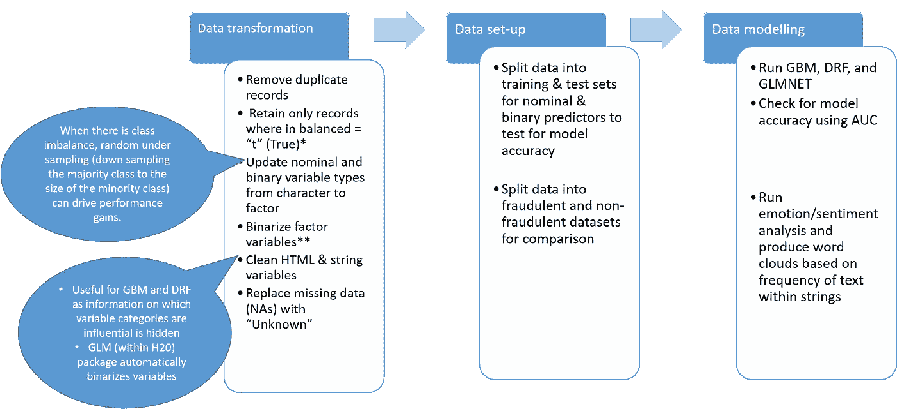

图 1:数据 ETL 流程图

# 结果

# 输出—文本分析

# 单词云

为每一个 HTML 字符串——公司简介、工作描述、要求和福利——创建了单词云。

下面的单词云表示非欺诈性广告(左)和欺诈性广告(右)的公司简介。

*   非欺诈性广告强调工作生活的平衡(“家庭”、“生活”、“关怀”)和公司文化(“团队”、“体验”)
*   欺诈性广告在很大程度上忽略了公司简介，强调金钱上的好处(“手机”、“金钱”、“成本”)

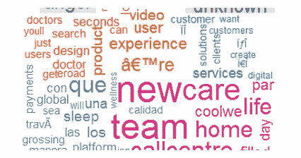

图 2.1:公司广告——非欺诈性

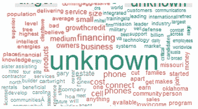

图 2.2:公司广告——欺诈

下面的单词云表示非欺诈性广告(左)和欺诈性广告(右)的职位描述。

*   非欺诈性广告强调公司产品(“天然气”、“石油”、“运营”)
*   欺诈性广告强调金钱价值(“金钱”、“财务上”、“折扣”)，非欺诈性广告强调公司产品(“天然气”、“石油”、“运营”)

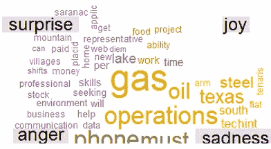

图 3.1:职位描述——非欺诈性广告

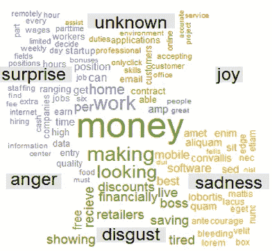

图 3.2:职位描述:欺诈性广告

下面是工作要求的词汇云——左边是非欺诈性的，右边是欺诈性的。

*   非欺诈性广告强调多年的经验、技能、学位资格和项目导向
*   欺诈性广告在较低程度上强调上述属性，非欺诈性广告强调多年的经验、技能、学位资格和项目导向

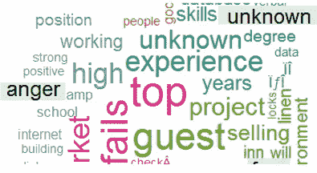

图 4.1:工作要求——非欺诈性广告


图 4.2:工作要求——欺诈性广告

最后，下面的单词云是基于对工作福利的测试。

*   非欺诈性广告强调诸如“病假”、“工作时间”和“假期”等福利
*   欺诈性广告似乎提供金钱上的好处，如住宿、假期、食物、有竞争力的薪水、签证和食物等。

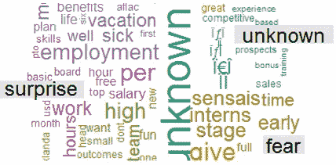

图 5.1:工作福利——非欺诈性广告

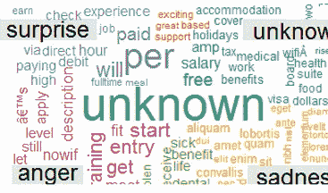

图 5.2:工作福利——欺诈性广告

# 情感分析

另一种分析文本的方法是通过情感分析，这是与文本中的每个单词相关联的情感类型(积极或消极)。

例如，看看下面的非欺诈性和欺诈性招聘广告的情感类别，我们可以看到，非欺诈性广告(左)的比例更大，是积极的(“喜悦”、“惊喜”)，而欺诈性广告(右)的比例则相反。

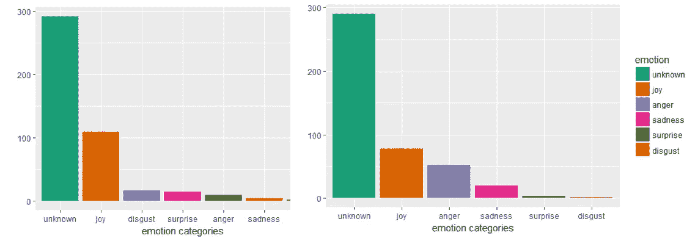

图 6:情感情绪分析:非欺诈性广告与欺诈性广告

我们也可以看看这些广告的极性，即倾向于特定的情感类别，积极的或消极的。与欺诈性广告相比，非欺诈性广告的正面比例更高。

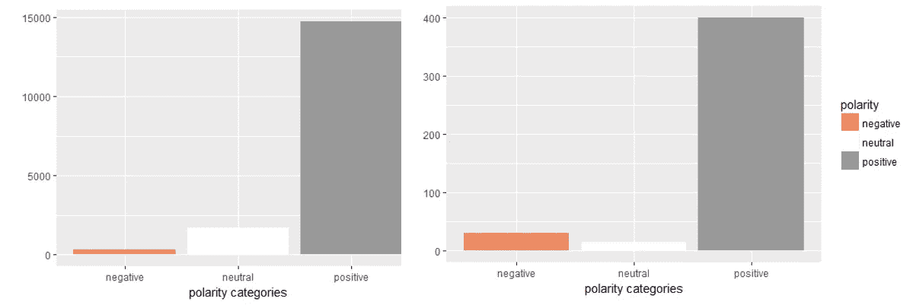

图 7:非欺诈性广告与欺诈性广告的情感(极性)分析

如文本情感的词云和条形图的例子所示，我们可以看到文本信息在预测某些行为方面非常有用。下一个合乎逻辑的步骤是根据广告的情绪/极性将这些广告标记为正面或负面，并将这些信息作为二进制变量引入机器学习模型进行预测，以确定这些变量对预测的重要性。

例如，您将创建四个变量:工作要求、描述、福利和公司简介。对于每个变量，每个广告将被分配一个“0”或“1”来表示“积极”或“消极”情绪。

现在，让我们继续利用模型中的数字变量来预测哪些广告是欺诈性的和非欺诈性的。

# 机器学习模型

# 概观

运行多种不同类型的模型，然后选择一种或多种模型的组合，这种方法不仅可以为您提供最高的准确性，还可以提供有意义的结果，这些结果可以很容易地向业务利益相关者解释，并有可能被他们接受。

对于这个问题，我运行了三种类型的模型:

*   *分布式随机森林* ( **DRF** ):本质上是一个随机森林，它是一个分类树的集合，但是在 h2o 服务器上并行运行，因此有了分布式这个词。
*   *梯度推进机* ( **GBM** ):和随机森林一样，也是由一群树组成的分类方法。不同之处在于，随机森林用于构建深度独立的树(即，每棵树都是在数据的随机子集上的随机变量集上运行的，即“bagging”方法)，而 GBM 则构建了大量浅、弱、依赖、连续的树。在这种方法中，每棵树都从先前的树中学习，并试图通过减少误差量和增加由预测变量解释的响应变量的变化量来对其进行改进。
*   *广义线性模型* ( **GLM** ):广义线性模型只是线性模型的扩展，可以在非正态分布的因变量上运行。由于这是一个分类问题，使用的链接函数用于*逻辑回归*。逻辑回归算法的输出是 *logits* 中预测值的系数，其中预测值变量的一个单位变化会导致对数概率的系数值变化。这些对数可以转换成比值比，以提供更有意义的信息。
*   为了计算比值比，我们需要对每个系数进行指数运算，将其提升到 *e 的幂，即 e^b*

现在您对三种类型的模型有了一些了解，让我们比较一下它们的模型精度。

# 方法学

使用随机种子将数据集分为训练集(数据集的 80%)和测试集(数据集的 20%)，目标是在训练集上训练模型，并在测试集上测试其准确性。

使用以下参数运行 GBM，其中树的最大深度被设置为 4 (4 级)、小学习率和五重交叉验证。

***交叉验证*** 是一种在我们将训练模型应用于测试集之前，用来验证我们的训练模型的技术。通过指定五个折叠，这意味着我们构建五个不同的模型，其中每个模型在四个部分上被训练，在第五部分上被测试。因此，第一个模型在第 1、2、3 和 4 部分进行训练，在第 5 部分进行测试。第二个模型在第 1、3、4 和 5 部分进行训练，在第 2 部分进行测试，依此类推。

这种方法被称为 k 倍交叉验证，使我们对所用建模方法的性能更有信心。当我们创建五个不同的模型时，我们在五个不同的/看不见的数据集上测试它。如果我们只测试模型一次，例如，在我们的测试集上，那么我们只有一个单一的评估，这可能是一个有偏见的结果。

```
gbm_model <-h2o.gbm(y=y_dv, x=x_iv, training_frame = model_train.h2o, 
                    ntrees =500, max_depth = 4, distribution="bernoulli", #for 0-1 outcomes
                    learn_rate = 0.01, seed = 1234, nfolds = 5, keep_cross_validation_predictions = TRUE)
```

为了衡量模型的准确性，我使用了 *ROC-AUC* 指标。 **ROC** 或接收器操作特性是一条概率曲线，而 **AUC，**曲线下面积是对类别之间分离程度的度量。在我们的例子中，AUC 是给定模型区分非欺诈性广告和欺诈性广告的准确度。AUC 越高，模型对广告的分类就越准确。

```
fpr <- h2o.fpr( h2o.performance(gbm_model, newdata=model_test.h2o) )[['fpr']]
tpr <- h2o.tpr( h2o.performance(gbm_model, newdata=model_test.h2o) )[['tpr']]
ggplot( data.table(fpr = fpr, tpr = tpr), aes(fpr, tpr) ) + 
  geom_line() + theme_bw() + ggtitle( sprintf('AUC: %f', gbm.auc) )
```

AUC 由测试模型准确性的几个指标组成，它们是:

*   真实肯定(TP):被正确预测为欺诈的欺诈广告
*   真实否定(TN):被正确预测为非欺诈性的非欺诈性广告
*   误报(FP):非欺诈性广告被错误地预测为欺诈性广告
*   假阴性(FN):被错误预测为非欺诈性的欺诈性广告

然后可以将这些指标结合起来计算灵敏度和特异性。

敏感度是衡量欺诈性广告被正确分类的比例。

*敏感度=计数(TP) /总和(计数(TP) +计数(FP))*

特异性是对非欺诈性广告被正确识别的比例的度量。

*特异性=计数(FP)/总和(计数(TP) +计数(FP)*

当确定哪种测量对您的分析更重要时，问自己这样一个问题:对您来说，识别正确分类的阳性(灵敏度更重要)还是阴性(特异性更重要)的数量更重要。在我们的例子中，我们想要一个具有更高敏感度的模型，因为我们对正确区分欺诈性广告更感兴趣。

所有这些指标都可以在一个 ***混淆矩阵*** 中进行总结，该表比较了正确和错误预测的案例数与欺诈性和非欺诈性案例的实际数量。该信息可用于补充我们对 ROC 和 AUC 指标的理解。

ROC-AUC 度量的另一个方面是用于确定广告是欺诈性还是非欺诈性的 ***阈值*** 。为了确定使 TPs 阳性数量最大化的最佳阈值 t，我们可以使用 ROC 曲线，其中我们在 y 轴上绘制 TPR(真阳性率),在 x 轴上绘制 FPR(假阳性率)。

AUC 允许对模型进行比较，我们可以在测试集上比较它们的 ROC 曲线以获得模型准确性，如下面的模型输出所示。

# 模型输出

## 模型精度比较

下表显示了 DRF 产生的模型在测试集上具有最高的 AUC 0.962。所有三个模型都具有高 AUC 值(> 0.5 或随机预测)。

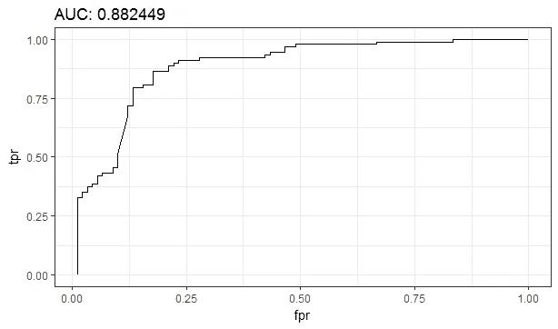

图 9:广告欺诈分类的 AUC 曲线

然而，让我们以 GLM 模型为例，通过查看下面的混淆矩阵，更深入地了解这个 AUC 在将广告正确分类为欺诈广告方面意味着什么。

测试集上 GLM 的混淆矩阵表明错误分类欺诈案例的错误率为 8.15%。该模型的灵敏度为 327/(327+29) = 92%，非常好。

现在，让我们看看模型的剩余输出，更具体地说，在对欺诈性和非欺诈性广告进行分类时，最重要的预测因素是什么。

## 最重要的预测因素

分类问题中的变量重要性等级告诉我们，相对于在该模式中使用的所有其他预测器，预测器变量可以多准确地将欺诈性广告分类为非欺诈性广告。

对于(a) GBM 和(b) DRF 来说，在将招聘广告分类为欺诈性或非欺诈性方面，前三个变量——地点、公司标志和行业——是相同的。这也适用于*认为最不重要的*和*远程办公*变量

现在，让我们绘制数据集，以更好地了解欺诈性和非欺诈性广告的顶级预测因素是如何变化的。

让我们看看最上面的变量，*位置*，我们可以看到，来自美国和澳大利亚的欺诈性广告比非欺诈性广告的比例更高，如带圆圈的条形所示。

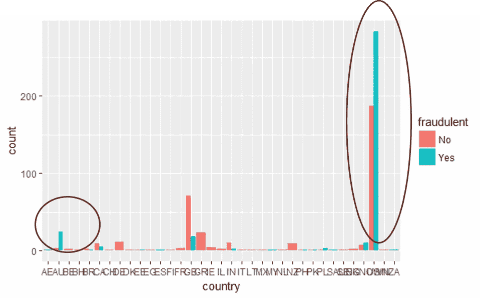

图 10:各国欺诈性广告与非欺诈性广告的频率

欺诈性广告比非欺诈性广告在招聘广告中不显示公司标志的比例更高。


图 11:欺诈性广告与非欺诈性广告的出现频率(按广告中是否出现公司标志划分)

## 了解模型系数

现在，让我们尝试从数字上理解预测变量和广告分类之间的关系。

如下表所示，突出显示的预测器最能区分欺诈性广告和非欺诈性广告。

*   *进入模型的 767 个变量中，只有 48 个具有非零系数(显示了顶部预测值)*
*   *概率越大，广告欺诈的几率就越高*

# 结论和下一步措施

现在，您已经很好地理解了在分类问题中使用文本和数字预测器，同时使用文本分析工具和机器学习分类算法。

那么，接下来我们能做什么？

*   应该结合使用文本分析和预测模型来将招聘广告分为欺诈性和非欺诈性招聘广告
*   为了提高文本分析的准确性，可以引入以下方法:
*   *N-grams 建模*:查看同时出现的单词组合，以识别模式
*   寻找大写和标点符号的趋势
*   在强调的文本中寻找趋势(粗体、斜体)
*   寻找所用 HTML 标签类型的趋势(原始文本列表与列表元素中的列表文本)

**预测模型精度可以通过以下方式提高:**

*   使用更大的数据集
*   将数据集分为三部分:训练集、测试集和验证集
*   将工资范围分解为数字变量:最低和最高
*   去除相互关联的变量(即使用独立性卡方检验)
*   将位置分为国家、州和城市
*   通过对行业和功能类别进行分组来减少变量数量
*   扩展数据集以包括在线行为，即广告被点击的次数、IP 位置、广告上传的时间等。

关于所有用于生成结果的代码，请参见我的 GitHub 库—【https://github.com/shedoesdatascience/fraudanalytics 