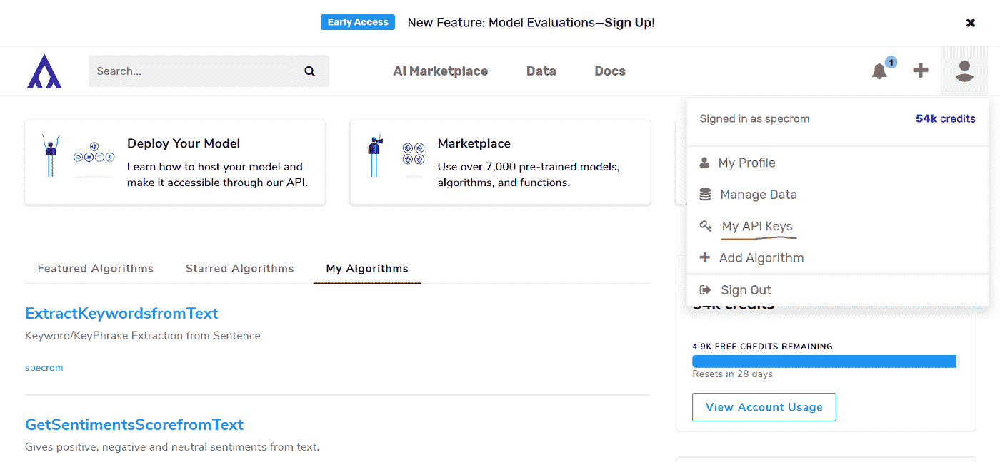
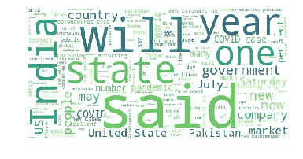

# 利用层次聚类识别新闻报道中的隐藏趋势

> 原文：<https://towardsdatascience.com/identifying-hidden-trends-in-news-stories-using-hierarchical-clustering-b6297df795af?source=collection_archive---------44----------------------->

## 了解如何使用称为凝聚聚类的通用层次聚类算法在最近的新闻文章中查找新的主题聚类

作为数据科学家，新闻报道的文本分析从学习和实践的角度来看都非常重要，因为它为我们提供了大量的数据语料库来训练文本分类、情感分析、命名实体识别等。模特。

总的来说，这些模型中的大多数都是在历史新闻语料库上训练的，该语料库使用了过去 1-3 年的新闻报道数据。这在平时很有效，但是，在新冠肺炎疫情，这给我们带来了严重的问题，因为新闻报道现在有更快的周转周期。

解决这个问题的一种方法是对在短时间内收集的新闻故事运行文本聚类算法，并在它们开始过多影响我们的预训练情绪分析模型之前识别新兴趋势。

例如，自从 Covid 疫情开始以来，我们开始看到情绪分析模型的性能下降。我们通过运行文本聚类和主题模型来缓解这一问题，并发现一个新的主题/聚类正在围绕一些令牌出现，如“工资保护计划”、“锁定”、“口罩”、“疫苗”、“空降”。我们不断保存来自这些“新”聚类的数据，直到我们有足够的数据点来重新训练我们的监督模型。

**新闻 API**

你可以从 Specrom Analytics 的[媒体监控](http://www.specrom.com/products-services/)数据库获得最近的(<24 h) news articles in structured format by accessing a [公共新闻数据 API](https://algorithmia.com/algorithms/specrom/LatestNewsAPI/docs) )公开数据。你必须在 Algorithmia 注册一个免费账户。当你注册的时候，你每个月会得到 10，000 点积分，这对于一个月 500 次 API 调用来说足够了。

要获取您的 API 密钥，请转到仪表板，然后单击我的 API 密钥，如下所示。



Algorithmia 拥有所有流行软件语言的客户端库，所以让我们通过在 bash 或命令行上键入下面的文本来获得 python 客户端。

```
pip install algorithmia`
```

每个 LatestNewsAPI 调用最多给我们 100 个结果，所以如果我们想要获取 1000 个新闻故事，我们将不得不分页大约 10 次，这对于本教程中的集群演示来说应该足够了。除了为文章的主要内容和标题指定关键字查询之外，API 本身还允许您按主题进行过滤。您还可以通过域名地址列表指定过滤，因为该数据库目前索引了超过 60，000 个新闻源。

然而，在这种情况下，我只通过在主题中指定“业务”来过滤它。

```
clean_response_list = []
for i in range(1,11):
    print("fetching page ", str(i))
    input = {
  "domains": "",
  "topic": "business",
  "q": "",
  "qInTitle": "",
  "page": str(i),
        "content": "true"
    }
    client = Algorithmia.client(YOUR_ALGO_KEY)
    algo = client.algo('specrom/LatestNewsAPI/0.1.4')
    response_dict = algo.pipe(input).result
    #print("Total results found: ", response_dict["totalResults"])
    clean_response_list = clean_response_list + response_dict["Article"]
len(clean_response_list) 
```

让我们将结果加载到一个熊猫数据框架中，并创建一个单词云来查看前 1000 个新闻故事中单词的初始分布。

```
import numpy as np
import pandas as pd
df = pd.DataFrame(clean_response_list)
df.head()from wordcloud import WordCloud, STOPWORDS
import matplotlib.pyplot as plt
import seaborn as sns
wordcloud_generated_bywd = WordCloud(stopwords = set(STOPWORDS),background_color="white").generate(' '.join(df['content']))
# Generate plot
plt.imshow(wordcloud_generated_bywd)
plt.axis("off")
plt.show()
```



来自 specrom News API 的 1000 个新闻故事的词云

让我们使用 tf-idf 向量对文档进行矢量化，并通过奇异向量分解来降低维度。关于如何预处理文本的完整讨论请参考之前的博客文章。

```
from sklearn.feature_extraction.text import TfidfVectorizertfidf_transformer = TfidfVectorizer(stop_words=’english’, 
ngram_range=(1, 3),max_df=0.99, min_df = 0.01, lowercase=True, max_features=2500)X_train_text = tfidf_transformer.fit_transform(df[“content”])
df_dtm = pd.DataFrame(X_train_text.toarray(), columns=tfidf_transformer.get_feature_names())
#df_dtm.head()
from sklearn.decomposition import TruncatedSVDsvd = TruncatedSVD(n_components=50, algorithm='randomized', n_iter=5, random_state=None, tol=0.0)
x_svd = svd.fit_transform(X_train_text)
#len(x_svd)
```

此时，我们已经准备好使用凝聚聚类来创建文本聚类。所有文本聚类算法的一个问题是需要预先指定文本聚类的数量作为超参数。有经验方法可用，如 k 均值聚类的“肘方法”,但它们需要太多的计算资源，无法每天运行。

然而，凝聚聚类非常快，它允许我们通过新闻数据迭代大量可能的聚类值，并以相当低的成本检查聚类成员数量的增长。

```
from sklearn.cluster import AgglomerativeClusteringcluster_list = range(2,10)
def get_optimum_ag_clusters(input_array, cluster_list):
    return_list = []
    for cluster_n in cluster_list:
        temp_dict = {}
        AG = AgglomerativeClustering(n_clusters=cluster_n, affinity='euclidean', memory=None, connectivity=None, compute_full_tree=True,linkage='ward', pooling_func='deprecated')
        pred_labels = AG.fit_predict(input_array)
        valcount_series = pd.Series(pred_labels).value_counts()
        temp_dict["cluster_n"] = cluster_n
        temp_dict["cluster_values"] = valcount_series.tolist()
        return_list.append(temp_dict)
    return return_list#return_list = get_optimum_ag_clusters(X_train_text.toarray(), cluster_list)
return_list = get_optimum_ag_clusters(x_svd, cluster_list)return_list
# Output
[{'cluster_n': 2, 'cluster_values': [788, 212]},
 {'cluster_n': 3, 'cluster_values': [774, 212, 14]},
 {'cluster_n': 4, 'cluster_values': [774, 199, 14, 13]},
 {'cluster_n': 5, 'cluster_values': [761, 199, 14, 13, 13]},
 {'cluster_n': 6, 'cluster_values': [751, 199, 14, 13, 13, 10]},
 {'cluster_n': 7, 'cluster_values': [730, 199, 21, 14, 13, 13, 10]},
 {'cluster_n': 8, 'cluster_values': [718, 199, 21, 14, 13, 13, 12, 10]},
 {'cluster_n': 9, 'cluster_values': [607, 199, 111, 21, 14, 13, 13, 12, 10]}]
```

我们不一定对这里确定的最大集群感兴趣；这可能会被我们通过现有的文本分析渠道或经验已经知道的东西所主导。更有趣的是，当天隐藏的新闻故事可能会在多个渠道受到关注。

让我们打印 6 个 n_clusters 的每个集群的顶部术语。

```
AG = AgglomerativeClustering(n_clusters=6, affinity='euclidean', memory=None, connectivity=None, compute_full_tree=True,linkage='ward', pooling_func='deprecated')
#y_km = AG.fit_predict(X_train_text.toarray())
y_km = AG.fit_predict(x_svd)df_dtm["cluster_name"] = y_km
df_dtm.head()cluster_list = len(df_dtm['cluster_name'].unique())
for cluster_number in range(cluster_list):
    print("*"*20)
    print("Cluster %d: " % cluster_number)
    df_cl = df_dtm[df_dtm['cluster_name'] == cluster_number]
    df_cl = df_cl.drop(columns = 'cluster_name')
    print("Total documents in cluster: ", len(df_cl))
    print()
    df_sum = df_cl.agg(['sum'])
    df_sum = df_sum.transpose()
    df_sum_transpose_sort_descending= df_sum.sort_values(by = 'sum', ascending = False)
    df_sum_transpose_sort_descending.index.name = 'words'
    df_sum_transpose_sort_descending.reset_index(inplace=True)
    print(','.join(df_sum_transpose_sort_descending.words.iloc[:20].tolist()))
```

最上面的两个集群代表了关于新冠肺炎困境和全球经济影响的可预测新闻。然而，其他集群似乎有一个有趣的关键字组合，如下所示:

```
Cluster 2: 
Total documents in cluster:  14

huawei,networks,5g,british,britain,nikkei,5g networks,japan,nikkei said,tokyo,wireless,suppliers,british government,equipment,citing,citing sources,potential alternative suppliers,alternative suppliers,nec corp,potential alternative
********************
Cluster 4: 
Total documents in cluster:  13

trader,joe,trader joe,petition,products,josé trader,trader josé,trader josé trader,josé,food,ethnic,san,process,chain,ethnic sounding,sounding,racist,labeled,retail giant,signed online petition
********************
Cluster 5: 
Total documents in cluster:  10

freitas,congressional,state del,del,richmond,convention,gop,paperwork time,paperwork,republicans,state,campaign,house,spanberger,won,va,nick,marquee,picked,write
```

因此，看起来集群 2 正在与华为讨论一些与 5G 相关的问题，这些问题与英国政府有关。我们可以过滤我们的数据框架以查看集群 2 中的成员，我们可以立即看到这是一个新兴的新闻趋势，它是由几天前的一篇[路透社文章](https://www.reuters.com/article/us-britain-huawei-japan/uk-asks-japan-for-huawei-alternatives-in-5g-networks-nikkei-idUSKCN24K01I)引发的，当时他们报道了英国政府要求日本在 5G 无线网络上替代华为。

集群 4 是关于 Trader Joe 的品牌被认为是种族主义的，这产生了大量关于该品牌的负面报道。

确定新的集群后，您可以运行名称实体关系模型来确定集群中的顶级实体，运行情感分析来查看其影响，并检查新闻传播流，以确定集群是否会在未来几天作为企业社交监听应用的一部分进行扩展。

在过去的几个月里，我们使用相同的技术发现了许多有趣的新兴话题，这使得我们的文本分类和社交听力模型对于我们今天所处的快速变化的世界更加强大。