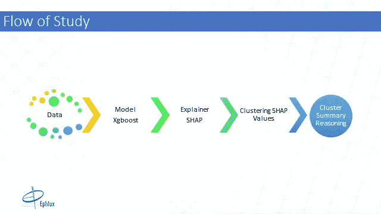
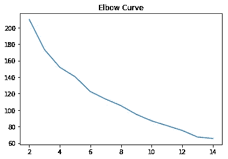
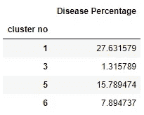
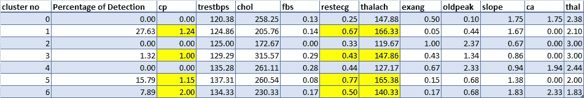

# 使用医疗保健数据的 SHAP 值识别高危人群。

> 原文：<https://towardsdatascience.com/identifying-high-risk-groups-using-shap-values-on-healthcare-data-e3e7198f30f6?source=collection_archive---------16----------------------->

## **了解如何使用 shap 值进行更好的聚类。**


# 动机

机器学习在过去几年取得了相当大的进展，这主要归功于我们可以获得的大量数据和可以从数据中提取一些结构和意义的复杂算法。一方面，这些复杂的模型提供了最先进的结果，但另一方面，它们也是一种难以理解和解释的谜。从法律和医疗保健的角度来看，模型的可解释性非常重要，因为它可以增加医疗保健中人工智能的信任和采用。

例如，在医疗保健行业，预测患者何时死亡可能是有用的，但更重要的是，了解我们的模型输出可以帮助我们识别那些具有任何不良结果高风险的聚类集(具有相似属性的患者)。这最终将导致在早期阶段更好和适当的干预。

# 模型可解释性

有相当多的方法可以帮助我们理解模型的结果。然而，我将讨论 SHAP 价值观，以及如何用它们来解释全球和地方层面的模型。

# 得体的附加解释(SHAP)

Shap 值基本上给出了每个特征对我们最终预测的平均贡献。它帮助我们更直观地分析和解释我们的模型。为了更好地理解什么是 shap 值以及它们是如何计算的，本文有一些非常好的内容[https://medium . com/@ Gabriel Tseng/interpreting-complex-models-with-shap-values-1c 187 db 6 EC 83](https://medium.com/@gabrieltseng/interpreting-complex-models-with-shap-values-1c187db6ec83)。

通过 shap 值，我们可以了解我们的模型在微观层面上为每个预测做了什么，这可以帮助我们确定哪些特征对我们的最终预测有多大贡献。

在这里，我们将使用 shap 值来创建聚类，看看它们是否有助于识别心脏病风险较高的患者。



通过聚类识别高危患者

正如你从上面的管道中看到的，这篇文章的目的首先是将 XGboost 这样的复杂模型拟合到数据中，然后使用 SHAP 库获得数据中每个例子的 SHAP 值，然后对它们进行聚类，以找到可以导致早期干预或更好地治疗患者的模式。本例的数据集由许多预测患者是否患有心脏病的特征组成。

# 为什么我们使用 SHAP 值进行聚类？

使用 shap 值进行聚类的优点是所有要素的 shap 值都在相同的范围内(二进制 xgboost 的对数概率)。这有助于我们生成有意义的集群。这里的目标是聚集那些具有相同预测心脏病风险的 shap 值。

```
#importing the required dependencies.
import pandas as pd
from xgboost import XGBClassifier
from sklearn.model_selection import train_test_split
from sklearn.cluster import KMeans
from sklearn.metrics import silhouette_score
import pylab as pl
import shap
shap.initjs()
```

让我们导入[数据集](https://archive.ics.uci.edu/ml/datasets/Heart+Disease)并将其分成训练集和测试集。

```
# loading the data set
data = pd.read_csv("D:/RnD/heart.csv")
#Seperating the target from the features
X = data.drop("target", axis  = 1)
#setting y as the target variable
y = data.target
#Splitting the dataset into train and test
X_train, X_test, y_train, y_test = train_test_split(X,y, random_state = 100)
```

接下来，我们训练一个 Xgboost 模型用于分类。这里的重点不是获得一个高度精确的模型，而是我想向您展示 shap 值如何用于聚类。

```
model = XGBClassifier(objective = "binary:logistic")
model.fit(X_train,y_train)
```

好了，我们已经训练好了模型，现在我们可以使用 SHAP 库来获得模型的 shap 值。下面的代码块首先在训练好的模型上使用 Tree explainer 方法创建一个 Explainer 对象。然后使用 explainer 对象来获取测试数据的 shap 值。

```
explainer = shap.TreeExplainer(model)
shap_values = explainer.shap_values(X_test)
```

使用肘方法来决定有多少个分类适合我们的数据。

```
#convert shap_values array to dataframe
s = pd.DataFrame(shap_values, columns = X_test.columns)
#Use Elbow method to decide the optimal number of clusters
sse = []
for k in range(2,15):
    kmeans = KMeans(n_clusters = k)
    #fit the k-means model on the shap values
    kmeans.fit(s)
    #appent the error of each iteration
    sse.append(kmeans.inertia_)

pl.plot(range(2,15), sse)
pl.title("Elbow Curve")
pl.show()
```



x 轴=聚类数，y 轴=错误率(sse)

我在这里选择 6 作为期望的集群数。接下来，我们再次将 K-Means 模型拟合到测试集的 shap 值，聚类数为 6。

```
kmeans = KMeans(n_clusters = 7, random_state = 100).fit(s)
#selecting cluster centres
centroids = kmeans.cluster_centers_
```

现在，我们为每个患者(数据点)映射基于其训练分配给它的聚类。

```
patient = pd.DataFrame(X_test.index)
cluster_no = pd.DataFrame(kmeans.labels_)
df= pd.DataFrame()#Concatenating the patient ids with the assigned cluster lablesdf = pd.concat([patient,cluster_no], axis =1)
df.columns = ["patient", "cluster no"]
```

基于我们之前训练的 xgboost 模型的学习，我们现在将为剩余的测试数据生成预测并评估它们。

```
y_pred = model.predict(X_test)
y_pred = pd.DataFrame(y_pred, index= X_test.index, columns = ["target"])df = df.set_index("patient")
cluster_df = pd.concat([df, y_pred], axis = 1)
```

用它们各自的患者 id(索引)对聚类进行分组，以识别具有较高疾病检测百分比的聚类。

```
group = (100 * cluster_df[cluster_df["target"]==1].groupby(by = ["cluster no","target"]).size()/len(df.index))
group = group.reset_index(level = 1, drop = True)
group = pd.DataFrame(group, columns  = ["Disease Percentage"])
group
```



疾病百分比

从图中，我们可以看到，我们的聚类中的疾病百分比有所不同。注意:这里没有显示没有疾病的集群。

# 我们从这些星团中发现了什么吗？

所以让我们试着推理一下，我们是否能从已经生成的集群中得到一些东西。下图包含心脏病检测的百分比以及每个聚类的每个特征的平均值。为了简洁起见，我对值进行了四舍五入。



使用 shap 值的聚类分析

*cp =胸彩——从上表可以明显看出，cp 越高，患心脏病的几率越大*

*restecg =静息心电图结果——心脏病发病率较高的聚类往往具有较高的 restecg 平均值*

*具有较高 thalach 平均值的聚类具有较高的心脏病检测百分比。*

我们所做的推理帮助我们识别数据中的模式，我们现在可以寻找可能的干预措施或解决方案来帮助预防心脏病。

# 下一步是什么？

到目前为止，本笔记本中描述的方法有些天真。例如，仅从肘方法中选择聚类的数量不是一个很好的主意，我们还需要看看其他一些措施来解释该算法如何很好地对我们的数据进行聚类。剪影分数就是这样一种测量方法，它可以帮助定义我们对数据进行聚类的程度。

> 事实仍然是，有许多聚类指标可以帮助我们了解我们的聚类的拟合度，但这都是相对于我们认为好的指标而言的。此处进一步解释[https://www . research gate . net/post/How _ can _ we _ say _ that _ a _ clustering _ quality _ measure _ is _ good](https://www.researchgate.net/post/How_can_we_say_that_a_clustering_quality_measure_is_good)
> 
> “问题是，我们不能真的说什么聚类质量度量是好的还是不好的。“好的集群”的概念是相对的，是一个观点的问题。这同样适用于质量措施。这取决于你想评价什么。”

因此，从这里得出的结论是，我们需要测试不同的集群，并决定哪个指标可以很好地适应我们的问题，并有效地解释我们所拥有的集群。

参考资料:

[1]https://shap.readthedocs.io/en/latest/

[2]https://github.com/slundberg/shap

[3][https://www.youtube.com/watch?v=vA_czRcCpvQ](https://www.youtube.com/watch?v=vA_czRcCpvQ)

[4]数据来源:[https://archive.ics.uci.edu/ml/datasets/Heart+Disease](https://archive.ics.uci.edu/ml/datasets/Heart+Disease)