# 鉴定新冠肺炎冠状病毒的潜在小分子抑制剂

> 原文：<https://towardsdatascience.com/identifying-potential-small-molecule-inhibitors-of-the-covid-19-coronavirus-a2bcf8574cfc?source=collection_archive---------22----------------------->

请注意，文章中的所有评论纯属实验性质，不应作为医疗建议。它不应被视为支持特定治疗的医学建议或证据。如果你认为自己可能感染了新冠肺炎病毒，你应该联系卫生官员并接受检测。

2019 年 12 月，世界在中国武汉发现了一种新型冠状病毒。快进 3 个月，病毒已经感染了超过 10 万人，数千人已经死亡。虽然从长远来看，疫苗可能是我们战胜这种疾病的最佳选择，但这似乎需要一年半以上的时间，现在必须取得突破。

我无法接触到实验室、病人或活的病人样本，但互联网上有大量的开放数据。我将尝试写一系列文章，利用现有数据回答有关病毒的问题，收集见解，也许还有可能用于抗击新冠肺炎的策略。

因为新药的发现、安全性测试和批准需要很多年，所以一个好的策略是努力找到一种已经被批准的、对病毒有一定疗效的药物。让我们进行一次模拟药物筛选。

我们的第一步是去[蛋白质数据库](https://www.rcsb.org/)，在那里你可以找到许多分子的 3D 分子结构，包括新冠肺炎的成分。

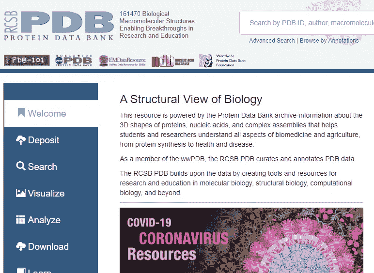

【https://www.rcsb.org/ 

通过滚动资源，我们可以看到他们已经结晶了主要的蛋白酶，这是药物发现的高产目标。实际上有几个版本，但我们选择这一个，因为它的分辨率最高，为 1.31 埃。这意味着我们可以看到和利用更多的分子信息。

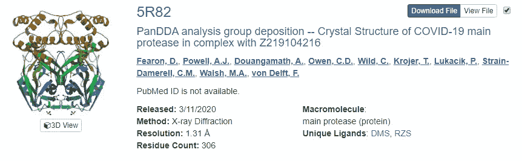

[https://www.rcsb.org/](https://www.rcsb.org/)

我们现在去 [pharmit](http://pharmit.csb.pitt.edu/) 网站，它允许我们在浏览器中进行虚拟筛选。

[http://pharmit.csb.pitt.edu/](http://pharmit.csb.pitt.edu/)

我们进入目标结构的 PDB，这里是 5R82。注意，配体有两种选择，DMS 或 RZS。这正是用来稳定蛋白质，以帮助结晶和解析其结构。我们将使用 RZS，因为它只与蛋白质中的一个位点结合，而 DMS 与多个位点结合，这使得在这个平台上进行药物筛选变得容易得多。

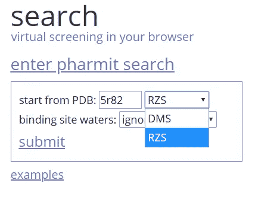

[http://pharmit.csb.pitt.edu/](http://pharmit.csb.pitt.edu/)

然后我们点击提交，得到下面的设置。带有配体的蛋白质(屏幕中间右侧)。

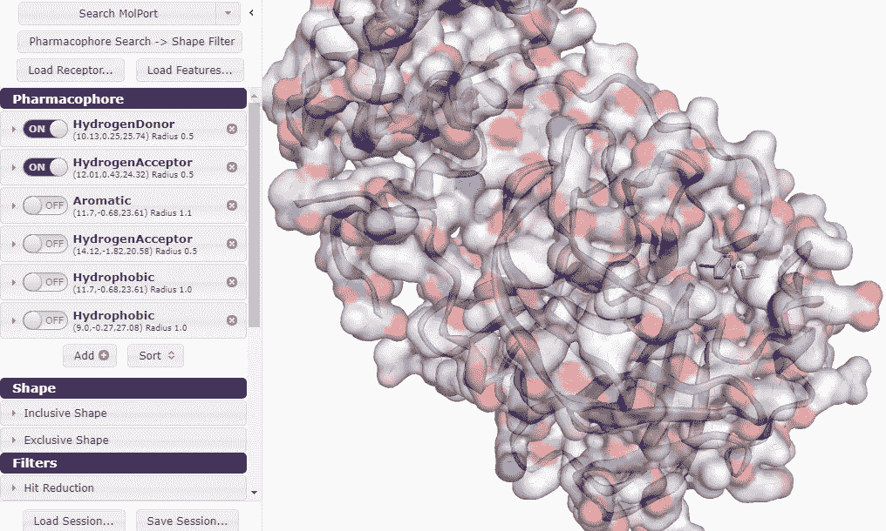

[http://pharmit.csb.pitt.edu/](http://pharmit.csb.pitt.edu/)

小组的药效团部分是我们最感兴趣的。通过打开和关闭区域，我们规定了任何药物在试图适应这种蛋白质时必须满足的分子相互作用。在我看来，我们需要一种符合尽可能多标准的药物。这最大化了它在现实中被束缚的可能性。所以我们把它们都打开。

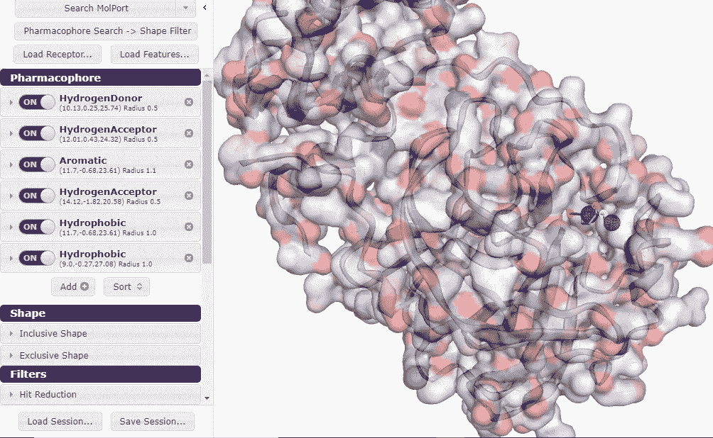

http://pharmit.csb.pitt.edu/

现在我们准备进行药物筛选。我们转到左上方的选项卡，通过单击向下箭头来查找合适的库。

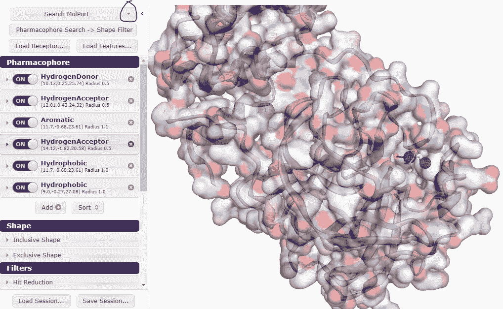

【http://pharmit.csb.pitt.edu/ 

我们获得了许多药物库的列表，并单击贡献的库以获得更多选项。

我从天然产物库开始，它包含 2029 个天然产物结构。令人震惊的是，当所有的约束都被激活时，有些东西是合适的。不幸的是，这种分子没有名字。

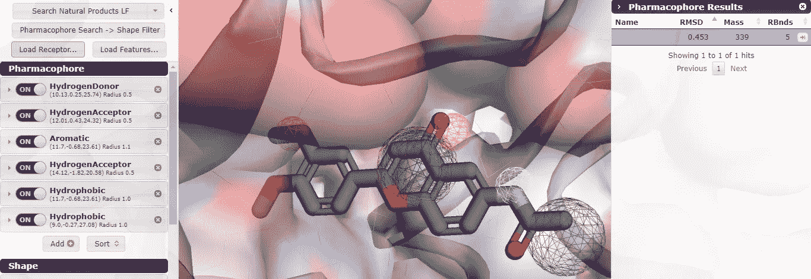

[http://pharmit.csb.pitt.edu/](http://pharmit.csb.pitt.edu/)

不要气馁，我把结构画出来，发现它是这个分子。

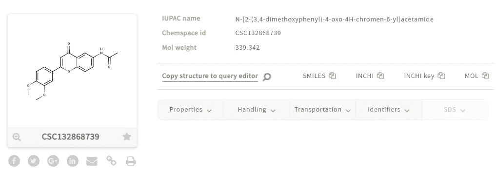

[https://chem-space.com/search](https://chem-space.com/search)

经过进一步研究，我发现它与依普黄酮结构非常相似，依普黄酮是一种用于预防绝经后妇女骨质疏松症的异黄酮。奇怪的发现，不知道是怎么回事。

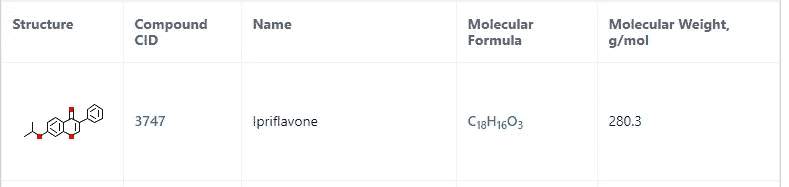

[https://pubchem.ncbi.nlm.nih.gov/compound/3747](https://pubchem.ncbi.nlm.nih.gov/compound/3747)

然后，我改变了思路，查看了 DrugBankApproved-2019 库。当所有的限制都设定好了，没有药物能够适合结合位置。

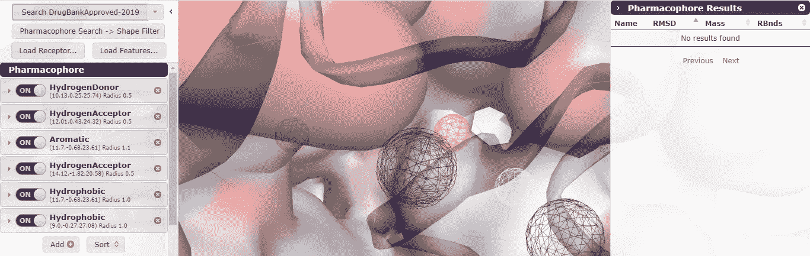

[http://pharmit.csb.pitt.edu/](http://pharmit.csb.pitt.edu/)

我开始一个接一个地放松每一个限制。我不想放松任何不必要的，因为我觉得这将增加假阳性的可能性。

1.  在位置(10.13，0.25，25.74)放松氢供体导致发现 38 种药物。这些药物通过 RMSD 进行排名，这是一种适合度的衡量标准，RMSD 越低，适合度越好。

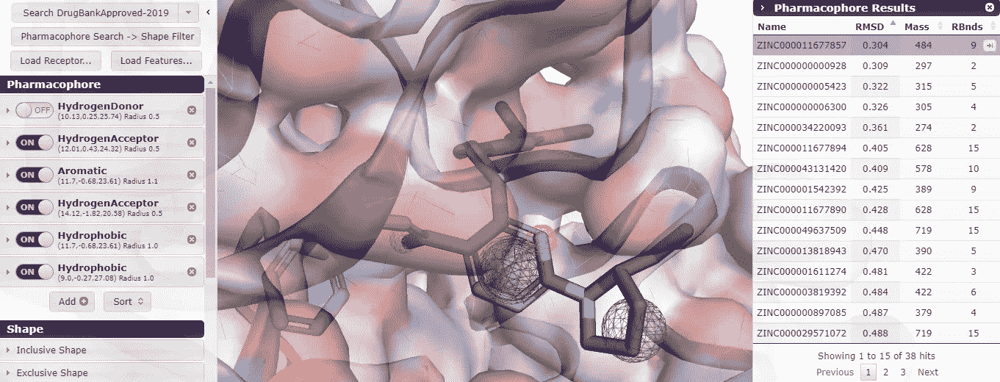

[http://pharmit.csb.pitt.edu/](http://pharmit.csb.pitt.edu/)

排名最高的药物是 RMSD = 0.304 的 Stendra。这是一种用于治疗勃起功能障碍的 PDE5 抑制剂。这很可能是假阳性。问题是我不知道 RMSD 有多好。我只知道越低越好。

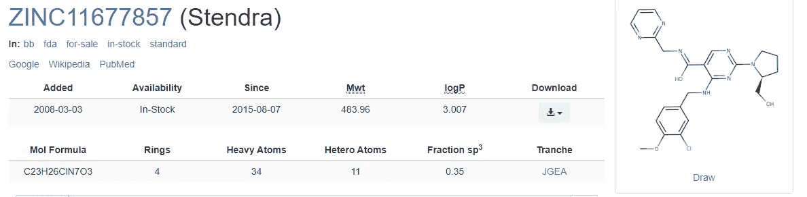

[http://zinc15.docking.org/substances/](http://zinc15.docking.org/substances/)

第二种是氨来沙诺(RMSD = 0.309)，这是一种用于治疗口腔溃疡的抗炎药物。可能是假阳性。我也看到一些讨论，像布洛芬这样的消炎药可能会恶化新冠肺炎的进程，所以也许最好远离。

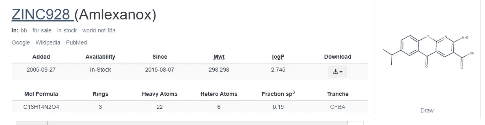

【http://zinc15.docking.org/substances/ 号

2.放松位置(12.01，0.43，24.32)的氢受体限制导致发现 21 种药物。

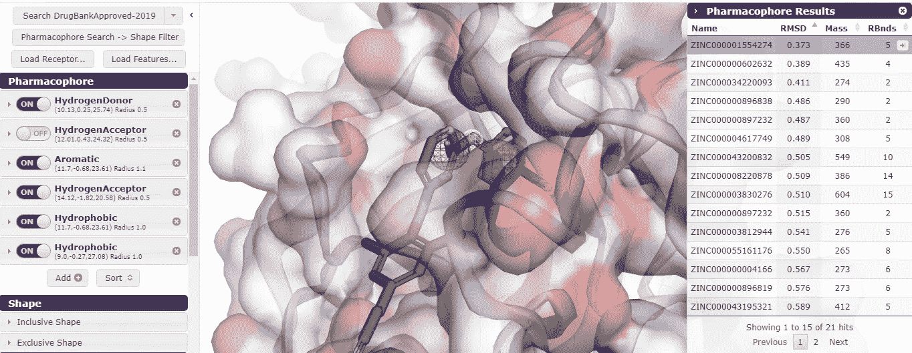

【http://pharmit.csb.pitt.edu/ 

排名最高的药物是 RMSD = 0.373 的利匹韦林。这是一种用于治疗 HIV 患者的非核苷类逆转录酶抑制剂(NNRTI)。虽然抗病毒药物的问世令人兴奋，但我们希望药物针对蛋白酶而不是逆转录酶。此外，RMSD 高于前 2 种药物。

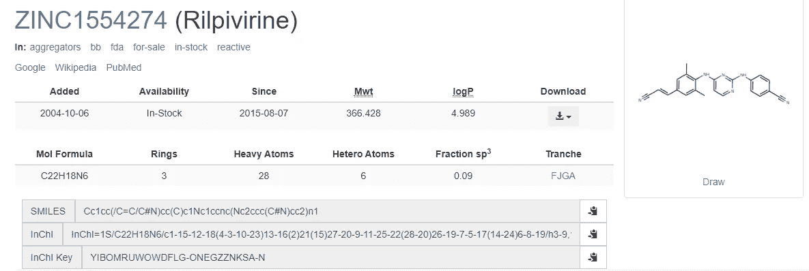

[http://zinc15.docking.org/substances/](http://zinc15.docking.org/substances/)

排名第二的药物是 Intelence (RMSD = 0.389)，这是另一种针对 HIV 的 NNRTI。

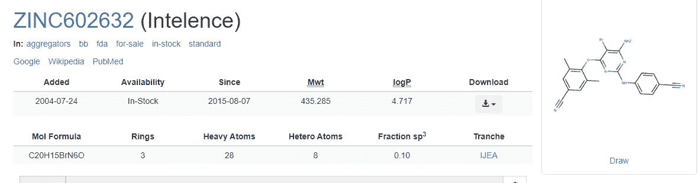

[http://zinc15.docking.org/substances/](http://zinc15.docking.org/substances/)

3.放松位置(11.7，-0.68，23.61)的芳香限制导致仅发现 1 种药物。

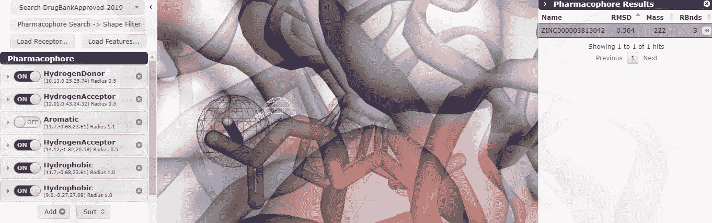

[http://pharmit.csb.pitt.edu/](http://pharmit.csb.pitt.edu/)

这种药物是乙酰唑胺(RMSD = 0.564)，是一种碳酸酐酶抑制剂，可导致利尿，用于青光眼和癫痫。不太可能是什么。

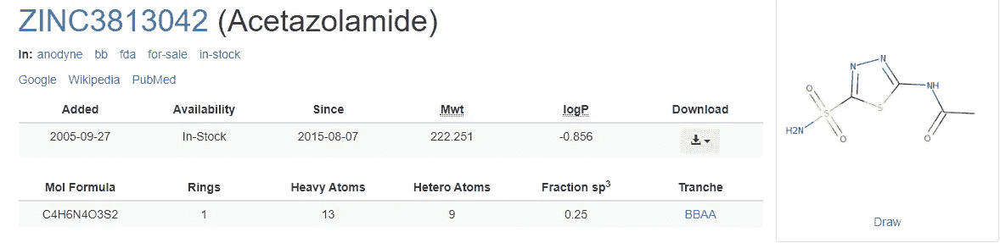

[http://zinc15.docking.org/substances/](http://zinc15.docking.org/substances/)

4.放松(14.12，-1.82，20.58)处的氢受体约束，得到了 16 种可能的药物。

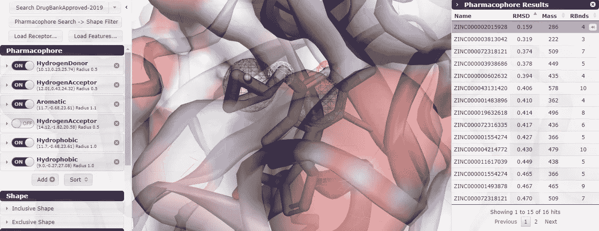

[http://pharmit.csb.pitt.edu/](http://pharmit.csb.pitt.edu/)

从一开始，我就非常兴奋，因为排名第一的药物的 RMSD = 0.159，几乎是之前最佳拟合的一半。

这种药物原来是阿巴卡韦，这是另一种艾滋病毒 NNRTI 像前两种艾滋病毒药物。我承认，如果它是一种蛋白酶抑制剂，我会开心得多。

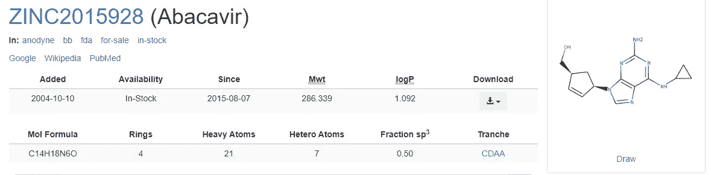

[http://zinc15.docking.org/substances/](http://zinc15.docking.org/substances/)

排名第二的药物仍然是乙酰唑胺。

5.放松(11.7，-0.68，23.61)处的疏水约束导致发现 1 种药物。

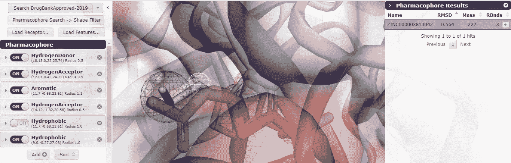

[http://pharmit.csb.pitt.edu/](http://pharmit.csb.pitt.edu/)

这种药物也是乙酰唑胺。

6.放松位置(9，-0.27，27.08)的疏水限制导致发现 60 种药物。

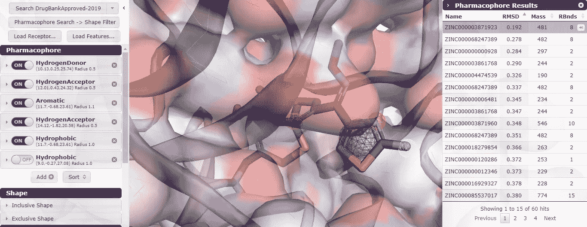

[http://pharmit.csb.pitt.edu/](http://pharmit.csb.pitt.edu/)

排名第一的选择是头孢吡肟(RMSD = 0.192)，这是第四代头孢菌素抗生素。作为一般规则，当你有一个纯粹的病毒感染，抗生素不应给予。这对你没有任何好处。在这项[荟萃分析](https://www.thelancet.com/journals/laninf/article/PIIS1473-3099(07)70109-3/fulltext)中，与其他β-内酰胺类药物相比，使用头孢吡肟治疗的患者死亡率升高。或许不值得追求。

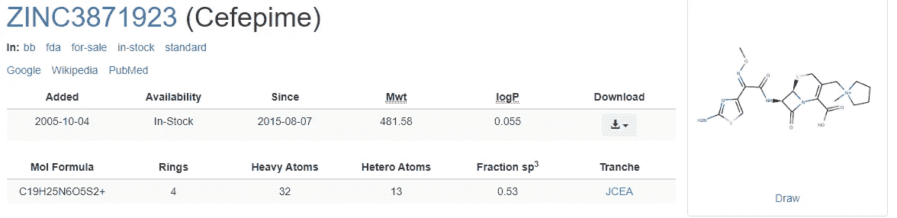

【http://zinc15.docking.org/substances/ 

排名第二的药物是 copanlisib (RMSD = 0.278)，一种用于治疗滤泡性淋巴瘤的 PI3K 抑制剂…我们可能不应该对新冠肺炎患者进行化疗。

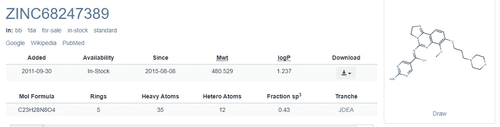

[http://zinc15.docking.org/substances/](http://zinc15.docking.org/substances/)

总的来说，我能够模拟针对新冠肺炎主蛋白酶结合位点的药物筛选。筛选出来的一些更有趣的药物是 NNRTI HIV 药物，特别是阿巴卡韦、利匹维林和因特林。我也对头孢菌素抗生素头孢吡肟和乙酰唑胺很感兴趣。

我对 NNRTIs 的效果并不太乐观，因为之前对另一种冠状病毒 SARS 的研究发现，它们在抑制生长方面并不十分有效。也就是说，阿巴卡韦在所有测试的药物中表现出最强的适应性。

值得强调的是，结合并不等同于抑制。即使结合得最好的分子，如果作用于错误的位点，也可能对蛋白质没有什么影响。

这项工作的一个限制是所有药物测试的结合位点的选择。这受到用于稳定蛋白质晶体结构的配体 RZS 的限制。如果用 DMS 代替 RZS 作为配体，这些药物将会针对不同的位点进行测试，也许会发现更有生物学意义的位点和不同的结果。

此外，新冠肺炎蛋白酶可能不是模拟药物筛选的最佳结构。用于附着宿主细胞的刺突蛋白可能是更好的选择。

同样，药物模拟软件可能有缺陷。选择它是因为它的易用性，但也许其他的会导致更准确的发现。我打算在未来探索其他潜在的模拟软件。

希望这篇文章能教会你一些东西，激励你去对抗新冠肺炎。你不在实验室工作，并不意味着你不能做出贡献。拥有一台电脑和一些好奇心是你所需要的。

请在下面的评论中指出任何明显的错误，这样我们都可以学习。也欢迎分享任何想法、见解和改进建议。

请注意，文章中的所有评论纯属实验性质，不应作为医疗建议。它不应被视为支持特定治疗的医学建议或证据。如果你认为自己可能感染了新冠肺炎病毒，你应该联系卫生官员并接受检测。