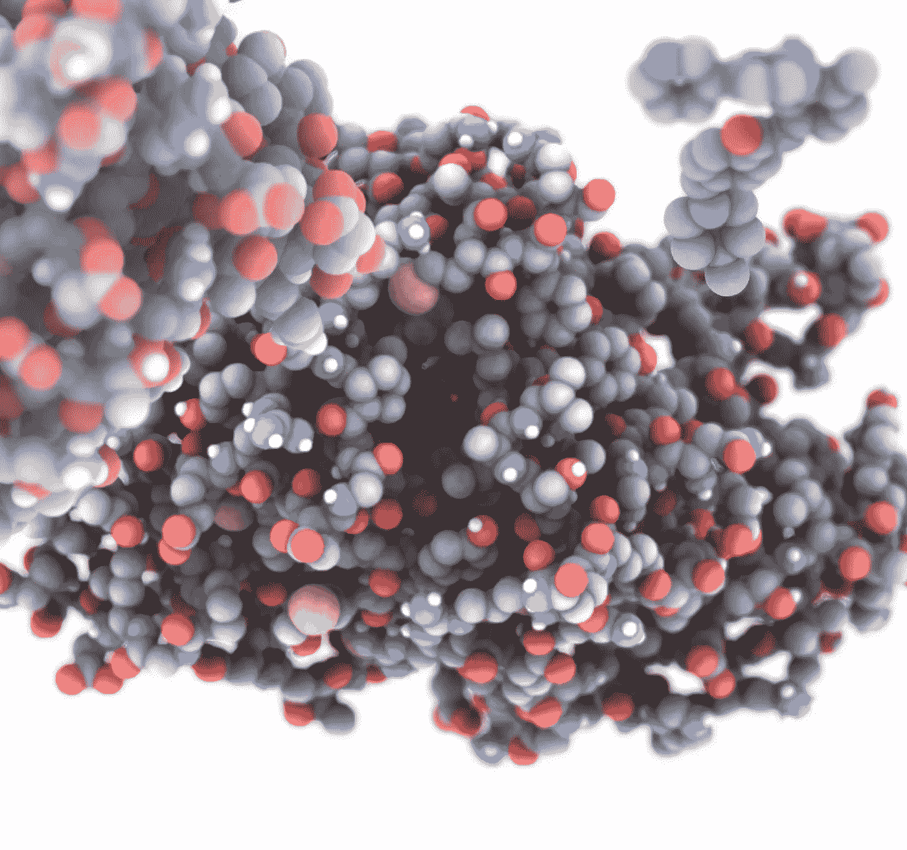
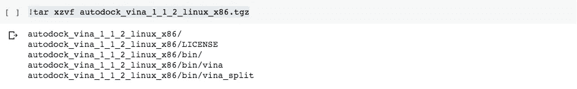
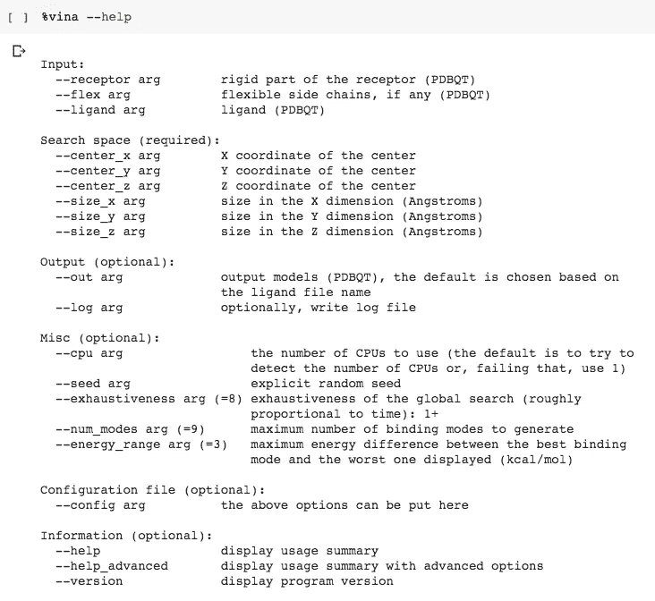
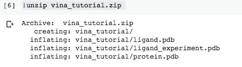
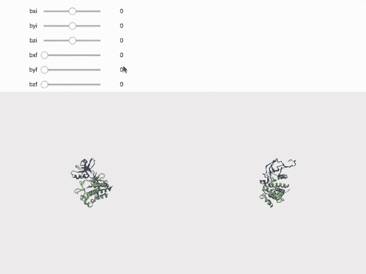
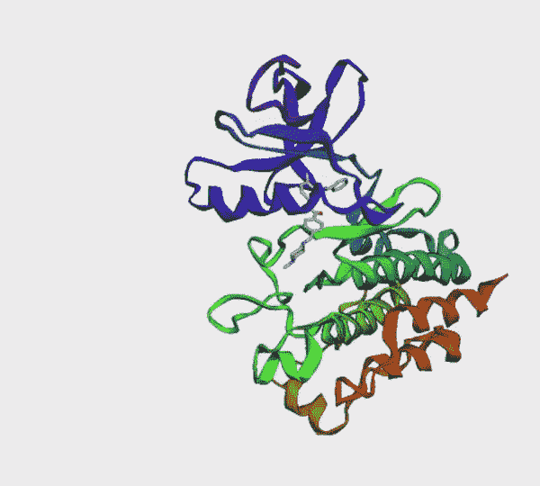

# 用 Colab 鉴定蛋白质-配体相互作用

> 原文：<https://towardsdatascience.com/identifying-protein-ligand-interactions-with-colab-2cfd26ed469a?source=collection_archive---------33----------------------->

设置自动停靠 Vina

由作者渲染

> “我们迫切需要公开、快速地分享我们的方法、模型和结果，以测试发现、确保重现性、测试显著性、消除死角并加速发现。新冠肺炎应用的数据共享将有助于连接全球生物分子模拟社区的科学家，并改善模拟、实验和临床数据与研究人员之间的联系和沟通。”
> 
> 关于共享新冠肺炎生物分子模拟数据的社区信函[1]。

我下面介绍的是至少两篇致力于计算分子生物化学中使用的虚拟筛选技术的文章中的第一篇。从广义上讲，它包括对蛋白质和一组候选药物之间的相互作用进行大规模探索。预测这样一个系统之间的相互作用是一个非常困难的问题，没有唯一的解决方法。虚拟筛选的第一步是一种称为**对接**的计算技术，其中一种分子(可能是一种药物，但不是必须的)反复与受体蛋白接触，并通过例如遗传算法选择具有最佳能量的构型。一般来说，这项技术的结果应该谨慎对待，并与实验室结果进行对比。当以这种方式进行时，可以获得这些系统中相互作用的良好指示，这改进了结果的解释。这篇文章将致力于这第一步。在另一个时间，我将回顾如何大规模地进行这项工作，然后应用分类机器学习算法，该算法受到了 [Kadioglu O，Saeed M，Johannes Greten H&efforth t .](http://Kadioglu O, Saeed M, Johannes Greten H & Efferth T. Identification of novel compounds against three targets of SARS CoV-2 coronavirus by combined virtual screening and supervised machine learning. [Submitted]. Bull World Health Organ. E-pub: 21 March 2020\. doi: http://dx.doi.org/10.2471/BLT.20.255943)的最新工作的启发，他们在这些工作中进行了探索，以找到攻击 SARS-CoV2 病毒的候选药物[2]。

**auto dock Vina**【3】**是一款流行的分子对接软件，用于预测分子是如何被蛋白质托管的。在这里，通过几个步骤，我将向您展示如何在 Google Colaboratory 或 Colab 中安装。你可以输入每个代码片段，或者去底部给出的 GitHub 链接。此外，您可以进入 Autodock 站点获取更多信息，并下载[4]。如果你不耐烦，向下滚动到底部查看分子，并打开 Colab 笔记本，看看它是如何工作的，并与小部件交互。**

1.  ****下载并安装 vina****

**为了将 *vina* 安装到 Colab*笔记本中，我们首先要*！wget* 下载链接:***

**下载并解压缩文件后，*auto dock _ vina _ 1 _ 1 _ 2 _ Linux _ x86*目录创建完成。 *vina* 可执行文件在子目录 bin 中:**

****

**图一。Vina 目录。图片作者。**

**我们可以给 *vina* 程序起一个别名，这样使用起来更方便。如果我们想改变目录并从那里调用 *vina* 这是很有用的:**

**现在我们可以调用 *vina* 作为 linux 命令(这里你可以使用*！vina* 或 *%vina* )从笔记本单元格中的任意目录。例如，我们可以尝试帮助(查看选项):**

****

**图二。帮助选项显示 vina 程序的用法。图片作者。**

**这个输出除了给出 *vina* 的基本用法外，还说明程序运行 OK。如上图所示， *vina* 接收*输入*主要是两种类型的文件，受体和配体。配体是一种化合物，它通过与靶蛋白(受体)上的位点结合形成所谓的复合物。在本教程中，我们将研究程序教程中给出的蛋白质和配体的对接。下一个需要的信息是*搜索空间*，其中被定义为一个以 *center_x* 、 *center_y* 、 *center_z* 和 sides *size_x* 、 *size_y* 、 *size_z* 为中心的盒子，单位为埃。这个盒子是配体将被探测的地方，改变它的位置，方向和可能改变其他自由度。因此，期望具有可发生结合的活性位点的先前信息，以相应地定义盒子，否则，我们可以进行盲对接，其中盒子具有整个受体的大小，但是计算成本较高。后来，我展示了一个小工具来从 Colab 构建这样一个盒子。**

****2。下载教程和 pdbqt 文件****

**蛋白质通常以[蛋白质数据库](https://www.rcsb.org/) (pdb)文件格式表示，其中包含原子位置的三维结构等信息。这里我们将从[http://vina.scripps.edu/tutorial.html](http://vina.scripps.edu/tutorial.html)的 *vina* 教程中获取所需文件，**

**我们必须使用 unzip 进行解压缩，以获得配体和蛋白质 pdb 文件以及"*配体 _ 实验. pdb"* 文件，该文件是通过实验手段获得的“真实”坐标文件，并且 *vina* 预测必须尽可能类似于该结构才能被认为是可接受的，**

****

**图片作者。图片作者。**

**蛋白质和配体文件必须用 *autodock tools* 进行预处理，这是一个允许操纵结构和编写 pdbqt 文件的 GUI，但在这里我将从[https://bcrf . biochem . wisc . edu/all-tutorials/tutorials-materials-molecular-graphics/66-2/](https://bcrf.biochem.wisc.edu/all-tutorials/tutorial-materials-molecular-graphics/66-2/)获得之前准备好的文件**

**我们将在 *vina_tutorial* 目录中工作，因此我们必须将这些文件移动到那里，重命名为" *protein.pdbqt"* 和" *ligand.pdbqt"* ，如下所示:**

**我们将目录更改为 *vina_tutorial* ，在这里我们将完成余下的练习:**

****3。配置文件****

**当我们在图 2 中看到来自 *vina* 的帮助时，我们注意到*配置文件*选项，其中所有选项都可以放在一个脚本中。我们可以使用 *cat* 命令来编写这个文件:**

**我想强调一下这个文件中的一些内容。在第 3 行和第 4 行，受体和配体被清楚地设置为相应 pdbqt 文件的名称。在第 6 行中，最佳构型中配体的 *out* 结构保存在一个“*all . pdbqt”*文件中。最后，从第 8 行到第 14 行，探索框的中心和大小被定义为包围搜索区域。通常，这个框是使用 autodock tools GUI 定义的，但是也可以使用其他流行的查看器来构建它。在接下来的内容中，我将展示如何在浏览器中查看分子，以及如何生成用于对接过程的框。**

****4。为浏览器可视化安装 py3d mol****

**我认为 Py3Dmol 是在 Jupyter 或 Colab 笔记本的浏览器中可视化分子的最佳选择之一。为了使用它，我们可以用 *pip* 安装，导入:**

**下面是我写的一些函数，用来查看分子、构建盒子并制作一个小部件，以便交互式地更改盒子设置:**

**函数 *visbox2* 向 *py3Dmol* 对象添加一个盒子，其中心在 *bxi* 、 *byi* 、 *bzi* ，大小为 *bxf* 、 *byf* 、 *bzf* 。在图 3 中，我们可以看到如何构建盒子。为了更好地可视化，显示了两幅图像。左图显示了 *py3dmol* 的默认屏幕(x-y 平面位于屏幕上)，右图显示了垂直旋转 90 度后的同一屏幕(z-y 平面位于屏幕上)。在这种情况下，只是为了说明如何操作盒子，蛋白质附近的配体被封闭在盒子中。**

****

**图 3。盒子里的分子。中心位置由前三个值 bxi、byi 和 bzi 确定，而框尺寸由后三个值 bxf、byf 和 bzf 定义。左图:长方体在 x-y 平面上移动。右图:我们可以从左到右看到 z. Image 按作者的变化。**

**一旦您对该框的设置满意，这些值将用于配置文件中的 *center_x* 、 *center_y* 、 *center_z* 和 *size_x* 、 *size_y* 和 *size_z* 。**

****5。运行 vina****

**现在我们已经有了蛋白质和配体文件，并且盒子已经设置好了，我们只需调用 *vina* 来读取" c *onf.txt"* 文件。使用虚拟机的 2 个 CPU 需要几分钟时间(遗憾的是这个软件不能在 GPU 上运行):**

****

**图 4。维娜在科拉布跑步。图片作者。**

****6。将 pdbqt 文件转换为 pdb****

**最后，可以使用软件 *openbabel* 将 pdbqt 文件转换成标准格式 pdb:**

**这里是两个分子，蛋白质和配体，在" *all.pdbqt"* 文件中的一个输出配置中，我们可以看到配体正确地位于蛋白质的“空腔”中。**

****

**图 5。蛋白质承载的配体。图片作者。**

****7。结论**。Colab 是一个允许分子对接过程有序进行的工具。尽管计算能力不是最充足的，但是可以转换成 Jupyter 笔记本，在本地运行或者在另一个云服务平台上运行。此外，能够在浏览器中直接可视化也很有用，可以进一步开发以识别化学相互作用，如氢键。我们将看到当机器学习被应用时它是如何工作的。**

****8。链接到笔记本**。[https://github . com/napoles-uach/covid 19 MX/blob/master/VINA _ auto dock _ vis . ipynb](https://github.com/napoles-uach/covid19mx/blob/master/VINA_autodock_vis.ipynb)**

****9。鸣谢**:我要感谢 Jaime Adame Gallegos 博士(@donadame)的善意评论。**

**10。参考文献。**

**[1] Rommie E. Amaro，Adrian J. Mulholland，*化学杂志。Inf。模型。* 2020 年【https://doi.org/10.1021/acs.jcim.0c00319 **

**[2] [Kadioglu O，Saeed M，Johannes Greten H&efforth t .通过组合虚拟筛选和监督机器学习识别针对 SARS CoV-2 冠状病毒三个靶标的新化合物。[已提交]。公牛世界健康器官。电子酒吧:2020 年 3 月 21 日。doi:http://dx . doi . org/10.2471/BLT . 20.255943](http://Kadioglu O, Saeed M, Johannes Greten H & Efferth T. Identification of novel compounds against three targets of SARS CoV-2 coronavirus by combined virtual screening and supervised machine learning. [Submitted]. Bull World Health Organ. E-pub: 21 March 2020\. doi: http://dx.doi.org/10.2471/BLT.20.255943)**

**[3[o . Trott，A. J. Olson，AutoDock Vina:用新的评分函数、高效优化和多线程提高对接的速度和精度，*计算化学杂志 31(2010)455–461*](http://O. Trott, A. J. Olson, AutoDock Vina: improving the speed and accuracy of docking with a new scoring function, efficient optimization and multithreading, Journal of Computational Chemistry 31 (2010) 455-461)*。***

**[http://vina.scripps.edu/index.html](http://vina.scripps.edu/index.html)**