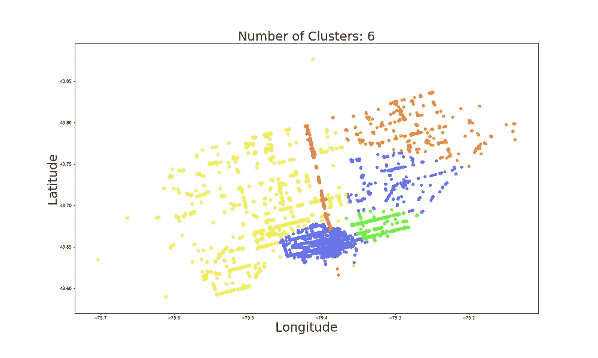

# 用高斯混合模型识别餐馆热点

> 原文：<https://towardsdatascience.com/identifying-restaurant-hotspots-with-a-gaussian-mixture-model-2a840ab0c782?source=collection_archive---------29----------------------->

## 使用 GMM 识别加拿大多伦多的直观餐馆集群(使用 Python 代码)

聚类算法(如 GMMs)是帮助识别数据模式的有用工具。它们使我们能够识别数据集中的子群，从而提高您的理解或增强预测模型。在本文中，在 GMM 的帮助下，我们将尝试使用位置数据来识别多伦多的餐馆集群。目标是找到在地理上有意义，但在其他特征(如餐馆评级)方面具有不同特征的聚类。将讨论关键的代码片段，您可以在 [GitHub](https://github.com/conorosully/medium-articles) 上找到完整项目。

来源:[图一](https://www.flaticon.com/free-icon/scheme_977960)、[图二](https://www.flaticon.com/free-icon/hamburger_2865826)、[图三](https://www.flaticon.com/free-icon/cup_707822)

# 什么是 GMM

如前所述，GMM 是一种聚类算法。这意味着它可用于根据要素对数据集中的元素进行分组。例如，假设我们有一个客户收入和年龄的数据集。聚类算法可以识别 4 个组:年老的高收入者、年老的低收入者、年轻的高收入者和年轻的低收入者。这 4 个群体可能具有非常不同的特征/行为。我们不会深入 GMM 如何创建这些集群的细节，因为那里有大量好的资源[【1】](/gaussian-mixture-models-d13a5e915c8e)[【2】](/gaussian-mixture-models-gmm-6e95cbc38e6e)。重要的是，为什么我们将使用 GMM，而不是其他聚类算法，如 K-means。

对于我们的问题，GMM 最重要的优点是它在聚类方差和协方差方面更灵活。首先，更大的方差灵活性意味着 GMM 可以更好地识别方差不相等的聚类。换句话说，当我们既有密集的集群又有分散的集群时，它会给出更好的结果。我们可以在下面的图 1 中看到这一点，我们将 K-means 和 GMM 应用于一些测试数据。这里，每个点的颜色由相关算法分配的聚类决定。在这种情况下，GMM 星团似乎更合适。

图 1:不同方差集群的聚类算法比较

其次，更大的协方差灵活性意味着我们可以识别更细长/椭圆形的集群。相比之下，K-means 只能真正识别球形簇。我们可以在图 2 中看到这一点，这里 GMM 集群更为合适。当我们将 GMM 应用到我们的餐馆数据集时，我们将看到为什么 GMM 的这些属性很重要。最终，它会让我们发现更多有趣的星团。

图 2:非球形集群上的集群算法比较

# 资料组

为了训练 GMM，我们将使用 Yelp 开放数据集[【3】](https://www.yelp.com/dataset)。这个数据集包含了 Yelp 网站上关于餐馆的大量信息。我们对它进行了预处理，这样我们就有了多伦多每家餐馆的名称、纬度和经度。我们还包括评论的数量(review_count)和餐馆的评级(stars ),这些将在以后用于分析聚类。其他特征，如餐馆的邻居和类别，都被排除在外。我们用下面的代码读取数据集，我们可以在表 1 中看到一个例子。

表 1:餐馆数据集示例

在图 3 中，我们用纬度和经度标出了所有的餐馆。每个点代表一家餐馆，总共有 7148 家餐馆。这个想法是，餐馆的位置可能会告诉我们一些关于它的事情。例如，某些位置的餐馆可能具有较高的评级。因此，我们也许可以在一个试图预测餐馆评级的模型中使用位置。然而，仅仅输入原始的纬度和经度数据可能不会给我们带来好的结果——尤其是当您使用线性模型时。这意味着我们必须对纬度和经度特性执行某种形式的特性工程。

图 3:使用餐馆纬度和经度的散点图

从某些方面来说，考虑到我们周围有餐馆，这已经做到了。换句话说，餐馆已经基于它们的纬度和经度被分组为集群(即，邻居)。问题是多伦多有 71 个不同的社区，这需要估计很多系数。你也许可以根据某些街区的特点将它们组合在一起，但这需要多伦多餐馆领域的知识。我们将尝试另一种方法，使用 GMM 对餐馆进行分组。

# 安装 GMM

在下面 Python 函数的第一部分，我们训练 GMM。GMM 的一个问题是它们可能收敛于局部最优点。为了避免这种情况，我们将“n_init”参数设置为 5。这将随机初始化和训练 5 个 GMM，最后，我们将最好的模型作为我们的最终模型。我们使用这个模型获得每个餐馆的标签/预测。然后，如图 3 所示，我们绘制了餐馆，只是这次我们根据 GMM 标签分配了一种颜色。

您可能已经注意到这个函数有一个参数——集群的数量。这被认为是 GMM 的超参数，是我们必须选择的。如果我们决定太多的聚类，模型将会使数据过拟合。这意味着我们将识别出没有意义的集群，或者将更适合放在一起的集群分割开来。如果我们决定的太少，模型可能会使数据不足。这意味着我们可能会错过一些重要的集群。问题是我们如何决定集群的数量？

有几种不同的方法可以帮助确定适当的集群数量。这些包括使用轮廓分数或模型 BIC 值[【4】](/gaussian-mixture-model-clusterization-how-to-select-the-number-of-components-clusters-553bef45f6e4)。这些只是有用的指南，并不一定会给你最好的集群数量。由于我们只使用 2 个特征来训练我们的 GMM，我们可以很容易地将结果可视化，并了解聚类是否合适。例如，如图 5 所示，我们使用上面的 Python 函数来绘制具有 5 个聚类的 GMM 的结果。

图 5:使用 5 个聚类的 GMM 标签散点图

GMM 发现了一些有趣的集群。例如，蓝色集群似乎非常密集，附近有许多餐馆。红色的长串看起来像是一条路。在图 6 中，我们看到分别使用 4 个和 6 个集群的类似曲线。在这两种情况下，我们看到 GMM 识别出了与图 5 中相似的集群。所以，让我们继续讨论 5 个集群。我们可以进一步分析它们，以更好地了解它们是否合适。

图 6:使用备选聚类数的 GMM 标签散点图

# 分析集群

如果我们看看多伦多的地图，就能更好地理解这些集群。我们使用下面的代码来做到这一点。首先，我们从一个有 5 个簇的 GMM 中得到标签。然后我们创建一个以多伦多为中心的叶子地图。最后，我们将每个点叠加在地图上。像以前一样，每个点的颜色由其标签决定。我们可以在图 7 中看到这个过程的结果。

看看地图，集群开始变得更有意义了。蓝色和绿色集群位于多伦多港周围更密集的城区。这些集群被一条高速公路大致分开，这似乎是划分餐馆群的一种非常自然的方式。黄色和橙色的集群不太密集，它们由更多郊区的餐馆组成。长长的红色星团特别有趣。几乎所有这些点都落在央街。快速搜索发现，这其实是多伦多最著名的街道。考虑到这一点，将这些餐馆归入自己的一组是有意义的。

图 7:覆盖在多伦多地图上的 GMM 星团

这些集群并不完美。有一些流氓红点可能有意义的蓝色集群的一部分。同样，在高速公路的右侧有一些蓝色的点，它们可能属于绿色集群。在很大程度上，GMM 已经确定了在地理上有意义的集群。我们可以预期它们具有不同的特征，但事实并非如此。

我们可以通过考虑餐馆的评论和评级来调查其特点。在表 2 中，我们可以看到每个聚类中餐馆的平均评论数。我们看到，蓝色集群中的评论数量往往更高。事实上，平均评论数量是黄色和橙色集群的两倍多。这可能是有道理的，因为我们可以预期在一个密集地区的餐馆会有更多的顾客。

表 2:集群审查和评级分析

我们还可以看到平均评级和至少拥有 4 星评级的餐厅的百分比(%高评级)。绿色聚类中的餐馆平均评级最高，并且它们拥有最大比例的高评级餐馆。也许这是多伦多的一个更高档的地区？此外，在评级方面，两个郊区集群(黄色和橙色)往往差别很大。

这只是我们可以用来比较集群的两个特征。我们可以永远继续分析它们。最终，集群的适当性取决于您想用它们做什么。总的想法是，也许在一些微调之后，您可以用它的聚类来标记每个餐馆，并在您的分析或模型中的一个特征中使用它。您也可以使用这些集群作为相似地理标签的起点。

## 图像来源

所有图片都是我自己的或从[www.flaticon.com](http://www.flaticon.com/)获得的。在后者的情况下，我拥有他们的[高级计划](https://support.flaticon.com/hc/en-us/articles/202798201-What-are-Flaticon-Premium-licenses-)中定义的“完全许可”。

## 参考

[1] [科里·马克林](https://medium.com/u/948cf3f4f36c?source=post_page-----2a840ab0c782--------------------------------) (2019)，混合模型聚类算法讲解(2019)，[https://towards data science . com/Gaussian-Mixture-Models-d 13 a5 e 915 c8e](/gaussian-mixture-models-d13a5e915c8e)

[3] [里布·尼雷克](https://medium.com/u/4a828aada3a8?source=post_page-----2a840ab0c782--------------------------------)，高斯混合模型(2020)，[https://towardsdatascience . com/Gaussian-Mixture-Models-GMM-6 e 95 CBC 38 E6 e](/gaussian-mixture-models-gmm-6e95cbc38e6e)

[3] Yelp，Yelp 开放数据集(2019)，[https://www.yelp.com/dataset](https://www.yelp.com/dataset)

[4] [Vincenzo Lavorini](https://medium.com/u/f0c2f36e0bc7?source=post_page-----2a840ab0c782--------------------------------) ，高斯混合模型聚类:如何选择分量数(2018)，[https://towards data science . com/Gaussian-Mixture-Model-clusterization-how-to-select-the-number-of-components-clusters-553 bef 45 F6 e 4](/gaussian-mixture-model-clusterization-how-to-select-the-number-of-components-clusters-553bef45f6e4)