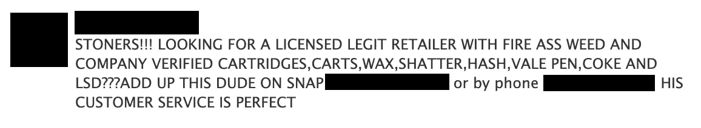

# 识别 Soundcloud.com 的非法毒品卖家

> 原文：<https://towardsdatascience.com/identifying-sellers-of-illicit-narcotics-on-soundcloud-com-3ca0bece4307?source=collection_archive---------48----------------------->

## 识别网上毒贩的自动化框架


来自[像素](https://www.pexels.com/photo/medication-pills-isolated-on-yellow-background-3683105/)的图像

# 介绍

许多网上药品销售发生在暗网市场——隐藏在暗网上销售非法商品的平台。然而，在 Instagram 和 Snapchat 等地方，这些商品的销售开始从暗网过渡到表面网。

卖家将利用这些平台发布他们产品的图片，并建立销售。然后，客户将付款并提供送货地点。定位这些帐户可能很困难，尤其是在 Snapchat 的情况下，因为你必须将他们添加为好友才能查看他们的内容。

然而，这些卖家正在网络上宣传他们的 Instagram 和 Snapchat 个人资料。这种情况发生在流行的在线音乐流媒体网站 Soundcloud 的评论区。下面是一个评论的截图，可识别的信息被编辑，广告大麻，可卡因和迷幻药。



图片来自[音云](https://soundcloud.com/)

建立一个自动化框架来收集 Soundcloud 评论并提取 Snapchat 和 Instagram 上销售毒品的个人资料，有助于提高这一新领域执法工作的有效性。

# 结构

该框架是用 Python 开发的，包括两个组件:web 抓取和帐户提取。网络爬虫抓取 Soundcloud.com 并下载流行歌曲的评论。然后，这些评论被输入账户提取组件，该组件识别广告销售毒品的评论，并提取 Instagram 和 Snapchat 账户。

## *刮网器*

web scraper 从 Soundcloud 上的当前热门曲目中抓取评论，并将其存储在 csv 文件中。这一管道概述如下。

首先，Selenium 库用于访问 Soundcloud 图表页面。

```
driver = webdriver.Chrome()
driver.get("[https://soundcloud.com/discover/sets/charts-top:all-music:us](https://soundcloud.com/discover/sets/charts-top:all-music:us)")
time.sleep(5)
```

然后选择当前的顶部轨道。

```
driver.find_element_by_xpath('//*[[@id](http://twitter.com/id)="content"]/div/div/div[2]/div[1]/div/div[2]/ul/li[1]/div/div[3]/a[2]').click()
```

因为 Soundcloud 对评论使用动态加载，所以需要先滚动到页面底部，直到不能再加载评论为止。

```
last_height = driver.execute_script("return document.body.scrollHeight")while True: driver.execute_script("window.scrollTo(0,               document.body.scrollHeight);") time.sleep(2) new_height = driver.execute_script("return document.body.scrollHeight")if new_height == last_height:
 break
 last_height = new_height
```

评论是由班级选择的。

```
comments = driver.find_elements_by_class_name('commentItem__read')
```

然后从评论中提取文本和用户名，并分别存储在 *commentTextList* 和 *commentUserList* 中。

```
for comment in comments:
  commentText
  comment.find_element_by_xpath('.//div[1]/div/span/p').text
  commentUser =  comment.find_element_by_xpath('.//div[1]/span/a').text
  commentTextList.append(commentText)
  commentUserList.append(commentUser)
```

commentTextList 和 commentUserList 然后被转换成 Pandas 数据帧并导出到 csv。

```
df['User'] = commentUserList
df['commentText'] = commentTextListdf.to_csv('scrape.csv')
```

## *账户提取*

账户提取组件搜索抓取的评论以识别毒品卖家并提取他们的 Instagram 和 Snapchat 账户。这一管道概述如下。

首先，使用 read_csv 加载注释。

```
df = pd.read_csv("scrape.csv")
```

为了识别销售毒品的广告账户的评论，使用了关键词列表。所选的关键词通常出现在这些评论中。在这个领域之外也经常使用的关键字，如“芽”，被排除在外。

```
keywordList = ['carts', 'pills', 'shrooms', 'lsd', 'acid']
```

然后在评论中搜索与关键词匹配的内容。如果找到匹配，该注释将被添加到列表 *foundComments 中。*

```
for ind in df.index:
  if any(ext in df['commentText'][ind] for ext in keywordList):
  foundComments.append(df['commentText'][ind])
```

如果评论包括 snapchat 或 Instagram 帐户，帐户名称几乎总是以 snap、Snapchat、insta 或 instagram 开头。为了捕捉这些不区分大小写的单词，注释被转换为小写。在某些情况下，评论中会使用表情符号。这些都是用 Demoji 库剥离出来的。然后，评论被转换成向量，一系列 if 语句被用来识别帐户在哪个平台上以及帐户名称是什么。如果找到一个账户，账户名称被添加到列表*用户名列表*，平台被添加到列表*平台列表*。

```
for comment in foundComments:
  cleanComment = demoji.replace(comment)
  cleanComment = cleanComment.lower()
  commentVector = cleanComment.split()
  if 'insta' in commentVector:
    next_word = commentVector[commentVector.index('insta') + 1]
    usernameList.append(next_word)
    platformList.append('instagram')
 if 'instagram' in commentVector:
    next_word = commentVector[commentVector.index('instagram') + 1]
    usernameList.append(next_word)
    platformList.append('instagram')
 if 'snap' in commentVector:
    next_word = commentVector[commentVector.index('snap') + 1]
    usernameList.append(next_word)
    platformList.append('snapchat')
 if 'snapchat' in commentVector:
    next_word = commentVector[commentVector.index('snapchat') + 1]
    usernameList.append(next_word)
    platformList.append('snapchat')
```

然后创建一个新的 pandas 数据框架，并添加两个列表。然后将数据帧导出为 csv 文件。

```
df2 = pd.DataFrame()
df2['username'] = usernameList
df2['platform'] = platformList
df2.to_csv('accounts.csv')
```

# 讨论

麻醉品销售从现场销售转向网上销售给执法部门带来了新的问题。这一框架可以帮助确定在线分销商，以便进一步调查，并改善这一领域的执法工作。

虽然这种实现只抓取了 Soundcloud 上的顶级音轨，但该框架可以扩展到从多个页面收集评论，从而大大提高其效率。此外，这个框架可以适用于 Soundcloud 之外的其他平台。

关键字词典也可以改进，以包括更多的术语和识别句子结构。提取 Snapchat 和 Instagram 用户名的算法也可以改进，以处理使用其他句子结构的评论。