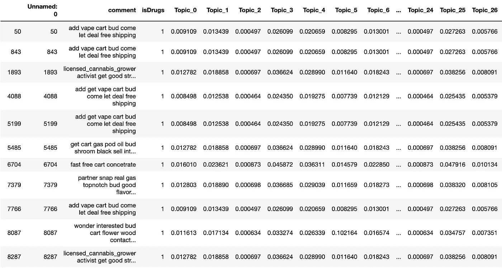
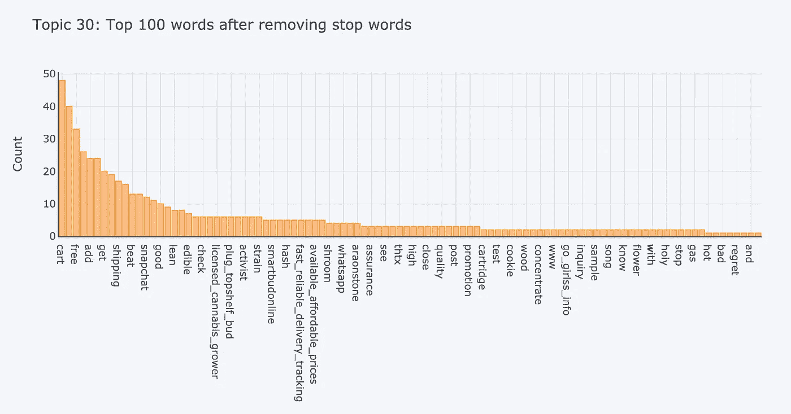
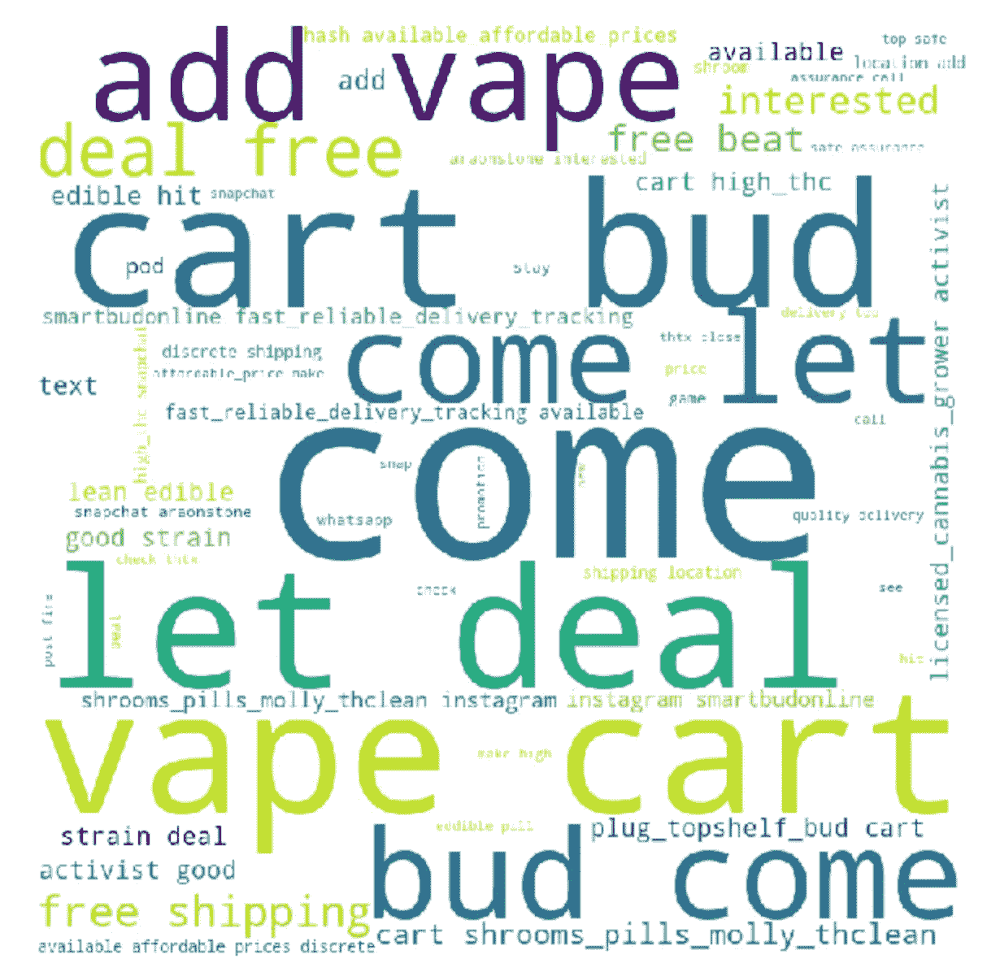

# 利用潜在狄利克雷分配识别 Soundcloud.com 非法毒品卖家

> 原文：<https://towardsdatascience.com/identifying-sellers-of-illicit-narcotics-on-soundcloud-com-using-latent-dirichlet-allocation-cae0a66deb67?source=collection_archive---------66----------------------->

## 基于 PyCaret 的 Soundcloud.com 评论主题建模

# 介绍

之前，我开发了一个[框架](/identifying-sellers-of-illicit-narcotics-on-soundcloud-com-3ca0bece4307)，用于识别 Soundcloud.com 上非法毒品广告的卖家。这个框架通过一个简单的关键词搜索来搜集评论，并识别出为药物做广告的评论。虽然这个框架由于注释的相似结构做得很好，但我想通过使用潜在的 Dirichlet 分配来尝试改进这个框架。

潜在狄利克雷分配(LDA)是用于学习文本的抽象主题的自然语言处理(NLP)模型，也称为主题建模。LDA 会将文档按主题分类，允许我们对评论进行分类，并找到宣传毒品销售的评论。

# 数据

该模型中使用的数据是以前收集的，用于 Tableau 中的分析。当时 Soundcloud 上排名前三的歌都是刮出来的:Playboi Carti 的@MEH，Baby Jesus 的 Find My Way，Lil Mosey 的 Blueberry Faygo。该数据集有 17048 条评论，其特征为*评论*和*药物*。特征*评论*是刮掉的评论的文本，特征*是药物*包含用于广告毒品销售的帖子的 1 和用于其他帖子的 0。关于数据收集的更多信息可参见[此处](/visualizing-sellers-of-illicit-narcotics-on-soundcloud-com-5b3bb9331b4b)。

# 模型实现

为了开发 LDA 模型，使用了一个名为 PyCaret 的 python 库。PyCaret 有很多机器学习算法的模块，但是使用的是 NLP 模块。更多关于 PyCaret 的信息可以在[这里](/announcing-pycaret-an-open-source-low-code-machine-learning-library-in-python-4a1f1aad8d46)找到。

首先，PyCaret nlp 模块和 Pandas 被导入。

```
from pycaret.nlp import *
import pandas as pd
```

然后将数据集读入熊猫数据帧。

```
data = pd.read_csv('ldaData.csv')
```

读入数据后，运行 PyCaret 设置函数。这个函数初始化 PyCaret 环境。会话 id 123 用于轻松再现环境。

```
dataSetup = setup(data = data, target = 'comment', session_id = 123)
```

制作 LDA 模型时，必须传递主题数。由于该模型的目标是将销售毒品的广告准确分类到一个主题中，PyCaret 的模型调整与 *isDrugs* 功能结合使用，以确定最佳主题数量。最佳主题数为 32 个，准确率为 98.9%。

```
tuned_classification = tune_model(model = 'lda', supervised_target = 'isDrugs')
```

然后使用 32 个主题创建了 LDA 模型。

```
lda = create_model('lda', num_topics = 32)
```

然后将模型分配给数据。

```
lda_results = assign_model(lda)
```

宣传毒品销售的评论被归类为话题 30。一些不相关的评论被分类到主题 30 中，但是这些评论通常可以通过过滤来过滤掉，其中特征 *Perc_Dominant_Topic* 大于 18% *。*我们可以看到这个话题中使用熊猫的一些评论。Snapchat 或 Instagram 用户名已被审查。

```
lda_results.loc[(lda_results['Dominant_Topic'] == 'Topic 30') & (lda_results['Perc_Dominant_Topic'] > 0.18)]
```



然后为主题 30 绘制频率图。

```
plot_model(lda, plot = 'frequency', topic_num = 'Topic 30')
```



话题 30 也可以被可视化为单词云。

```
plot_model(lda, plot = 'wordcloud', topic_num = 'Topic 30')
```



# 讨论

LDA 似乎是一个很有前途的工具，可以用来识别 Soundcloud 上非法毒品广告的卖家。虽然该模型的性能相当不错，但额外的模型调整可以提高性能。这种模式也可以实现到原始框架中(可以在这里看到)，并添加一个图形用户界面供执法部门使用。