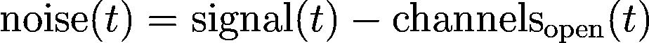
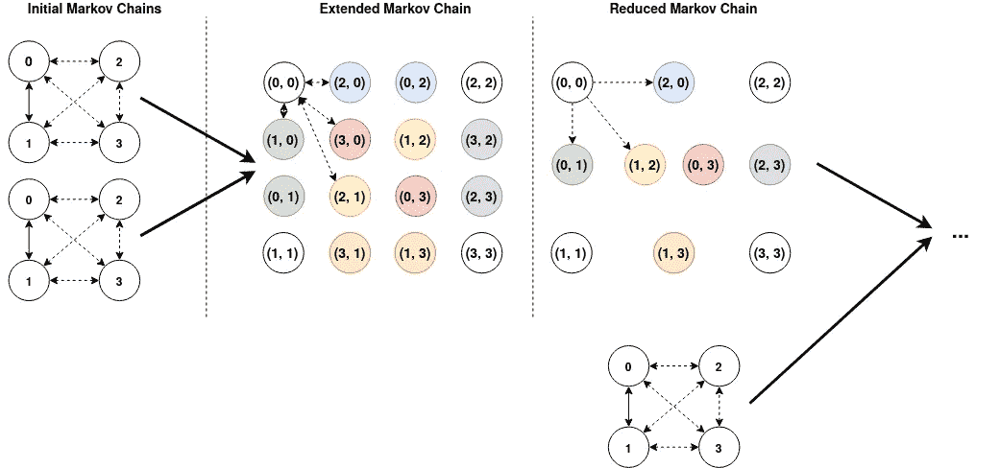

# 用隐马尔可夫模型识别开放离子通道的数量

> 原文：<https://towardsdatascience.com/identifying-the-number-of-open-ion-channels-with-hidden-markov-models-334fab86fc85?source=collection_archive---------34----------------------->

## 一篇关于我们如何差点赢得“利物浦大学—离子交换”Kaggle 竞赛的报道

2020 年 4 月 6 日编辑:我们已经发布了我们的代码！

2 月 24 日， [Kaggle](http://www.kaggle.com) 与[利物浦大学](https://www.liverpool.ac.uk/)合作发布了一项新的“研究”竞赛，奖金高达 25000 美元。在这场比赛中，我们获得了与离子通道数据相对应的电信号，我们的目标是创建一种算法，可以自动识别每个时间点打开的通道数量。最初，比赛以一种奇特的“二次加权科恩卡帕评分(QWK)”开始，但这导致了发布后不久近乎完美的结果，这使得 [me 不愿加入](https://www.kaggle.com/c/liverpool-ion-switching/discussion/132527)。过了一段时间，竞争指标变成了更合理的宏观 F1 分数，之后很明显我们离完美的解决方案还很远。我决定加入是因为几个原因:

*   这是时间序列数据。
*   这只是一个单一的时间序列，这使我们能够更专注于预处理和建模，而不是功能工程。
*   数据集相当小，在训练集中总共有 500 万个测量值，在测试集中有 200 万个测量值。所需的总存储空间约为 125 MB。

我有幸与我曾有机会共事过的两个最聪明的人合作:[卡沃](https://www.kaggle.com/khahuras)和[兹德米](https://www.kaggle.com/zidmie)。**最终，我们成功获得了第三名和 5，000 美元奖金，并在 2600 多个团队中脱颖而出。** [第一名和第二名设法在比赛快结束时在私人测试数据中发现了一个漏洞](https://www.kaggle.com/c/liverpool-ion-switching/discussion/153824)，我们没有发现(只是在知道它的存在之后)。换句话说，我们有了**最佳无泄漏解决方案**！最后，我们能够在很短的时间内[自己找到这个漏洞](#cf75)，这让我们更加沮丧…

这篇博文将提供我们解决方案的详细概述，并提供我们提出解决方案所需的见解。以下是目录:

*   [**简介**](#d423)
    - [问题陈述](#da77)
    - [一看数据&竞赛度量](#08e4)
*   [**预处理**](#634a)
    - [预处理一:去除漂移](#2d98)-
    -[预处理二:线性变换](#9466)
    - [预处理三:电力线干扰去除](#5270)
    - [类别 5 =类别 4 +类别 4](#cf75)
*   [**建模**](#5857)
    - [隐马尔可夫模型:1 通道数据](#2e4c)-[-【隐】隐马尔可夫模型](#2bb4)
    - [将隐马尔可夫模型扩展到 K 通道](#8d9f)
    - [在隐马尔可夫模型中引入记忆](#2bfb)
*   [**后处理**](#fe33)
    - [后处理后验概率](#2b73)-
    -[一点点融合](#0a56)
*   [**结论**](#0d40)

# 介绍

## **问题陈述**

[离子通道](https://en.wikipedia.org/wiki/Ion_channel)是成孔膜蛋白，存在于动物和植物中，允许离子通过通道孔。它们对学习和记忆进行编码，帮助对抗感染，发出疼痛信号，刺激肌肉收缩。这些离子通道可以通过[膜片钳技术](https://en.wikipedia.org/wiki/Patch_clamp)进行记录和分析，以推断疾病的某些特性。

来自[维基百科](https://en.wikipedia.org/wiki/Ion_channel)的离子通道示意图。

组织者这样描述这个挑战:“当离子通道打开时，它们传递电流。检测这些状态变化的现有方法既慢又费力。人类必须监督分析，这除了乏味之外，还会带来相当大的偏差。这些困难限制了可用于研究的离子通道电流分析的容量。科学家希望该技术能够在原始数据中快速自动检测离子通道电流事件。在过去的 20 年里，分析电池中电数据的技术没有发生重大变化。如果我们更好地了解离子通道活动，这项研究可能会影响许多与细胞健康和迁移相关的领域。从人类疾病到气候变化如何影响植物，更快地检测离子通道可以大大加快解决重大世界问题。”

当离子通道打开时，我们可以清楚地看到电流的增加。

## 了解数据和竞争指标

提供给我们的数据相当简单，这是这场比赛的好处之一。数据只包含三列:

*   时间戳
*   每个时间戳的安培值(电流)。这些值是在 10 千赫的采样频率下测量的。
*   该时间戳对应的开放通道数(仅针对训练数据提供)。

训练数据集包含 500 万行，而测试数据集包含 200 万行。竞赛的目标是在这 200 万行上最大化宏观 F1 分数。特定类别的 F1 分数被定义为精确度和召回率的调和平均值:

**“宏”** F1 简单来说就是每个班级的平均 F1 分数。因此，如果我们有 *K* 类，我们将计算 *K* F1 分数，然后取这些 *K* 分数的平均值。如果我们检查提供的数据，我们已经可以得出一些有趣的事情…

提供的原始数据(训练和测试)

首先，通过检查训练数据中的开放通道，我们可以看到*数据由批量 500K 测量值*组成。我们也可以在电信号中批量看到这些转换。在测试集中，我们可以找到 100K 的*批次。而且，事实证明，训练集中 500K 的批次实际上由 5x 100K 的批次组成。*

训练由多批 500K 组成。摘自[Chris Deotte](https://www.kaggle.com/cdeotte/one-feature-model-0-930)[的【一个特征模型】](https://www.kaggle.com/cdeotte)。

通过更多地检查训练集中的开放频道，我们可以在训练集中找到五个不同的组:

*   开放信道等于 0 或 1 的组。有许多 0 和一些 1。**(类别 1)**
*   开放信道等于 0 或 1 的群。很多 1，很少 0。**(类别 2)**
*   等于 0，1，2，3 的一组开放通道。**(第三类)**
*   等于 0，1，2，3，4，5 的一组开放通道。**(第四类)**
*   等于 0，1，2，3，4，5，6，7，8，9，10 的一组开放通道。**(类别 5)**
*   令人惊讶的是，测试数据包含许多看起来非常类似于类别 1 的数据，但在电信号中有一些尖峰，这些尖峰没有出现在列车数据中。因此，我们将这些分类为单独的类别**(类别 6)**

当将这种洞察力与竞争指标相结合时，很明显*具有多达 10 个开放频道* ***(类别 5)*** *的组将对宏观 F1 平均值产生最大影响。*它有 5 个独特的类别(6、7、8、9、10)，没有出现在其他组中，因此，这组数据对我们的宏观 F1 分数的贡献超过 50%。在比赛过程中， [Waylon Wu](https://www.kaggle.com/waylongo) [通过打探发现](https://www.kaggle.com/c/liverpool-ion-switching/discussion/133142)公共 LB 由前 30%(或 600000)的测试值组成，而私有 LB 由剩下的 70% (1400000)组成。

# 预处理

## 预处理 I:消除漂移

我们注意到，在训练信号的开始和结束以及测试信号的不同位置都存在奇怪的漂移…我们注意到两种类型的漂移:曲线漂移(例如，在训练信号的结束)和线性漂移(例如，在训练信号的开始，时间=50 左右)。

来自信号的两个子样本说明了两种类型的漂移。

最后，事实证明“线性”漂移根本不是线性的，而实际上只是“弯曲”漂移的一小部分(例如，我们的弯曲漂移的前半部分看起来也是线性的)。比赛开始后不久， [Eunho Lee](https://www.kaggle.com/eunholee) 和 [Markus F](https://www.kaggle.com/friedchips) 发现比赛组织者通过使用频率非常低的(周期值为 1.000.000)的[正弦函数，在数据中引入了人为噪声。](https://www.kaggle.com/eunholee/remove-drift-using-a-sine-function) [Chris Deotte](https://www.kaggle.com/cdeotte) 将来自两个独立分析的见解捆绑在一起，以执行最干净的漂移消除，并[从中制作一个数据集](https://www.kaggle.com/cdeotte/data-without-drift)，该数据集可被所有其他竞争对手使用(感谢 Chris！).我们的新数据现在看起来如下:

漂移消除后的数据

我们可以注意到，从时间=360 到时间=390，有些事情仍然在出错。我们决定不为此费心，因为这样的异常在测试集中不存在，并且我们从我们的训练集中删除了这个数据。

## 预处理 II:线性变换

通过检查数据，很明显列车信号和开放频道的数量是高度相关的。事实上，对电信号应用线性变换，然后对结果值进行舍入，已经表现得相当好了。

电信号和开放通道的数量密切相关。

我们决定学习每类数据的线性变换，将电信号值最好地映射到开放通道的数量，这使得在未来的步骤中更容易分析。转换相当简单，我们学习了以下函数的两个不同参数(1D 线性回归):

1D 线性回归，以更好地将电信号(x)与其各自的开放通道数对齐。o 是偏移量，s 是线性回归的斜率。

我们的斜率对于每个类别都是相同的(0.8107)，并且偏移取决于类别(对于类别 2、3、4 和 6 是 2.221318；类别 5 为 4.4288541，类别 1 为 2.180783)

对齐的数据。请注意，电信号现在已经非常好地对应于各个开放通道的数量。对信号值进行舍入已经会产生强基线。

[我们提供了一个包含 python 代码的笔记本来说明这一点。](https://github.com/GillesVandewiele/Liverpool-Ion-Switching/blob/master/notebooks/1%20-%20Align%20Channels%20and%20Signal.ipynb)

## 预处理三:电力线干扰消除

正如我在上一节中提到的，舍入我们对齐的电信号值将会产生一个强基线。不幸的是，它不会产生一个完美的分数…这是由于噪音存在于我们的数据集中(幸运的是，否则这将是一个相当微不足道的挑战)！我们可以通过简单地计算以下等式来检查这种噪声:

下面是我们的训练集的前 10000 个噪声值的图:

我们训练集的前 10000 个噪音值

虽然可能很难用肉眼看到，但在我们的噪声中存在某种波形。如果我们取一个大小为 50 的居中窗口的移动平均线，这就变得更加清楚了:

我们 10000 个噪声值的移动平均值(大小为 50 的居中窗口)。

我们可以清楚地看到平均每 200 个值就有一个波峰。以 10 kHz 的采样频率测得的周期约为 200 的周期性信号对应于 50 Hz 的频率。原来英国的交流电(比赛是利物浦大学的)频率是 50 Hz！为了从我们的噪声中消除这种模式，我们决定在每批 100000 个噪声值上拟合一个正弦函数(为此，您可以使用 [scipy.optimize](https://docs.scipy.org/doc/scipy/reference/generated/scipy.optimize.curve_fit.html) )。虽然信号处理技术，如带通和带阻滤波器也可以做到这一点，但我们用简单的正弦函数可以得到更好的结果。结果还表明，正弦函数中有多个分量(即多个正弦波具有不同的振幅、相位和频率)效果最佳。

10000 个噪声值和相应的拟合正弦函数。

[同样，我们提供了一个笔记本来用 python 代码演示这一点。](https://github.com/GillesVandewiele/Liverpool-Ion-Switching/blob/master/notebooks/2%20-%20Remove%20Power%20Line%20Interference.ipynb)

## 类别 5 =类别 4 +类别 4

看起来我们的噪声去除技术对所有类别都很有效，除了一个类别……类别 5 中的数据有一些独特之处，使其区别于其他所有类别。通过做一些实验，我们注意到我们可以通过将类别 4 中的两个随机批次相加，很好地模拟类别 5 中的数据。

通过将两批类别 4 相加，生成类别 5 的合成数据。

通过这种假设，我们也可以假设 5 类噪声是两个正弦函数的叠加。此外，这种见解允许对例如神经网络有用的数据扩充。

**事实证明，这一见解实际上也是漏洞。我们没有追求这条途径足够长的时间，但私人测试数据正好是两个类别 4 批次的总和，其中一个可以在训练集中找到...比赛结束后，我的队友 Zidmie，** [**在大约 30 分钟的寻找中发现了这个漏洞**](https://www.kaggle.com/c/liverpool-ion-switching/discussion/153824) **(将我们的私人得分提高到 0.95430)。令人沮丧的是，由于一个漏洞，我们在 30 分钟内改进的模型比我们两个月的工作都多。后来他发现了整个泄密:** `y_test[570000:5800000] = predict(X_test[5700000:5800000] - X_train[4000000:4100000]) + y_train[4000000:4100000]` **。因为你现在预测的是第 4 类数据(最多 5 个通道)，所以任务变得容易多了。**

再现#1 和#2 使用的泄漏。#1 从 X_test 中提取 X_train，而#2 从 X_test 中提取 y_train。提取 X_train 比 y_train 好，因为你也把噪音降低了一半！

# 建模

## 隐马尔可夫模型:单通道数据

这个迷因太适合不使用它了。最后，**事实证明，私有测试数据的泄露是真正的赢家**(也许我应该创造一个新的迷因……)。

序列状态空间模型，如隐马尔可夫模型，在很长一段时间内是这类问题的最新技术。只是在最近，深度学习的变体才被提出来(例如竞赛组织者提出的[本文](https://www.nature.com/articles/s42003-019-0729-3))，因为这些变体通常对漂移之类的事情更加鲁棒。由于我们正在预处理我们的数据以消除所有的伪像，我们决定采用隐马尔可夫模型作为我们这次比赛的建模技术。

有很多关于隐马尔可夫模型的精彩介绍，所以我在这里就不再赘述了。我们需要知道的是，每个隐马尔可夫模型都有不同的参数:

*   隐藏状态的数量(= K)
*   初始化概率(大小为 K 的向量)
*   一个转移矩阵(K×K 矩阵)
*   排放概率。每个隐藏状态都发出一定的可观测值。这些发射可以具有不同的分布，例如离散发射的多项分布和连续发射的高斯分布(我们将在这里使用，因为我们的电信号是连续的)。

简而言之，开放通道(隐藏变量)遵循特定的马尔可夫过程，并以由转移矩阵确定的特定概率从一个值转移到另一个值。当马尔可夫过程处于某个隐藏/潜在状态时，会发出一个可观测值，这里就是电信号。

作为一个例子，我们将关注具有二元响应变量(开放通道= 0 或 1)的类别 2，并假设我们的马尔可夫模型具有 2 个隐藏状态。当打开通道的数量等于 0 时为隐藏状态，当它等于 1 时为一个隐藏状态。通过查看我们的训练数据(即，计算从一个状态到另一个状态的转换，并查看与一定数量的开放通道相对应的信号值)，我们可以很容易地估计转换矩阵和发射分布:

第二类训练数据的估计高斯分布和转移概率。

这意味着，例如，如果开放通道的数量等于 1，信号值也将大约为 1(有一点差异)。下一个值将以 93.6%的概率等于 1，或者以 6.4%的概率等于 0。如上所述，这些参数可以通过使用训练数据来估计，但是也可以通过应用[鲍姆-韦尔奇算法](https://en.wikipedia.org/wiki/Baum%E2%80%93Welch_algorithm)来估计。该算法是期望最大化算法的一个特例，期望最大化算法是一个**无监督算法**(不需要交叉验证，允许更快的迭代)。简而言之(也是简单化的方式)，它会基于其初始参数进行预测，然后使用这些预测来更新参数，直到收敛。一旦学习了参数，我们就可以通过应用两种算法中的一种来执行推理:

*   [维特比算法](https://en.wikipedia.org/wiki/Viterbi_algorithm)——将返回最可能的序列
*   [前向-后向算法](https://en.wikipedia.org/wiki/Forward%E2%80%93backward_algorithm)(或最大后验概率)——返回 TxK 概率矩阵 P，其中`P[t][k]`将是在时间`t`处于隐藏状态`k`的概率。

[初始实验](https://www.kaggle.com/group16/lb-0-936-1-feature-forward-backward-vs-viterbi)已经表明，前向-后向算法比维特比算法工作得稍好(尽管较慢)。注意，这些算法也用于 Baum-Welch 算法。在 Python 中应用所有这些算法的一个很棒的库是 [hmmlearn](https://hmmlearn.readthedocs.io/en/latest/) 。

让我们在类别 2 的预处理数据上拟合一个双态 HMM:

创建具有两个隐藏状态的隐藏马尔可夫模型，我们基于我们的训练数据估计我们的发射分布和转移矩阵的参数。“长度=[100000]*10”来自于类别 2 有 2 批数据的事实。每批长度为 500K，同样由 5 批 100K 组成。因此，我们总共有 10 个长度为 100000 的序列。

我们脚本的输出。hmmlearn 库执行 Baum-Welch 算法 5 次迭代以适应我们的参数，之后它收敛。这类数据的 F1 分数等于 0.9961

因此，通过使用这个相当简单的方法，我们已经可以在我们的数据类别 2 上获得 0.9961 的 F1 分数。应该注意的是，我们的数据的类别 1 和类别 2 是最简单的，具有近乎完美的性能。F1 分数随着开放频道的最大数量而迅速下降。例如，我们无法在数据的类别 5 上达到 0.9 的 F1 分数。[请看这本笔记本，了解更详细的例子。](https://github.com/GillesVandewiele/Liverpool-Ion-Switching/blob/master/notebooks/3%20-%20Fit%204-state%20HMM%20(Cat%203).ipynb)

## “隐”隐马尔可夫模型

当阅读组织者发表的一篇论文时，可以清楚地看到，尽管开放频道的数量遵循马尔可夫过程，但它们又是由隐马尔可夫模型生成的。：

地面真相(开放通道)由马尔可夫过程产生，这可以是合成的(这是该比赛的情况)或真实的(因为假设真实离子通道遵循马尔可夫过程)。这个地面真相然后通过膜片钳放大器播放并记录下来，这产生了我们的带噪声(电信号)的可观测数据。[图取自主办方的一篇论文。](https://www.nature.com/articles/s42003-019-0729-3/figures/1)

这个隐马尔可夫模型由比唯一的开放信道值的数量更多的隐藏状态组成。这是 [Markus F](https://www.kaggle.com/friedchips) 在比赛中[指出的](https://www.kaggle.com/c/liverpool-ion-switching/discussion/140634)。

左边是“香草”HMM，右边是 2 层或隐马尔可夫模型。

一个简单的方法是在我们的 2 层模型中忽略中间层(y(t))。因此，我们有一个隐藏马尔可夫过程，其隐藏状态的数量大于唯一开放通道的数量。让我们将这一观点应用到我们的类别 2 数据中。我们将在 HMM 中使用 4 个隐藏状态(我们已经用其他数字进行了实验，但是 4 个效果最好)。前两个隐藏状态将对应于开放通道的数量等于 1 时，随后的两个隐藏状态对应于开放通道为 0 时。估计初始转移矩阵现在变得更加困难，因为我们不能从我们的训练数据中直接估计它，我们手动调整了转移矩阵。

为了适合 4 状态 HMM，我们手动初始化转移矩阵，并对不同的隐藏状态重复使用我们的均值和协方差。

我们脚本的输出。请注意，hmmlearn 在迭代过程中打印的负对数似然比具有两个隐藏状态的对数似然大一倍。

可以注意到，我们现在获得了 0.9972 的 F1 分数，与仅使用 2 个隐藏状态相比，这大约增加了 0.001。这种改善非常显著，尤其是考虑到随着开放频道数量的增加，这种改善甚至会增加更多。F1 分数 0.001 的差距就是一枚银牌和一枚金牌的差距。通过引入更多的隐藏状态或调整初始转移矩阵，F1 可能会得到更大的改进，但较小的转移矩阵有几个优点，这将在后面更加清楚。在这本笔记本中可以找到这方面的 Python 代码。关于我们如何手动调整转换矩阵的更多信息，我们建议读者查阅[这本笔记本。](https://github.com/GillesVandewiele/Liverpool-Ion-Switching/blob/master/notebooks/4%20-%20Setting%20the%20Transition%20Matrix.ipynb)

## 将隐马尔可夫模型扩展到 K 信道

看起来我们可以非常精确地对我们数据的类别 1 和类别 2 建模，这两个类别有多达 1 个开放通道。现在的问题(25，000 美元)是，我们是否可以将这种方法应用于我们的具有一个以上公开渠道的数据的其他类别。事实证明，这远不是一个微不足道的情况…设计一个大型的初始转移矩阵，并确定哪些隐藏状态对应于哪些数量的开放通道是困难和昂贵的(我们的搜索空间实际上是无限大的)。

因此，我们假设当一批数据中的最大开放通道数等于`K`时，我们正在处理`K`个独立的二元马尔可夫过程。此外，这些马尔可夫过程中的每一个都具有与我们的第二类数据非常相似的参数。让几个独立的隐藏过程产生一个可观察变量非常适合[阶乘隐马尔可夫模型](http://www.ee.columbia.edu/~sfchang/course/svia-F03/papers/factorial-HMM-97.pdf)。不幸的是，我们没有在 Python 中找到一个好的库(有 [factorialHMM](https://github.com/regevs/factorial_hmm) ，这是一个很棒的包，但我们在比赛期间没有让它足够快地工作，还有 [Pyro.ai](http://pyro.ai/) ，但学习曲线非常陡峭(至少对我来说)。

由于没有可用的实现，我们意识到自己实现这一点将是一个困难而漫长的过程。因此，我们决定在独立流程方面“突破”,将用于模拟多达 1 个开放通道数据的较小转换矩阵转换为较大的转换矩阵。我们新的大型马尔可夫过程中的每个隐藏状态对应于独立过程中隐藏状态的可能组合。顺序无关紧要(即(0，2)(这意味着 1 个进程处于隐藏状态 0，另一个处于隐藏状态 2)与(2，0)相同)。这种构造是递归完成的，如下所示:

为了对两个独立的过程建模，我们首先将 4 个隐藏状态扩展到 16 个隐藏状态，这 16 个隐藏状态捕获了隐藏状态的所有可能组合。之后，我们将相似的状态组合在一起(用相同的颜色标记)。然后，我们可以通过将新的 10x10 矩阵扩展为 40x40，并将其还原为 20x20(以此类推)来进一步继续模型 3 流程。**马尔可夫链中所有状态之间都有转移(我只是没有全部画出来)。**

扩展 4x4 转换矩阵以模拟独立流程。

在每次迭代中，我们首先扩展我们的转移矩阵。如果初始转移矩阵是 N×N，那么我们新扩展的矩阵将是 N * K×N * K，它捕获了我们的 N 个初始状态与 K 个新的可能状态的所有可能的相互作用。当有两个独立的进程时，一个例子是进程 1 处于隐藏状态 0，进程 2 处于隐藏状态 1。在此扩展之后，我们将相似的状态分组在一起(例如我们图中的绿色单元)。使用我们的示例，进程 1 处于隐藏状态 0，进程 2 处于隐藏状态 1，相当于进程 1 处于隐藏状态 1，进程 2 处于隐藏状态 0。在这个过程之后，我们新生成的矩阵的维数将是 C×C，其中 C 等于来自 K 个可能状态中的 P 个独立过程的重复组合的数量。作为一个例子，对于 4 个隐藏状态和 3 个独立进程，C 将等于 20(Comb _ with _ repeation(4，3)= Comb(4+3–1，3) = 20)。

下面是实现这一点的 Python 代码:

应该注意的是，这种算法实现起来并不那么简单，当进程数等于 10 时，一个简单(但可读性更好)的实现估计需要几周的运行时间。这一实施已经花费了大约 2 分钟来生成包含 10 个流程的转换矩阵，初始矩阵为 4x4，对于 5x5 矩阵来说已经花费了更长的时间(因此我们仍然使用 4x4)。

## 在隐马尔可夫模型中引入记忆

我们自己实现了向前向后算法，这给了我们很大的自由度。我们对算法的普通实现尝试了许多不同的调整，但导致最显著改进的是内存的引入。当在向后传递中计算时间步长`t`的概率时，我们使用向前传递的时间步长`t`的计算概率:

计算后向概率(betas)。Psig 是我们的发射概率，Ptran 是我们的跃迁概率，c 是系数(越高，前向概率的影响越大)。

计算我们的未来概率。

总的来说，我们执行三遍。一次向前传递，其中我们在下一次向后传递中使用 alphas，最后一次向前传递使用我们新计算的 betas。我们的 Psig 计算如下:

计算我们的 Psig 使用平均值为 0 的高斯分布和可以调整的 sigma。这导致|状态|概率。

我们的适应函数，用于向前和向后传递。对于反向传递，我们只是转置了转移矩阵并反转了信号。

[在这里可以找到这种定制的向前向后算法的工作示例。](https://github.com/GillesVandewiele/Liverpool-Ion-Switching/blob/master/notebooks/6%20-%20Custom%20Forward-Backward%20(Cat%203).ipynb)

# 后处理

## 后处理后验概率

在我们的向前向后算法之后，我们剩下一个`TxK`,它具有每个可能的隐藏状态和每个时间步长的概率。由于我们有多个对应于相同开放通道值的隐藏状态，我们需要另一个后处理步骤来将这些概率转换为预测。作为第一步，我们用我们的`K`状态取每个时间步中我们的`K`概率的点积，这与加权和相同，因此得到连续的值`Y`。然后我们决定学习每一类和每一类数据的阈值。如果`Y`落在两个阈值之间，那么它被分配到相应的类。

为了确定这些阈值，我们使用了某种无人监管的技术。首先，我们过滤掉接近其舍入值的信号(因为这些信号中不存在大量噪声),并使用其舍入值作为标签。然后，我们确定这些舍入值的分布，并选择阈值，以便产生类似的分布。

[请使用我们的后处理代码检查此笔记本。](https://github.com/GillesVandewiele/Liverpool-Ion-Switching/blob/master/notebooks/7%20-%20Prediction%20Post-Processing%20(Cat%203).ipynb)

## 一点混合

这个 HMM 的许多变体已经在这个比赛的过程中被制造。我的队友 Zidmie 在他的脚本中使用了一个计数器，他最终是 342(所以 342 个不同的脚本只由他自己编写)。在整个比赛过程中，我们不断提高我们的简历和公众 LB 分数。通常，连续版本之间的差异比 CV 分数的差异要大得多，这意味着新版本所做的改变并不都是正确的。因此，我们将前向-后向算法的不同输出混合在一起(通过使用它们的计算概率)。这给了我们一些边际增长。

## 结束语

我对我们的最终结果感到非常自豪。我认为这个解决方案相当优雅，因为它不是你在 Kaggle 上经常看到的 1001 个不同模型的典型集合，而且它在不到一个小时内运行。我们也从未使用竞赛组织者的代码来创建额外的数据或对数据生成过程进行逆向工程。最后，我有点失望地掉了两个位置，因为一个漏洞被其他车队发现了，而不是我们。尽管如此，我在这次比赛中学到了很多，因为我以前从未使用过隐马尔可夫模型，并且认识了两个伟大而聪明的人！

请关注这个页面，因为在接下来的几天里，它可能会收到一些小的更新。此外，我们正在努力发布我们的代码！

再次感谢 [Kha Vo](https://www.kaggle.com/khahuras) 和 [Zidmie](https://www.kaggle.com/zidmie) 在这次比赛中有很多乐趣！

**致谢:**作者感谢 [Marco Gorelli](https://www.kaggle.com/marcogorelli) 的建设性反馈。

## 来源

 [## 利物浦大学-离子交换

### 确定每个时间点打开的通道数量

www.kaggle.com](https://www.kaggle.com/c/liverpool-ion-switching/overview)  [## 离子通道

### 离子通道是成孔膜蛋白，允许离子通过通道孔。他们的功能…

en.wikipedia.org](https://en.wikipedia.org/wiki/Ion_channel)  [## Deep-Channel 使用深度神经网络从膜片钳数据中检测单分子事件

### 努曼·切利克等人提出了一种深度学习模型，可以在嘈杂的环境中自动检测单分子事件

www.nature.com](https://www.nature.com/articles/s42003-019-0729-3)  [## 阶乘隐马尔可夫模型

### 神经信息处理系统电子会议录

papers.nips.cc](https://papers.nips.cc/paper/1144-factorial-hidden-markov-models)  [## hmmlearn/hmmlearn

### hmmlearn 是一组用于隐马尔可夫模型的无监督学习和推理的算法。对于受监督的…

github.com](https://github.com/hmmlearn/hmmlearn)