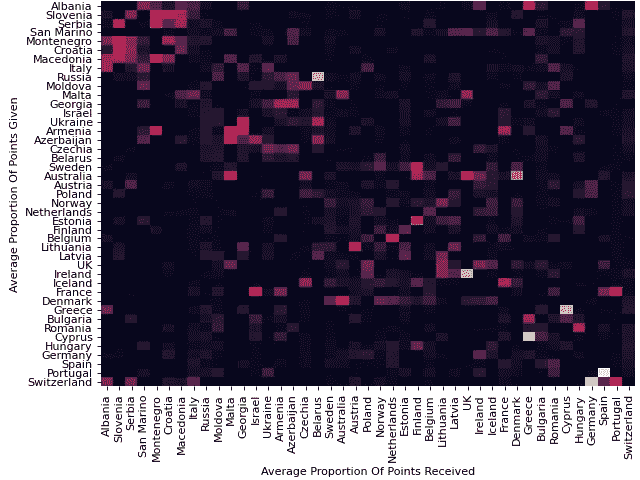
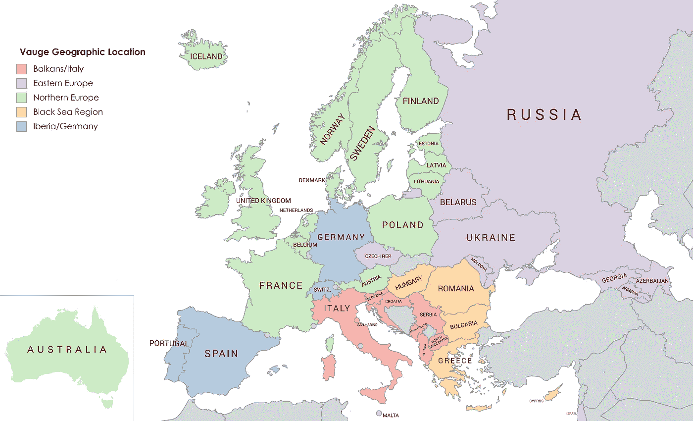
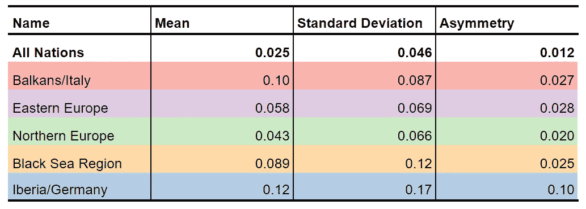
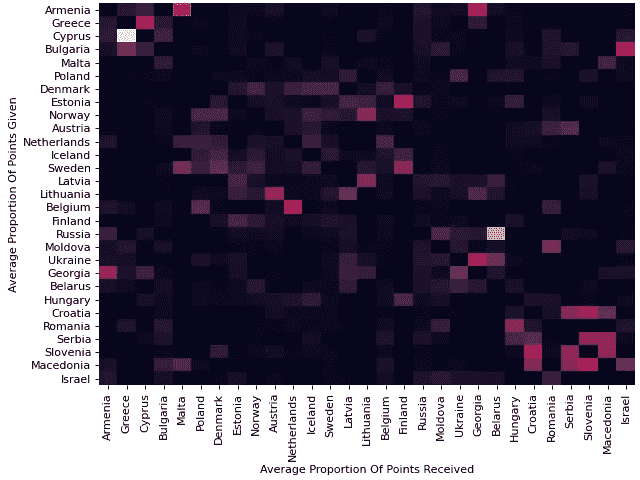
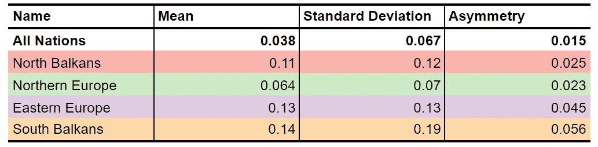
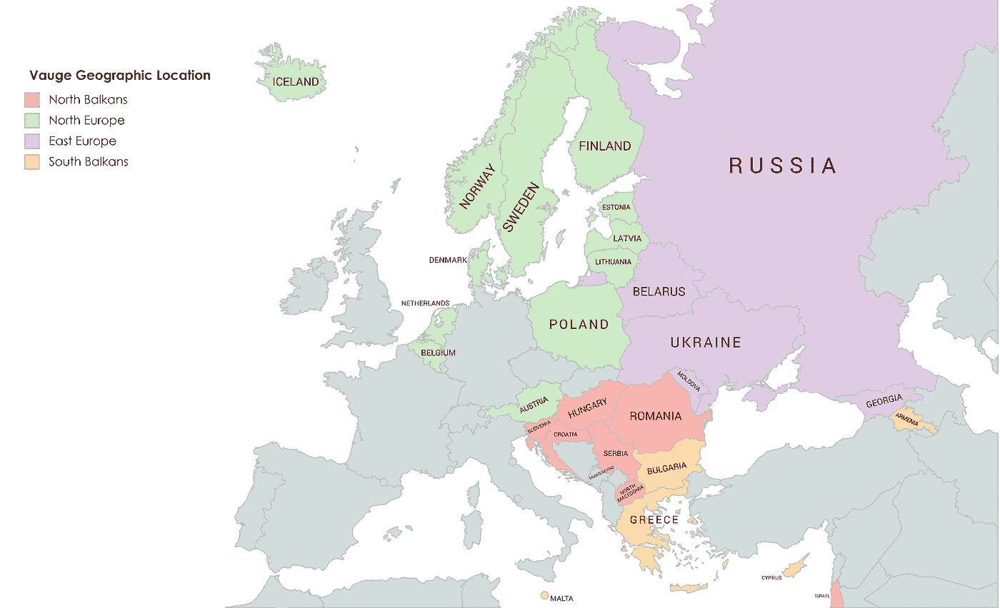
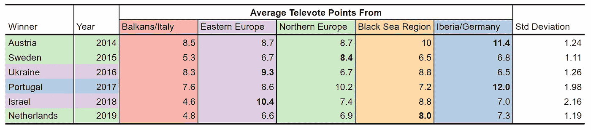
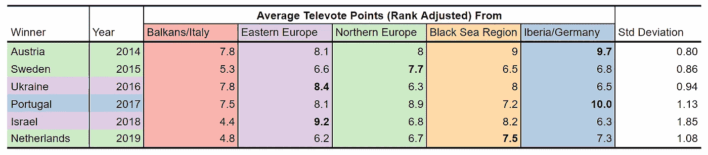
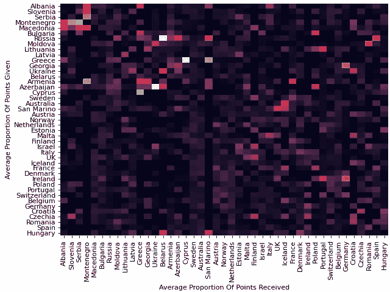

# 确定欧洲电视网歌唱比赛中的投票群体

> 原文：<https://towardsdatascience.com/identifying-voting-blocs-in-the-eurovision-song-contest-4792065fc337?source=collection_archive---------33----------------------->

## 长期以来，欧洲电视网歌曲大赛一直被指责为政治投票。像希腊和塞浦路斯或者瑞典和丹麦这样的投票配对是众所周知的，但是这种偏见会更深吗？我们能在竞赛中识别整个投票集团吗？

比赛确实试图通过使用公正的陪审团分发每个国家一半的分数来抵消政治投票，但是，自 2014 年以来，欧洲电视歌曲大赛一直在发布每个国家的电视投票排名。现在这个数据集已经增长，我们有一个独特的机会来确定欧洲电视网欧洲观众的民族偏见。

在我们开始之前，我们需要一个数据集。很多相关数据可以在[这里](https://data.world/datagraver/eurovision-song-contest-scores-1975-2019)找到。然而，它缺少了几年的电视投票，所以请查看我的 [Github 库](https://github.com/adamprice97/EurovisionVotingBlocks.git)中我使用的数据，并查看我为这篇文章创建的代码。

有了数据，我可以带您完成我决定使用的预处理步骤:

*   **一个国家的积分值除以该国当年获得的总积分。**无论歌曲质量如何，投票集团中的国家都会投票给对方。因此，在一个国家的歌曲整体排名很差的年份，他们的投票集团将在他们的分数中占很大比例。
*   **分值 12 和 10 分别更改为 10 和 9。**这将移除排名第一和第二的权重。
*   **仅使用来自决赛的数据。**
*   在决赛中没有得分的国家被除名。

我通过平均每个国家每年的得分比例，将数据汇编成一个 2D 矩阵。一个国家因为没有资格进入决赛而不能得分的年份被忽略了。

矩阵可以被视为所有国家之间的加权双向网络。这让我们使用 [Louvain 方法](https://en.wikipedia.org/wiki/Louvain_modularity)进行社区检测，将所有国家划分为投票团体。当这些块被排列在一起时，我们会得到这样的热图:

我们可以看到几个方形的高活性区域。这些区域是不同的投票区。把这个翻译到欧洲地图上，我们得到这个:

欧洲电视网歌唱比赛的投票区。所有国家都适合。

一般来说，投票集团反映了地理和文化边界，例如，俄罗斯在东欧集团或前南斯拉夫国家的影响。然而，随着我们向西移动，这些集团变得更大，更不明确。

该表为我们提供了更多关于投票集团的详细信息:

并非所有的投票群体都是平等的。“北欧”集团的地区偏见虽然高于所有国家的平均水平，但远低于其他地区。

“不对称”度量告诉我们给出和接收的反射点如何。“非对称性”为 0 意味着一个国家从另一个国家得到的分数是相同的。高度不对称的集团是投票集团的不良例子。如果我们看看伊比利亚/德国集团的地理位置，它不是一个强大的投票集团就不足为奇了。

这凸显了试图将所有国家纳入集团的问题。一些国家有非常高的不对称度。他们不给给他们积分的国家积分。通过迫使这些国家加入投票集团，我们给聚类增加了很多噪音，这反过来又给我们发现的集团增加了很多不确定性。

为了解决这个问题，我重复了制作第一张热图的所有步骤，但这次我删除了 15 个最不对称的国家。

有趣的是，五大和澳大利亚就在这 15 个国家中。这些国家不需要通过半决赛来获得决赛资格。这可能告诉我们，投票集团中的国家更有可能通过半决赛。

移除不对称国家后，我们得到的热图如下所示:

这些集群似乎比以前更加明确，我们的指标也证实了这一点:

这相当程度上更新了地图:

欧洲电视网歌唱比赛的投票区。不对称国家被移除。

所以，我们找到了投票团！我对比赛中地域偏见的程度感到非常惊讶。不可否认，各国获得的很大一部分分数来自他们的投票集团。但是，它的作用大到足以影响获奖歌曲吗？看一下过去 6 届欧洲电视网的获奖歌曲列表。

总的来说，我们看到了来自自己阵营的强烈支持。此外，(忽略巴尔干)，获奖歌曲确实设法在其他投票集团中排名很高。但是，很难说所有的集团都同意这首获奖歌曲。

投票集团是欧洲电视网投票系统的自然产物，尽管看起来很难阻止投票集团，但将它们的影响最小化是可能的。目前，各国给最多人投票的宋 12 分，给第二名 10 分。这给了每个国家投票的前 2 首歌曲额外的权重，这是一个可以在投票群体中利用的因素。我重新创建了以前的表格，但这次 12 点选票减少到了 10 点，10 点减少到了 9 点。

标准偏差从平均值 1.49 降至 1.11，偏差降至最低。我找不到在比赛中引入 12 分制的理由。然而，无论是直觉上还是显而易见的，这似乎清楚地表明，它允许偏见被进一步利用。也许这种改变不值得。仅仅是为了娱乐。毕竟是歌唱比赛。

作为结束语，我认为值得一提的是，法官投票似乎更少偏见。它远非完美，但令人欣慰的是，专业人士比公众更客观。

