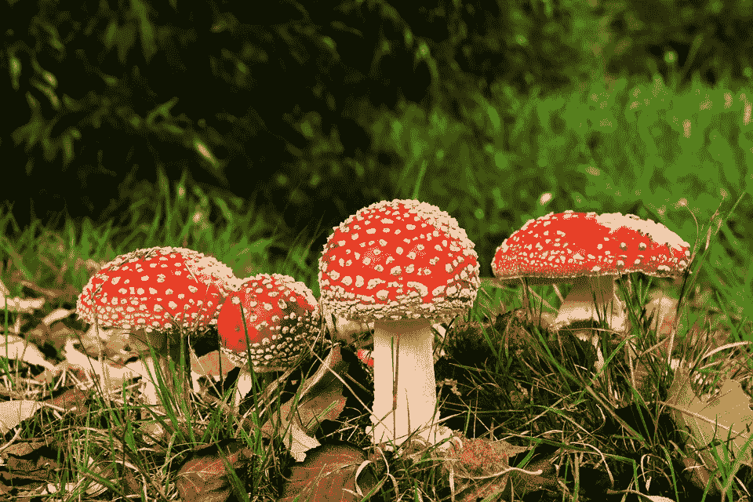
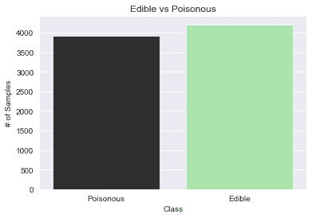
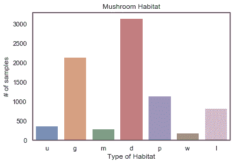
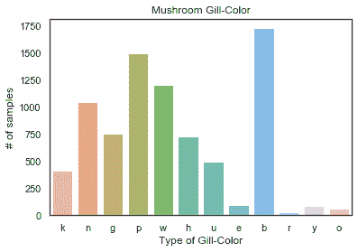
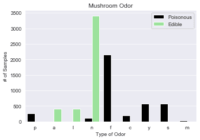
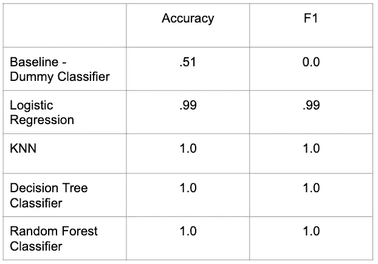
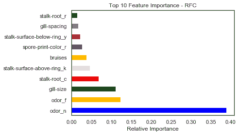
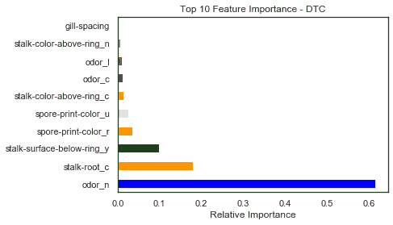
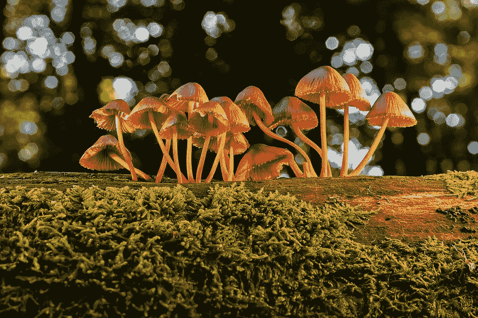

# 鉴别野生蘑菇

> 原文：<https://towardsdatascience.com/identifying-wild-mushrooms-what-to-forage-what-to-avoid-79242d14346c?source=collection_archive---------39----------------------->

## 吃什么，避免什么？Python 分类项目

来源:Pixabay

近年来，蘑菇作为一种超级食物越来越受欢迎，人们也越来越了解它对健康的巨大益处。蘑菇过去通常被视为传统食物，现在被广泛消费，并被认为具有治疗和保健功能。随着越来越多的人对此感兴趣，在野外寻找蘑菇的人数可能会增加，我想知道是否可以很容易地识别出**可食用或有毒的**蘑菇，以及这看起来像什么。

# 数据

该项目中使用的原始[数据集](https://archive.ics.uci.edu/ml/datasets/Mushroom)来自 UCI 机器学习知识库。该数据集包括来自 23 种蘑菇的 8，124 个蘑菇样本的分类特征。

评估的**目标**变量是“可食用”或“有毒”的等级区分，并且从一开始就基本平衡。

目标变量，用 Seaborn 绘制。

**解释变量**涵盖了每个观察到的蘑菇结构的一系列描述性和视觉特征——例如，菌盖颜色、气味、环数和菌柄形状。我的数据集中最初有 21 个解释变量，都是分类变量。下面是 Seaborn 绘制的一些功能可视化(一键编码前):

我还利用 EDA 来可视化数据集的特性和类之间的关系。有明确的实例显示明显的分离:

# 建模

在通过 EDA 对我的数据集有了一些了解之后，我开始研究建模。应该注意的是，我的数据集从一开始就基本上是干净的——但是仍然有几个地方需要清理。为建模而预处理我的数据的主要领域有:

*   所有二进制分类特征被编码为 0 和 1 值(包括目标)。
*   由于所有值都相同，并且不会对模型产生影响，因此删除了面纱类型特征。
*   一键编码应用于所有非二进制或序数/数字的特征。
*   应用于数据集的训练/测试分割。

那么我运行了哪些模型呢？

我运行了基线虚拟分类器(预测多数类)、逻辑回归、KNN、决策树和随机森林分类器。我利用网格搜索来调整每个(不包括基线模型)的超参数。我的最佳评估者和他们的测试分数如下所示:

我的分类模型在数据集上的表现都非常好！这绝对让我感到惊讶…但我稍后会详细介绍这一点。

关于我的模型的一些想法——逻辑回归，它有 99%的分数通常是一个很好的选择。然而，鉴于该模型预测了一些假阴性(在这种情况下可能是致命的)，我会说其他 3 个模型表现完美，因此更适合对蘑菇进行分类。

# 特征重要性和结论

由于我的模型表现得如此之好，我很清楚它们能够识别出对食用蘑菇和有毒蘑菇的分类有很大影响的特定特征。这正是我所希望的！

我从我的决策树分类器和随机森林分类器中探索了特征的重要性，并在下面绘制了前 10 个特征。有一些重叠和一些变化，如图所示…你也可以看到，气味 n，代表无，被两个模型选为最重要的。

随机森林分类器的特征重要性。

决策树分类器的特征重要性。

最后，几个简单的规则来鉴别毒蘑菇…

我能够利用从我的特性重要性分析和 EDA 中学到的东西，整理出一个简单的列表。也就是说，我不是专家，这个列表不应该在现实世界中应用——但是我能够得出一些结论，这些结论值得在这个项目中分享。

1.  **气味**:如果蘑菇有气味，特别是气味不好闻，很可能有毒。

**2。鳃大小:**如果鳃很窄，很可能有毒。

**3。孢子印颜色:**白色、红色、‘巧克力’都有可能有毒。

**4。淤青:**如果蘑菇没有淤青，很可能有毒。

**5。戒指上方的茎面**:如果呈丝状，很可能有毒。

来源:Pixabay

# 最后的想法和下一步

为了扩大这个项目，也许选择一个“最终”模型，我想看看是否有类似的数据可用于未来的分析。通过这种方式，我可以进一步测试我的模型，也许还能发现一些在现实世界中最有效的方法。一些模型在我的数据集上表现完美，因此值得怀疑数据集是否受到损害，因此，在另一个数据集上测试我的模型可以提供进一步的验证。

此外，将我的结论与图像分类结合使用也是一个有价值的实验。

如果你对这个项目背后的代码感兴趣——查看我的 Github:[https://Github . com/AlisonSalerno/Classification-model-project](https://github.com/AlisonSalerno/Classification-model-project)