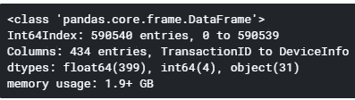
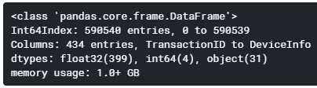
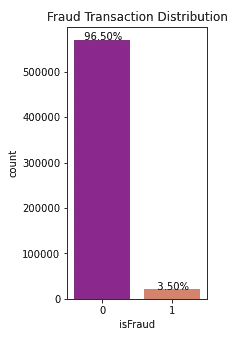
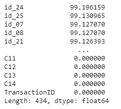
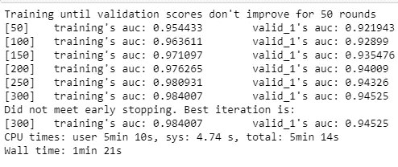

# IEEE-CIS 欺诈检测

> 原文：<https://towardsdatascience.com/ieee-cis-fraud-detection-by-lightgbm-b8956a8e4b53?source=collection_archive---------39----------------------->

## 机器学习算法有助于确定哪些交易可能是欺诈性的。


布莱克·维斯在 Unsplash 上的照片

在这项工作中，我们将对在线交易是否欺诈进行分类。它是一个二进制目标，名为:isFraud。我们很多人都遇到过这样的情况，一笔交易未经我们的考虑就被取消了。有一个更好的算法，只取消欺诈交易，而不只是导致在商店里尴尬。虽然目前经常令人尴尬，但这个系统每年确实为消费者节省了数百万美元。

该数据集由 Vesta 的真实世界电子商务交易提供，包括从国家到收件人电子邮件域的广泛功能。利用这个数据集，我们将 Lightgbm 算法应用于一个具有挑战性的大型 e 级数据集。提高欺诈交易警告的有效性将为许多人省去误报的麻烦。如果您想了解 PySpark 的实现，请阅读下一篇文章。

但是我们如何分析这类问题呢？

# 数据

第一步是下载[数据集](https://www.kaggle.com/c/ieee-fraud-detection/data)。这里使用的训练集有两个部分。一个是 train _ transcation，另一个是 train_identity。

```
train_identity = pd.read_csv(‘../input/ieee-fraud-detection/train_identity.csv’)train_transaction = pd.read_csv(‘../input/ieee-fraud-detection/train_transaction.csv’)
```

我将在名为“TransactionID”的列上合并这两个数据帧。但并不是所有的交易都有相应的身份信息。

```
train_transaction_identity = train_transaction.merge(train_identity, on=’TransactionID’,how=’left’ )
```

数据集包含几个特征，下面我只提到其中的几个。

*   **TransactionDT** :给定参考日期时间的 timedelta(不是实际时间戳)
*   **交易金额**:美元交易支付金额(部分为其他货币兑换)。
*   **card1 — card6** :支付卡信息，如卡的类型。
*   **地址**:地址

如果您想更好地了解特性，请查看数据源链接。

如下图所示，内存使用量超过 1.9+ GB。我们可以在不丢失任何数据的情况下减少内存使用。

```
train_transaction_identity.info()
```



首先，我发现了不同类型的特性，包括对象、浮点和整数。通过使用。在熊猫图书馆，你可以找到内存使用的大小。大部分被 float64 占据。我已经将这些列从 float64 更改为 float32。如您所见，内存使用量减少了近 50%。



# 数据探索

大多数交易不是欺诈，所以在这种情况下，我们有不平衡的数据。机器学习算法无法在不平衡的数据集上正常工作。下面写的一段代码显示只有 3.5%是欺诈性的。



它们是处理不平衡数据集的几种方法，如过采样和欠采样。好在 Lightgbm 可以帮你解决这个事情。默认情况下，模型认为数据集是平衡的。因此，在您的情况下，我们需要将参数更改为:

`is_unbalance = True`

通过这样做,“不平衡”模式使用目标值来自动调整与输入数据中的类别频率成反比的权重。

# 移除多余的功能

如果我们看每一列，我们可以看到，如果我们有很多丢失的值。

```
(np.sum(pd.isnull(train_transaction_identity)).sort_values(ascending=**False**)/len(train_transaction_identity))*100
```

下图显示，我们有大约 99%的缺失值的特征。这些列不会给我们的模型增加任何值。所以我们可以删除它们而不会丢失太多数据。



在所有特性中，我已经删除了丢失值超过 30%的列。下面写的代码是为了去掉这些不重要的特性。

# 分类特征

分类数据是只需要有限数量的可能值的数据。机器学习算法不能直接处理分类数据，要使用它们，必须先将类别转换成数字，然后才能对它们应用学习算法。

有几种技术可以应用，包括 OneHotEncoder，替换值。在这里，我使用 Pandas get_dummy 函数将分类变量转换为虚拟/指示变量。

```
train_dummy = pd.get_dummies(train_transaction_identity, drop_first=**True**)
```

# 处理缺失值

有几种方法可以处理缺失值，如插补、删除。默认情况下，Lightgbm 有一个选项来处理这个问题。它在分割查找过程中忽略丢失的值，然后将它们分配给损失减少最多的那一侧。如果你不想使用选项和应用其他技术，你将需要它的参数为:

```
use_missing=false
```

# 特征缩放

在创建机器学习模型之前的数据预处理期间，特征缩放是机器学习算法中最重要的步骤之一。大多数情况下，您的数据集将包含在量级、单位和范围方面差异很大的要素。但对于大多数机器学习来说，使用未缩放的特征会产生一个问题。

例如，线性回归等机器学习方法和使用梯度下降作为优化算法的神经网络需要对数据集进行缩放。当我们使用像 K-means 和 SVM 这样受特征范围影响最大的距离算法时，也会出现类似的问题。原因是他们使用数据点之间的距离来确定它们的相似性。

幸运的是，我们不需要担心它的功能扩展。基于树的算法对特征的规模相当不敏感。

# 模型评估

我用了 25%的数据进行验证，其余的用于训练。这里涉及到很多超参数。因此，你的工作就像一个建筑师，寻找最佳值，以最大限度地提高准确性。

有几种技术非常有用，包括 GridSearchCV 和 RandomizedSearchCV。

如您所见，这里涉及到许多参数，但如果您想了解每个参数是什么，请查看此[链接](https://lightgbm.readthedocs.io/en/latest/pythonapi/lightgbm.train.html)。

# 结论

正如我们在下面可以看到的，我们已经获得了训练数据的 AUC 几乎为 98%,验证数据集的 AUC 为 94%。大约花了 5 分钟。您可以增加“增强迭代次数”以获得更好的训练/验证数据集 AUC。您可以考虑这一点，或者更改其他参数来权衡准确性和速度。

您将能够在 CPU 上运行 Lightgbm。为此，您只需设置以下参数“设备类型”:“GPU”*。*



本文使用的所有代码都可以从我的 [**GitHub**](https://github.com/shosseini811/IEEE-CIS-Fraud-Detection-TWS/blob/master/ieee-fraud.ipynb) 中访问。我期待听到反馈或问题。