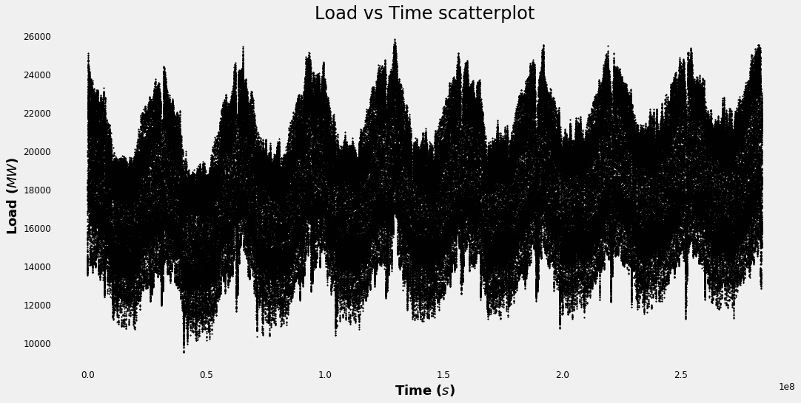
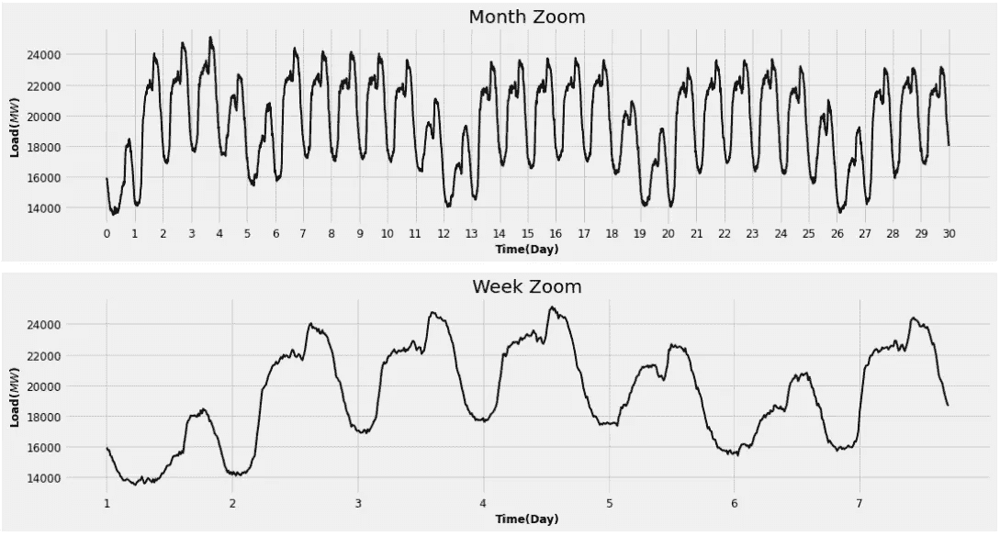
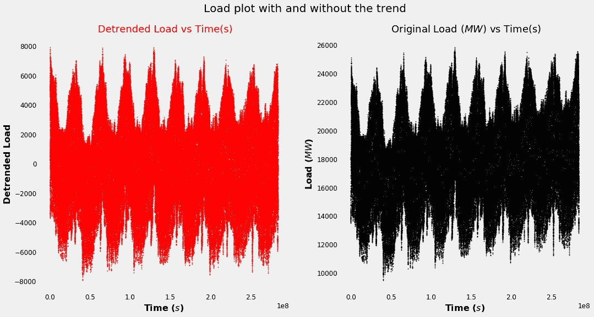

# 如果历史重演，傅立叶变换是一把钥匙

> 原文：<https://towardsdatascience.com/if-history-repeats-itself-fourier-transform-is-a-key-a593ddfa246e?source=collection_archive---------52----------------------->

## 仅仅使用傅立叶变换就可以清理你的数据并预测新的数据吗？答案是肯定的，可能。

图片由乔恩·泰森[https://unsplash.com/@jontyson](https://unsplash.com/@jontyson)拍摄

我的教授在高中时常说的一句话是**“历史会重演”**。这句话的意思显然与这样一个事实有关，即我们应该以史为鉴，从而能够不犯我们过去犯过的同样的错误。

现在我们来谈谈科学。如果你有一个时间序列，那么你就有(最好)很长一段时间的数据。让我们假设一下**历史确实会重演**。这将意味着，通过简单地复制信号，您将扩展您的数据，从而获得两倍长的数据集。我知道你在想什么，你是对的，我在愚弄你。事实上，我在这几行中主要提到的是 [**傅里叶变换**](https://en.wikipedia.org/wiki/Fourier_transform) **，即每个周期信号都可以被视为正弦和余弦之和**。获得每个频率的幅度和相位，就有了信号，可以很容易地扩展它。

我有一个好消息和一个坏消息要告诉你。坏消息是你不能假装你的数据是周期性的，除非你知道由于某种奇怪的原因它们确实是周期性的。好消息是，有时你的数据确实呈现半周期模式，在这种情况下，傅立叶变换值得一试。

我知道，我说了很多，让我们从实践开始。

# 设置:

已经使用的语言是 Python，具有已经使用的以下库:

# 数据集:

让我们以[波兰电力负荷](https://www.pse.pl/web/pse-eng/data/polish-power-system-operation/load-of-polish-power-system)为例，看看 2008 年至 2016 年的数据:

这是原始数据

每一年的时间步长非常容易区分，如果我们把它缩小，每个月和每个星期也是如此。

很有周期性，是吧？

在这些情况下，傅立叶变换这样的简单方法可能是一种选择。事实上，**它可以应用的想法是，我们的信号实际上是周期性的，但它似乎不是周期性的，因为噪声、一般线性趋势或其他不必要的影响使我们的信号不稳定**。让我们继续前进！

## **春季大扫除:**

该信号具有线性趋势，并且其平均值不为 0。**这可能会干扰傅立叶频谱，通常我们不希望线性趋势被视为傅立叶频谱的“长频率成分”**。使用神奇的 scipy 库，信号已被消除趋势和转移，以便将其平均值设置为 0。

线性增长的信号消失了。加上数据现在有 0 均值。

好了，我们准备好了。

## 培训/验证/测试:

借用机器学习术语，数据集分为三部分:

*   **训练集:**应用傅立叶变换的地方(从 2008 年到 2014 年)
*   **验证集**:最适合模型的地方(2015)
*   **测试集:**其中揭示模型的优良性。(2016)

如果你是一个 ML 专家，请不要把这个术语看得太重，因为它和你所知道的不太相符。无意冒犯。名字就是名字。:)

# 算法:

当然，如果你天真地应用傅立叶变换，你不能期望得到好的结果，这就是为什么算法稍微(我希望)复杂一些。

## Divide et impera(训练集)

傅立叶变换意味着数据是静止的，但生活是变化的，爱情故事也是结束的

**这就是为什么训练集的每一年都必须单独进行。每一年都会给出它的傅立叶变换。**

平均傅立叶变换(F)是通过每个傅立叶变换的和除以 7(在训练集上有 7 年)获得的。

## 消除干扰(验证集)

**现在让我们考虑验证集信号(2015 年负载)。其思想是使用训练集的傅立叶变换，将其转换回来，并将重建的信号与验证集的信号进行比较。傅立叶逆变换当然是通过使用 numpy FFT 算法获得的。**

问题是，由于 numpy FFT 算法非常出色，它能够非常好地再现信号，甚至可能太好了。事实上，我们希望噪声不在重构信号中。但是什么是真正的噪音呢？

你知道没人能回答这个问题，但是**一个安全的警告是，误差(原始信号(即 2015 年负载)和重建信号之间的差异)必须最有可能与信号**不相关。当然，另一方面，如果我们有一个 0 信号，它与原始信号不相关，但它没有预测能力。简而言之，这就是我们想要的模型:

*   **原始信号和重建信号之间可接受的低 RMSE**:如果 RMSE 太高，预测就不起作用。
*   **误差与原始信号之间的低相关性**:如果相关性太高，我们的模型会过度拟合数据，并且在测试期间会出现令人不愉快的意外。

为了做到这一点，我们调用一个名为 **threshold** 的魔法向导。阈值是 0 和 1 之间的某个值，将乘以训练集(F)的平均谱的最高值。**所有小于 t * max(F)的频率都被设置为 0，然后信号被转换回原始空间，RMSE 和相关值都已经被计算出来。最佳阈值是具有最低 RMSE 和尽可能最低相关性的阈值。**

## 测试预测(测试集)

这种经过滤波的傅立叶频谱已被用于预测 2016 年负荷的前 10 至 90 天，结果实际上令人惊讶。

**该模型略微过拟合，但 RMSE 仍然低得可以接受，误差部分是由于统计误差波动，从 C 为< 0.60 这一事实可以看出。此外，预测实际上在一周的前几天非常好，而周末似乎更难赶上**(伙计们，拜托，别喝太多了！)

# 结论:

许多数据科学挑战是**时间序列挑战**(例如全球气候报告、股票市场分析、太阳周期预测等。).当然，还有更强有力的方法来处理时间序列(RNN、阿玛、ARIMA、萨里玛等)。)并对它们进行预测。尽管如此，正如我希望我在这篇报道中所展示的那样，有时很好地利用简单的数学概念仍然可以产生非常好的结果。作为简单的数学概念，它们还能让你完全控制正在发生的事情，并且可以根据你自己的调查进行调整。

顺便说一句，我真的不知道历史是否会重演，但我确实认为我们应该以不同的形式、不同的心态和不同的精神重新生活一些时刻。正如马克·吐温曾经说过的:

> “历史不会重演，但它经常押韵”

如果你喜欢这篇文章，你想知道更多关于机器学习的知识，或者你只是想问我一些你可以问的问题:

A.在 [**Linkedin**](https://www.linkedin.com/in/pieropaialunga/) 上关注我，我在那里发布我所有的故事
B .订阅我的 [**简讯**](https://piero-paialunga.medium.com/subscribe) 。这会让你了解新的故事，并给你机会发短信给我，让我收到你所有的更正或疑问。
C .成为 [**推荐会员**](https://piero-paialunga.medium.com/membership) ，这样你就不会有任何“本月最大故事数”，你可以阅读我(以及数千名其他机器学习和数据科学顶级作家)写的任何关于最新可用技术的文章。

再见:)