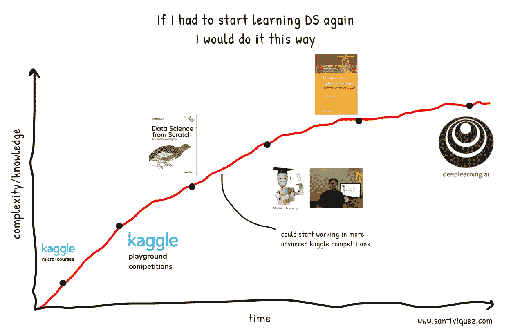

# 如果让我重新开始学习数据科学，我会怎么做？

> 原文：<https://towardsdatascience.com/if-i-had-to-start-learning-data-science-again-how-would-i-do-it-78a72b80fd93?source=collection_archive---------1----------------------->

几天前，我开始思考，如果我必须从头开始学习机器学习和数据科学，我会从哪里开始？有趣的是，我想象的道路与我开始时实际走的完全不同。

我知道我们都以不同的方式学习。有些人更喜欢视频，有些人只需要书就可以了，很多人需要付费才能感受到更多的压力。没关系，重要的是学习并享受它。

因此，从我自己的角度来说，如果我必须重新开始学习数据科学，我知道如何才能学得更好，所以我设计了这条道路。

正如你将会看到的，我最喜欢的学习方法是从简单到复杂逐渐进行。这意味着从实际例子开始，然后转向更抽象的概念。

# Kaggle 微课

我知道从这里开始可能会很奇怪，许多人更愿意从最基础和数学视频开始，以充分理解每个 ML 模型背后发生的事情。但是从我的角度来看，从一些实际和具体的东西开始有助于对整个画面有一个更好的看法。

此外，这些微型课程每门大约需要 4 个小时才能完成，因此提前实现这些小目标会增加额外的动力。

## Kaggle 微课:Python

如果你熟悉 Python，你可以跳过这一部分。在这里，您将学习基本的 Python 概念，这将帮助您开始学习数据科学。将会有很多关于 Python 的事情仍然是一个谜。但是随着我们的进步，你会在实践中学会的。

链接:[https://www.kaggle.com/learn/python](https://www.kaggle.com/learn/python)

价格:免费

## Kaggle 微课:熊猫

Pandas 将为我们提供用 Python 操作数据的技能。我认为一个 4 小时的微型课程和实际例子足以让你对可以做的事情有一个概念。

链接:【https://www.kaggle.com/learn/pandas 

价格:免费

## Kaggle 微课:数据可视化

数据可视化可能是最被低估的技能之一，但却是最重要的技能之一。它将使您能够完全理解您将使用的数据。

链接:【https://www.kaggle.com/learn/data-visualization 

价格:免费

## Kaggle 微课:机器学习入门

这是激动人心的部分开始了。你将学习基本但非常重要的概念，以开始训练机器学习模型。这些概念对于理解它们是至关重要的。

链接:**【https://www.kaggle.com/learn/intro-to-machine-learning】T2**

**免费**

## **Kaggle 微课:中级机器学习**

**这是对前一个的补充，但这里您将第一次使用分类变量，并处理数据中的空字段。**

**链接:【https://www.kaggle.com/learn/intermediate-machine-learning】**

**价格:免费**

**让我们在这里停一会儿。应该清楚的是，这 5 个微型课程不会是一个线性的过程，你可能需要在它们之间来来回回地更新概念。当您在 Pandas one 中工作时，您可能需要返回 Python 课程以记住您所学的一些内容，或者进入 Pandas 文档以理解您在机器学习入门课程中看到的新功能。所有这些都很好，真正的学习将在这里发生。**

**现在，如果您意识到前 5 门课程将为您提供进行探索性数据分析(EDA)和创建基线模型的必要技能，以后您将能够对其进行改进。所以现在是时候从简单的卡格尔比赛开始，并把你学到的东西付诸实践了。**

## **卡格尔游乐场竞赛:泰坦尼克号**

**在这里，你将把你在入门课程中学到的东西付诸实践。也许刚开始会有点吓人，但没关系这不是为了在排行榜上第一，这是为了学习。在本次竞赛中，您将了解这些类型问题的分类和相关指标，如精确度、召回率和准确度。**

**链接:[https://www.kaggle.com/c/titanic](https://www.kaggle.com/c/titanic)**

## **卡格尔游乐场竞赛:房价**

**在本次竞赛中，您将应用回归模型并了解相关指标，如 RMSE。**

**链接:[https://www.kaggle.com/c/home-data-for-ml-course](https://www.kaggle.com/c/home-data-for-ml-course)**

**到目前为止，您已经有了很多实践经验，并且您会觉得您可以解决很多问题，但是您可能还没有完全理解您所使用的每个分类和回归算法背后发生的事情。所以这就是我们必须研究我们所学内容的基础的地方。**

**许多课程都是从这里开始的，但至少在我从事过一些实际工作后，我能更好地吸收这些信息。**

## **书:从零开始的数据科学**

**在这一点上，我们将暂时脱离 pandas、scikit-learn 和其他 Python 库，以实际的方式了解这些算法“背后”发生了什么。**

**这本书读起来非常友好，它提供了每个主题的 Python 示例，并且没有太多繁重的数学，这是这个阶段的基础。我们想要理解算法的原理，但是从实践的角度来看，我们不想因为阅读大量密集的数学符号而失去动力。**

**链接:[亚马逊](https://www.amazon.com/-/es/Joel-Grus-ebook/dp/B07QPC8RZX/ref=sr_1_1?__mk_es_US=%C3%85M%C3%85%C5%BD%C3%95%C3%91&crid=2PJBNAU152TB8&dchild=1&keywords=data+science+from+scratch&qid=1587749617&sprefix=data+scien%2Caps%2C213&sr=8-1)**

**价格:26 美元左右**

**如果你已经做到这一步，我会说你很有能力从事数据科学工作，并且理解解决方案背后的基本原则。因此，我在此邀请您继续参与更复杂的 Kaggle 竞赛，参与论坛并探索您在其他参与者解决方案中发现的新方法。**

## **在线课程:吴恩达的机器学习**

**在这里，我们将看到许多我们已经学到的东西，但我们将看到该领域的一位领导者对此的解释，他的方法将更加数学化，因此这将是更好地理解我们的模型的一种方式。**

**链接:【https://www.coursera.org/learn/machine-learning **

**价格:无证书免费——有证书 79 美元**

## **书:统计学习的要素**

**现在繁重的数学部分开始了。想象一下，如果我们从这里开始，这将一直是一条上坡路，我们可能会更容易放弃。**

**链接:[亚马逊](https://www.amazon.com/-/es/Trevor-Hastie/dp/0387848576/ref=sr_1_1?__mk_es_US=%C3%85M%C3%85%C5%BD%C3%95%C3%91&dchild=1&keywords=The+Elements+of+Statistical+Learning&qid=1587750194&sr=8-1)**

**价格:$60，在[斯坦福](https://web.stanford.edu/~hastie/ElemStatLearn/printings/ESLII_print12.pdf)页面有官方免费版本。**

## **在线课程:吴恩达深度学习**

**到那时，你可能已经阅读了深度学习的相关内容，并尝试了一些模型。但在这里，我们将学习什么是神经网络的基础，它们如何工作，并学习实现和应用现有的不同架构。**

**链接:[https://www.deeplearning.ai/deep-learning-specialization/](https://www.deeplearning.ai/deep-learning-specialization/)**

**价格:49 美元/月**

**在这一点上，这很大程度上取决于你自己的兴趣，你可以专注于回归和时间序列问题，或者更深入地进行深度学习。**

**我想告诉你，我推出了一个数据科学问答游戏，通常会在面试中出现问题和答案。前往[**datasciencetrivia.com**](https://www.datasciencetrivia.com/)了解更多相关信息。**

**【santiviquez.com】原载于**