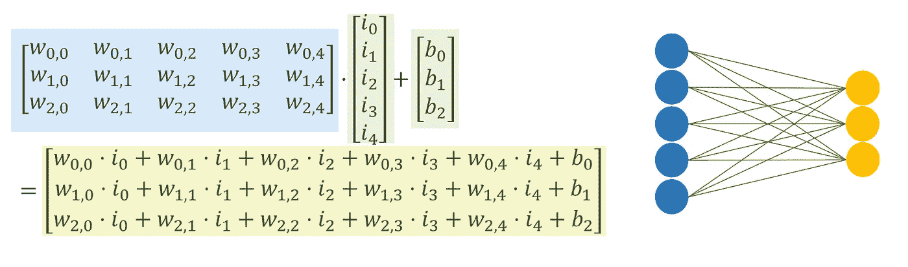
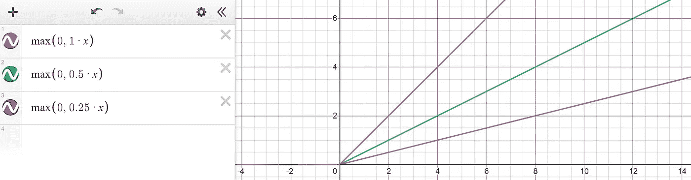
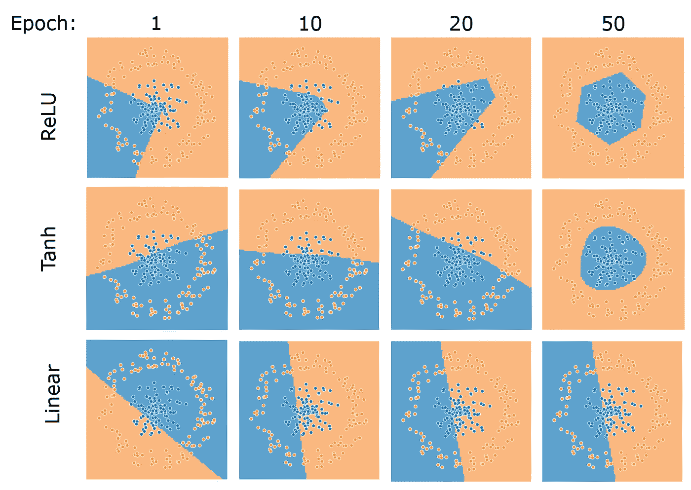
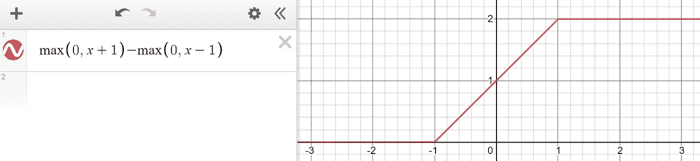
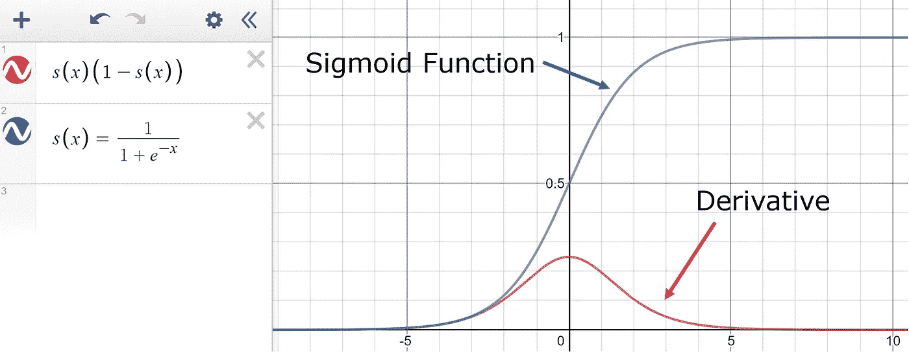

# 最后，对 ReLU 工作原理的直观解释

> 原文：<https://towardsdatascience.com/if-rectified-linear-units-are-linear-how-do-they-add-nonlinearity-40247d3e4792?source=collection_archive---------8----------------------->

来源: [Pixabay](https://pixabay.com/photos/surface-pattern-texture-design-945444/)

## 分段线性函数如何增加非线性

几乎所有使用过神经网络的人都用过 ReLU 函数。这是激活功能的现代标准，但是关于它是如何工作的还有一些问题。神经网络需要非线性来处理非线性问题，通常唯一可以注入非线性的地方是激活函数。然而，尽管严格地说，ReLU 在数学上不是线性函数，但它是由两个线性函数(分段线性)组成的。那么，直观地说，ReLU 如何保持并超越真正非线性的曲线函数的性能呢？

首先，重要的是要充分理解为什么需要在神经网络中加入非线性。在标准的神经网络中，每一层都将前一层乘以一组权重，并添加一个偏差。为了将长度为 *m* 的向量转换为长度为 *n* 的向量，权重采用了一个 *n* 乘以 *m* 矩阵(乘以一个 *m* 乘以一个矩阵，或者一个向量)的形式。

由作者创建。

即使在输入通过网络的几层之后，所应用的变换也是纯线性的；也就是说，只通过乘以一个系数并加上一个偏差来允许自由移动。因此，网络将只能解决不能被严格线性函数的有限运动所分离的问题。由于支配神经网络应用的许多复杂问题，线性神经网络的有限能力根本没有用武之地。

作为一个更严格的必要性的证明，普适近似定理需要非线性激活函数才能有效。本质上，该定理指出，在一些条件下，任何连续函数 *f* 都可以用具有一个隐藏层和足够数量单元的神经网络来建模。要求之一是激活函数必须具有某种形式的非线性。概括地说，为了处理非线性问题，网络中必须存在某种非线性。这是足够直观的理解。

ReLU 已经成为神经网络世界的宠儿激活函数。整流线性单元的简称，它是一个分段线性函数，对于 *x* 的所有负值定义为 0，否则等于 *a* × *x* ，其中 *a* 为可学习参数。

用德斯莫斯画的。

这种分段线性函数如何给网络增加非线性，这可能看起来不直观。毕竟还是线性的。虽然它显然不是完全线性的，但非线性的数学定义并不令人满意或直观。与激活函数宝座的其他竞争者相比——soft max、sigmoid 和 tanh——ReLU 缺乏干净的曲线，相反似乎只是线性函数的兄弟。然而，ReLU 成功的关键在于它如何解决环空问题:

每个神经网络有三个隐藏层，每层有三个单元。唯一的区别是激活功能。学习率:0.03，正规化:L2。由作者创建。

tanh 是一个平滑的曲线函数，它在圆的周围画出一个干净的包络线(而 linear 完全失败)，而 ReLU 画出一个六边形，有几个尖角。其实这就是 ReLU 的优势所在:可以在某一点弯曲线性函数，到一定程度。结合前一层的偏差和权重，ReLU 可以在任何位置以任何角度弯曲。

用德斯莫斯画的。

这些小弯曲构成了近似法的基础。任何关系或函数都可以通过将许多 ReLU 函数聚合在一起来粗略估计，这发生在神经元在下一层中被折叠和组合的时候。这已经在数学上得到证明，例如，用正弦波或指数函数，很像低阶泰勒级数如何拟合函数。

酷似乙状结肠。用德斯莫斯画的。

人们可能倾向于指出，ReLUs 不能外推；也就是说，拟合为类似于-4< *x*4 的正弦波的一系列 ReLUs 将不能在这些界限之外继续正弦波的 *x* 的值。然而，重要的是要记住，神经网络的目标不是外推，而是概括。例如，考虑一个基于浴室数量和卧室数量来预测房价的模型。如果模型很难将该模式应用到浴室数量的负值或卧室数量超过 500 的负值，这并不重要，因为这不是模型的目标。(你可以在这里阅读更多关于一般化 vs 外推[。)](https://medium.com/swlh/real-artificial-intelligence-understanding-extrapolation-vs-generalization-b8e8dcf5fd4b)

ReLU 功能的强大不在于它本身，而在于一整支 ReLU 大军。这就是为什么在神经网络中使用几个 ReLUs 不会产生令人满意的结果；相反，必须有大量的 ReLU 激活，以允许网络构建一个完整的点地图。在多维空间中，校正的线性单元沿着类边界组合形成复杂的多面体。

ReLU 工作得如此好的原因在于:当有足够多的 ReLU 时，它们可以近似任何函数，就像其他激活函数一样，如 sigmoid 或 tanh，就像堆叠数百个乐高积木一样，而没有缺点。平滑曲线函数有几个问题是 ReLU 不会出现的，其中之一是计算导数或变化率，即梯度下降背后的驱动力，ReLU 比任何其他平滑曲线函数都要便宜得多。

另一个是 sigmoid 和其他曲线有一个消失梯度的问题；因为对于更大的绝对值 *x* ，sigmoid 函数的导数逐渐变缓。因为输入的分布可能在训练期间较早地偏离 0，所以导数将非常小，以至于没有有用的信息可以反向传播来更新权重。这通常是神经网络训练中的一个主要问题。

用德斯莫斯画的。

另一方面，ReLU 函数的导数很简单；它是输入所在直线的斜率。它将可靠地返回有用的梯度，尽管*x*= 0 {*x*0 }有时可能会导致“死神经元问题”，但总体而言，ReLU 仍然表现出不仅比曲线函数(sigmoid，tanh)更强大，而且比试图解决死神经元问题的 ReLU 变体(如 Leaky ReLU)更强大。

ReLU 设计用于大量工作；在大容量的情况下，它近似得很好，并且在近似得很好的情况下，它的表现与任何其他激活功能一样好，没有缺点。

# 如果你喜欢这个，

你可能也会喜欢我关于深度学习的一些其他文章。

 [## 批量规范化:深度学习的最大突破

### 它是如何工作的——又是如何如此有效的？

towardsdatascience.com](/batch-normalization-the-greatest-breakthrough-in-deep-learning-77e64909d81d)  [## 每个人的 GANs

### 革命性人工智能概念的直观解释

medium.com](https://medium.com/analytics-vidhya/gans-for-everyone-an-intuitive-explanation-of-the-revolutionary-concept-2f962c858b95)