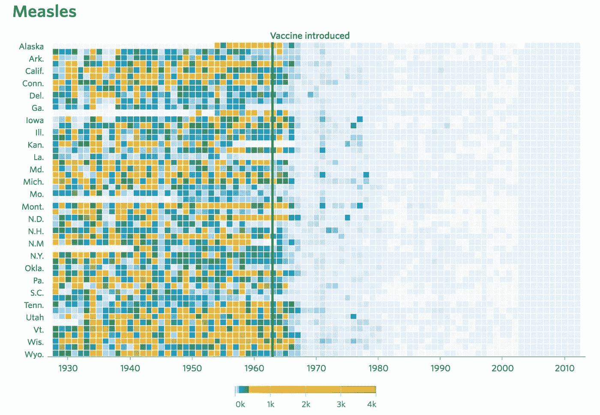

# 如果你没有发现任何新的东西，你就没有做好 EDA

> 原文：<https://towardsdatascience.com/if-you-dont-find-anything-new-you-don-t-do-eda-right-d356f9995098?source=collection_archive---------72----------------------->

## 更好的 EDA 指南

进行探索性数据分析或 EDA 的目的是在数据中发现新信息。从业者可能没有意识到的对 EDA 的理解是，EDA 使用直观检查的数据集来理解和总结数据集的主要特征，而无需事先假设或依赖统计模型。

照片由 [Unsplash](https://unsplash.com/s/photos/scenary?utm_source=unsplash&utm_medium=referral&utm_content=creditCopyText) 上的 [Aswathy N](https://unsplash.com/@abnair) 拍摄

EDA 是制定新假设之前的关键步骤，然后可以使用后续分析对新数据集进行测试。做 EDA 的最大好处只有当它从数据集中检测到预期的并发现意外的时候才能实现。

最有趣的问题是如何解释可视化中的有趣模式，这些模式可以是图表、图形或地图的形式，并描述是什么导致了您观察到的模式。

考虑名为“[对抗 20 世纪传染病:疫苗的影响](http://graphics.wsj.com/infectious-diseases-and-vaccines/)的互动图片:

照片由[华尔街日报](http://graphics.wsj.com/infectious-diseases-and-vaccines/)

首先，我们马上注意到的是配色方案。只要看看颜色和写着疫苗引入的线，就已经提供了疫苗起作用的证据。

这就是我们在 EDA 阶段对可视化的期望，它是对数据的表示、探索和呈现，以促进理解。使一个 EDA 与另一个不同的是，它产生的可视化可以使理解变得容易。

照片由[伯纳德·赫尔曼](https://unsplash.com/@bernardhermant?utm_source=unsplash&utm_medium=referral&utm_content=creditCopyText)在 [Unsplash](https://unsplash.com/s/photos/access?utm_source=unsplash&utm_medium=referral&utm_content=creditCopyText) 上拍摄

就像我说过的，可视化只是 EDA 的产物。更好的可视化形式是交互式的。单个可视化一次只能表示一个方面。在包含多个交互式可视化的仪表板中，用户可以使用多个表示来工作和指导、选择、筛选。只需点击链接，就可以使用简单的指示板进行操作，该指示板允许您交互式地播放各种时间方面的记录。

为什么想出有效的 EDA 这么难？你可以说，好吧，让我们导入一些库，然后画些东西。

> 能有多难？

因为数据有无数种可能的可视化表示。你的目标应该是创建有效的可视化效果，让用户无需更多解释就能真正理解。

# **制定 EDA 战略**

制定 EDA 策略的方法有很多，取决于你的创造力水平。然而，良好的开端是检查您的数据并理解组成数据集的不同数据类型。

那么，到底是什么数据类型呢？它可以解释为以结构化的方式解释数据的方式。这里的数据类型不是指我们从编程中知道的数据类型的定义。

其次是任务抽象。让我给你一个例子来解释“任务”在可视化中意味着什么，以及为什么要抽象。“任务”做的第一件事是，当我们执行 EDA 时，它证明了使用可视化的合理性。有些人可能认为，当它勾选了指南中出现的所有检查清单时，就创建了一个完美的可视化，但是如果它没有提供洞察力并回答用户最初提出的问题，那么无论它有多漂亮，它对用户都没有多大用处。

这就是用户的“任务”的重要性。当用户想要分析数据时，考虑用户来自的领域，确定用户如何思考

我希望你能从这篇文章中学到一些新东西。

感谢您的阅读。对于任何想法或反馈，请随时通过给我的 Linkedin 发送消息来与我分享！

https://www.linkedin.com/in/faizfablillah/[➡️](https://www.linkedin.com/in/faizfablillah/)