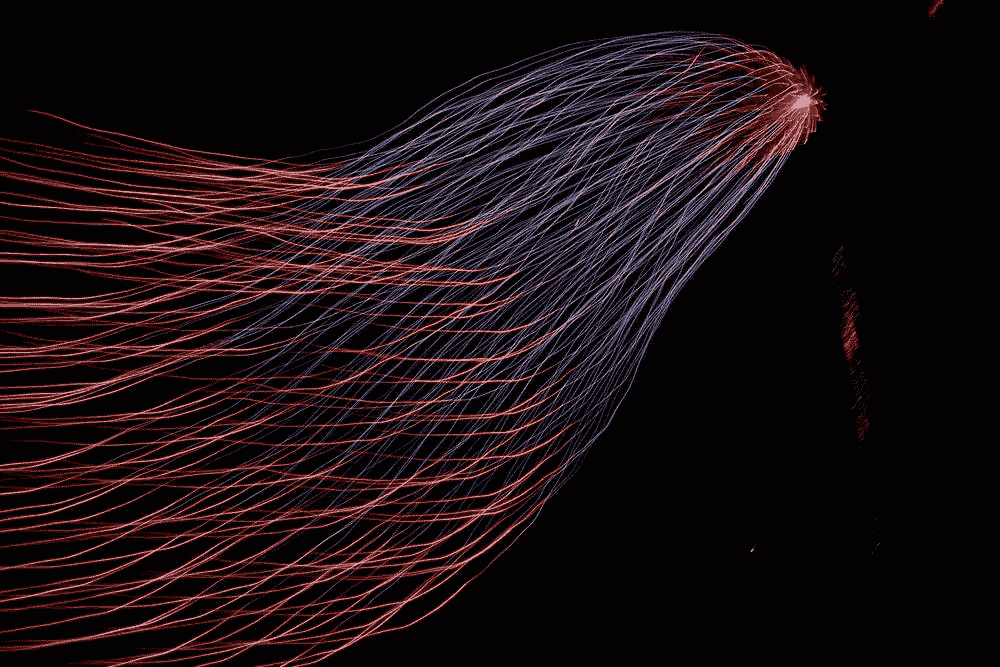
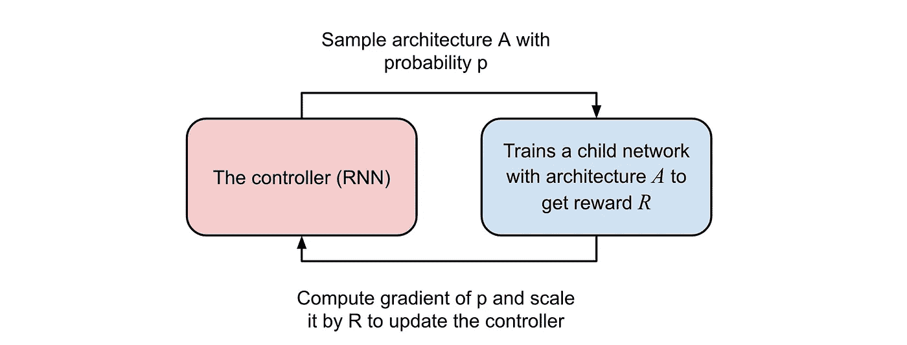
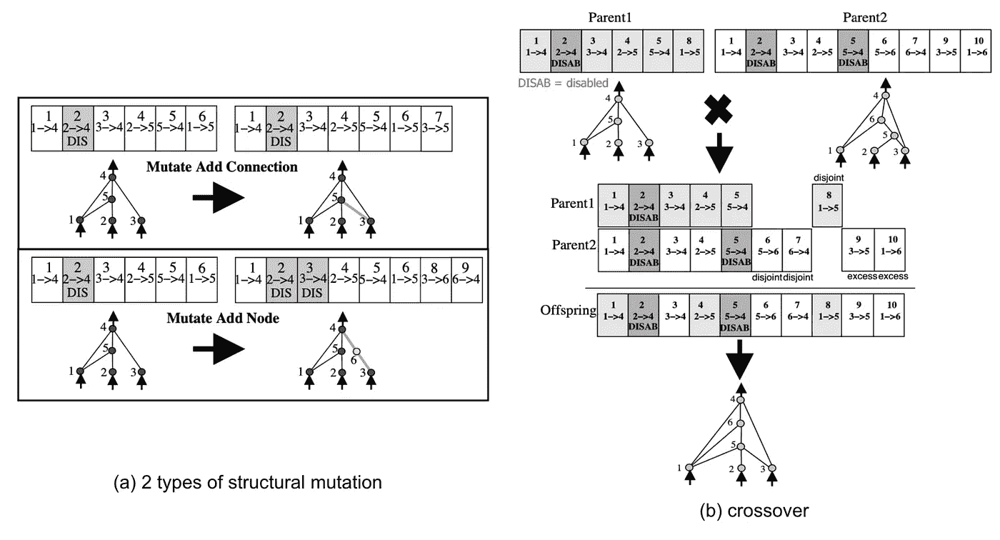

# 如果你对 GPT-3 编写代码感到兴奋，那你一定没听说过 NAS

> 原文：<https://towardsdatascience.com/if-youre-hyped-about-gpt-3-writing-code-you-haven-t-heard-of-nas-19c8c30fcc8a?source=collection_archive---------15----------------------->

来源: [Unsplash](https://unsplash.com/photos/Ype9sdOPdYc)

## 自动化人工智能发现和研究

GPT-3 最近因展示人类语言代码翻译的病毒视频而成为机器学习社区的头条新闻。该模型可用于自动化许多冗余和重复的编码，例如在 HTML/CSS 中或在简单神经网络的构造中。正如许多其他人所指出的，GPT-3 只是一个工具，并且受到其训练数据的限制。

开发人员想做的许多更复杂的事情——例如，给网站添加一些特定的基于动量的动画——GPT-3 都做不到，因为它 a)不够先进，b)没有足够的训练数据，c)毫无疑问不是“创造性的”。GPT-3 可能会成为一个有用的工具，帮助开发人员花更少的时间重新输入旧命令，花更多的时间集思广益创造性的基础设施设计和调试复杂的跨系统错误，但它绝不是对程序员生计的威胁。

特别令人感兴趣的是一个演示，其中 GPT-3 在流行的高级深度学习库 Keras 中为一个神经网络编写了代码，给定一个自然文本输入，如“我有一个 60 乘 60 像素图像的数据集，想将它们分为 10 类”。然后，GPT-3 会吐出默认代码来构建一个基本的模板卷积神经网络。

GPT-3 为神经网络“编写代码”很像一个初学者试图打出他们从教程中记住的样本代码:它不关心它的性能或使它的架构适合数据集，它只是试图根据它早先在训练数据集中看到的内容来预测下一个最有可能的字符。尽管这是一种直白的说法，但使用 GPT-3 编写代码就像在 StackOverflow 上自动搜索简单的代码片段一样。也许它会在代码自动完成中获得商业上的成功。

然而，这个想法，人工智能学习创造人工智能，并不新鲜，在 2002 年就有了第一个正式的概念。虽然 GPT-3 将以前在广泛的代码处方中看到的代码回流，但神经架构搜索(简称 NAS)通过实际搜索数据集的最佳神经网络，将这一想法推向了一个新的水平。机器学习工程师的大部分工作都依赖于基于直觉和经验测试一些万亿级的潜在神经网络结构，而 NAS 可以大大降低这一成本。

> NAS 通过智能搜索人类从未想到的潜在结构，利用 AI 创造更好的新 AI。不是概括，是发现。

通常，NAS 的实施有三个组件:

*   **一个搜索空间**。这是神经结构搜索可以探索潜在结构的空间。该空间由作者定义的一组可能的层(回旋、汇集、密集、下降等)界定。)以及它们如何连接(跳过、层大小等。).搜索空间的轮廓需要一些人类经验。
*   **一种搜索算法。**NAS 算法首先对几个候选网络架构进行采样，并根据这些“子模型”的性能，通过准确性或延迟(运行时间)等指标，获得奖励或惩罚。人类可以指定哪些度量更重要；例如，如果需要一个小而轻的模型，即使以精度为代价，更小的尺寸和更好的延迟可能会获得更高的回报。
*   **一种进化策略**。NAS 必须测量和预测许多提议的子模型的性能，以获得反馈供其学习。这可以通过训练每个子模型来完成，但是这显然是非常昂贵的，并且已经提出了新的方法来节省计算和时间资源。

作者创建的图像。

从这个意义上说，NAS 类似于一个人解决搜索问题的典型 RL 方法，但是做了一些修改以适应其任务。

首先，神经网络结构有许多潜在的表现形式。由于 NAS 围绕着这种复杂结构的选择和进化，所以找到一种合适的方法来呈现它是非常重要的。因为将神经网络表示为实际的、物理的神经网络是非常低效的，所以已经有许多对架构的描述，这些架构额外支持更容易的进化。

一种方法是基于细胞的方法，受现代图像识别模型(如 Inception)的设计启发，在该方法中，人类决定堆叠两种类型细胞的一般架构:正常细胞(输入和输出具有相同的维度)和缩减细胞(输出是输入的 1/2)。在网络框架(细胞序列，可能是多个背靠背的同一个细胞)设置好之后，NAS 创建这两个细胞的结构。

来源: [*Zoph 等人 2018*](https://arxiv.org/abs/1707.07012) *，图片免费分享。*

该模型具有高度的可移植性，因为架构不是特定于数据集的，可以用其他实现来实现，并且在训练时速度更快。然而，基于细胞的表示高度依赖于良好的人类细胞构造。

另一种方法是将神经网络表示为计算图或“主题”。1 级操作——原始的 1x1 卷积或汇集，可以组装成 2 级主题，并递归到更高级别的网络结构上。这种方法类似于基于单元的结构，因为它聚合了几个更小的结构，但它允许更大的复杂性。

来源: [*刘等人 2017*](https://arxiv.org/abs/1711.00436) *，图片免费分享。*

这种表示方法可以被认为更“自然”，因为神经网络本质上是单向图。此外，它可以产生有趣的非对称神经网络。然而，这种表示的存储和操作成本很高。

对于已建立的神经网络表示，仍然存在许多算法来(有时)创建和选择架构。令人惊讶的是，随机搜索——从空间中随机选择一个网络——是设计良好的搜索空间难以超越的基准。

强化学习常用于 NAS 方法。基于强化学习的“控制器”生成/建议要评估的子模型架构。这个控制器是一个递归神经网络，它学习生成潜在神经网络的基于令牌的顺序表示。RNN 随着潜在架构的性能而更新，并被训练以输出更好且性能更好的网络。

来源:[*Zoph&Le 2017*](https://arxiv.org/abs/1611.01578)*，图片免费分享。*

这至少在概念上类似于 GPT 3 号正在做的事情:模拟一个序列。然而，在 NAS 中，RNN 连接到强化学习系统，因此它根据数据集学习生成性能良好的网络。可以认为是自动化人类研究人员所做的事情——利用已知的现有想法并探索新想法。

另一种搜索算法是基于进化的，其中架构被表示为“基因”。突变包括单独添加连接和节点；来自父体系结构的两个体系结构可以“配对”或“交叉”以形成子结构。通过巧妙的方法来减少搜索空间并控制种群数量，如淘汰旧模型，NAS 的进化方法已被证明是相对有效的，尽管比 RL 方法更昂贵。

来源: [*斯坦利&米库莱宁*](http://nn.cs.utexas.edu/downloads/papers/stanley.ec02.pdf) *。图片免费分享。*

虽然 NAS 仍处于早期，其沉重的计算成本限制了广泛的访问，但人工智能指导的人工智能研究很可能会变得更加流行。尤其是像上面讨论的基于主题(图形)的流体表示，AI 可能会在 LSTMs 或 Dropout 这样的聪明机制中找到新的发现。另一个有趣的思想实验是考虑如果 NAS 系统的发现被用来改进发现它的系统会发生什么。

此外，神经架构搜索正在扩展到深度无监督学习，由于标签和监督学习的成本，这是非常重要的。此外，在神经网络的框架之外， [Auto-ML Zero](https://arxiv.org/abs/2003.03384) 将 NAS 扩展到发现新的机器学习算法，如 SVM 或决策树，使用简单的数学运算作为构建模块和老化进化策略。

NAS 不会是机器学习研究人员的棺材上的钉子，就像 GPT-3 不会是开发人员工作的死刑判决一样。当自动计算器被发明时，人类计算器开始使用计算器来提高他们在金融机构和会计的新工作中的效率，人类总是会有所贡献。同样，技术发展的道路将继续向前，突破是帮助进一步增长的工具。

人工智能发现的自动化令人难以置信地有前途，并有可能使机器学习的能力远远超出人类思维的限制。