# “我会在半路上遇见你”——使用数据科学来揭露你的朋友告诉你的谎言

> 原文：<https://towardsdatascience.com/ill-meet-you-halfway-using-data-science-to-expose-the-lies-your-friends-are-telling-you-c028b4262091?source=collection_archive---------60----------------------->

## 使用 API 和空间分析来优化和规划你的“新常态”社交生活


[马克·克劳斯](https://unsplash.com/@markcnunes?utm_source=medium&utm_medium=referral)在 [Unsplash](https://unsplash.com?utm_source=medium&utm_medium=referral) 上拍照

# 一款应用程序，使用 API 和空间分析来优化与朋友见面时的旅行

回到 2019 年，我开发了一个应用程序，它很快给了我和我的朋友们一个“*最好的*”见面地点的列表。这包括了地点的类型，每个人的旅行时间，评论，价格等等。虽然当时我把它作为“一点乐趣”和在空间分析中更深入地使用 API 的有用尝试，但我希望随着我们进入“新常态”，它可能会比以往任何时候都更有用，作为一种减少每个人旅行并找到新的和不那么拥挤的见面地点的手段。

这是我在 Alteryx 的开发过程中写的，作为我如何构建应用程序的指南，这是在一个预先锁定的世界里……所以，让我们回到 2019 年，一个更好的时间，那时我们可以出去，感觉安全地去见朋友。

(虽然重读了一些，但我当时似乎还是那么消极。直到失去了，你才真正懂得珍惜你所拥有的…)

# 【2019 年 11 月

我很恼火；我已经在一个破旧的伦敦酒吧里独自等了 15 分钟，这时我收到一条短信说，“对不起，伙计，我要走了……给我拿杯酒，我一分钟就回来”。我仍然很恼火，但不再是因为他迟到了；也不是说酒吧很糟糕；我甚至不用请他喝一杯。我很恼火，因为我们选择见面的地方显然就在他家附近，尽管离我家有几英里远。这可能会让你觉得我是一个很难相处的人。你绝对是对的。无论如何，这是我认为这种问题将来可以解决的方法…

像任何理性分析师一样，我和我的(同样脏兮兮的)同伴喝完一品脱酒后，离开了这个脏兮兮的酒吧，开始思考如何解决这个问题。在处理手头的挑战之前，我想了解具体的问题是什么，以及定义它的可能约束。我把它们总结为:

问题:两个(或更多)人需要决定他们想在哪里见面

**约束**:

*   双方都必须有可能在每个人规定的旅行时间内到达这个地方(显然我的同伴的最大旅行时间是 1 分钟，我应该明白这一点)
*   每个人都可以选择开车、步行、骑自行车或乘坐公共交通工具到达目的地
*   这个地方应该在平均旅行时间和场地质量之间取得平衡
*   场所类型可以预先定义(咖啡馆、酒吧、餐馆等)。)
*   在你去之前，你应该能看到这个地方和评论

这是一个位置问题，尽管我知道我需要位置信息来解决它——而不是预先选择数千个地点，我想要一种方法来动态访问任何位置的大量位置数据，无论应用程序何时运行。

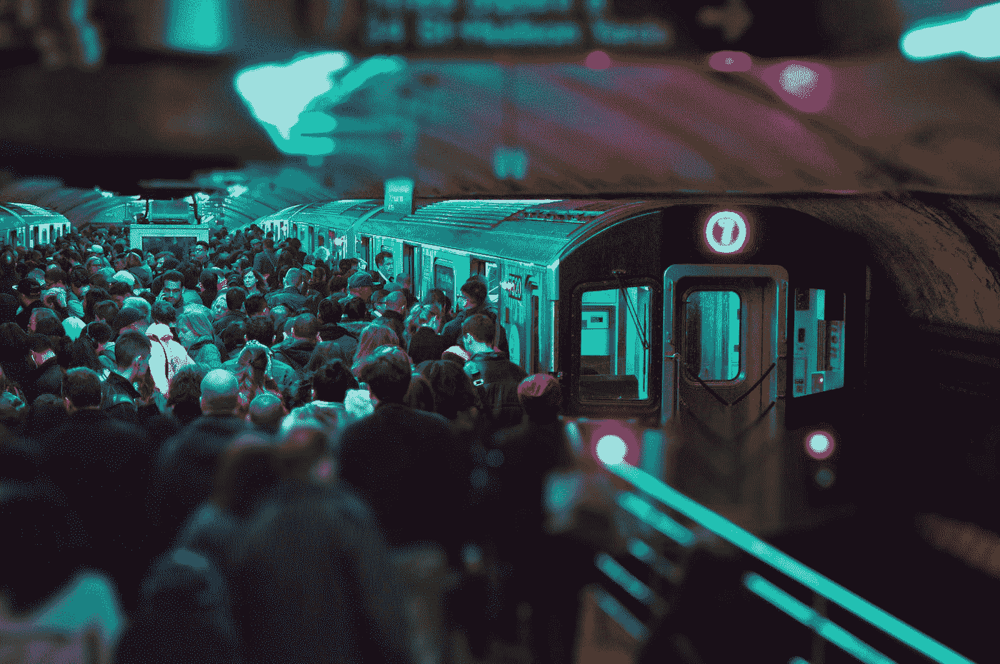

维克多·罗德里格兹在 [Unsplash](https://unsplash.com?utm_source=medium&utm_medium=referral) 上的照片

所以——除了我明显的个性问题(有些事情即使复杂的算法也无法解决)——很明显这是一个空间和 API 的两难问题，我可以使用 Alteryx 来解决。

本博客的其余部分致力于应用程序的用户界面；从技术角度看它是如何构建的；以及我接下来的步骤。我在这篇文章的底部添加了 Alteryx 社区上的应用程序链接。请随意下载并亲自尝试，或者只是评论反馈—链接在本文的底部。欢迎所有反馈。

# 如何使用该应用程序

像许多 API 一样，您需要生成一个访问令牌来使用 Google API。你可以在这里注册。

请务必检查路线和地点:

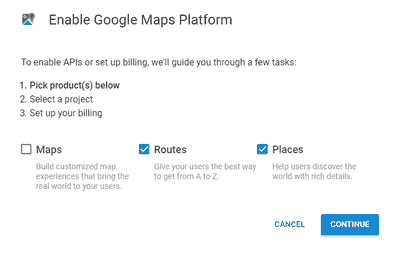

我选择将一张卡与我的 API 相关联(因为这样做可以让你免费打很多电话)，但是请务必通读这里的所有文档。

该应用的用户界面分为三个选项卡:

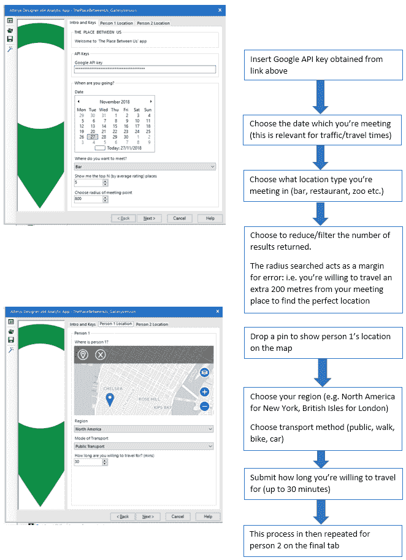

Alteryx 设计器中 UI 的第一次迭代

# 结果

结果在报告中提供，显示:您的旅行多边形重叠的地方，该景点中排名最高的地方，以及其他一些有趣的点和图像…

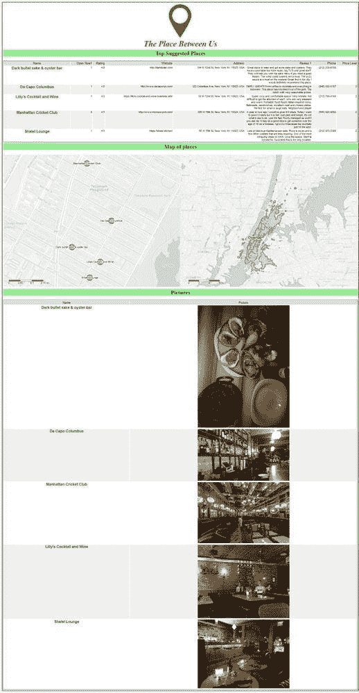

# 它是如何工作的？

有几个关键工具是该应用程序不可或缺的。在[调试模式](https://help.alteryx.com/current/DeBugModule.htm?TocPath=Apps%20and%20Macros%7C_____4)下运行应用程序可以让你确切地看到这些工具在做什么。

*   在应用程序开始时，您在地图上放置了两个(或更多)大头针；这些大头针需要转换成空间对象，这样我们就可以对每个人的位置进行空间分析。这是使用“创建点”工具，通过 XY 坐标和附加一个空间对象来完成的。
*   丢弃的点被馈送到 Route 360 API 宏中；该 API 利用步骤 1 中创建的空间点，在每个人周围创建一个多边形，显示他们在选择的交通类型和时间内可以到达的区域。(请注意，当您远离时，斑点的大小会减小；公共交通经常出现这种情况，其中每个斑点(在这种情况下)是一个地铁站，围绕它们的圆环是人们在剩下的分配时间内可以从每个车站走多远)

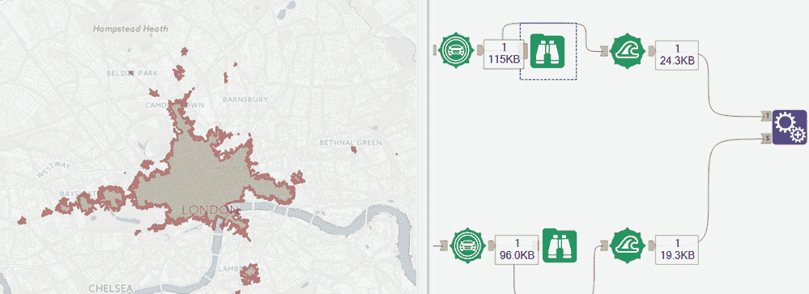

*   上面的步骤 2 是为每个人单独运行的，但我们真正想要的是将这两个多边形结合起来，看看这两个旅程是否可以重叠(你将去参加舞会)。“空间处理”工具允许您创建显示重叠区域的多边形，如下所示:

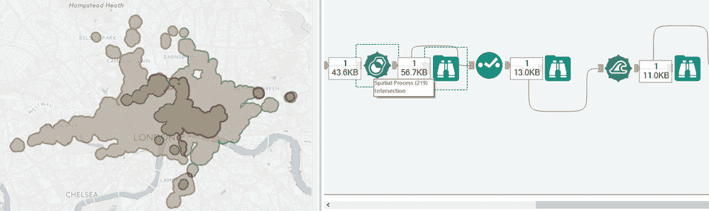

*   如果——如上所述，我们有多个重叠的区域呢？为了最大限度地找到一个好的地点(并最大限度地减少我们必须在下游进行的 API 调用的数量)，我们可以使用“空间信息”工具来计算这四个多边形的面积，并只选择面积最大的一个进行地点分析。

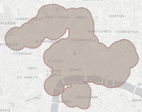

*   现在我们有了“完美的会合点”(或者有中心点的多边形)，但是我们仍然需要在其中搜索符合我们标准的地方(在这个例子中，是一个酒吧)。您在应用程序开始时定义的搜索半径在这里发挥作用，在我们的谷歌地图 API 调用中充当“距离”中心点的角色。
*   这些信息，以及中心点和地点类型的 X 和 Y，使我们能够构建一个搜索 URL，如下所示:

```
[https://maps.googleapis.com/maps/api/place/nearbysearch/json?location=518746104,-0.110362243&radius=500&keyword=Bar&key=**yourGoogleAPIkey**](https://maps.googleapis.com/maps/api/place/nearbysearch/json?location=518746104,-0.110362243&radius=500&keyword=Bar&key=yourGoogleAPIkey)
```

*   这个网址实际上是你在谷歌地图中搜索过的。我们需要 Alteryx 预先做好工作，以便在稍后找到完美的会议，但是，通过 Alteryx 这样做，我们可以返回比我们在 Google 中直接看到的更多的结果，更不用说看到关于每个地方的更多信息。
*   我们可以将新构建的 URL 输入到“下载”工具中，该工具与“JSON parse”一起允许我们以结构化的方式查看所有数据:

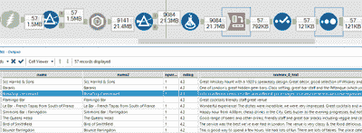

*   额外的报告和 blob 转换工具允许我们为用户构建标签，点击通过谷歌评级排序的地点列表，查看显示其位置的地图，并查看一些示例图片:

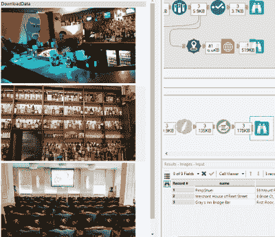

*   然后使用报告工具生成您在最终输出中看到的地图和表格:

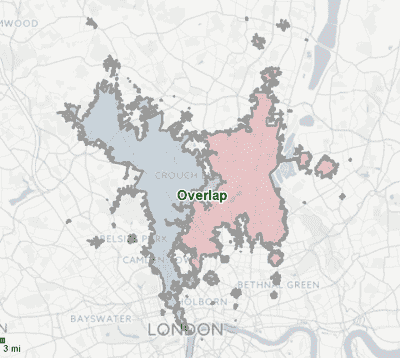

# 后续步骤

最近，除了“中间”之外，我拒绝在任何地方与任何人见面，并且被封锁，这意味着我有很多空闲时间来测试、改进和添加功能。我在锁定期间添加的几个功能包括但不限于:

*   用户关键字搜索。例如，您可能想要一家餐馆，但是添加到 google URL 的自由文本字段也允许您声明该餐馆提供“鱼和薯条”
*   每个人的实际旅行时间；google maps API 允许您返回以分钟和英里为单位的旅行时间，还可以返回一步一步的路线
*   多人(> 2 人)功能。显然，有些人有不止一个朋友，所以我添加了在 UI 中声明多人位置的功能
*   评论排名理论上是好的，但实际上很差。如果我要会见工作中的朋友(假设每个人都在市中心工作)，应用程序通常会建议在里兹酒店(Ritz)见面喝杯啤酒……所以我创建了一个指数，将所有这些变量都考虑在内，包括价格
*   UI 的一般整理:例如，最初，在下拉选择中，你可以看到谷歌将为你搜索的一系列商业类型；很自然，这非常适合酒吧和餐馆:

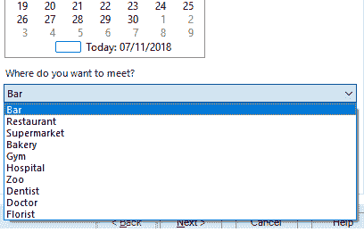

…我认为(也希望)没有人会想用这个来寻找他们之间评价最高的牙医或动物园。但我有什么资格评判？

更新后的新应用程序用户界面如下所示，可以在任何设备上通过浏览器运行:

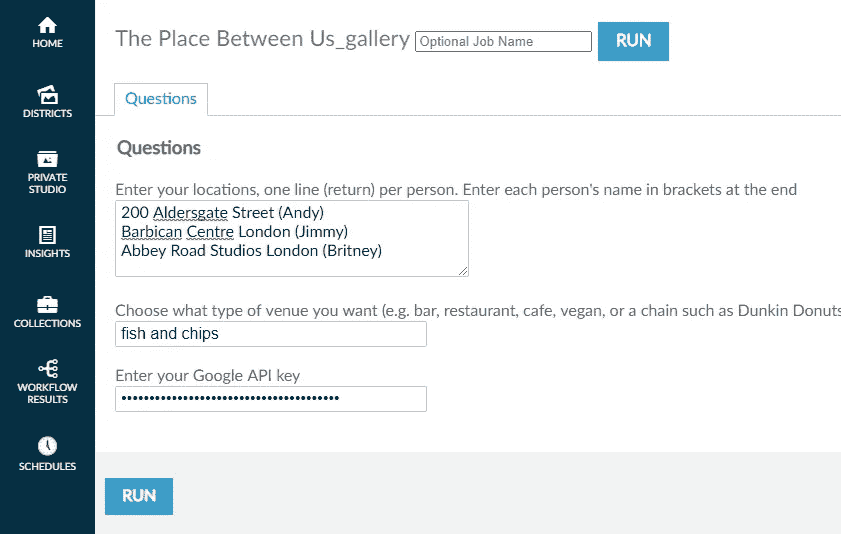

Alteryx 服务器中的新应用程序 UI

…输出包括更多细节，包括:

*   每个人到达每个目的地需要多长时间(见下面的安迪、克里斯和戴夫专栏)
*   行程时间的均值和标准差(保证公平！)
*   价格、评级、评级数量
*   一个排名指数，基于我创建的评分系统，加权并结合了上述所有指标

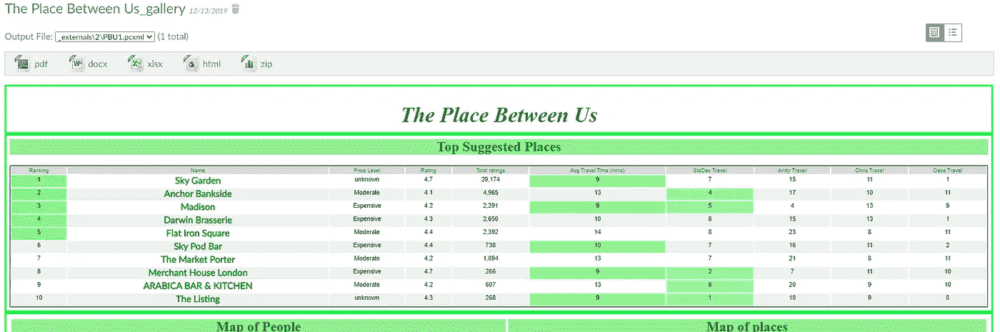

如果我和两个(虚构的)朋友想在一个高档酒吧见面

# 最后订单

我发现，尽管用例最初是用来学习 Google APIs 并继续使用 Alteryx 中的空间分析工具，但从 2020 年开始，我们相遇的地方以及我们如何到达那里，是一个比以往任何时候都更相关的问题。

正如你所看到的，即使是现在这也是一项正在进行的工作；我欢迎对这个应用程序的任何反馈，或者如果你想在这个或类似的事情上合作，请听听你的意见。我很乐意在附近的动物园见面，假设它符合我的评分高于 4.7 和旅行时间少于 27 分钟的标准。

我欢迎任何反馈或想法！


威尔·斯图尔特在 [Unsplash](https://unsplash.com?utm_source=medium&utm_medium=referral) 上拍摄的照片

干杯