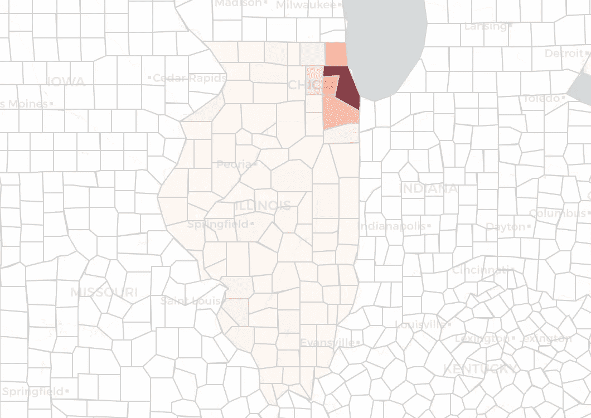
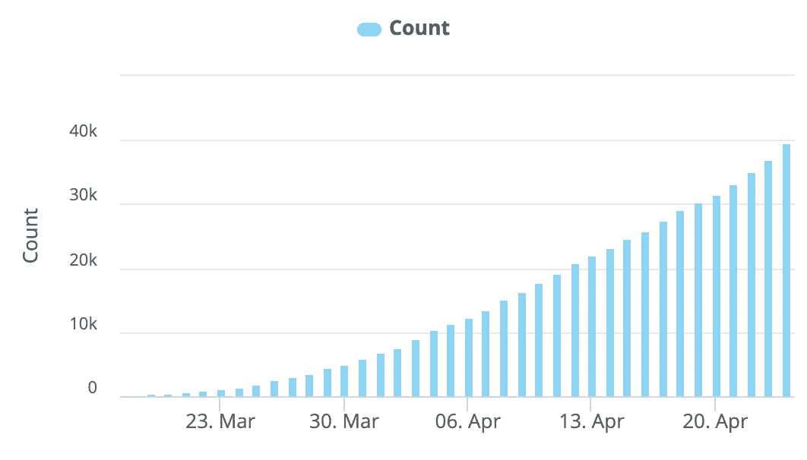
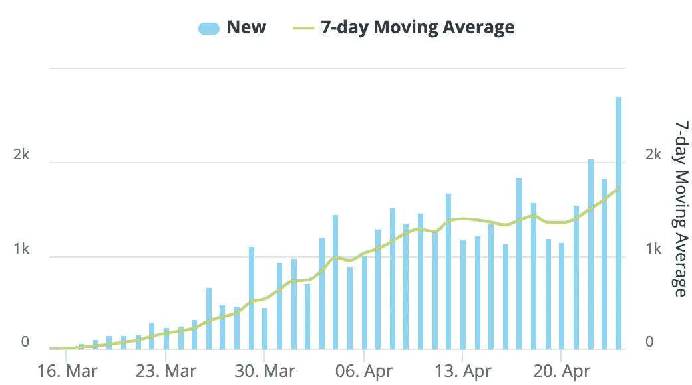
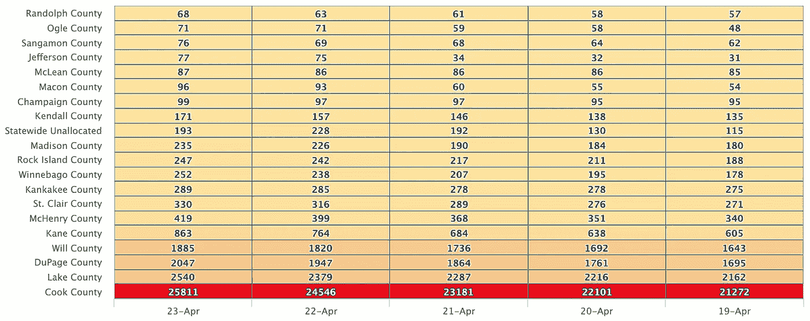
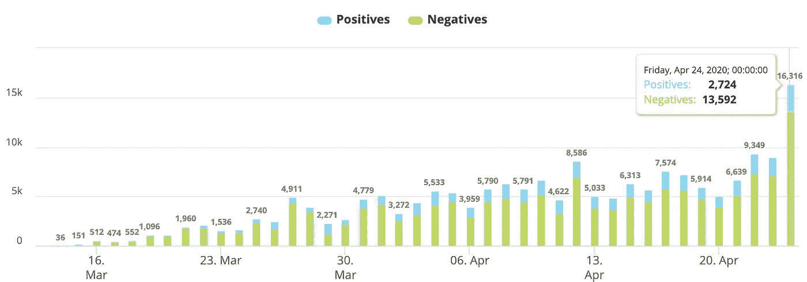
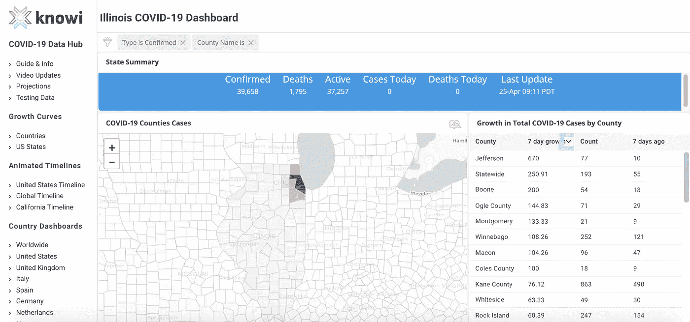

# 伊利诺伊州——你为什么不把曲线变平？

> 原文：<https://towardsdatascience.com/illinois-why-arent-you-flattening-the-curve-9e19b71ab453?source=collection_archive---------47----------------------->

## 还是你？让我们看看数据

索耶·本特森在 [Unsplash](https://unsplash.com?utm_source=medium&utm_medium=referral) 上的照片

***编者按:*** [*走向数据科学*](http://towardsdatascience.com/) *是一份以数据科学和机器学习研究为主的中型刊物。我们不是健康专家或流行病学家，本文的观点不应被解释为专业建议。想了解更多关于疫情冠状病毒的信息，可以点击* [*这里*](https://www.who.int/emergencies/diseases/novel-coronavirus-2019/situation-reports) *。*

图片作者。查看伊利诺伊州新冠肺炎仪表盘上的实时图像。

伊利诺伊州的“呆在家里”命令，相当于该州的就地避难所，于 3 月 21 日生效，并持续到今天。但是尽管隔离，伊利诺伊州的新冠肺炎病例似乎仍在加速。这与旧金山湾区的明显成功形成鲜明对比。

# 确诊病例总数

图片作者。查看伊利诺伊州新冠肺炎仪表盘上的实时图像。

关于伊利诺伊州，首先要注意的是，总病例数继续呈上升趋势。这对于大多数州来说是真实的，并不意味着他们没有拉平曲线。问题是，病例总数的增长速度有多快？

# 增长曲线—每日新病例

每天新增病例的数量是决定一个州是否在拉平曲线的最重要的统计数据。它代表了感染的加速。

## 生长曲线的快速解释

为了便于说明，让我们用一个假设的例子来说明一周的时间跨度。

如果一个州的新病例数每两天翻一番，这意味着周一有 400 个新病例，周三有 800 个新病例，周五有 1600 个新病例，周日有 3200 个新病例，这意味着一周总共有 6000 个新病例。这很糟糕，表明感染率在上升。

相比之下，如果增长曲线是平坦的，则他们可能会在周一显示 40 个新病例，周三显示大约 40 个新病例，周五显示大约 40 个新病例，周日显示 40 个新病例——这几周总共有 160 个新病例。

前一种情况是那种可以迅速压垮医疗系统的增长曲线。后一种情况是曲线变平后的样子。仍然有新的病例，但是每天的新病例数量没有增长。因此，病例总数并没有增加。

## 伊利诺伊州的增长曲线

图片作者。查看伊利诺伊州新冠肺炎仪表盘上的实时图像。

从这张图表中我们可以看出，伊利诺伊州的增长曲线似乎没有变平。每天都有一些变化，但如果你看一下 7 天移动平均线(绿线)，你会发现每天的新病例数量仍呈上升趋势。这是怎么回事？

# 库克县有绝大多数的病例

图片作者。在[伊利诺斯州新冠肺炎仪表盘](https://www.knowi.com/coronavirus-dashboards/illinois/)上查看实时可视化。

这张图表中最突出的一点是，伊利诺伊州的绝大多数病例都发生在库克县。库克县是芝加哥的所在地，芝加哥是该州最大的都会区，也是人口密度最大的地区。

# 但是等等，他们在进行更多的测试吗？

我们需要考虑的一点是，确诊新增病例的数量可能并不总是代表实际新增病例的数量。检测激增会导致确诊新病例激增。

因此，伊利诺伊州(甚至芝加哥)每天都在做越来越多的测试，这是理所当然的，他们会显示每天的病例数在增加，即使实际病例数持平。我们来看看测试数据。

现在看这个图表，叙述开始改变。在这里，我们看到 4 月 24 日进行的测试大幅增加。如果我们回到每日新增病例图表，我们也看到 4 月 24 日确诊病例大幅增加。

测试曲线解释了增长曲线中所有的增长吗？看起来没有，没有。但它确实消除了一些更令人担忧的峰值，并且在报道伊利诺伊州就地安置的有效性时需要额外的谨慎。

# 数据源和参考

这篇文章的所有数据和可视化来自 [Knowi 冠状病毒数据中心](https://www.knowi.com/coronavirus-dashboards/)。那里使用的数据来自约翰·霍普斯金，世卫组织，疾病控制中心。在这里查看他们的数据来源列表。

[可以在这里找到各州的测试数据。](https://www.knowi.com/coronavirus-dashboards/testing-data/)

图片作者。伊利诺伊州的新冠肺炎仪表盘。