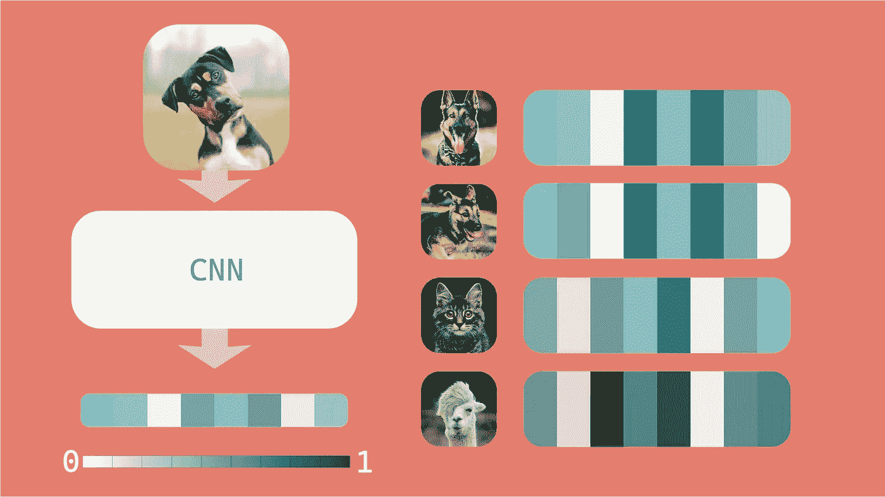
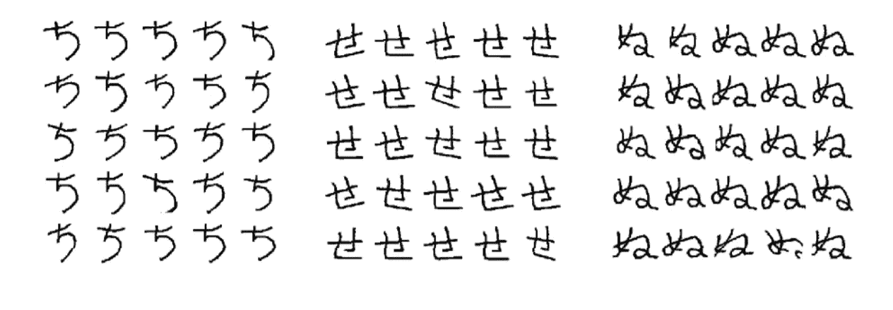
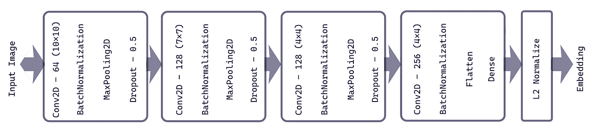
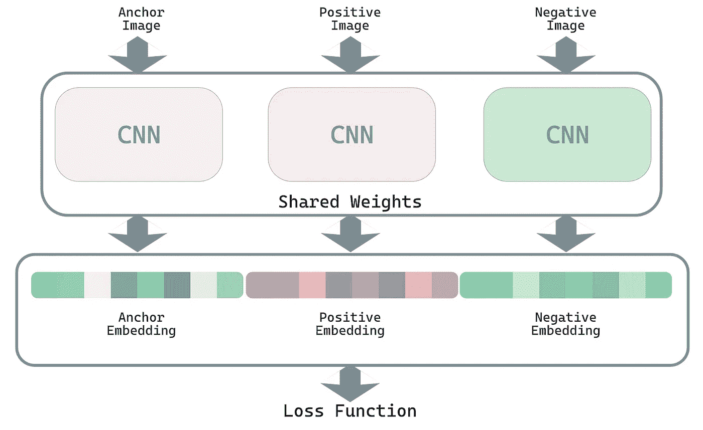
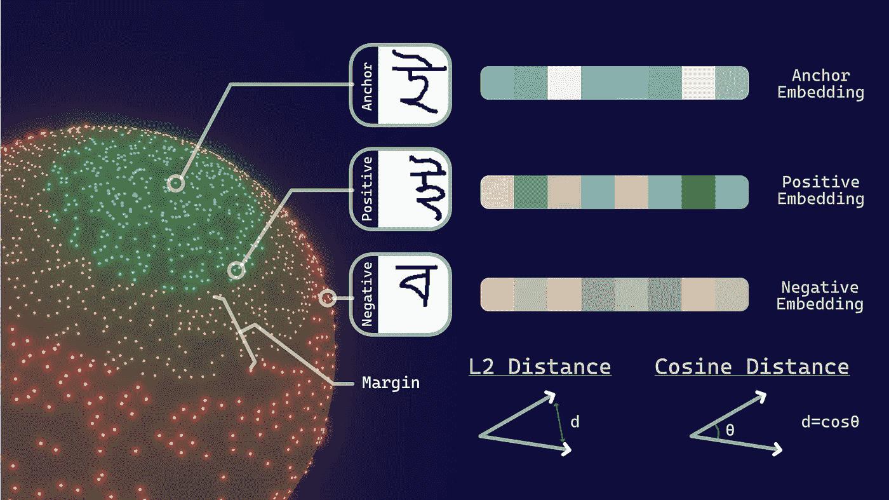
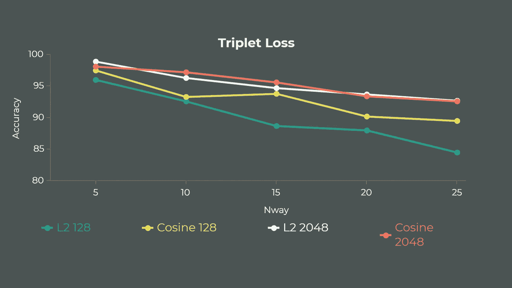
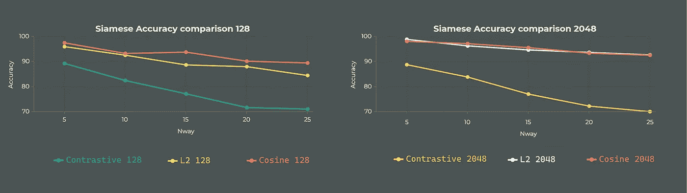

# 暹罗网络图解指南

> 原文：<https://towardsdatascience.com/illustrated-guide-to-siamese-network-3939da1b0c9d?source=collection_archive---------25----------------------->

## 使用三重损失进行一次性学习

马尔科·祖彭在 [Unsplash](https://unsplash.com/s/photos/signature?utm_source=unsplash&utm_medium=referral&utm_content=creditCopyText) 上的照片

建立一个准确的机器学习模型通常需要大量的训练数据，这仍然可能导致训练数据过度拟合，或者只适用于有限数量的训练数据类别。但是，如果一台机器能够“**学会学习**，例如，如果我们向我们的机器展示一只鹦鹉的单一图像，它可以通过理解它与作为参考展示的鹦鹉的图像如何相似来准确地识别另一只鹦鹉的图像。这个设计一个可以“学会学习”的机器的问题叫做**元学习**。

在本文中，我们将关注一个著名的元学习模型——暹罗网络。如何运作，如何实施？

Siamese，顾名思义，来自“Siamese Twins”，其中我们使用两个或更多的网络(这里，在图像的情况下是 CNN)，该网络使用共享的权重来学习图像之间的相似性和不相似性。网络输出 n 维嵌入，其中每个方向代表图像的一些视觉模式。

**了解嵌入**

假设，我们使用 n 维空间来映射我们的图像，其中每个维度对应于特定特征/或模式的值。每个维度描述了输入图像的独特视觉特征。查看 Jay alam mar[的这篇令人惊叹的](https://twitter.com/JayAlammar)[文章](https://jalammar.github.io/illustrated-word2vec/)以获得更好的嵌入直觉**。**例如，在不同动物图像的情况下，输出嵌入可能如下所示(颜色强度表示其值在 0 到 1 之间)—

作者图片

狗的前两个图像输出相似的嵌入，而猫和美洲驼的第三和第四输出嵌入与狗非常不同，因为它们具有非常不同的视觉特征包。

在本文中，我们将使用 [Omniglot 数据集](https://github.com/brendenlake/omniglot)。该数据集包含世界各地不同语言中使用的各种字母的字符图像。

Ominglot 数据集

# 工作

## 美国有线新闻网；卷积神经网络

CNN 架构的灵感来自[这篇论文](https://www.cs.cmu.edu/~rsalakhu/papers/oneshot1.pdf)

我们的 CNN 输出一个期望嵌入大小的一维数组。我们可以看到最后一层执行 [*L2 归一化*](https://stats.stackexchange.com/a/331967/283107) ，这将归一化输出向量并将其映射到半径为 1 的 n 维超球的*表面。这样做是为了确保可以通过计算两个嵌入之间的距离来比较图像之间的相似性值，因为所有的嵌入都将位于将给出更好结果的表面上。我们的模型有三个这样的 CNN，所有的重量都一样。这将帮助我们的模型学习每个样本中的一个相似性和一个不相似性。每个样本将包含三个组成*锚*、*阳性*和*阴性*的样本图像。稍后会有更多的介绍。*

最终连体网络架构

# 损失函数

现在是构建这个网络最重要的部分。在这里，我们将编写它如何比较输出嵌入的定义，并理解它们之间的相似性/不相似性，从而完成*元学习*的任务。

由于我们使用之前讨论的 *L2 归一化*将输出嵌入映射到表面上，我们可以使用 L2 距离或余弦相似度。使用三重损失将允许我们的模型映射两个彼此接近的相似图像，并且远离不相似的样本图像。这种方法通过供给三个一组来实现，包括:

**1。*锚点图像*** —这是一个样本图像。

**2。*正面形象***——这只是主播形象的另一种变体。这有助于模型学习两个图像之间的相似性。

**3。*负像*** —这是与上面两幅相似图像不同的图像。这有助于我们的模型学习锚图像的不同之处。

为了增加相似和不相似输出向量之间的距离，并进一步映射彼此接近的相似图像，我们引入了另一个术语，称为*边距*。这增加了相似和不相似向量之间的分离，也消除了任何[平凡解](https://youtu.be/d2XB5-tuCWU?t=138)的输出。由于人类很难想象一个嵌入映射到 N 维球体上，从而理解这种损失是如何工作的，我做了下面的渲染来建立对 N=3(我们非常熟悉的 3D)这种东西如何工作的直觉。

此图描述了我们的模型在训练后的输出。标记为*绿色*点的相似图像相互靠近映射，标记为*红色*映射的不相似图像相距较远，边距大小的最小距离显示为*黄色*。在训练后的理想情况下，不应在锚图像的黄色区域中映射任何点。然而，由于表面上的空间非常有限，点往往会有重叠区域。稍后将对此进行更多讨论。

我们的模型使用了在[论文](https://www.cs.cmu.edu/~rsalakhu/papers/oneshot1.pdf)中使用的 0.2 的边距大小。

这种相似性/不相似性由使用 L2 距离和余弦距离的两个向量之间的距离来定义。

所以我们的损失定义如下—

> loss(a，p，n) = max(0，d(a，p) -d(a，n)+余量)

***余弦三重损失***

***L2 三重损失***

# 履行

实现这个网络的棘手部分是定义损失函数。我们通过对所需批量的三元组进行采样来生成输入数据，并定义网络和我们的损失函数，然后进行训练！！！完整的实现可以在 [***这里找到***](https://github.com/pranjalg2308/siamese_triplet_loss) 。

# 结果和观察

在用不同的超参数和损失函数训练网络，并在 n 路一次分类(即网络从未见过的不同类别的“n”个单个图像)上测试网络准确度之后。可以观察到—

1.  对于较小的嵌入，余弦损失往往表现良好。
2.  增加嵌入的大小可以提高精确度，因为更多的维度现在可以表示图像的更多独特特征。
3.  随着 n 向一次发射中的“n”增加，模型精度略微降低，因为网络难以在超球体上映射更多数量的相距较远的嵌入。

不同大小的输出向量之间的精确度比较

后续的[文章](/one-shot-learning-with-siamese-networks-using-keras-17f34e75bb3d)可以阅读，使用对比损失使暹罗网络仅学习相似性，使用一个角色的两个不同图像。毫无疑问，它确实表现不佳，往往在训练中过度适应，而三连音缺失根本不会过度适应。基于对比损失的连体网络的准确性随着 nway 一次性分类的增加而急剧下降。

不同大小输出向量下对比损失和三重损失的准确性比较

# 应用

这个网络用来比对指纹，[检测签名伪造](https://www.alliance.edu.in/aicaam-conference-proceedings/Papers/Siamese-Triple-Ranking-Convolution-Network.pdf)，[人脸识别](https://www.cs.toronto.edu/~ranzato/publications/taigman_cvpr14.pdf)。这可以应用于任何相似和相异分数有用的地方。

# 参考

[1]https://www.cs.cmu.edu/~rsalakhu/papers/oneshot1.pdf

[2][https://en.wikipedia.org/wiki/Siamese_neural_network](https://en.wikipedia.org/wiki/Siamese_neural_network)

[https://jalammar.github.io/illustrated-word2vec/](https://jalammar.github.io/illustrated-word2vec/)

[3][https://towards data science . com/one-shot-learning-with-siamese-networks-using-keras-17 f 34 e 75 bb 3d](/one-shot-learning-with-siamese-networks-using-keras-17f34e75bb3d)

[4][https://Neptune . ai/blog/content-based-image-retrieval-with-siamese-networks](https://neptune.ai/blog/content-based-image-retrieval-with-siamese-networks)