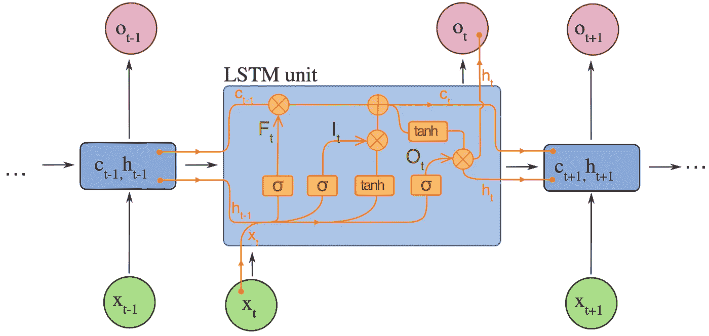
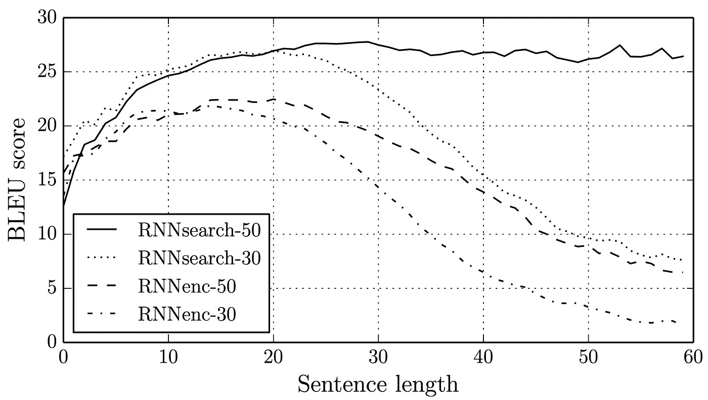
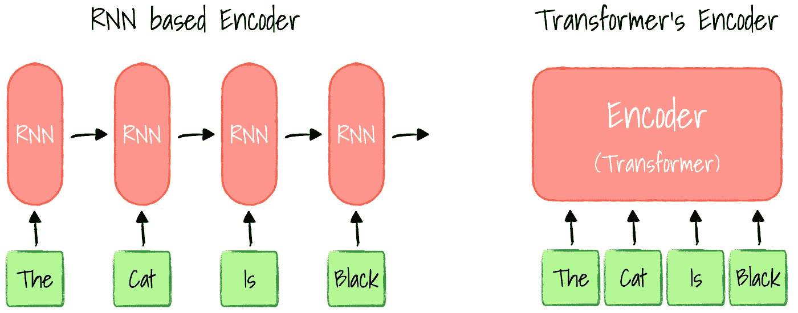
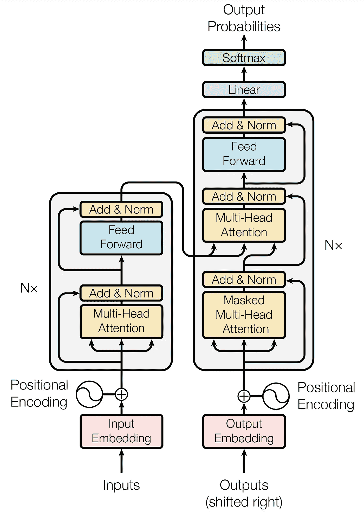
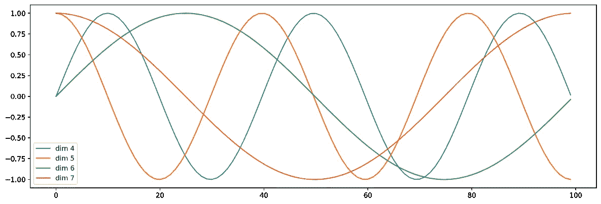
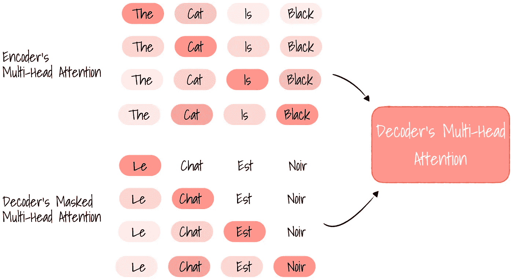
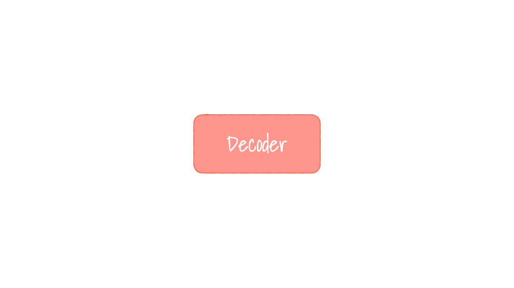

# 变压器图解指南

> 原文：<https://towardsdatascience.com/illustrated-guide-to-transformer-cf6969ffa067?source=collection_archive---------20----------------------->

## 逐个组件的细分分析

变压器模型是编码器-解码器架构的演变，在论文[中提出](https://arxiv.org/abs/1706.03762)注意力是你所需要的一切。虽然编码器-解码器架构一直依赖递归神经网络(RNNs)来提取序列信息，但转换器不使用 RNN。基于变压器的模型已主要取代了 LSTM，并已被证明在许多序列间问题的质量优越。

Transformer 完全依赖注意力机制，通过并行化来提高速度。它在机器翻译方面产生了最先进的性能。除了语言翻译方面的重大改进之外，它还提供了一种新的体系结构来解决许多其他任务，如文本摘要、图像字幕和语音识别。

在 Transformer 模型之前，递归神经网络(RNNs)一直是顺序数据的首选方法，其中输入数据具有定义的顺序。RNNs 的工作方式就像一个前馈神经网络，将输入一个接一个地展开。

展开递归神经网络[ [来源](https://en.wikipedia.org/wiki/Recurrent_neural_network)

展开输入中每个符号的过程由编码器完成，其目的是从顺序输入中提取数据，并将其编码为一个向量，即输入的表示。

顺序输入数据的例子是产品评论中的单词(或字符)，其中 RNN 将顺序提取每个单词，形成一个句子表示。这种表示将被用作分类器输出固定长度向量的特征，例如指示正面/负面的情感标签，或者在 5 分尺度上。

在机器翻译和图像字幕中，我们可以用解码器代替输出固定长度向量的分类器。如同编码器单独消耗输入中的每个符号一样，解码器在几个时间步长上产生每个输出符号。

使用编码器-解码器结构的机器翻译。

例如，在机器翻译中，输入是英语句子，输出是法语翻译。编码器将按顺序展开每个单词，并形成输入英语句子的固定长度向量表示。然后，解码会以定长向量表示为输入，一个接一个地产生每个法语单词，形成翻译后的英语句子。

## 基于 RNN 的编码器-解码器的问题

然而，RNN 模型有一些问题，它们训练缓慢，并且它们不能处理长序列。

输入数据需要一个接一个地顺序处理。这种循环过程没有利用现代图形处理单元(GPU ),它是为并行计算而设计的。rnn 非常慢，以至于引入了截断反向传播来限制反向传递中的时间步长数——估计梯度来更新权重，而不是完全反向传播。即使采用截短的反向传播，rnn 的训练仍然很慢。

其次，RNNs 也不能很好地处理长序列，因为如果输入序列太长，我们会得到消失和爆炸梯度。一般在训练过程中会在损耗中看到 NaN(不是一个数字)。这些也被称为 RNNs 中的长期依赖性问题。

如果输入序列太长，则渐变消失。

1997 年，[hoch Reiter&schmid Huber](https://www.mitpressjournals.org/doi/abs/10.1162/neco.1997.9.8.1735)引入了长短期记忆(LSTM)网络，这种网络被明确设计用来避免长期依赖问题。每个 LSTM 单元允许过去的信息跳过当前单元的所有处理并移动到下一个单元；这允许存储器保留更长时间，并且将使数据不变地随其流动。LSTM 由一个决定存储什么新信息的输入门和一个决定删除什么信息的遗忘门组成。

长短期记忆[ [来源](https://en.wikipedia.org/wiki/Recurrent_neural_network)

当然，LSTMs 比 rnn 有更好的记忆，能够处理更长的序列。然而，LSTM 网络更复杂，速度更慢。

基于 RNN 的编码器-解码器架构的另一个缺点是固定长度的向量。使用固定长度的向量来表示输入序列以解码一个全新的句子是困难的。如果输入序列很大，上下文向量不能存储所有信息。此外，区分单词相似但意思不同的句子是一项挑战。

使用固定长度的向量来表示输入序列。

想象一下，选择上面的一段话(输入)并记忆它(定长向量)。然后，翻译整个段落(输出),不要参考它。这很难，我们不是这样做的。相反，当我们把一个句子从一种语言翻译成另一种语言时，我们一部分一部分地看这个句子，每次都注意这个句子中的一个特定短语。

Bahdanau 提出了一种在编码器-解码器模型中搜索与预测目标单词相关的源句子部分的方法。这就是注意力机制的美妙之处；我们可以使用注意力翻译相对较长的句子，而不会影响它的表现。比如翻译成“noir”(法语是“黑”的意思)，注意机制会把注意力集中在“black”这个词上，可能还有“cat”，而忽略句子中的其他词。

测试集上生成的翻译相对于句子长度的 BLEU 分数。[ [来源](https://arxiv.org/pdf/1409.0473.pdf)

注意机制提高了编码器-解码器网络的性能，但是速度的瓶颈仍然是由于 RNN 必须一个字一个字地顺序处理。对于序列数据，我们能去掉 RNN 吗？

## 我们如何对顺序数据使用并行化？

是啊！你需要的只是关注。[变压器](https://arxiv.org/pdf/1706.03762.pdf)架构于 2017 年推出。就像编码器-解码器架构一样，输入序列被送入编码器，解码器将逐个预测每个字。该转换器通过消除 RNN 和利用注意机制来改善其时间复杂度和性能。

RNN 一个一个地打开每个单词。变压器并行处理输入。

考虑把一个句子从英语翻译成法语。在 RNN，每个隐藏状态都依赖于前面单词的隐藏状态。因此，当前步骤的嵌入一次生成一个时间步骤。在 Transformer 中，没有时间步长的概念；输入序列可以并行传递到编码器。

# 变压器

假设我们正在训练一个将英语句子翻译成法语的模型。转换器架构有两部分，编码器(左)和解码器(右)。让我们来看看变压器架构。

变压器模型架构。[ [来源](https://arxiv.org/abs/1706.03762)

在编码器中，它输入一个英语句子，输出将是每个单词的一组编码向量。将输入的英语句子中的每个单词转换成嵌入来表示意思。然后我们添加一个位置向量来添加单词在句子中的上下文。这些单词向量被馈送到编码器注意块，编码器注意块计算每个单词的注意向量。这些注意力向量通过前馈网络并行传递，输出将是每个单词的一组编码向量。

解码器接收法语单词的输入和整个英语句子的注意力向量，以生成下一个法语单词。它用嵌入层编码每个单词的意思。然后添加位置向量来表示单词在句子中的上下文。这些单词向量被送入第一个注意块，即掩蔽注意块。掩蔽注意块计算当前和先前单词的注意向量。来自编码器和解码器的注意力向量被馈送到下一个注意力块，该注意力块为每个英语和法语单词生成注意力映射向量。这些向量被传递到前馈层线性层和 softmax 层，以预测下一个法语单词。我们重复这个过程来生成下一个单词，直到生成“句子结束”标记。

这是变压器如何工作的高级细节。让我们更深入地研究一下每个组件。

## 嵌入

因为计算机不像我们一样理解单词——它的意思以及单词之间的关系；我们需要用向量代替单词。单词向量(或嵌入)允许每个单词被映射到高维嵌入空间中，其中具有相似含义的单词彼此更接近。

尽管我们可以用向量来引用和表示每个单词的含义，但单词的真正含义取决于句子中的上下文，因为不同句子中的同一个单词可能有不同的含义。由于 RNN 被设计用来捕获序列信息，没有 RNN，转换器如何处理词序？我们需要位置编码器。

## 位置编码器

位置编码器从输入嵌入层接收输入，并应用相对位置信息。这一层输出带有位置信息的单词向量；这就是单词的意思和它在句子中的上下文。

考虑下面的句子，“狗咬了约翰尼”和“约翰尼咬了狗。”如果没有上下文信息，两个句子会有几乎相同的嵌入。但我们知道这不是真的，对约翰尼来说肯定不是真的。

单词嵌入和位置编码产生带有上下文的单词向量。

作者建议使用多个正弦和余弦函数来生成位置向量。这样，我们可以使用这个位置编码器来处理任何长度的句子。波的频率和偏移对于每个维度是不同的，代表每个位置，值在-1 和 1 之间。

使用多个正弦和余弦函数的位置编码。

这种二进制编码方法还允许我们确定两个单词是否彼此接近。例如，通过参考低频正弦波，如果一个单词具有“高”，而另一个单词具有“低”，我们知道它们相距更远，一个位于开头，另一个位于结尾。

## 编码器的多头注意力

注意力的主要目的是回答“我应该关注输入的哪一部分？”如果我们对一个英语句子进行编码，我们想要回答的问题是，“英语句子中的一个单词与同一个句子中的其他单词有多相关？”这表现在注意力向量中。对于每个单词，我们可以生成一个注意力向量来捕捉句子中单词之间的上下文关系。例如，对于单词“黑色”，注意力机制集中在“黑色”和“猫”上

多个注意力向量正常化。

由于我们对不同单词之间的交互感兴趣，每个单词的注意力向量可能对自己的权重过高。因此，我们需要一种方法来规范化向量。注意模块接受输入 V、K 和 Q——这些是提取输入单词不同成分的抽象向量。我们用这些来计算每个单词的注意力向量。

为什么叫“多头关注”？这是因为我们对每个单词使用多个注意力向量，并采用加权平均来计算每个单词的最终注意力向量。

## 编码器的前馈

由于多头注意块输出多个注意向量，我们需要将这些向量转换成每个单词的单个注意向量。

该前馈层接收来自多头注意力的注意力向量。我们应用标准化将它转换成一个单一的注意力向量。因此，我们得到可被下一个编码器块或解码器块消化的单个向量。在该论文中，作者在输出到解码器模块之前堆叠了六个编码器模块。

## 解码器的输出嵌入和位置编码器

因为我们是从英语翻译成法语，我们输入法语单词到解码器。我们用单词嵌入替换单词，然后添加位置向量来获得单词在句子中的上下文概念。我们可以将这些包含单词含义及其在句子中的上下文的向量输入解码器模块。

## 解码器的掩蔽多头注意

类似于编码器模块中的多头注意力。注意块为法语句子中的每个单词生成注意向量，以表示每个单词与同一个输出句子中的每个单词的相关程度。

与接收英语句子中每个单词的编码器中的注意块不同，只有法语句子中的前几个单词被输入到解码器的注意块中。因此，我们使用向量屏蔽稍后出现的单词，并用零表示，这样注意力网络在执行矩阵运算时就无法使用它们。

多个注意力向量被屏蔽。

## 解码器的多头注意力

这个注意块充当编码器-解码器，它从编码器的多头注意和解码器的掩蔽多头注意接收向量。这个注意块将决定每个单词向量彼此之间的相关程度，这就是从英语单词到法语单词的映射发生的地方。这个模块的输出是英语和法语句子中每个单词的注意力向量，其中每个向量代表两种语言中与其他单词的关系。

将注意力向量输入到解码器的多头注意力中

## 解码器的前馈

像编码器的前馈层一样，该层将由多个向量组成的每个词归一化为下一个解码器块或线性层的单个注意力向量。在本文中，作者在输出到线性层之前堆叠了六个解码器块。

## 解码器的线性层和 softmax

由于解码器的目的是预测下一个单词，所以这个前馈层的输出大小是词汇表中法语单词的数量。Softmax 将输出转换为概率分布，输出与下一个单词的最高概率相对应的单词。

把英语翻译成法语，解码器预测下一个单词。

对于每一个生成的单词，我们重复这个过程，包括法语单词，并用它来生成下一个直到句子结束的令牌。

# 开始

[TensorFlow](https://www.tensorflow.org/tutorials/text/transformer) 和 [PyTorch](https://pytorch.org/tutorials/beginner/transformer_tutorial.html) 都有一个循序渐进的教程，可以帮助你理解和训练一个使用 Transformer 的序列到序列模型。如果你需要快速制作的东西，可能最受欢迎的选择是通过[拥抱脸](https://huggingface.co/transformers/quickstart.html)。

张量流教程:

 [## 用于语言理解的转换器模型| TensorFlow 核心

### 本教程训练一个 Transformer 模型将葡萄牙语翻译成英语。这是一个高级示例，假设…

www.tensorflow.org](https://www.tensorflow.org/tutorials/text/transformer) 

PyTorch 教程:

 [## 基于神经网络的序列间建模。变压器和火炬文本- PyTorch 教程 1.5.0…

### PyTorch 1.2 版本包含了一个标准的 transformer 模块，该模块基于一篇名为“你只需要关注”的文章。的…

pytorch.org](https://pytorch.org/tutorials/beginner/transformer_tutorial.html) 

PyTorch 中的变压器架构:

生产包装:

 [## 快速入门-变压器 2.10.0 文档

### Transformers 是一个为寻求使用/研究/扩展大型变压器的 NLP 研究人员而构建的自以为是的库…

huggingface.co](https://huggingface.co/transformers/quickstart.html)  [## 深度学习神经网络中卷积层是如何工作的？

### 理解卷积及其参数的生动方式

towardsdatascience.com](/how-convolutional-layers-work-in-deep-learning-neural-networks-2913af333b72) 