# 💡示出了重整器

> 原文：<https://towardsdatascience.com/illustrating-the-reformer-393575ac6ba0?source=collection_archive---------11----------------------->

## 🚊高效变压器️

*参见:🇫🇷* [*法文*](https://lbourdois.github.io/blog/nlp/Reformer/) 的翻译

🎥如果你一直在开发用于处理顺序数据的机器学习算法——如语言处理中的文本、语音信号或视频——你可能听说过或使用过[**Transformer**](https://ai.googleblog.com/2017/08/transformer-novel-neural-network.html)**model**，**，你可能知道它与 twitter 认为的不同:**

****

**图一。破冰者，摘自克里斯·曼宁教授的推特**

**🔊🗞最近，谷歌推出了 [**重整器**](https://ai.googleblog.com/2020/01/reformer-efficient-transformer.html) 架构，这是一个*转换器*模型，旨在高效处理*超长序列*的数据(例如一种语言处理多达 100 万个单词)。Reformer 的执行需要低得多的内存消耗，即使只在一个 GPU 上运行也能获得令人印象深刻的性能。论文[*改革者:高效的变革者*](https://arxiv.org/pdf/2001.04451.pdf) *r* 将于 2020 年在 ICLR 亮相(并在评论中获得近乎完美的分数)。*改革家*模型有望通过超越语言应用(如音乐、语音、图像和视频生成)对该领域产生重大影响。**

**💡在本帖中，我们将尝试深入到 ***重整器模型*** 中，并尝试用一些视觉向导来理解它。准备好了吗？💪**

## **为什么是变形金刚？**

**🎬NLP 中的一类任务(如机器翻译、文本生成、问题回答)可以公式化为[序列到序列学习问题](https://papers.nips.cc/paper/5346-sequence-to-sequence-learning-with-neural-networks.pdf)。长短期记忆(LSTM)神经网络，后来配备了一个[注意力机制](http://Neural machine translation by jointly learning to align and translate.)，是一个用于建立此类问题预测模型的突出架构——例如在[谷歌的神经机器翻译系统](https://arxiv.org/pdf/1609.08144.pdf)。然而，LSTMs 中递归固有的顺序性质是对数据序列进行并行计算的最大障碍(就速度和消失梯度而言)，因此，这些架构无法利用长序列的上下文。**

**🚀最近的[变压器型号](https://ai.googleblog.com/2017/08/transformer-novel-neural-network.html)——在论文[中介绍的“注意力就是你所需要的全部”](https://arxiv.org/abs/1706.03762)——通过消除递归并引入多头自我注意力机制，在许多任务中实现了最先进的性能。transformer 的主要新颖之处在于它的并行处理能力，这使得能够处理长序列(具有数千个单词的上下文窗口)，从而以更少的训练时间产生卓越的模型，如著名的 [Open AI 的 GPT2 语言模型](https://openai.com/blog/better-language-models/)。🤗Huggingface 的[变形金刚库](https://github.com/huggingface/transformers)——拥有 100 多种语言的超过 32 个预训练模型以及 TensorFlow 和 PyTorch 之间的互操作性——是构建最先进的 NLP 系统的一项出色的开源工作。🎮[用变形金刚写作](https://transformer.huggingface.co/)和[与变形金刚对话](https://talktotransformer.com/)是一些有趣的演示。这个转换器已经被用于文本之外的应用，例如[生成音乐](https://magenta.tensorflow.org/music-transformer)和[图像](https://ai.google/research/pubs/pub46840/)。**

## **变形金刚少了什么？**

**🚦在深入研究重整器之前，让我们回顾一下 transformer 模型的挑战性。这需要对 transformer 体系结构本身有所了解，这一点我们在本文中无法详述。然而，如果你还不知道，Jay Alamar 的[The Illustrated Transformer](http://jalammar.github.io/illustrated-transformer/)帖子是迄今为止最伟大的视觉解释，我强烈建议在阅读这篇帖子的其余部分之前阅读他的帖子。**

**🤔虽然 transformer 模型在越来越长的序列上使用时产生了很好的结果，例如(Liu 等人，2018 年)中的 11K 长的文本示例，但许多这样的大型模型只能在大型工业计算平台上训练，甚至不能在单个 GPU 上进行微调，即使是针对单个训练步骤也是如此，因为它们需要内存。例如，完整的 GPT-2 模型包含大约 1.5 亿个参数。(Shazeer 等人，2018 年)中报告的最大配置中的参数数量超过每层 0.5B，而层的数量高达 64(Al-Rfou 等人，2018 年)。**

**💡让我们看一下变压器模型的简化概述:**

**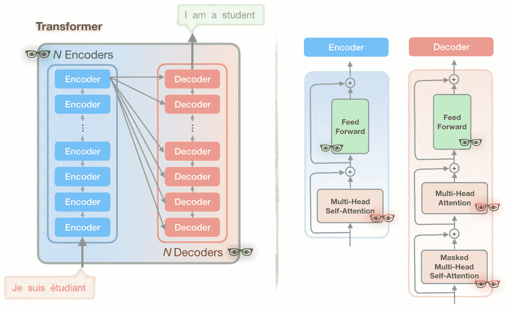**

**图 2:标准变压器模型的简化总结[图片灵感来自‘图解变压器’]**

**😕如果这个模型看起来不熟悉或似乎难以理解，我敦促你在这里停下来，并审查➡️ [的插图变压器](http://jalammar.github.io/illustrated-transformer/)职位。**

**你可能会注意到有一些👓在图表中用三种不同的颜色。每个都是独一无二的👓s 代表了 Transformer 模型的一部分，Reformer 作者将其视为计算和内存问题的来源:**

## **👀问题 1(红色👓):注意力计算**

**计算长度为 *L* 的序列上的注意力是 *O(L* )(时间和内存都有)。想象一下，如果我们有一个长度为 64K 的序列，会发生什么。**

## **👀问题 2(黑色👓):大量的层**

**具有 *N* 层的模型消耗的内存是单层模型的 *N* 倍，因为每一层中的激活都需要存储用于反向传播。**

## **👀问题 3(绿色👓):前馈层的深度**

**中间前馈层的深度通常比注意激活的深度大得多。**

**重整器模型解决了上述*转换器中内存消耗的三个*主要来源，并对它们进行了改进，使得重整器模型可以处理高达*100 万字*的上下文窗口，所有这些都在*单个加速器*上，并且仅使用 *16GB 内存。***

> **简而言之，重整器模型结合了两种技术来解决注意力和内存分配的问题:[位置敏感哈希](https://en.wikipedia.org/wiki/Locality-sensitive_hashing) (LSH)来降低处理长序列的复杂性，以及[可逆剩余层](https://arxiv.org/abs/1707.04585)来更有效地使用可用内存。**

**下面我们将进一步探讨细节。**

# **💥 1.区分位置哈希(LSH)注意**

## **💭注意和最近的邻居**

**深度学习中的注意力是一种机制，它使网络能够根据上下文的不同部分与当前时间步长的相对性，专注于上下文的不同部分。变压器模型中存在以下三种类型的注意机制:**

**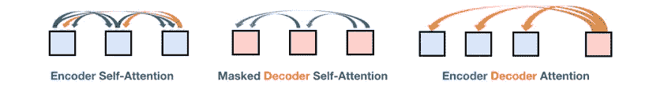**

**图 3:变形金刚模型中的三种注意力**

**变压器中使用的标准注意力是缩放的点积，公式如下:**

**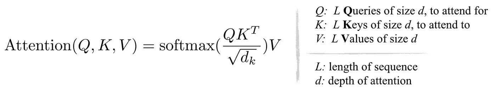**

**从上式和下图可以看出，乘法 *QKᵀ* (形状为[ *L，L* )的计算和内存开销都在 *O(L)，*这是主要的内存瓶颈。**

**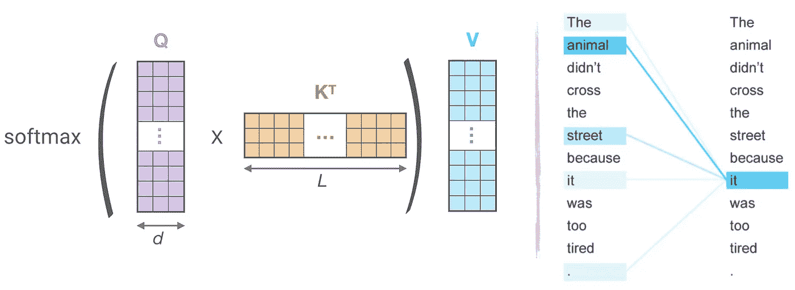**

**图 4:(左):点积注意力的主要计算，(右)一个标记(‘它’)注意序列中其他标记的子集(‘the’，‘animal’，‘street’，‘it’，’.’)**

**❓But 是否有必要计算和存储全矩阵 *QKᵀ* ？答案是*不，*因为我们只对 *softmax* ( *QKᵀ* )感兴趣，它由典型稀疏矩阵中的最大元素支配。因此，正如你在上面的例子中看到的，对于每个查询 *q* ，我们只需要注意最接近 *q* 的键 *k* 。例如，如果 *K* 的长度为 64K，对于每个 *q* ，我们只能考虑 32 或 64 个最接近的键的一个小子集。因此，注意力机制找到了查询的最近邻关键字，但是效率很低。💡这是否让你想起了*最近邻搜索*？**

**重整器的第一个新颖之处来自于用*局部敏感散列(LSH)* 代替点积关注，将复杂度从 *O* ( *L* )变为 O( *L log L* )。**

## **最近邻搜索的🗒 LSH**

**LSH 是在*高维*数据集中*最近邻搜索*的一种*高效*和*近似*方式的著名算法。LSH 背后的主要思想是选择*散列*函数，使得对于两点' *p'* 和' *q'* ，如果' *q'* 接近' *p'* ，那么以足够好的概率我们得到' *hash(q) == hash(p)'。***

**实现这一点的最简单的方法是通过随机超平面保持切割空间，并附加 *sign(pᵀH)* 作为每个点的散列码。让我们看下面的例子:**

**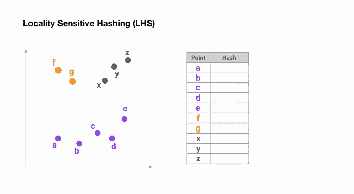**

**图 5:用于最近邻居搜索的位置敏感散列的简化动画**

**一旦我们找到所需长度的哈希码，我们就根据它们的哈希码将这些点划分到桶中——在上面的例子中，*‘a’*和*‘b’*属于同一个桶，因为 *hash(a) == hash(b)* 。现在，用于查找每个点的最近邻居的搜索空间从整个数据集到其所属的桶中急剧减少。**

****🗒角度 LSH:** 普通 LSH 算法的一种变体，称为*角度 LSH，*将点投影到单位球上，该单位球已被分成预定义的区域，每个区域具有不同的代码。然后，点的一系列随机旋转定义了点所属的桶。让我们通过一个简化的 2D 例子来说明这一点，这个例子摘自《改革家》一文:**

**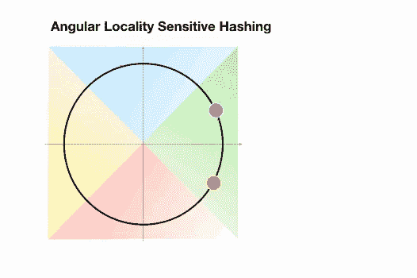**

**图 6:最近邻搜索的角度 LSH 的简化动画:两个点是分开的[基于论文中的例子创建的动画]**

**这里我们有两个点被投影到一个单位圆上，并以不同的角度随机旋转 3 次。我们可以观察到它们不太可能共享同一个哈希桶。然而，在下一个示例中，我们看到彼此非常接近的两个点将在 3 次随机旋转后共享相同的哈希桶:**

**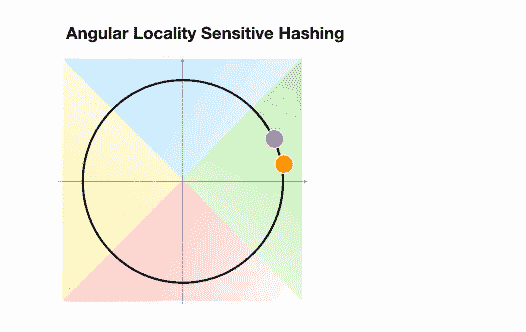**

**图 7:最近邻居搜索的角度 LSH 的简化动画:两个点接近[基于论文中的例子创建的动画]**

## **🚀LSH 注意了**

**现在 LSH 关注*背后的基本想法*如下。回过头来看上面的标准注意力公式，不是计算 *Q* 和 *K* 矩阵中所有向量的注意力，而是进行以下操作:**

*   **找到矩阵 *Q* 和 *K* 的 LSH 散列。**
*   **仅为相同哈希桶内的 *k* 和 *q* 向量计算标准注意力。**

****多轮 LSH 注意:**重复上述步骤几次，以增加相似物品不落入不同桶中的概率。**

**下面的动画根据论文中的图片展示了简化版的 LSH 注意力。**

**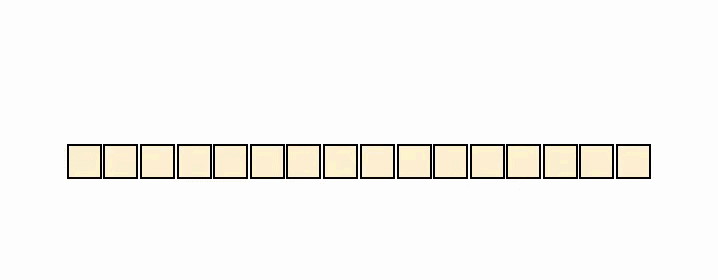**

**图 6:LSH 注意力机制的简化示意图[根据论文中的例子制作的动画]**

# **💥 2.可逆变压器和组块**

**现在我们准备解决变压器中的第二和第三个问题，即大量( *N* )编码器和解码器层以及前馈层的深度。**

## **🗒可逆残差网络**

**密切关注图 2 中的编码器和解码器块，我们意识到每个关注层和前馈层都被包装到一个*残差块*(类似于我们在图 6(左)中看到的)。*残差网络*(*ResNet*s)——在这篇[论文](https://arxiv.org/pdf/1512.03385.pdf)中介绍——是 NN 架构中使用的强大组件，用于帮助解决深度网络(具有许多层)中的[消失梯度问题](https://en.wikipedia.org/wiki/Vanishing_gradient_problem)。然而，ResNets 中的内存消耗是一个瓶颈，因为需要*将每层中的激活存储在内存*中，以便在反向传播期间计算梯度。存储成本与网络中单元的数量成正比。**

**为了解决这个问题，由一系列*可逆模块*组成的[可逆残差网络(RevNet](https://papers.nips.cc/paper/6816-the-reversible-residual-network-backpropagation-without-storing-activations.pdf) )。在 Revnet 中，每一层的激活都可以从后续层的激活中精确重建，这使我们能够执行反向传播，而无需将激活存储在内存中。图 6。说明了残差块和可逆残差块。请注意，我们如何从模块的输出( *Y₁，Y₂* )计算模块的输入( *X₁，X₂* )。**

**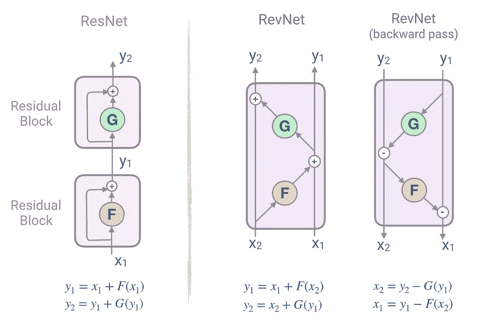**

**图 6:*残差网络*块(左)和可逆残差块(右)示意图**

## **🚀可逆变压器**

**回到我们的第二个问题，这个问题是处理 *N* 层变压器网络的内存需求——N 可能相当大。**

**Reformer 通过将 RevNet 块内的*注意*和*前馈*层结合起来，将 RevNet 思想应用于变压器。在图 6 中，现在 *F* 成为关注层， *G* 成为前馈层:**

***y₁=x₁+attention(x₂)
y₂= x₂+feedforward(y₁)***

**🎉现在使用可逆残差层代替标准残差使得在训练过程中只存储一次激活而不是 N 次*T42。***

## **🚀组块**

**重整器中效率改进的最后一部分处理第三个问题，即前馈层的高维中间向量，其可以达到 4K 或更高维。**

**由于前馈层中的计算独立于序列中的各个位置，因此前向和后向传递的计算以及反向计算都可以分成块。例如，对于向前传球，我们将有:**

**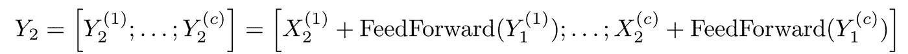**

**前向传递计算中的分块[图片取自 Reformer 论文]**

# **🚀实验结果**

**作者对两个任务进行了实验:图像生成任务 *imagenet64* (序列长度为 12K)和文本任务 *enwik8* (序列长度为 64K)，并评估了可逆变换和 LSH 哈希对内存、准确性和速度的影响。**

**🎉可逆变压器匹配基线:他们的实验结果表明，可逆变压器节省内存而不牺牲准确性:**

**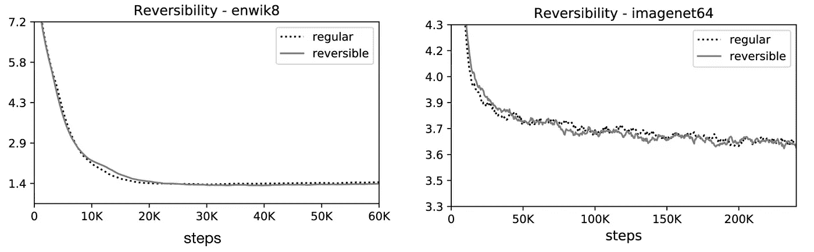**

**可逆性对 enwik8 和 imagenet64 训练表现的影响[图片和说明取自 Reformer 论文]。**

**🎉LSH 关注度与基线相符:📔注意，由于 LSH 注意力是完全注意力的近似，其准确性随着哈希值的增加而提高。当哈希值为 8 时，LSH 注意力几乎等同于完全注意力:**

**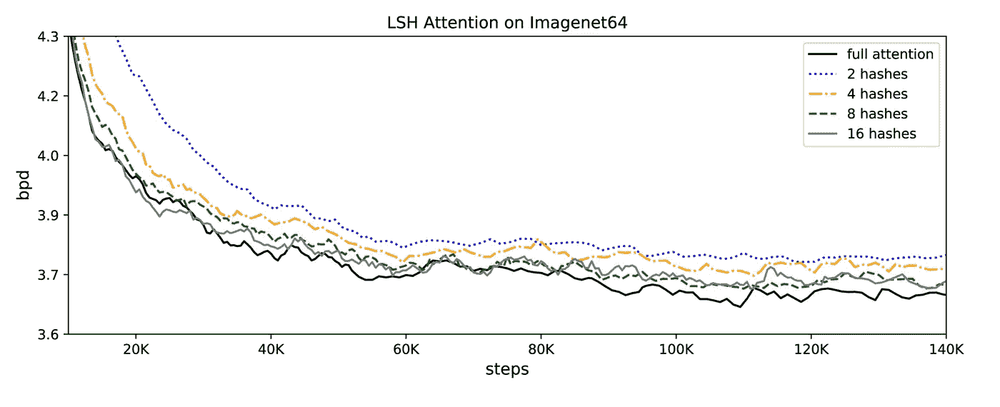**

**LSH 注意力在 imagenet64 上作为散列回合的函数的效果[图像和说明取自 Reformer 论文]。**

**🎉他们还证明，随着序列长度的增加，常规注意力会变慢，而 LSH 注意力速度保持稳定，它在 8GB GPUs 上以通常的速度运行于长度约为 100K 的序列上:**

****

**注意力评估的速度是完全注意力和 LSH 注意力输入长度的函数。**

> **与变压器模型相比，最终的重整器模型表现类似，但是在长序列上显示出更高的存储效率和更快的速度。**

# **💻Trax:代码和示例**

**🤖重整器的[代码](https://github.com/google/trax/tree/master/trax/models/reformer)已经作为新的 [***Trax***](https://github.com/google/trax/tree/master/trax/) 库的一部分发布。Trax 是一个模块化的深度学习训练和推理库，旨在让您从头开始理解深度学习。重整器代码包括几个例子，您可以在[图像生成](https://colab.research.google.com/github/google/trax/blob/master/trax/models/reformer/image_generation.ipynb)和[文本生成](https://colab.research.google.com/github/google/trax/blob/master/trax/models/reformer/text_generation.ipynb)任务中训练和推断。**

# **🙏承认**

**我要感谢祖卡斯·凯泽生动地介绍了改革者并提供了补充材料。我还要感谢 [Abraham Kang](https://medium.com/u/cbc32bf7cff7?source=post_page-----393575ac6ba0--------------------------------) 的深刻回顾和建设性反馈。**

# **📚参考资料和相关链接:**

** [## 改革家:高效的变压器

### 理解连续数据——如语言、音乐或视频——是一项具有挑战性的任务，尤其是当有…

ai.googleblog.com](https://ai.googleblog.com/2020/01/reformer-efficient-transformer.html)  [## Transformer:一种用于语言理解的新型神经网络结构

### 神经网络，特别是递归神经网络(RNNs)，现在处于领先方法的核心…

ai.googleblog.com](https://ai.googleblog.com/2017/08/transformer-novel-neural-network.html) 

*   改革家:高效的改革家
*   [Google/Trax 深度学习库](https://github.com/google/trax/tree/master/trax/)
*   [图示变压器](http://jalammar.github.io/illustrated-transformer/)
*   [拥抱脸/变形金刚 NLP 库](https://github.com/huggingface/transformers)
*   你所需要的只是注意力
*   [开放 AI 的 GPT2 语言模型](https://openai.com/blog/better-language-models/)
*   [用变压器写字](https://transformer.huggingface.co/)
*   [与变形金刚对话](https://talktotransformer.com/)
*   [谷歌的神经机器翻译系统](https://arxiv.org/pdf/1609.08144.pdf)**