# 我要去(数据)冒险了！—霍比特文本分析

> 原文：<https://towardsdatascience.com/im-going-on-a-data-adventure-hobbit-text-analysis-a0a5cb116ed1?source=collection_archive---------50----------------------->

## 解释自然语言处理技术的整本书的数据分析。

在这篇文章中，我分析了 J. R. R .托尔金的书《霍比特人》的全文。我主要关注的是提取关于书籍情感的信息，以及熟悉 NLP 的技术之一——文本分块。我们将回答谁是这本书的主角，情绪如何随着每一章而变化，以及-哪一对矮人在一起出现的次数最多！

[*《霍比特人:意外之旅》*](https://www.warnerbros.com/movies/hobbit-unexpected-journey/)

# 探索性分析

快速浏览一下数据总是应该的。它有助于了解我们在处理什么，验证数据质量，但也允许一些初步的见解。通过对句子进行分词，我得到它们的总数是 4915。它们分为 18 章。

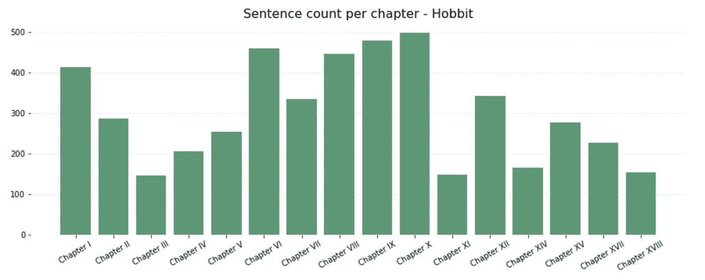

每章的句子数量变化很大。最短的一章有 150 个句子长，最长的一章有三倍多。我们可以看到，当章节从第三章到第十章变得更长时，“情节变得越来越复杂”。然后，随着两个急剧的变化，它们的长度逐渐变短。从句子长度来看，稳定性要高得多。最低平均句子长度和最高平均句子长度的最大差异在 30%左右(句子最短的章节平均在 45 左右，最长的在 60 字左右)。如果我们仔细观察，细微的差别显示了一个类似的章节长度模式——最长的句子在第八章到第十章。最短的——第三、第十一、第十四和最后一个。我对散文的句子长度做了一个小小的研究，建议(例如这里的)平均长度应该在 15-20 个单词之间。如果我们把这作为一个参考，托尔金的写作风格是明显不同的。

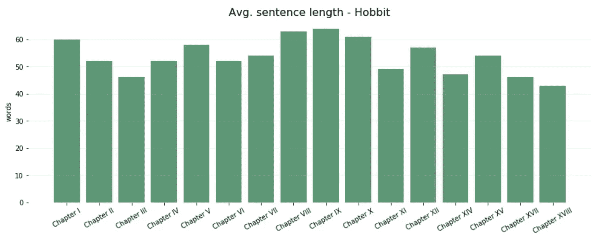

# 情感分析

我开始为文本中的每一个句子获得一个情感分数。为了这个目的，我使用了一种叫做 VADER 的方法，它可以在 nltk . perspective 包中找到。通过调用*sentimentintensitiyanalysizer*上的 *polarity_scores* ，我们得到 4 个分数:复合、正、负和新。复合分数是一个一维的标准化句子分数，基于[词典](https://github.com/cjhutto/vaderSentiment/blob/master/vaderSentiment/vader_lexicon.txt)中单词的等级。它的取值范围是-1 到 1。根据标准，一个句子被认为是中性的，复合得分在-0.05 到 0.05 之间——高于 0.05 的都是积极的，低于 0.05 的都是消极的。Pos、neg 和 neu 是可以被分配到每个类别中的文本的比例，并且总和为 1。

出于这个分析的目的，我将使用复合分数，但在分析之前，让我们看看它在 Hobbit 文本上是如何工作的(这四个数字分别是:复合分数、正分数、负分数和新分数):

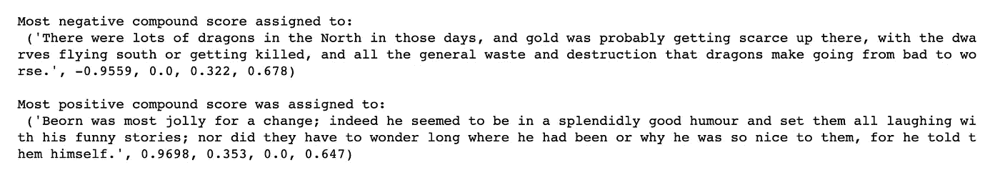

《霍比特人》中最多的肯定句和否定句

我觉得下面的配乐很搞笑:

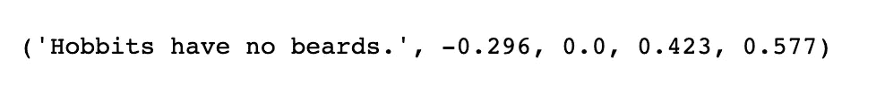

句子及其复合词、词性、否定词和 neu 分值。

我完全支持，每个人都应该有选择。但另一方面，它显示了这种方法的缺陷。似乎因为这个句子太短，所以它受到了“不”的严重影响，而句子本身是一个完全中立的陈述。知道这些句子平均至少有 40 个单词长，我有足够的信心在分析中使用这种方法。

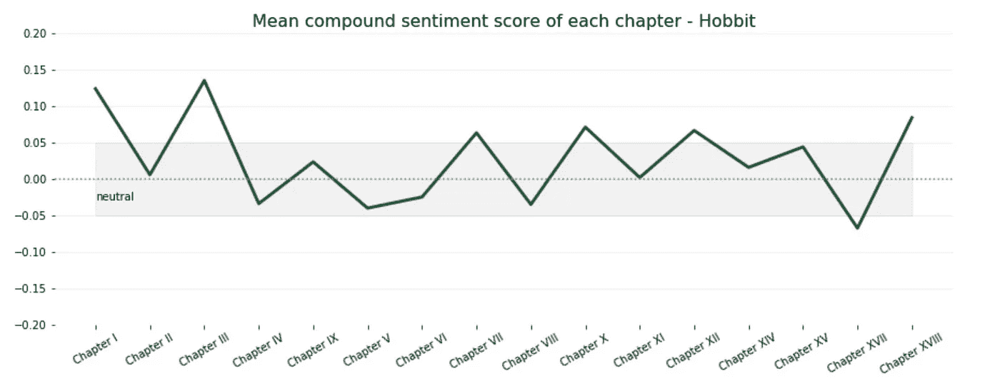

看上面的情节，我们可以看到小说以积极的情绪开始，可能是对开始旅程的兴奋。然后，它大部分保持在中性范围内，只达到一次负分，然后再次以正数结束。

让我们更详细地看看每一章和句子的百分比。一般来说，肯定句占所有句子的 25%到 40%，否定句占 30%左右。虽然每一个情绪组按章节划分的比例没有强烈的波动，但我在肯定句的百分比中发现了一个有趣的模式。除了一个例外，每一次增加都伴随着肯定句百分比的下降，反之亦然。会不会是整本书不断变化的氛围在戏弄读者？这是一个很长的镜头，但情节讲述了一个很好的故事。

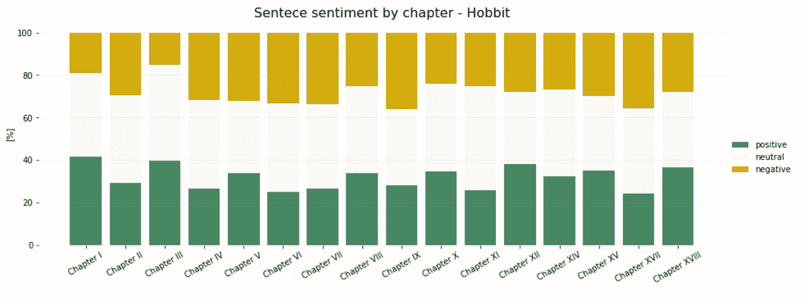

# 文本分块

根据定义，组块需要多音序列来分割和标记它们。这个想法变得简单时，显示了一个例子。

# 1.命名实体

在第一次尝试中，我们将以自动方式从文本中提取命名实体——我知道书中的人物，并且可以列出他们，但是很容易错过一些重要的东西。这个任务变得更加简单，因为在库中提供了一个 *nltk.ne_chunk()* 函数来实现这个目的。

对于输入，我们需要准备一个句子，其中每个单词都转化为一个单词及其词性标签的元组，例如:

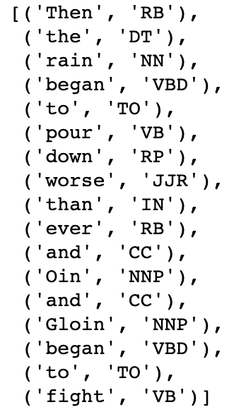

多音标记句

当把句子的每个单词输入到 *nltk.ne_chunk()* 时，我们得到一个 nltk。树对象，它以清晰的图形方式显示了哪个部分匹配块标准。在这个例子中，这意味着成为一个 NNP——单数专有名词，由“Oin”和“Gloin”满足。

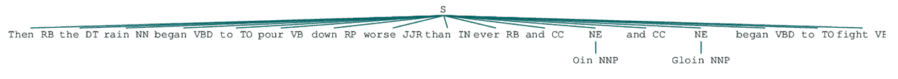

nltk。树对象

我发现 *nltk.ne_chunk* 能够很好地处理我的数据。尽管还需要做更多的工作。许多常用词被认为是命名实体，因为它们是用大写字母书写的，例如“Hill”。我限制列表的想法是删除英语单词语料库中包含的所有以小写字母书写的单词词条。

为此我使用了*nltk . corpus . words . words()*。这仍然有点棘手，需要一些领域知识(当然是阅读这本书)，例如，这种方法会将比尔博从命名实体中排除。

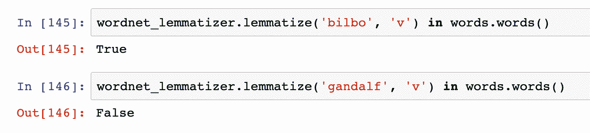

当时只有几个词，我决定手动删除，例如:“Tralalalally”和“Blimey”。整本书中前 15 个命名实体的结果列表(基于它们的出现次数)如下所示。

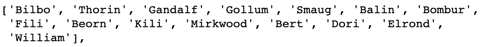

《霍比特人》中的 15 大命名实体

我们可以更进一步，按章节分析出现次数最多的主要人物。三个主要角色——比尔博、索林和甘道夫，毫无疑问，贯穿了整个故事。虽然在第一章中甘道夫的出现肯定更多。咕鲁是一个独一无二的角色。另一方面，史矛革在书的结尾得到了最多的关注，我们仍然可以看到他已经在第一章被宣布了。

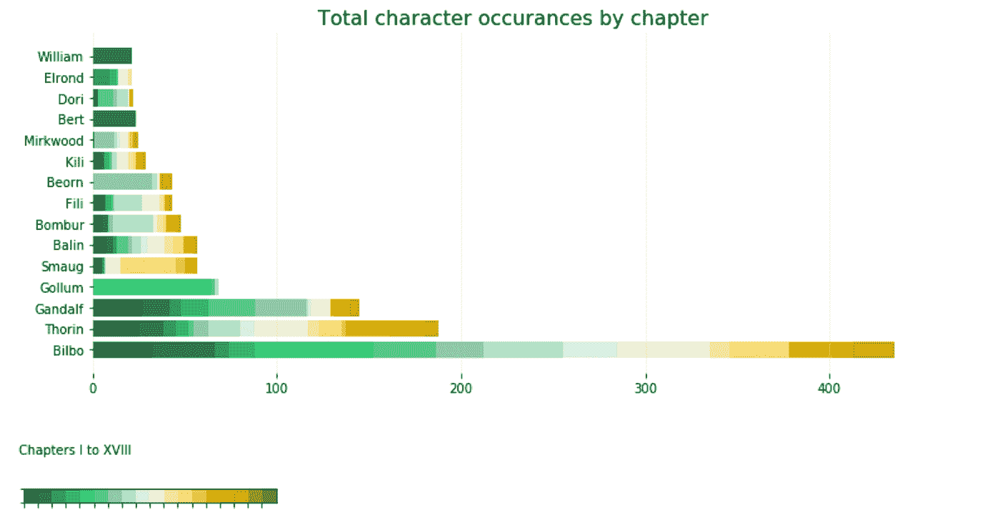

我们还可以将提取的命名实体与前面分析部分的句子情感得分进行匹配，并查看某些字符是否在肯定句中出现的次数多于否定句。

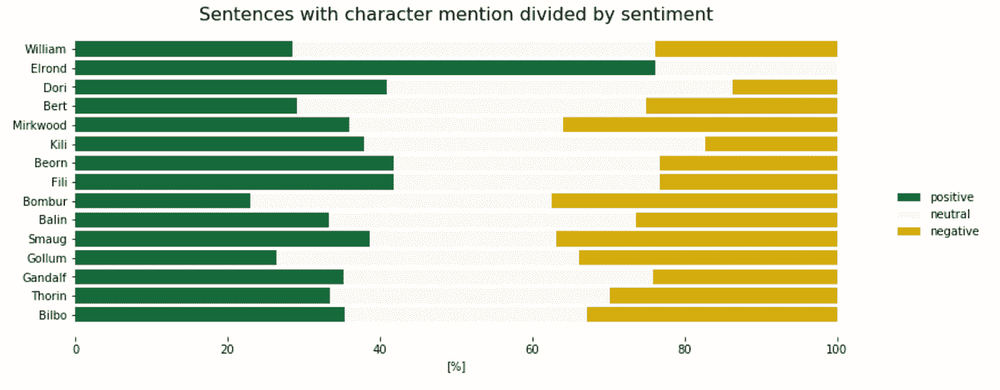

除了埃尔隆德，情绪的分布在人物之间没有很大的不同。从前面的情节中，我们知道埃尔隆德在书中出现的次数相对较少，所以他的结果可能会有偏差。

事实证明，这并不一定意味着性格是好是坏。这也是有意义的，因为情感分数是根据角色自己说的话以及他被描述的时候来计算的。一个快乐的坏人可能不会在这样的情节中浮出水面。不过我们确实知道，没有一个霍比特人的角色仅仅被放在好/坏的环境中。

# 2.命名实体之间的关系

出于学习的目的，我想定义我自己的组块规则。在第一次尝试中，它是由已经存在的函数 *nltk.ne_chunks* 自动完成的，但是我们可以选择任何配置的任何词性标签集来从文本中提取。

下面的语法由 4 个 nnp 组成——单数专有名词。中间的两个是必需的，剩下的两个是可选的，用“？”表示。它们都由可选的 CC(并列连词)、TO、VBD(动词、过去式)或 IN(介词或从属连词)连接。

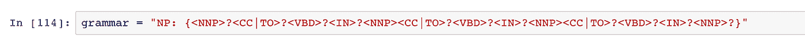

我的目标是让任何一组实体通过动词“talked to”以及简单的“and”连接起来。实际上，它导致从下面的句子中提取这样的 4 个组块:

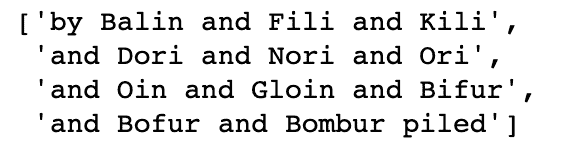

列表中提取的块

> 很快，德瓦林躺在巴林旁边，菲利和基利躺在一起，多丽、诺里和奥里躺在一起，欧因、格洛因、比弗、博弗和邦布尔不舒服地堆在火边。

“lay”在词性方面被认为是一个 NN，这就是为什么 Dwalin 不幸被这个逻辑遗漏的原因。我计算了这些命名实体块一起出现的数量。

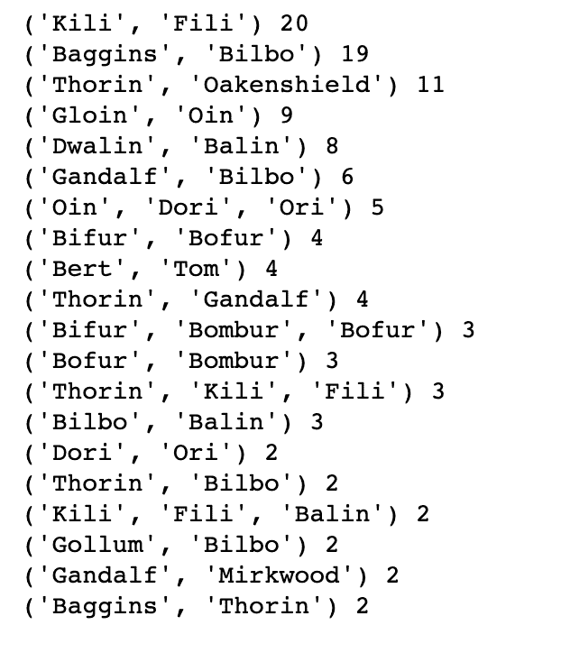

命名实体对及其出现次数

我们现在知道哪对矮人在一起出现的次数最多了——是基利和菲利，没有接近的亚军！我们也看到只有一组矮人和非矮人角色——比尔博和巴林。同样的角色也有成对的名和姓(例如比尔博·巴金斯)，这是因为在我上面的定义中，名词之间的任何单词都是可选的。

# 摘要

借助一些工具，我们可以对整本书有一个有趣的了解。虽然它们可能不太准确——我认为用数据分析来总结艺术是非常困难的——但这是学习新技术的一个好方法。

分析的代码可以在[这里](https://github.com/dorotamierzwa/ministryofdata/blob/master/Hobbit%20Or%20There%20And%20Back%20Again%20-%20Text%20analysis.ipynb)找到。

这篇文章主要发表在[数据部维基](https://ministryofdata.fandom.com/wiki/I%27m_going_on_a_%28data%29_adventure%21)上。