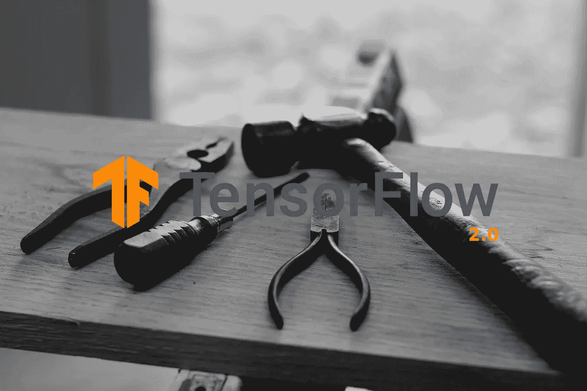
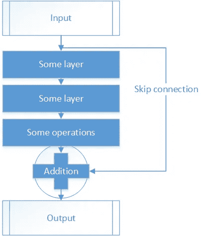
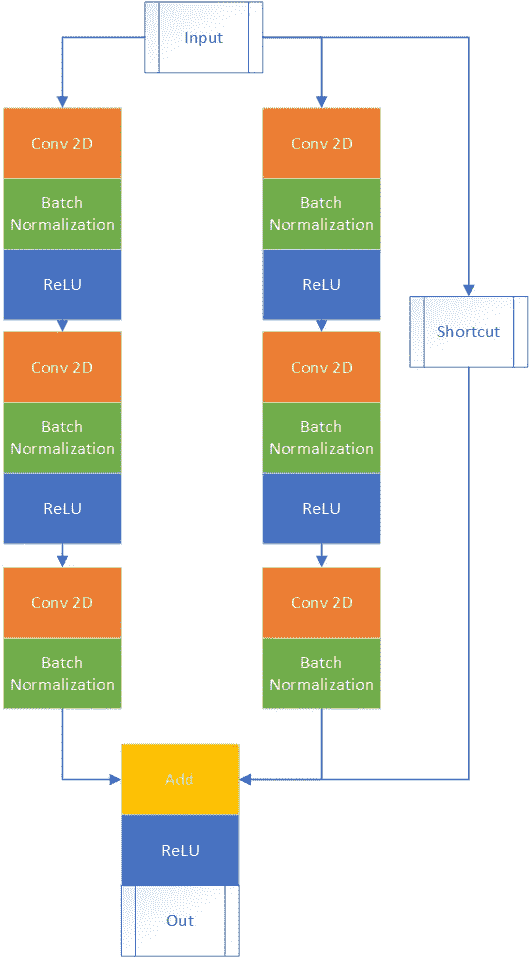
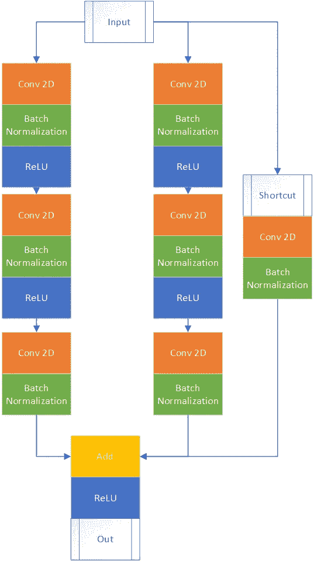
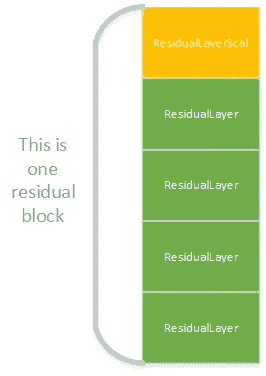
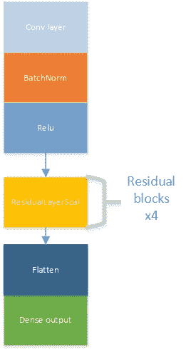

# 我没有图层了——如何定制 TensorFlow 2 图层。

> 原文：<https://towardsdatascience.com/im-out-of-the-layers-how-to-make-a-custom-tensorflow-2-layer-9921942c88fc?source=collection_archive---------17----------------------->

## 有时需要编写自己的神经网络层，接受非标准数据或以不寻常的方式处理它们。

TensorFlow 2 使机器学习框架更容易使用，但仍保留了构建模型的灵活性。它的一个新特性是通过集成的 Keras API 构建新的层，并使用 eager-execution 轻松调试这个 API。

在本文中，您将学习如何在 TensorFlow 2 框架中构建自定义神经网络层。撰写本文时，我假设您对 Python 3 中的面向对象编程有基本的了解。最好是在阅读本文之前先回顾一下`__init__`、`__call__`、类继承和方法重写。

## 用于构建图层的模板

让我们从一个模板开始，基于它你将建立你的大部分层。

新 TensorFlow 2 层的模板，根据需要使用它。

如你所见，结构很简单。该模板由两个方法组成，`__init__`和 call。第一个方法是一个类的标准 Python 3 构造函数，我们在其中初始化所有对象和字段。因此，在层的情况下，您在这里初始化将在训练中使用的所有变量。还要记住通过调用`super(YourClassName, self).__init__()`来调用图层类的`__init__`方法，否则图层类的构造函数不会被初始化。方法调用是基于给定的输入和变量定义所有向前和向后的地方。你唯一要做的就是定义正向传播步骤，**反向传播步骤由 TF2 自动执行。**

此外，还有两个强制参数—一个是`x_input`，另一个是`training`。输入可以是任何类型，如果需要，还可以添加更多的输入参数。然而，必须至少有一个输入，否则正向和反向传播步骤是不可能的。此外，还有训练增强，我将它设置为默认的`False`(测试期间默认没有`False`)。它用于某些层，在测试和训练阶段的行为是不同的。比如 dropout 就是这样一个层，用在这里是因为它只在训练阶段丢弃神经元。

如果你很好奇为什么用`call`而不是 pythonic 式的`__call__`，那么看看文章的最后。

## 自定义层的示例

让我们定义一个更复杂的层，这一次它将执行一个非常复杂的操作，那就是……**两个实数的乘法**。

允许两个标量数相乘的层

这一次，这些层由`call`方法中的两个输入和一个将两个数相乘的`tf.math.multiply`方法组成。要使用该层，您只需定义创建多层对象，并通过向其传递值来调用它，如下所示:

一个如何使用我们创建的多层的例子。

先自己试试，再往前跑。下一个更复杂，这次我不玩文字游戏了。但你会熬过去的，相信我。

# 用 TF2 建立残差层神经网络

让我们假设，你想要创建一个神经网络来预测几个类。为此，您将在流行的 CIFAR-10 数据集上训练网络，该数据集有 10 个不同的类。为了解决这个问题，你选择了残差神经网络(简称 ResNet)，但它要求你建立自己的层，因为它们不是在 TF2 实现的，或者你想玩不同的架构。ResNet 由剩余块构成，这些块具有跳跃连接，抵消了消失梯度问题。

## ResNet 块

这里有两种类型的块，一种保持输入形状(因此输出形状与输入形状相同)，另一种改变。ResNet 块具有如下所示的体系结构，其中最重要的是跳过连接(有时称为快捷连接)。跳过连接只不过是复制输入并将其添加到输出的末尾，这并不神秘，但它工作得很好。

ResNet 块的一般视图

## 将 ResNet 定义为 TF2 的自定义图层

让我们现在尝试建立一个剩余块。我不会根据一些架构来创建层，而是根据一些直觉。此外，我会尽量让事情简单，但它会占用更多的空间(不必要的重复)，我会预约如何做得更好。

有了构建 TF2 层的基础，让我们尝试一下构建 ResNet **的新技能，在 CIFAR10** 基准数据集中把自己放在靠前的位置。在这里，您可以找到一个带有相应文件的排行榜:

 [## CIFAR-10 排行榜|带代码的论文

### CIFAR-10 目前的最新水平是 BiT-L (ResNet)。查看 91 篇论文与代码的完整对比。

paperswithcode.com](https://paperswithcode.com/sota/image-classification-on-cifar-10) 

让我们首先画出我们的标识块，我们将使用它来构建我们的自定义层(即 ResNet 块)。
首先，我们将构建一个身份块，我称之为`ResidualLayer`在代码中，这一层由两条路径和三个卷积块以及一条快捷路径组成(见下图)。在训练过程中，宽度通常会提高准确性[1]。随意修改路径的数量，并检查它如何影响结果的准确性，训练时间和其他参数。值得注意的是，两条路径应该有不同的超参数集，以学习如何提取不同的特征集。

在我们的例子中使用的剩余块，代码如下。快捷方式块表示前面提到的跳过连接。

第二个残差块不保留输入形状，因此跳过连接必须重新缩放输入。这是用卷积层完成的。其余的几乎与前面显示的剩余块相同。该层将在代码中以与上一个类似的方式调用，但使用 Scal 后缀，所以`ResidualLayerScal`。

快捷路径上带有缩放层的剩余块。

## 残余块的代码

剩余块的代码在这里，用于`ResidualLayer`和`ResidualLayerScal`。代码有点长，所以你不能在中型网页上看到它的全部。你必须点击它，直接进入要点。

保留输入形状的剩余图层

不保留输入形状的剩余图层

注意评论和`training=False`。

## 使用剩余层

所有的代码看起来都很复杂，但是大部分代码都是某种模式的重复。大部分代码可以(**甚至是**)通过一个或两个 for 循环重复(一个用于控制深度，另一个用于控制宽度)。但是为了使代码更简单，我认为最好不要在这里使用它。

要创建这样一个层并使用它，您只需以与`MultiplyLayer`相同的方式创建该类的一个实例。

请随意修改这些参数以获得更好的结果。

## 将其分组为块

从“纸”入手，总比没有任何计划就匆忙投入工作要好。因此，让我们制作一个块的模式，块将由五个剩余层组成，如下图所示，并被进一步称为…猜怎么着，一个剩余块！

一个由 5 个定制剩余层组成的剩余块。

在这样的块中有两种类型的层，一层不保留输入形状— `ResidualLayerScal`，四层保留— `ResidualLayer`。定义好模块后，让我们构建一个模型并测试这些层。

## 建立模型

整个模型的模式不会更复杂，它是四个剩余块的重复，在开始时具有批量标准化、激活函数和卷积层，在结束时具有密集输出的另一个批量标准化。

整个模型的模式，看起来很简单，你不觉得吗？

该模型将通过创建一个继承自`tf.keras.Model`类的类来实现。姑且称模型类为`FunnyResNet`(听起来一点都不好笑)。代码来了:

这个模型实现了前面展示的模式，它是如何工作的你可以在我的另一个故事中了解到。

 [## 如何从头开始创建 TensorFlow 2 模型——一个“无用”的例子。

### 想象一下，您想要构建一个可以在项目中使用的模型。你选择做张量流 2…

towardsdatascience.com](/creating-a-trashy-model-from-scratch-with-tensorflow-2-an-example-with-an-anomaly-detection-27f0d1d7bd00) 

## 培训和评估

定义好你的模型后，你需要做的一件事就是用`model.compile()`定义它，用`model.fit()`训练模型。这里展示的**整体 Resnet 模型**你可以在我的知识库中找到，还有图像标准化、规范化和增强。

在编译之前将两幅图像传递给模型的目的是初始化权重形状。这是在 TF2 自动完成的，基于第一次出现的输入。

在这里，您可以找到一个 Jupyter 笔记本，上面有所有代码:

 [## 丹尼尔维奇/搞笑网

### TowardDataScience-DanielWicz/funny resnet 上的教程示例

github.com](https://github.com/DanielWicz/FunnyResNet) 

或者直接在谷歌的 colab:

 [## DanielWicz/FunnyResNet 谷歌联合实验室

TowardDataScience 教程的 resnet 示例](https://colab.research.google.com/github/DanielWicz/FunnyResNet/blob/master/SimpleResNet.ipynb) 

## 摘要

在 TF2 创建图层并不是一件难事，您需要记住以下几点:

*   它将复杂的结构简化成一个可用的“块”，可以很容易地重复多次。
*   该层必须从`tf.keras.Layer`继承才能工作。
*   您必须定义两种方法，`__init__`和`call`。
*   在 `__init__`方法中，你定义了所有将在调用方法中进一步使用的变量，如对象(如层)、常量。
*   在`call`中，您定义了应用于数据的所有操作，如分层、乘法、加法、蒙版、转置等。
*   记得在`call`中传递`training`参数，否则，dropout 和 batch normalization 不起作用。

## 此外，记得使用专用的张量流函数

总是在层中使用 TF 函数，否则你将不能用`model.fit()`来编译它们或者用`@tf.function`语句来使用它们(这意味着低得多的性能)。在 TF2，你需要的几乎每一个 pythonic 函数都有替代品。例如，在一个层中执行一个 For 循环，你将使用`for i in tf.range(N)`或者使用你使用的数组`tf.TensorArray`。

## 说明

*   定义了`call`方法而不是`__call__`，因为`__call__` 在调用`call`之前会调用一些额外的东西。这些东西包括初始化权重的方法，以及确保该层正常工作的所有其他东西。这是一个与`Model`相似的案例，你可以在我的故事中读到。

## 附加阅读

*   谷歌自定义图层指南:[此处](https://www.tensorflow.org/guide/keras/custom_layers_and_models)
*   TF2 图层类文档:[此处](https://www.tensorflow.org/api_docs/python/tf/keras/layers/Layer)

# 参考资料:

[1]s . Zagoruyko 和 n . Komodakis(2016 年)。广泛的剩余网络。 *arXiv 预印本 arXiv:1605.07146* 。