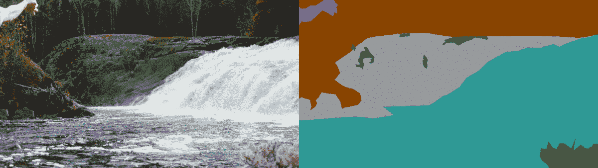
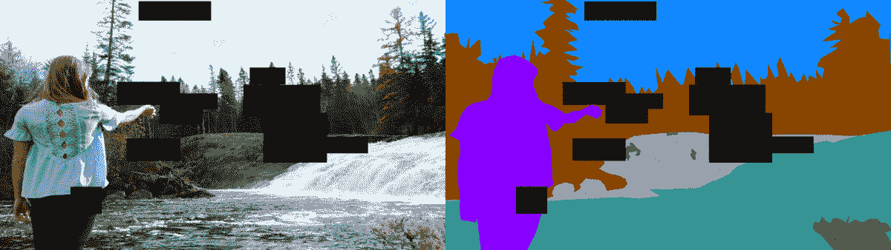
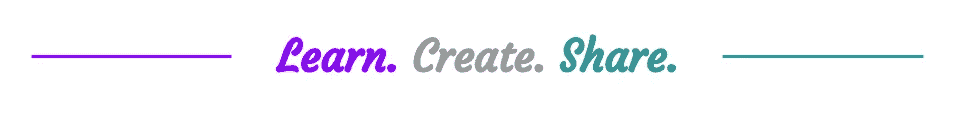

# 图像增强掌握:15+技术和 Python 代码的有用功能

> 原文：<https://towardsdatascience.com/image-augmentation-mastering-15-techniques-and-useful-functions-with-python-codes-44c3f8c1ea1f?source=collection_archive---------32----------------------->

## 平滑的 python 代码可自行扩充您的影像数据集。

无论我们是在享受 **Keras** 还是 **Pytorch** 我们都可以使用美妙的**图书馆**来有效地**提升**我们的形象。但是那些**特例**呢，其中:

*   我们的数据集**不具有平凡的结构**(例如，3 个输入图像和 1-2 个分段输出)。
*   在我们所做的事情上，我们想要完全的自由和透明。
*   我们希望增加这些库没有提供的功能。

对于所有这些情况和许多其他情况，我们必须能够**掌握我们的图像增强**。此外，我每次都使用自己的函数，而且我不是唯一一个这样做的人(我想)。因此，在这篇文章中，我将**向您介绍并**我的功能来执行图像增强。

举个例子，我会用一个朋友的照片来提醒我在加拿大度过的美好时光。我希望你喜欢这张照片，因为这是你在这篇文章中看到的唯一一张照片...🍁👼🍁

我将**分段**它，以便有一个**实际案例**使用我们的图像和目标函数。这会让你对将要向你描述的方法的灵活性有一个概念:

*   翻转
*   农作物
*   内核过滤和锐化
*   虚化
*   旋转、平移、剪切、缩放
*   断流器
*   色彩空间
*   聪明
*   对比
*   均匀和高斯噪声注入
*   渐晕
*   透镜畸变

⚠️:这篇文章的目的是**不是证明**增强技术是如何设计的，**而是如何理解**使用它们。⚠️

# 一些有用的功能

在我开始之前，我想解释一下**的常见结构** **每个方法都会有**。它实际上将是一个**对象来初始化**。这个对象将用我们的样本作为参数被**调用，并将**返回我们的扩充样本**。就这些吗？是的，就这些！那么，在我们的增强功能之前，让我们先从一些**有用的**功能开始。**

## 调整大小

第一个有用的函数允许我们用`(width, height)`形状来**调整**图像的大小。这个**类**允许我们看到所有其他的类将如何被初始化。我们用上游参数化的实例化一个**大小的对象。在我们的例子中，所有的样本(图像和目标)都将以这个**相同的尺寸**返回。有了这种类型的功能，我们可以**轻松地**同时**以我们想要的方式**处理我们的图像和目标。**

## 夹子

剪辑功能是一个非常有用的功能，尤其是当你需要从一个**色彩空间**切换到另一个色彩空间或者**在 0 和 1 或者 0 和 255 之间重置**图像时。

默认情况下，如果只指定了一个阈值，最小**阈值**为 0。

## 使正常化或标准化

在传递模型中的输入之前，我们通常希望**标准化**或**标准化**我们的数据。当然，这些操作可以在特定的**轴**上完成。

默认情况下，对整个图像执行规范化和标准化。

## 托特索尔

最后，如果你使用的是 Pytorch，你需要将你的图片转换成 T1。唯一需要注意的一点是，使用 Pytorch，我们的图像是先**通道后**通道，而不是最后一个通道。最后，我们还可以留下选择张量的**输出类型**的可能性。

# 怎么用？

也许在这一点上，你没有看到**的设置有多简单**。然而它是。我们所要做的就是**定义一个我们想要在样本上做的转换列表**，就这样。之后我们不碰任何其他东西。注意转换的**顺序**有其重要性。由你决定。

我们现在可以**深入文章**的目的，看看图像增强技术。

# 翻转

第一种，也是**中最简单的一种**，由**随机**在图像的**水平**和**垂直**轴上执行**翻转**组成。换句话说，有 50/50 的机会进行垂直翻转，有 50/50 的机会进行水平翻转。

# 农作物

为了进行图像增强，通常的做法是**随机裁剪**图像。换句话说，我们裁剪一部分**随机** **大小**的图像，并覆盖一个**随机** **区域**。

裁剪图像的尺寸可以从尺寸`(height, width)`的 **比率**中选择**。如果没有指定裁剪的比例最大尺寸，那么我们将默认认为它是图像的尺寸。**

# 内核过滤器

## 一般情况

我们将开始一些更有趣的事情。滤镜是伟大的经典作品，但我认为能够轻松创建我们自己的卷积滤镜是很重要的。如果您不知道滤波器的工作原理，请参考我关于 Conv2d 的文章。

 [## Conv2d:终于明白了向前传球会发生什么

### 2D 卷积层及其参数的视觉和数学解释

towardsdatascience.com](/conv2d-to-finally-understand-what-happens-in-the-forward-pass-1bbaafb0b148) 

所以我想做一个通用的函数来使用我们自己的过滤器。

## 尖锐

就过滤器而言，通过**选择上游的过滤器**并应用**随机加权**，可以走得更远。例如，我向你介绍用于**锐化**我们图像的滤镜。

`value of center`从 0 到 65。

# 虚化

为了完成过滤器，最流行的是用来随机模糊我们的图像。有很多方法可以模糊我们的形象。最著名的是[平均、中值、高斯或双边滤波器](https://docs.opencv.org/master/d4/d13/tutorial_py_filtering.html)。

## 平均模糊度

内核大小从 1 到 35

关于**平均滤波器**。顾名思义:它允许我们对给定中心的值进行平均。这是由一个**内核**做出的。它的大小可以指定或多或少的模糊。为了用平均过滤器增加我们的图像，我们只需要用随机大小的内核来过滤我们的输入图像。

## 高斯模糊

内核大小从 1 到 35

最后，以同样的方式平均模糊。**高斯模糊**不使用平均滤波器，而是使用滤波器，因此值对应于中心的高斯曲线。注意，内核维度必须只包含奇数**。**

# **视角转换**

**到目前为止**应用最广泛的**图像增强技术是**透视**变换。有**旋转**、**平移**、**剪切、**和**缩放**。这些转换可以在一个 **3D** 维度中执行。通常，他们只在 2D 使用，这是一个遗憾。让我们利用我们所拥有的一切，对吗？**

## **旋转**

****

## **翻译**

****

## **剪羊毛**

****

## **缩放比例**

****

## **结合一切**

**我不会在 2D 图像的 3D 变换上花更多的时间，因为我写了一整篇文章。所以我选择了本文末尾的函数。如果你想了解更多关于**齐次坐标**和**三维变换矩阵**的信息，我邀请你去看一下。**

** [## 如何将 2D 图像转换成三维空间？

### 用 python 执行变换矩阵。数学和视觉解释视频游戏和深…

towardsdatascience.com](/how-to-transform-a-2d-image-into-a-3d-space-5fc2306e3d36) 

应该注意的是，这个函数允许我们根据 4 个建议的矩阵随机执行转换。**秩序有它的重要性。这里有剪切，然后是旋转，然后是缩放，最后是平移。注意，平移是通过图像尺寸的比例**来完成的。****

结合随机旋转平移剪切和缩放

# 断流器

剪切块替换为 0，在整个输入上同时裁剪目标

**断流**漂亮**直观**。它包括**随机移除输入图像的区域**。它在**中的工作方式与我们之前谈到的裁剪**相同。但是我们没有返回相关的区域，而是删除了它们。因此，我们可以再次允许用户提供要删除的区域的每比例的最小和最大尺寸**，区域的最大数量**，以便同时或不同时从**目标**中剪切区域，我们可以对每个通道**执行此**剪切，并且还可以选择已删除区域的默认**替换值**。****

****

**剪切替换为 1，输入通道尺寸，不裁剪目标**

# **色彩空间**

****

**现在我们到了我觉得最有趣的部分。很**很少考虑的一部分**。如果我们知道**色彩空间**，我们可以利用它们的特性来增强我们的图像。给你一个简单的例子，有了 **HSV** 颜色空间，我们可以尽情地**提取叶子，感谢**它的颜色和**根据我们的愿望随机改变它的颜色**。这是一件非常酷的事情！我们理解拥有自己的图像增强功能的好处。当然，这需要多一点**创造力**。因此了解我们的色彩空间以充分利用它们是很重要的。特别是因为它们在我们的(深度)机器学习模型的预处理中可能是至关重要的。**

** [## 了解并可视化色彩空间，以改进您的机器学习和深度学习模型

### 解释、分析和实验 14 种流行的颜色空间以及它们对我们模型的准确性的影响。

towardsdatascience.com](/understand-and-visualize-color-spaces-to-improve-your-machine-learning-and-deep-learning-models-4ece80108526) 

# 聪明

亮度从-100 到 100

让我们再坚持一会儿。图像增强的一个伟大经典就是能够玩**亮度**。有几种方法可以做到这一点最简单的是简单地**添加一个随机偏差**。

# 对比

对比度从-100 到 100

同理，玩**对比**也很简单。这也可以随机进行。

# 噪声注入

最后一种相当常见的图像增强技术是**噪声注入**。实际上，我们只添加了一个与输入大小相同的矩阵。该矩阵由随机分布的**个元素组成。可以从任何随机分布中进行噪声注入。实际上，我们只看到其中的两个。**但是可以随意走得更远**😃**

## 制服

## 高斯的

# 渐晕

最后，用得少但不是没用。有些相机有**渐晕效果**。想想我们如何通过随机**模仿**这种现象来增加我们的形象也是很有趣的。我们也将尝试给予用户灵活性。我们将能够决定**从效果可以随机开始的最小距离**，决定它的**强度**，甚至决定它是一个**走向黑色还是走向白色的效果**。

# 透镜畸变

最后**最好的最后**。我很惊讶它没有被更多地使用。但是它可以模仿相机镜头的扭曲。就像透过圆玻璃看一样。我们看到的是扭曲的，因为镜片(玻璃)是圆的。所以，如果我们的图像是从一个有镜头的相机中拍摄的，为什么我们不模拟它们呢？**这应该是默认用于图像** s 的，至少我是这么认为的。

因此，我建议在最后一个函数中，通过利用**径向**系数`k1, k2, k3`和**切向**系数`p1, p2`来随机模拟我们的镜头失真。在该方法中，系数的**顺序**如下:`k1, k2, p1, p2, k3`。我邀请你看一看关于这个主题的 OpenCV 文档。

 [## 使用 OpenCV 进行摄像机校准——OpenCV 2.4.13.7 文档

### 照相机已经存在很长时间了。然而，随着 20 世纪 90 年代后期廉价针孔摄像机的出现…

docs.opencv.org](https://docs.opencv.org/2.4/doc/tutorials/calib3d/camera_calibration/camera_calibration.html) 

> 知识就是分享。
> **支持**我，获取**访问 [**中我所有文章的**点击此处](https://axel-thevenot.medium.com/membership)** 。

# 来源和参考

一切都是**自制**和**免费使用**(包括图片和 gif)

**特别感谢 Elise** 授权使用此图片👋****