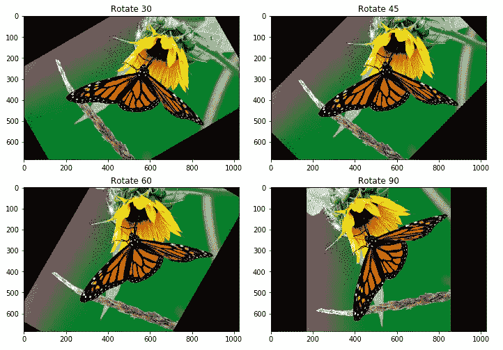
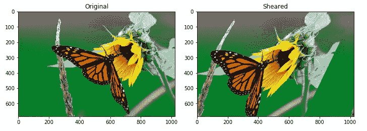
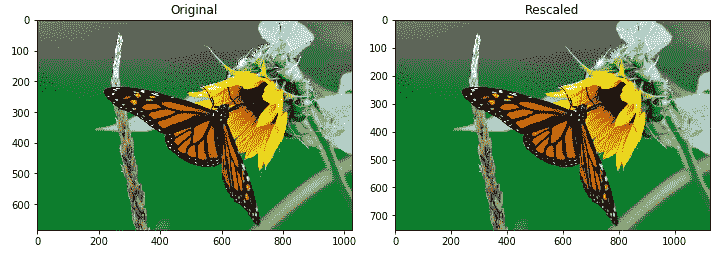
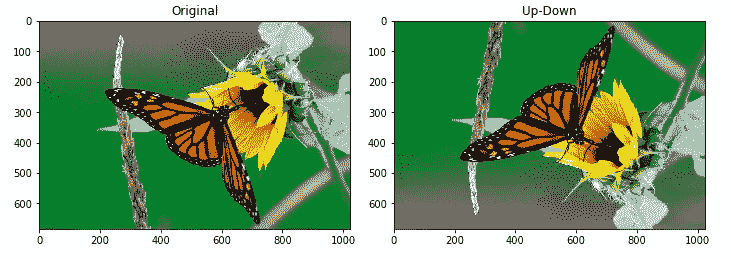
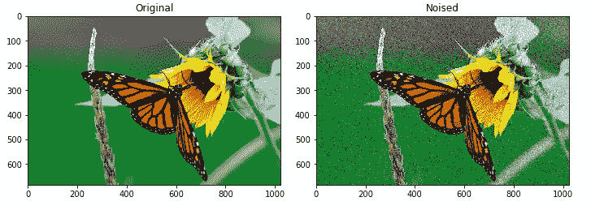
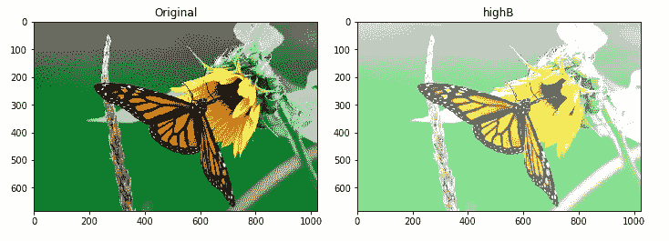
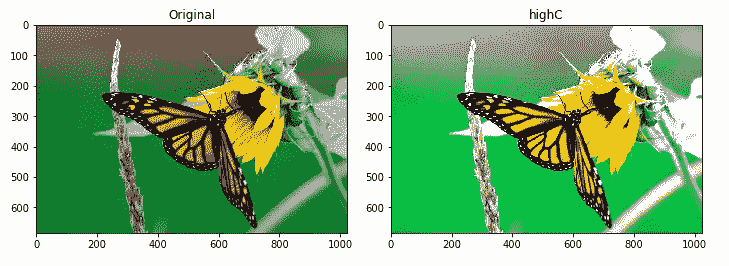

# 使用 skimage 增强图像— Python

> 原文：<https://towardsdatascience.com/image-augmentation-with-skimage-python-7f53f1b0eeb5?source=collection_archive---------22----------------------->


个人电脑:Flickr

嘿伙计们，最近我在解决一个图像分类问题。但不幸的是，其中一个班级没有足够的样本。我在网上搜索，了解到一种叫做图像增强的技术。在这里，我分享了我对这种技术的理解，并分享了一些使用 skimage 的代码。你可以在底部找到 jupyter 笔记本。

## 什么是图像增强？

影像增强是一种用于人为增加影像数据集大小的技术。这可以通过对图像进行随机变换来实现。

我们知道，当深度学习模型能够看到更多数据时，它们能够很好地进行归纳。数据扩充可以创建现有图像的变体，这有助于更好地进行归纳。

但是你也需要小心。**我们可以使用增强图像进行训练，但不能用于测试**。因此，在应用任何增强之前，请将您的数据分成训练集和测试集。使用图像增强功能扩展您的训练数据。

图像增强主要应用于图像的两个领域

1.  **位置增强**
2.  **增色**

## 什么是位置增强？

位置增强很简单，我们在像素位置上应用不同的变换。

缩放、旋转、裁剪、翻转、填充、缩放、平移、剪切和其他仿射变换是位置增强的示例。让我们尝试应用其中的一些转换。

```
import numpy as np
from skimage.io import imread, imsave
import matplotlib.pyplot as plt
from skimage import transform
from skimage.transform import rotate, AffineTransform
from skimage.util import random_noise
from skimage.filters import gaussian
from scipy import ndimage# load Image
img = imread('./butterfly.jpg') / 255# plot original Image
plt.imshow(img)
plt.show()
```


原始图像 PC: Flickr

```
# image rotation using skimage.transformation.rotate
rotate30 = rotate(img, angle=30)
rotate45 = rotate(img, angle=45)
rotate60 = rotate(img, angle=60)
rotate90 = rotate(img, angle=90)fig = plt.figure(tight_layout='auto', figsize=(10, 7))fig.add_subplot(221)
plt.title('Rotate 30')
plt.imshow(rotate30)fig.add_subplot(222)
plt.title('Rotate 45')
plt.imshow(rotate45)fig.add_subplot(223)
plt.title('Rotate 60')
plt.imshow(rotate60)fig.add_subplot(224)
plt.title('Rotate 90')
plt.imshow(rotate90)plt.show()
```



```
# image shearing using sklearn.transform.AffineTransform
# try out with differnt values of shear 
tf = AffineTransform(shear=-0.5)
sheared = transform.warp(img, tf, order=1, preserve_range=True, mode='wrap')sheared_fig = plot_side_by_side(img, sheared, 'Original', 'Sheared')
```



```
# Image rescaling with sklearn.transform.rescale
rescaled = transform.rescale(img, 1.1)rescaled_fig = plot_side_by_side(img, rescaled, 'Original', 'Rescaled')
plt.show()print('Original Shape: ',img.shape)
print('Rescaled Shape: ',rescaled.shape)Output: 
Original Shape:  (684, 1024, 3)
Rescaled Shape:  (752, 1126, 3)
```



```
# flip up-down using np.flipud
up_down = np.flipud(img)fig_updown = plot_side_by_side(img, up_down, 'Original', 'Up-Down')
plt.show()
```



```
# flip up-down using np.flipud
left_right = np.fliplr(img)fig_lr = plot_side_by_side(img, left_right, 'Original', 'Up-Right')
plt.show()
```


**什么是增色？**

色彩增强是一种我们利用像素强度值的技术。

我们通过**调整亮度、对比度、饱和度来再现不同的图像，我们还可以给图像添加随机噪声。**

```
# Apply Random Noise to image using skimage.utils.random_noise
noised = random_noise(img, var=0.1**2)fig_noised = plot_side_by_side(img, noised, 'Original', 'Noised')
plt.show()
```



```
# Increasing the brighness of the Image
# Note: Here we add 100/255 since we scaled Intensity values of Image when loading (by dividing it 255)
highB = img + (100/255)fig_highB = plot_side_by_side(img, highB, 'Original', 'highB')
plt.show()
```



```
# Increasing the contrast of the Image
# Note: Here we add 100/255 since we scaled Intensity values of Image when loading (by dividing it 255)
highC = img * 1.5fig_highB = plot_side_by_side(img, highC, 'Original', 'highC')
plt.show()
```



你有没有注意到一件事，我们已经从一个图像创建了 11 个不同的图像。请注意，我们仍然可以使用参数并创建更多的参数。

当训练神经网络时，我们可以向图像加载器添加随机变换。还有其他高级技术，比如使用 GAN 进行数据扩充，我们可以在另一篇文章中看到。我希望你现在明白什么是图像增强。

你可以在[https://github . com/mathan Raj-Sharma/sample-for-medium-article/blob/master/image-augmentation-skimage/image-augmentation . ipynb](https://github.com/Mathanraj-Sharma/sample-for-medium-article/blob/master/image-augmentation-skimage/image-augmentation.ipynb)找到笔记本