# 使用深度学习的医疗报告生成

> 原文：<https://towardsdatascience.com/image-captioning-using-deep-learning-fe0d929cf337?source=collection_archive---------16----------------------->

## 利用编解码模型和注意机制生成胸部 x 光医学报告。


由[拉蒙·萨利内罗](https://unsplash.com/@donramxn?utm_source=unsplash&utm_medium=referral&utm_content=creditCopyText)在 [Unsplash](https://unsplash.com/s/photos/technology?utm_source=unsplash&utm_medium=referral&utm_content=creditCopyText) 上拍摄

# 内容:

1.  **介绍**——*理解问题*
2.  **先决条件**
3.  **数据**
4.  **获取结构化数据**
5.  **准备文本数据—** *自然语言处理*
6.  **获取图像特征** — *迁移学习*
7.  **输入管道** — *数据生成器*
8.  **编解码模型** — *训练、贪婪搜索、波束搜索、BLEU*
9.  **注意机制**——*训练、贪婪搜索、光束搜索、BLEU*
10.  **总结**
11.  **未来工作**
12.  **参考文献**

# 1.介绍

图像字幕是一个具有挑战性的人工智能问题，它是指根据图像内容从图像中生成文本描述的过程。例如，请看下图:


由 [Anthony Tran](https://unsplash.com/@anthonytran?utm_source=unsplash&utm_medium=referral&utm_content=creditCopyText) 在 [Unsplash](https://unsplash.com/s/photos/woman-with-guitar?utm_source=unsplash&utm_medium=referral&utm_content=creditCopyText) 上拍摄的照片|你会如何描述这张照片？

一个常见的答案是“*一个弹吉他的女人*”。我们人类可以看着一幅画，用适当的语言描述里面的任何东西。这很简单。让我给你看另一个:

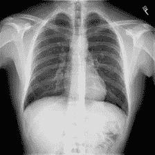

嗯，你怎么描述这个？

对于我们这些“非放射科医生”来说，一个常见的答案是“胸透”。嗯，我们没有错，但是放射学家可能会有一些不同的解释。他们撰写文字报告，叙述成像研究中检查的身体各部位的发现，特别是各部位是否发现正常、异常或潜在异常。他们可以从一幅这样的图像中获得如此有价值的信息并做出医疗报告。

对于缺乏经验的放射科医生和病理学家，尤其是那些在医疗质量相对较低的农村地区工作的放射科医生和病理学家来说，撰写医学成像报告是一项艰巨的任务，或者另一方面，对于有经验的放射科医生和病理学家来说，撰写成像报告可能是乏味且耗时的。

因此，为了解决所有这些问题，如果一台计算机能够像放射科医生那样将如上图所示的胸部 x 光片作为输入，并将结果以文本形式输出，岂不是很棒？

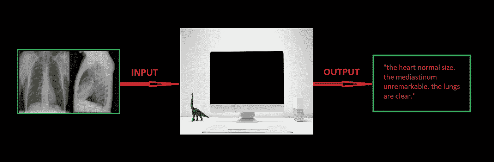

图片作者|我们现在是在要求机器做医生吗？！！

但是，你真的能写出这样的计算机程序吗？如果答案是否定的，你就不会读到这个故事。

# 2.先决条件

这项工作假设一些深度学习熟悉的主题，如神经网络，CNN，RNNs，迁移学习，Python 编程和 Keras 库。下面提到的两个模型将用于解决我们的问题，稍后将在本博客中简要说明:

1.  编码器-解码器模型
2.  注意机制

对它们有足够的了解将有助于你更好地理解模型。

# 3.数据

您可以从以下链接获得解决此问题所需的数据:

*   [***图像***](http://academictorrents.com/details/5a3a439df24931f410fac269b87b050203d9467d) ***-*** 包含所有胸部 x 光片。
*   [***报表***](http://academictorrents.com/details/66450ba52ba3f83fbf82ef9c91f2bde0e845aba9)***-*-**包含了上图对应的报表。

图像数据集包含一个人的多张胸部 x 光照片。例如:x 射线的侧视图、多个正视图等。正如放射科医师使用所有这些图像来编写发现一样，模型也将一起使用所有这些图像来生成相应的发现。数据集中有 3955 个报告，每个报告都有一个或多个相关联的图像。

## 3.1.从 XML 文件中提取所需的数据

数据集中的报告是 XML 文件，每个文件对应一个人。与该人相关联的图像 id 和相应的发现包含在这些文件中。下面显示了一个示例:

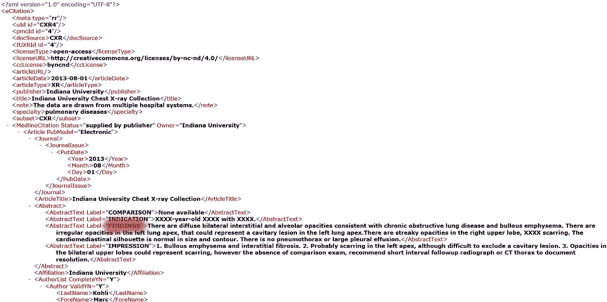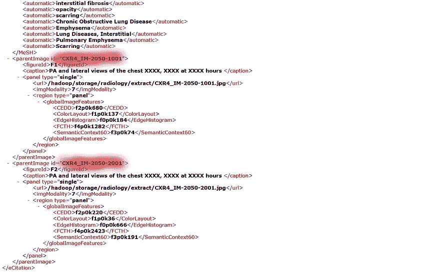

作者图片|左图显示文件中的“发现”,而右图显示同一文件的给定图片 id

突出显示的信息是您需要从这些文件中提取的内容。这可以在 python 的 XML 库的帮助下完成。

注:调查结果也将被称为报告。它们将在博客的其余部分互换使用。

从 XML 文件中提取结果和报告

# 4.获取结构化数据

从 XML 文件中提取所需数据后，数据被转换成结构化格式，以便于理解和访问。如前所述，有多个图像与单个报告相关联。因此，我们的模型在生成报告时也需要看到这些图像。但是有些报告只有 1 个相关联的图像，而有些报告有 2 个，最多 4 个。

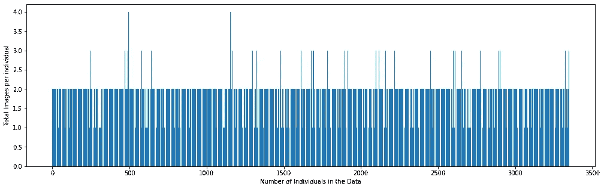

按作者分类的图片|显示每份报告相关图片数量的图表

所以问题来了，我们应该一次向模型中输入多少图像来生成一个报告？为了使模型输入一致，一次选择成对的图像，即两幅图像作为输入。如果一个报表只有一个图像，那么同一个图像将作为第二个输入被复制。

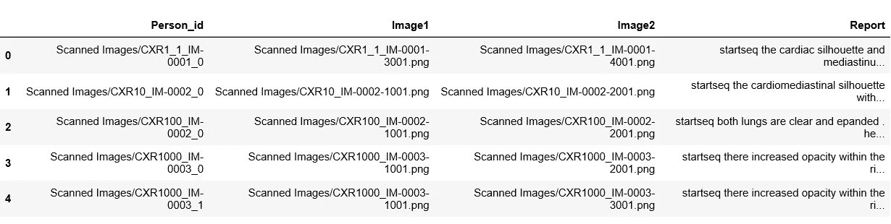

作者图片|结构化数据外观一览

现在我们有了一个合适的、可理解的结构化数据来处理。图像以其绝对地址的名称保存。这将有助于加载数据。

## 训练-测试 _ 拆分

在最后一步之后，我们将多次获得一个人的数据点。例如，如果一个人有四个与报告相关联的图像，并且由于我们正在拍摄成对的图像，将会生成该人的多个数据点。**因此，有必要将该数据集分割成个体，而不是生成的数据点，以避免数据泄露问题**。

在制作图像对之前，确保使用独特的“person_id”功能将数据分为 train、cv 和 test，然后训练模型。

# 5.准备文本数据

从 XML 文件中获得结果后，在将结果输入模型之前，应该对它们进行适当的清理和准备。下图显示了清理前的一些结果示例。

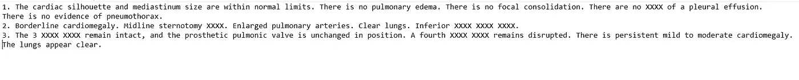

作者图片|清理前的示例调查结果

我们将通过以下方式清理文本:

1.  将所有字符转换成小写。
2.  执行基本的解收缩，即像不会、不能等单词将分别转换为不会、不能等。
3.  删除文本中的标点符号。请注意，句号不会被删除，因为调查结果包含多个句子，所以我们需要模型通过识别句子以类似的方式生成报告。
4.  删除文本中的所有数字。
5.  删除所有长度小于或等于 2 的单词。例如，删除了“是”、“到”等。这些话没有提供太多信息。但是“不”这个词不会被删除，因为它增加了价值。在句子中加上“不”会完全改变它的意思。因此，在执行这些清洁步骤时，我们必须小心。你需要确定哪些词要保留，哪些词要避免。
6.  还发现一些文本包含多个句号、空格或重复多次的“X”。这样的字符也被删除。

我们将开发的模型将生成一个报告，给出两个图像的组合，该报告将一次生成一个单词。将提供先前生成的单词序列作为输入。因此，我们将需要一个'*首字*来开始生成过程，并需要一个'*尾字'*来表示报告的结束。为此，我们将使用字符串' *startseq'* 和' *endseq'* 。这些字符串被添加到我们的发现。现在这样做很重要，因为当我们对文本进行编码时，我们需要这些字符串被正确编码。

编码文本的主要步骤是创建从单词到唯一整数值的一致映射，称为**标记化**。为了让我们的计算机理解任何文本，我们需要以我们的机器能够理解的方式来分解那个单词或句子。如果不执行标记化，我们就无法处理文本数据。标记化是一种将一段文本分成称为标记的更小单元的方法。记号可以是单词或字符，但在我们的例子中是单词。Keras 为此提供了一个内置的库。

```
from tensorflow.keras.preprocessing.text import Tokenizer
tokenizer = Tokenizer(filters='!"#$%&()*+,-/:;<=>?@[\\]^_`{|}~\t\n')
tokenizer.fit_on_texts(reports)
```

现在，我们已经对文本进行了适当的清理和标记，以备将来使用。在我的 GitHub 账户中可以找到所有这些的完整代码，在这个故事的结尾提供了它的链接。

# 6.获取图像特征

图像和部分报告是我们模型的输入。我们需要将每张图像转换成固定大小的向量，然后作为模型的输入。为此，我们将使用**迁移学习**。

> *“在迁移学习中，我们首先在一个基本数据集和任务上训练一个基本网络，然后我们重新调整已学习的特征，或者将它们转移到第二个目标网络，以便在目标数据集和任务上进行训练。如果特性是通用的，即既适合基本任务又适合目标任务，而不是特定于基本任务，那么这个过程将会起作用。”*

VGG16、VGG19 或 InceptionV3 是迁移学习常用的 CNN。这些是在像 Imagenets 这样的数据集上训练的，这些数据集的图像与胸部 x 光照片完全不同。所以从逻辑上来说，他们似乎不是我们任务的好选择。那么，我们应该使用哪个网络来解决我们的问题呢？

如果你不熟悉，我给你介绍一下 **CheXNet** 。CheXNet 是一个在 ChestX-ray14 上训练的 121 层卷积神经网络，ChestX-ray 14 是目前最大的公开可用胸部 X 射线数据集，包含 14 种疾病的 100，000 多幅正面 X 射线图像。然而，我们在这里的目的不是对图像进行分类，而仅仅是获得每个图像的瓶颈特征。因此，不需要该网络的最后一个分类层。

你可以从 [***这里***](https://drive.google.com/file/d/19BllaOvs2x5PLV_vlWMy4i8LapLb2j6b/view) 下载 CheXNet 训练好的权重。

```
from tensorflow.keras.applications import densenetchex = densenet.DenseNet121(include_top=False, weights = None,   input_shape=(224,224,3), pooling="avg")X = chex.output
X = Dense(14, activation="sigmoid", name="predictions")(X)model = Model(inputs=chex.input, outputs=X)model.load_weights('load_the_downloaded_weights.h5')chexnet = Model(inputs = model.input, outputs = model.layers[-2].output)
```

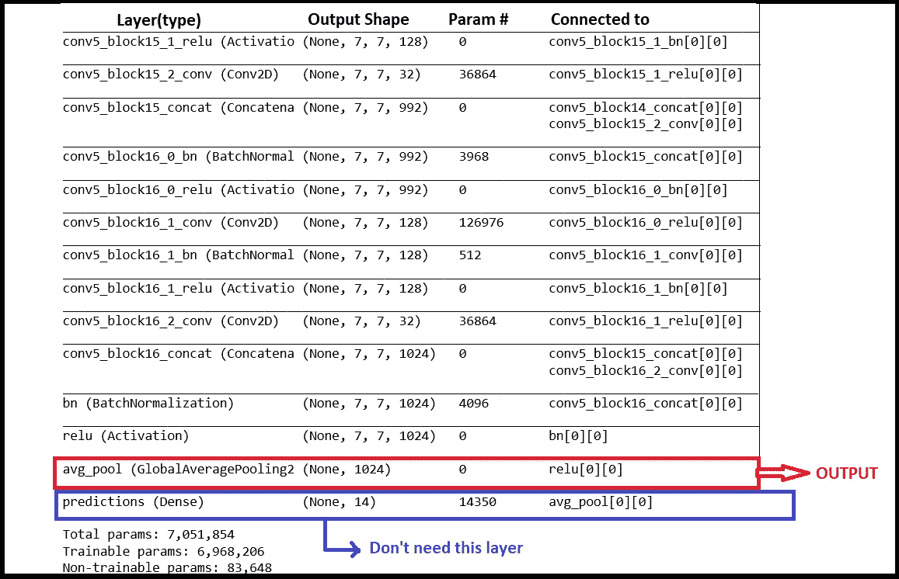

作者图片 CheXNet 的最后几层

如果你忘了，我们有 2 张图片作为模型的输入。下面是瓶颈特征是如何获得的:

每个图像的大小被调整为(224，224，3)并通过 CheXNet，获得 1024 长度的特征向量。稍后，这两个特征向量被连接以获得 2048 个特征向量。如果你注意到，我们已经添加了一个平均池层作为最后一层。这有一个**具体原因**。因为我们要连接两个图像，所以模型可能会知道一些连接的顺序。例如，image1 总是在 image2 之后，反之亦然，但这里不是这样。在连接它们时，我们不保持任何顺序。这个问题是通过创建位置差异的池来解决的。

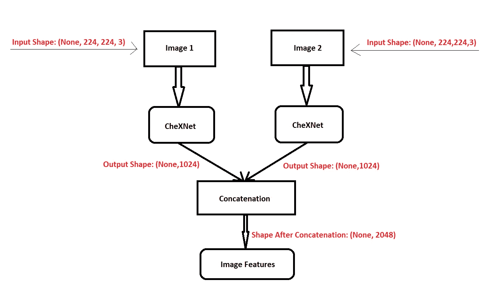

作者图片|获取图片特征

这方面的代码如下:

这些特性以 pickle 格式存储在一个字典中，可以供将来使用。

# 7.输入管道

考虑这样一种情况，您有大量的数据，多到无法一次将所有数据都存储在 RAM 中。购买更多 RAM 显然不是每个人的选择。

解决方案可以是将我们的小批量数据动态地输入到模型中。这正是**数据生成器**要做的事情。它们可以动态生成模型输入，从而形成从存储器到 RAM 的管道，以便在需要时加载数据。这种管道的另一个优点是，在准备将数据输入模型时，可以很容易地对这些小批量数据应用预处理例程。

我们将使用[***TF . data***](https://www.tensorflow.org/guide/data)来解决我们的问题。

我们首先将数据集分为两部分，一个训练数据集和一个验证数据集。在划分的时候，要确保你有足够的数据点用于训练，也有足够的数据点用于验证。我选择的比例允许我在训练集中有 2560 个数据点，在验证集中有 1147 个数据点。

现在是时候为数据集创建生成器了。

数据生成程序

这里我们创建了两个数据生成器，用于训练的 train_dataset 和用于验证的 cv_dataset。create_dataset 函数获取 id(这是字典的键，用于前面创建的瓶颈特性)和预处理报告，并创建生成器。生成器一次生成 BATCH_SIZE 数量的数据点。

如前所述，我们将要创建的模型将是一个逐字逐句的模型。该模型将图像特征和部分序列作为输入，以生成序列中的下一个单词。

例如:假设对应于“图像 _ 特征 _1”的报告是“开始序列心脏轮廓和纵隔尺寸在正常范围内结束序列”。

那么输入序列将被分成 11 个输入-输出对来训练模型:

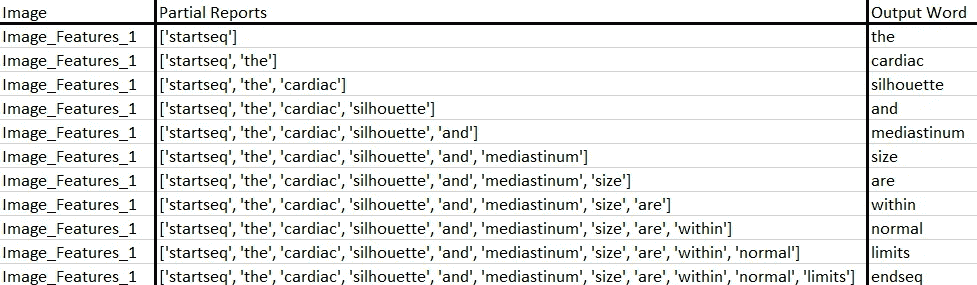

作者图片|模型将图片和部分报告作为输入，并输出输出单词

**注意**我们是**而不是**通过生成器创建这些输入输出对。生成器一次只为我们提供 BATCH_SIZE 数量的图像特征及其相应的完整报告。输入-输出对是在训练过程中稍后生成的，稍后将对此进行解释。

# 8.编码器-解码器模型


照片由 [Sergi Kabrera](https://unsplash.com/@skabrera?utm_source=unsplash&utm_medium=referral&utm_content=creditCopyText) 在 [Unsplash](https://unsplash.com/s/photos/sequence?utm_source=unsplash&utm_medium=referral&utm_content=creditCopyText) |让我们解码一些序列！！

序列到序列模型是一种深度学习模型，它采用一个项目序列(在我们的情况下，是图像的特征)并输出另一个项目序列(报告)。

编码器处理输入序列中的每一项，它将捕获的信息编译成一个称为上下文的向量。处理完整个输入序列后，编码器将上下文发送给解码器，解码器开始逐项产生输出序列。

在我们的例子中，编码器是一个 CNN，它通过获取我们的图像特征来产生一个上下文向量。解码器是一个递归神经网络。

Marc Tanti 在他的论文 [***中介绍了许多架构，如 init-inject、par-inject、pre-inject 和 merge，指定了在创建图像标题生成器时应该在哪里注入图像。对于我们的问题，我们将使用他的论文中指定的合并架构。***](https://arxiv.org/abs/1703.09137)

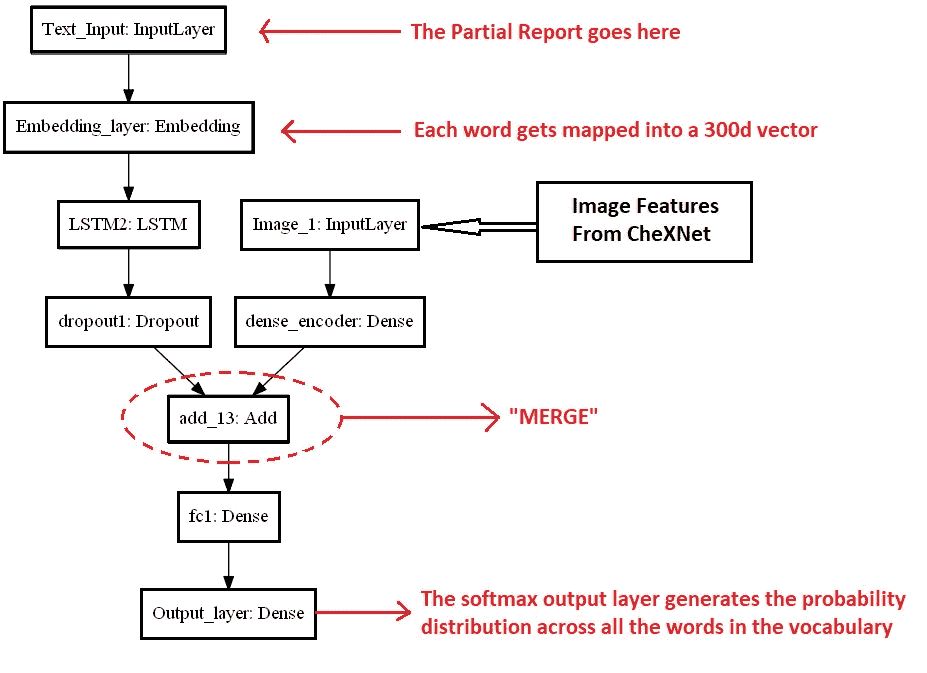

作者图片|建筑

在“合并”架构中，RNN 在任何点都不暴露于图像向量(或从图像向量导出的向量)。相反，在前缀被 RNN 完整编码后，图像被引入语言模型。这是一个后期绑定架构，它不会在每个时间步修改图像表示。

他的论文中的一些重要结论被用于我们实现的架构中。它们是:

*   RNN 输出需要与辍学正规化。
*   图像向量不应该具有非线性激活函数，也不应该用丢失来正则化。
*   图像输入向量在被馈送到神经网络之前必须被归一化，这是在从 CheXNet 获得特征时完成的。

**嵌入层:**

单词嵌入是一类使用密集向量表示来表示单词和文档的方法。Keras 提供了一个 [***嵌入***](https://keras.io/api/layers/core_layers/embedding/#embedding) 层，可用于文本数据上的神经网络。它也可以用一个从别处学来的单词嵌入。在自然语言处理领域中，学习、保存和自由使用单词嵌入是很常见的。

在我们的模型中，利用嵌入层，每个单词已经使用预先训练的 [***手套***](https://nlp.stanford.edu/projects/glove/) 模型被映射成 300 维表示。使用预训练嵌入时，请记住，应通过设置参数“trainable = False”来冻结层的权重，以便权重在训练时不会更新。

**型号代码:**

**型号汇总:**

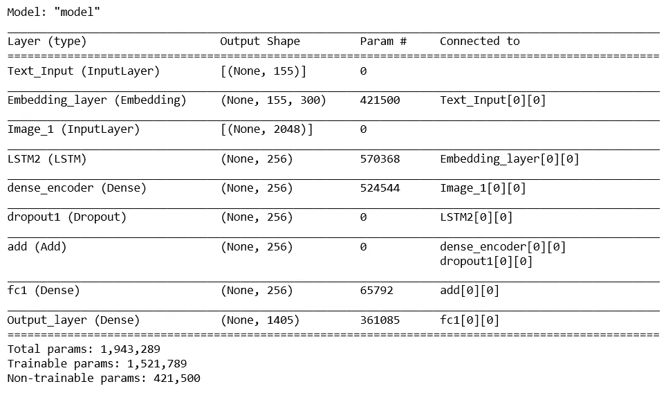

模型参数汇总

## 8.1 培训

**损失函数:**

为此问题创建了掩蔽损失函数。例如:

如果我们有一个令牌序列- [3]、[10]、[7]、[0]、[0]、[0]、[0]、[0]

我们在这个序列中只有 3 个单词，零对应于实际上不是报告一部分的填充。但是模型会认为零也是序列的一部分，并开始学习它们。当模型开始正确预测零点时，损失将会减少，因为对于模型来说，它正在正确地学习。但对我们来说，只有当模型正确预测实际单词(非零)时，损失才会减少。

因此，我们应该屏蔽序列中的零，这样模型就不会关注它们，只学习报告中需要的单词。

隐蔽损失

输出字是一个热编码，因此分类交叉熵将是我们的损失函数。

```
optimizer = tf.keras.optimizers.Adam(0.001)
encoder_decoder.compile(optimizer, loss = maskedLoss)
```

还记得我们的数据生成器吗？现在是时候使用它们了。

这里，生成器提供的批次不是我们用于训练的实际数据批次。请记住，它们不是逐字的输入输出对。他们只是返回图像及其相应的整个报告。

我们将从生成器中检索每一批数据，并从该批数据中手动创建输入-输出序列，也就是说，我们将为训练创建我们自己的定制数据批。所以在这里，BATCH_SIZE 逻辑上是模型在单个批次中看到的图像对的数量。我们可以根据我们的系统能力改变它。我发现这种方法比其他博客中提到的传统定制生成器要快得多。

由于我们正在创建自己的训练数据批次，因此我们将使用“train_on_batch”来训练我们的模型。

培训步骤

代码中提到的 convert 函数将来自生成器的数据转换为一个字一个字的输入输出对表示。然后，部分报告被填充到报告的最大长度。

转换功能:

Adam optimizer 的学习率为 0.001。该模型被训练了 40 个时期，但是在第 35 个时期获得了最好的结果。由于随机性，您得到的结果可能会有所不同。

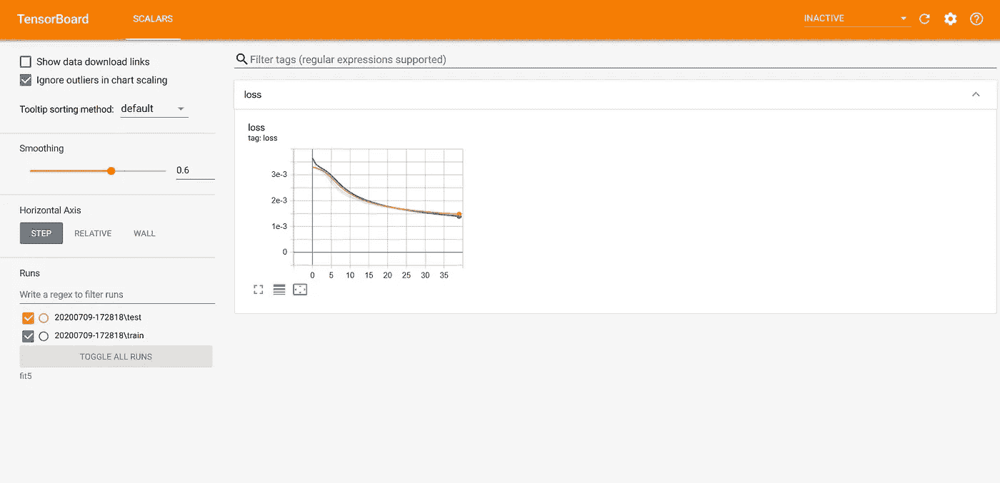

图片由作者| Tensorboard 提供，显示了模型的损耗图

**注:**以上培训已在 Tensorflow 2.1 中实现。

## 8.2 推理

既然我们已经训练了我们的模型，是时候准备我们的模型来预测报告了。

为此，我们必须对我们的模型进行一些调整。这将为我们节省一些测试时间。

首先，我们将编码器和解码器部分从模型中分离出来。编码器预测的特征将与部分报告一起用作解码器的输入。

推理设置

通过这样做，我们将只需要预测编码器特征一次，同时我们将它用于我们的**贪婪搜索**和**波束搜索**算法。

我们将实现这两种生成文本的算法，并看看哪一种效果最好。

## 8.3 贪婪搜索算法

贪婪搜索是一种算法范式，它一点一点地构建解决方案，总是选择下一个提供最明显好处的方案。

***贪婪搜索步骤* :**

1.  编码器输出我们图像的特征。编码器的工作到此结束。一旦我们有了我们需要的特性，我们就不需要关心编码器了。
2.  这个特征向量连同开始标记-‘start seq’(我们的初始输入序列)作为第一个输入提供给解码器。
3.  解码器预测整个词汇的概率分布，具有最大概率的单词将被选为下一个单词。
4.  这个预测的字连同先前的输入序列将是我们对解码器的下一个输入序列。
5.  继续步骤 3-4，直到我们遇到结束标记，即‘end seq’。

让我们检查一下在使用 greedysearch 生成报告之后，我们的模型表现如何。

> **BLEU 评分—贪婪搜索:**

**双语评估替角评分**，简称 BLEU，是一个将生成的句子评估为参考句子的度量。

完全匹配的得分为 1.0，而完全不匹配的得分为 0.0。该方法通过计算候选文本中的 n 元语法与参考文本中的 n 元语法的匹配来工作，其中 1 元语法或单元语法将是每个单词，双元语法比较将是每个单词对。

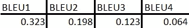

通过贪婪搜索生成报告后的 BLEU 分数

满分在实践中是不可能的，因为译文必须与参考文献完全匹配。这甚至是人类翻译所做不到的。用于计算 BLEU 分数的参考文献的数量和质量意味着跨数据集比较分数可能会很麻烦。

想了解更多关于 BLEU 的信息，点击 [***这里***](https://machinelearningmastery.com/calculate-bleu-score-for-text-python/) 。

## 8.4 波束搜索

波束搜索是一种算法，它扩展了贪婪搜索并返回最可能的输出序列列表。每个序列都有一个与之相关的分数。得分最高的序列作为最终结果。

在构建序列时，波束搜索不是贪婪地选择最有可能的下一步，而是扩展所有可能的下一步，并保持最有可能的 *k* ，其中 k(称为波束宽度)是用户指定的参数，控制波束的数量或概率序列中的并行搜索。

波束宽度为 1 的波束搜索只不过是你的贪婪搜索。常见的波束宽度值为 5-10，但甚至高达 1000 或 2000 以上的值也用于研究，以从模型中挤出最佳性能。点击 [***此处***](https://machinelearningmastery.com/beam-search-decoder-natural-language-processing/) 阅读更多关于光束搜索的内容。

但是请记住，随着波束宽度的增加，时间复杂度也会增加。因此，这些比贪婪搜索慢得多。

波束搜索

波束搜索并不总是保证更好的结果，但在大多数情况下，它给你一个。

您可以使用上面给出的函数检查光束搜索的 BLEU 分数。但是请记住，评估它们需要一段时间(几个小时)。

## 8.5 示例

现在让我们来看一些胸部 x 光的预测报告:


训练图像对 1

**图像对 1 的原始**报告:*心脏正常大小。纵隔不明显。肺部没问题。*

**预测的**报告为图像对 1:*心脏正常大小。纵隔不明显。肺清*。”

对于这个示例，模型预测的是完全相同的报告。


训练图像对 2

**图像对 2 的原始**报告:“*心脏大小和肺血管分布在正常范围内。未发现局部浸润性胸腔积液。*

**图像对 2 的预测**报告:“*心脏大小和肺部血管分布在正常范围内。肺部是自由的局灶性空域疾病。没有胸腔积液。*”

虽然不完全相同，但预测结果与原始报告几乎相似。

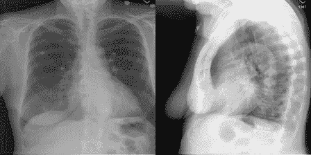

训练图像对 3

**图像对 3 的原始**报告:“*肺部过度膨胀但清晰。没有局灶性浸润渗出。心脏和纵隔轮廓在正常范围内。发现钙化的纵隔。*

**图像对 3 的预测**报告:“*心脏大小正常。纵隔轮廓在正常范围内。肺部没有任何病灶浸润。没有结节肿块。没有可见的气胸。没有明显的胸腔积液。这是非常正常的。横膈膜下无可见的腹腔内自由空气*

你并不期望这个模型完美无缺，对吧？没有一个模型是完美的，这个也不是。尽管从图像对 3 中可以正确识别出一些细节，但是产生了许多额外的细节，这些细节可能是正确的，也可能是不正确的。

我们创建的模型绝不是完美的，但它确实为我们的图像生成了不错的报告。

现在让我们来看一个高级模型，看看它是否提高了当前的性能！！

# **9。注意机制**


保罗·斯科鲁普斯卡斯在 [Unsplash](https://unsplash.com/s/photos/focus?utm_source=unsplash&utm_medium=referral&utm_content=creditCopyText) 拍摄的照片|现在让我们来关注一下吧！！

注意机制是对编解码模型的一种改进。上下文向量被证明是这类模型的瓶颈。这对他们处理长句子来说是一个挑战。在 [*Bahdanau 等人，2014*](https://arxiv.org/abs/1409.0473) 和 [*Luong 等人，* 2015](https://arxiv.org/abs/1508.04025) 中提出了解决方案。这些论文介绍并完善了一种叫做“注意力”的技术，这种技术极大地提高了机器翻译系统的质量。注意力允许模型根据需要关注输入序列的相关部分。后来这个想法被实现为图像字幕在论文中， [*展示，出席，讲述:视觉*注意](https://arxiv.org/pdf/1502.03044.pdf)的神经图像字幕生成。

那么，我们如何为图像的注意力机制建模呢？


马库斯·温克勒在 [Unsplash](https://unsplash.com/s/photos/smileys?utm_source=unsplash&utm_medium=referral&utm_content=creditCopyText) 上拍摄的照片

在文本的情况下，我们对输入序列的每个位置都有一个表示。但是对于图像，我们通常使用来自网络的完全连接层之一的表示，但是该表示不包含任何位置信息(想想看，它们是完全连接的)。我们需要查看图像的特定部分(位置)来描述那里有什么。例如，要从 x 光片上描述一个人心脏的大小，我们只需要看他的心脏区域，而不是他的手臂或任何其他部位。那么注意力机制的输入应该是什么呢？

好吧，我们使用具有空间信息的卷积层之一(迁移学习)的输出，而不是完全连接的表示。

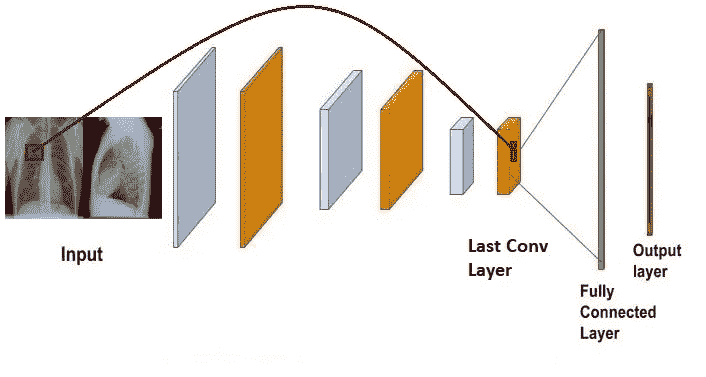

图片作者| Conv 图层包含空间信息

例如，假设最后一个卷积层的输出是一个(7*14*1024)大小的特征图。这里，“7*14”是对应于图像中某些部分的实际位置，1024 是通道。我们不是关注通道，而是关注图像的位置。因此，这里我们有 7*14 = 98 个这样的位置。我们可以把它想象成 98 个位置，每个位置都有一个 1024 维的表示。

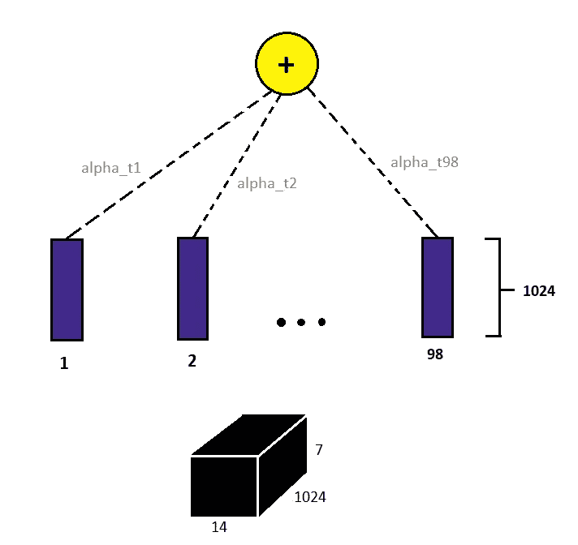

作者图片|关注组件

现在我们有 98 个时间步，每个时间步有 1024 个维度表示。我们现在需要决定模型应该如何关注这 98 个时间步长或位置。一个简单的方法是给每个位置分配一些权重，得到所有这 98 个位置的加权和。如果特定的时间步长在预测输出时非常重要，则该时间步长将具有较高的权重。让这些重量被表示为阿尔法。

现在我们知道，阿尔法决定了一个特定位置的重要性。阿尔法值越高，重要性越高。但是我们如何找到α的值呢？没有人会给我们这些值，模型本身应该从数据中学习这些值。为此，我们定义了一个函数:

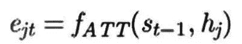

这个量捕获了第 j 个输入对于解码第 t 个输出的重要性。h_j 是第 j 个位置表示，s_t-1 是解码器直到该点的状态。我们需要这两个提到的量来确定 e_jt。ATT 只是一个函数，我们将在后面定义。

在所有输入中，现在我们希望这个量(e_jt)的总和为 1。这就像一个概率分布，其中输入的重要性是多少。通过取 softmax 将 e_jt 转换成概率分布。

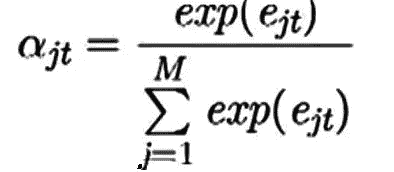

使用 softmax 将 e_jt 转换为概率分布

现在我们有阿尔法战士了。！阿尔法是我们 e _ jts 的软 max。α_ JT 表示聚焦于第 j 个输入以产生第 t 个输出的概率。

是时候定义函数 f_ATT 了。许多其他可能的选择之一如下:

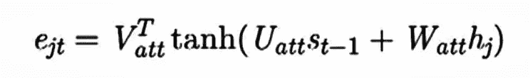

v、U 和 W 是将在训练期间学习的参数，以确定 e_jt 的值。

我们有阿尔法，我们有输入，现在我们只需要得到加权和，以产生新的上下文向量，它将被馈送到解码器。实际上，这些模型比编码器解码器模型工作得更好。

## 模型实现:

像上面提到的编码器-解码器模型一样，这个模型也将由两部分组成，一个编码器和一个解码器，但这次解码器将有一个额外的注意力组件，即一步注意力解码器。为了更好地理解，现在让我们用代码编写上面解释的注意步骤:

```
***The onestep attention layer will consist of the attention part which
will be calculated for each time step of the decoder.******# Calculating e_jts***
score = self.Vattn(tf.nn.tanh(self.Uattn(features) + self.Wattn(hidden_with_time_axis)))***# Converting our scores to probability distributions using softmax***
attention_weights = tf.nn.softmax(score, axis=1)***# Calculating the context vector(weighted sum)***
context_vector = attention_weights * features
```

我们将使用 keras 的子类 API，这给了我们更多的可定制性和对我们架构的控制。你可以从文档本身 ***中阅读更多关于子类 API [***这里***](https://www.tensorflow.org/guide/keras/custom_layers_and_models) 。***

我们将实现教师强制训练我们的模型，这一次我们不必将我们的文本转换成逐字逐句的模型。但是对于图像特征，我们将从 CheXNet 网络的最后一个 conv 层获取特征。

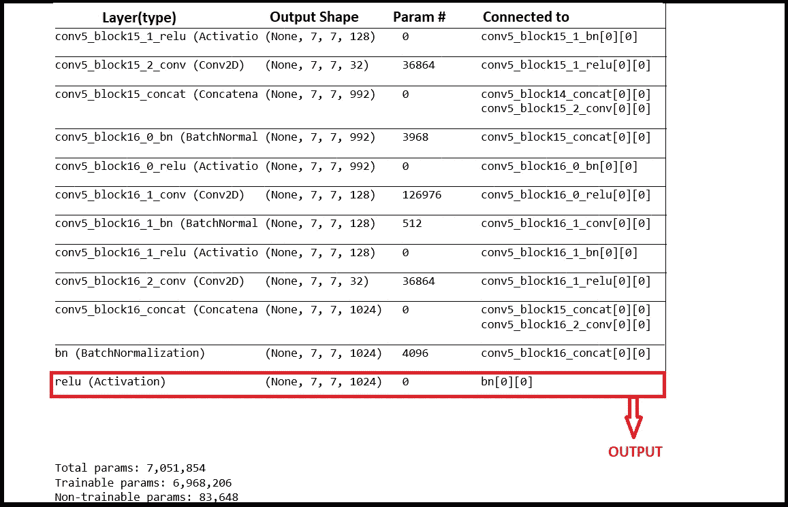

作者图片|提取图像特征以引起注意

组合我们的两个图像后的最终输出形状将是(无，7，14，1024)。因此，整形后编码器的输入将是(None，98，1024)。为什么要整形？嗯，这已经在注意介绍中解释过了，如果你有任何疑问，请确保你再次阅读解释。

**型号:**

1.  编码器

编码器层只是对我们的图像执行一些操作，并输出将作为输入提供给解码器的特征。

2.解码器

解码器为每个解码器时间步长调用单步关注层，并计算分数和关注权重。每个时间步的所有输出都存储在“所有输出”变量中。每个解码器步骤的输出是序列中的下一个字。“全力输出”将是我们的最终输出。

3.单步解码器

4.创建模型

```
**model1 = Attention_Model(vocab_size, units, max_capt_len, att_units, BATCH_SIZE)**
```

## 9.1 培训

如前所述，我们将使用教师强制来训练我们的模型。因此，我们将不需要我们用于编码器解码器模型的额外功能。我们可以直接使用来自生成器的自定义报告。

“train_dataset”是我们的生成器，它为我们提供图像特征和相应的 155 维填充报告。

```
**# teacher forcing
res = model1.train_on_batch([img, rep[:,:-1]], rep[:,1:])**
```

可以看到，解码器的输入比输出落后一个时间步长。我们不希望模型预测的输入与输出相同。我们希望它能预测序列中的下一个单词。

为了引起注意，Adam optimizer 以 0.001 的学习率使用。该模型仅用 10 个时期的训练就给出了不错的结果。由于随机性，您得到的结果可能会有所不同。稀疏分类交叉熵是在这种情况下使用的损失函数，因为我们没有将输出转换为 OHE 向量。

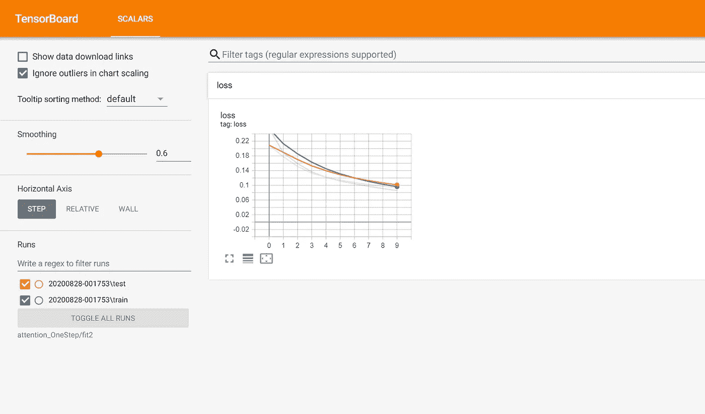

图片由作者| Tensorboard 提供，显示了损失图

所有东西的代码都可以从我的 GitHub 上获取。它的链接已经在这个博客的末尾提供了。

## 9.2 推理

## 9.3 贪婪搜索

现在我们已经建立了模型，让我们检查一下获得的 BLEU 分数是否确实比以前的模型有所改进:

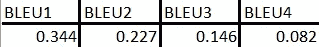

贪婪搜索后注意模型的 BLEU 分数

我们可以看到，它比带有贪婪搜索的编码器-解码器模型具有更好的性能。因此，这肯定是对前一个的改进。

## 9.4 波束搜索

现在让我们看看光束搜索的一些分数:

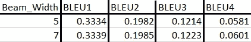

波束搜索后的 BLEU 分数

BLEU 分数低于 greedy 分数，但相差不远。但是值得注意的是，随着波束宽度的增加，分数实际上也在增加。因此，可能存在一些 beam_width 值，分数实际上与贪婪值交叉。

## 9.5 示例

以下是模型使用贪婪搜索生成的一些报告:

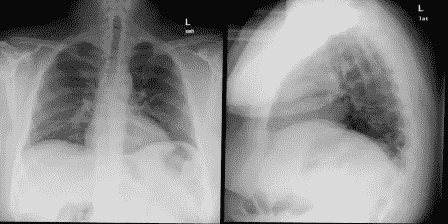

训练图像对 1

**图像对 1 的原始**报告:“*心脏大小和肺血管分布在正常范围内。未发现局部浸润性胸腔积液。*

**图像对 1 的预测**报告:“*心脏大小和纵隔轮廓在正常范围内。肺部没问题。没有胸腔积液。没有急性骨质发现。*

这些预测几乎与原始报告相似。

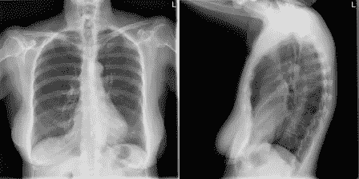

训练图像对 2

**图像对 2 的原始**报告:“*心脏大小和肺部血管分布在正常范围内。肺部是自由的局灶性空域疾病。没有胸腔积液。*”

**图像对 2 的预测**报告:“*心脏大小和肺部血管分布在正常范围内。肺部是自由的局灶性空域疾病。没有胸腔积液。*

预测的报告一模一样！！

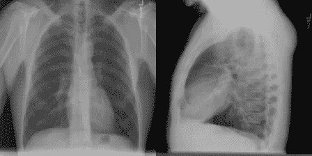

训练图像对 3

**图像对 3 的原始**报告:*心脏正常大小。纵隔不明显。肺部没问题。*

**预测的**图像对 3 的报告:*心脏正常大小。纵隔不明显。肺部没问题。*

在这个例子中，模型也做得非常好。

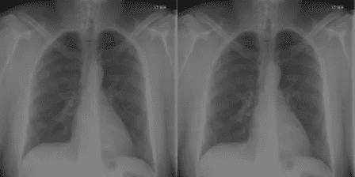

训练图像对 4

图像对 4 的原始报告:“*双肺清晰。具体来说，没有证据表明局灶性实变气胸胸腔积液。心脏纵隔轮廓不起眼。可视化骨骼结构胸部无急性异常。*”

**图像对 4 的预测**报告:“*心脏大小和纵隔轮廓在正常范围内。肺部没问题。没有胸腔积液。*”

你可以看到这个预测并没有真正的说服力。

" B***ut****本例中的波束搜索预测了完全相同的报告，尽管它对整个测试数据组合产生了较低的 BLEU 分数！！!"*

那么，选哪个呢？好吧，这取决于我们。只需选择一个通用的方法。

在这里，即使我们的注意力模型也不能准确预测每一幅图像。正如我们从示例中看到的，这一对没有侧视图像，或者如果我们查看原始报告中的单词，会发现有些复杂的单词通过一些 EDA 并不经常出现。这些可能是我们在某些情况下没有一个好的预测的一些原因。请记住，我们只是在 2560 个数据点上训练这个模型。为了了解更复杂的特征，模型将需要更多的数据。

# 10.摘要

既然我们已经结束了这个项目，让我们总结一下我们所做的一切:

*   我们刚刚看到了图像字幕在医学领域的应用。我们理解这个问题和对这种应用的需要。
*   我们看到了如何为输入管道使用数据生成器。
*   创建了一个编码器-解码器模型，给了我们不错的结果。
*   通过建立注意力模型改进了基本结果。

# 11.未来的工作

*   正如我们提到的，我们没有一个大的数据集来完成这项任务。更大的数据集将产生更好的结果。
*   没有对任何模型进行主要的超参数调整。因此，更好的超参数调整可能会产生更好的结果。
*   利用更先进的技术，如变压器或 BERT，可能会产生更好的结果。

# 12.参考

1.  [https://www.appliedaicourse.com/](https://www.appliedaicourse.com/)
2.  https://arxiv.org/abs/1502.03044
3.  【https://www.aclweb.org/anthology/P18-1240/ 
4.  [https://arxiv.org/abs/1703.09137](https://arxiv.org/abs/1703.09137)
5.  [https://arxiv.org/abs/1409.0473](https://arxiv.org/abs/1409.0473)
6.  [https://machine learning mastery . com/develop-a-deep-learning-caption-generation-model-in-python/](https://machinelearningmastery.com/develop-a-deep-learning-caption-generation-model-in-python/)

> 这个项目的完整代码可以从我的[***GitHub***](https://github.com/vysakh10/Image-Captioning)中访问。
> 
> 也可以在我的[***LinkedIn***](https://www.linkedin.com/in/i-am-vysakh/)上和我联系。

> 希望你喜欢这个项目。感谢阅读:)