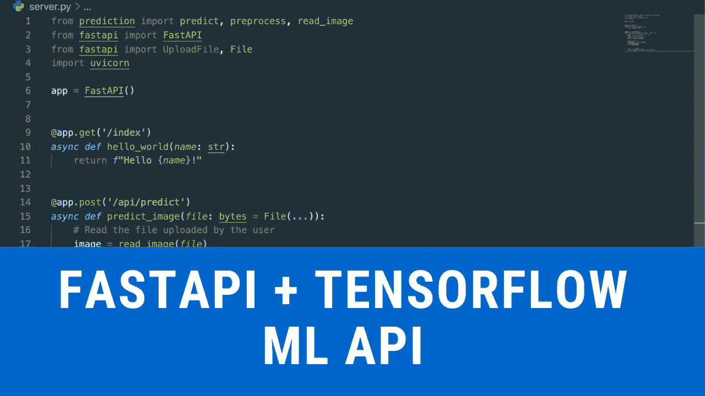

# 用 Tensorflow 和 FastAPI 构建影像分类 API

> 原文：<https://towardsdatascience.com/image-classification-api-with-tensorflow-and-fastapi-fc85dc6d39e8?source=collection_archive---------7----------------------->

## 从零开始学习用 Tensorflow 和 FastAPI 构建图像分类 API。



资料来源:aniketmaurya

FastAPI 是一个高性能的异步框架，用于在 Python 中构建 API。

> 这个博客也有视频教程

> 这个博客的源代码是可用的[aniketmaurya/tensor flow-fastapi-starter-pack](https://github.com/aniketmaurya/tensorflow-web-app-starter-pack)

# 让我们从一个简单的 hello-world 示例开始

首先，我们导入`FastAPI`类并创建一个对象`app`。这个类有有用的[参数](https://github.com/tiangolo/fastapi/blob/a6897963d5ff2c836313c3b69fc6062051c07a63/fastapi/applications.py#L30)，比如我们可以为 Swagger UI 传递标题和描述。

```
from fastapi import FastAPI
app **=** FastAPI**(**title**=**'Hello world'**)**
```

我们定义一个函数并用`@app.get`来修饰它。这意味着我们的 API `/index`支持 GET 方法。这里定义的函数是异步的，FastAPI 通过为普通的 def 函数创建一个线程池来自动处理异步和非异步方法，并为异步函数使用一个异步事件循环。

```
**@**app**.**get**(**'/index'**)**
**async** **def** **hello_world():**
    **return** "hello world"
```

# 图像识别 API

我们将创建一个 API 来对图像进行分类，我们将其命名为`predict/image`。我们将使用 Tensorflow 创建图像分类模型。

> tensor flow[图像分类教程](https://aniketmaurya.ml/blog/tensorflow/deep%20learning/2019/05/12/image-classification-with-tf2.html)

我们创建一个函数`load_model`，它将返回一个带有预训练权重的 MobileNet CNN 模型，也就是说，它已经被训练来分类 1000 个独特的图像类别。

```
import tensorflow **as** tf**def** **load_model():**
    model **=** tf**.**keras**.**applications**.**MobileNetV2**(**weights**=**"imagenet"**)**
    **print(**"Model loaded"**)**
    **return** modelmodel **=** load_model**()**
```

我们定义了一个`predict`函数，它将接受一幅图像并返回预测结果。我们将图像的大小调整为 224x224，并将像素值归一化为[-1，1]。

```
from tensorflow.keras.applications.imagenet_utils import decode_predictions
```

`decode_predictions`用于解码预测对象的类名。这里我们将返回前 2 个可能的类。

```
**def** **predict(**image**:** Image**.**Image**):** image **=** np**.**asarray**(**image**.**resize**((**224**,** 224**)))[...,** **:**3**]**
    image **=** np**.**expand_dims**(**image**,** 0**)**
    image **=** image **/** 127.5 **-** 1.0 result **=** decode_predictions**(**model**.**predict**(**image**),** 2**)[**0**]** response **=** **[]**
    **for** i**,** res **in** *enumerate***(**result**):**
        resp **=** **{}**
        resp**[**"class"**]** **=** res**[**1**]**
        resp**[**"confidence"**]** **=** f"{res[2]*100:0.2f} %" response**.**append**(**resp**)** **return** response
```

现在我们将创建一个支持文件上传的 API `/predict/image`。我们将过滤文件扩展名，仅支持 jpg、jpeg 和 png 格式的图像。

我们将使用 Pillow 来加载上传的图像。

```
**def** **read_imagefile(***file***)** **->** Image**.**Image**:**
    image **=** Image**.***open***(**BytesIO**(***file***))**
    **return** image**@**app**.**post**(**"/predict/image"**)**
**async** **def** **predict_api(***file***:** UploadFile **=** File**(...)):**
    extension **=** *file***.**filename**.**split**(**"."**)[-**1**]** **in** **(**"jpg"**,** "jpeg"**,** "png"**)**
    **if** **not** extension**:**
        **return** "Image must be jpg or png format!"
    image **=** read_imagefile**(await** *file***.**read**())**
    prediction **=** predict**(**image**)** **return** prediction
```

# 最终代码

```
import uvicorn
from fastapi import FastAPI**,** File**,** UploadFilefrom application.components import predict**,** read_imagefileapp **=** FastAPI**()****@**app**.**post**(**"/predict/image"**)**
**async** **def** **predict_api(***file***:** UploadFile **=** File**(...)):**
    extension **=** *file***.**filename**.**split**(**"."**)[-**1**]** **in** **(**"jpg"**,** "jpeg"**,** "png"**)**
    **if** **not** extension**:**
        **return** "Image must be jpg or png format!"
    image **=** read_imagefile**(await** *file***.**read**())**
    prediction **=** predict**(**image**)** **return** prediction **@**app**.**post**(**"/api/covid-symptom-check"**)**
**def** **check_risk(**symptom**:** Symptom**):**
    **return** symptom_check**.**get_risk_level**(**symptom**)** **if** __name__ **==** "__main__"**:**
    uvicorn**.**run**(**app**,** debug**=***True***)**
```

> [FastAPI 文档](https://fastapi.tiangolo.com/)是了解框架核心概念的最佳地方。
> 
> 希望你喜欢这篇文章。

欢迎在评论中提出你的问题，或者亲自联系我

👉推特:[https://twitter.com/aniketmaurya](https://twitter.com/aniketmaurya)

👉领英:【https://linkedin.com/in/aniketmaurya 