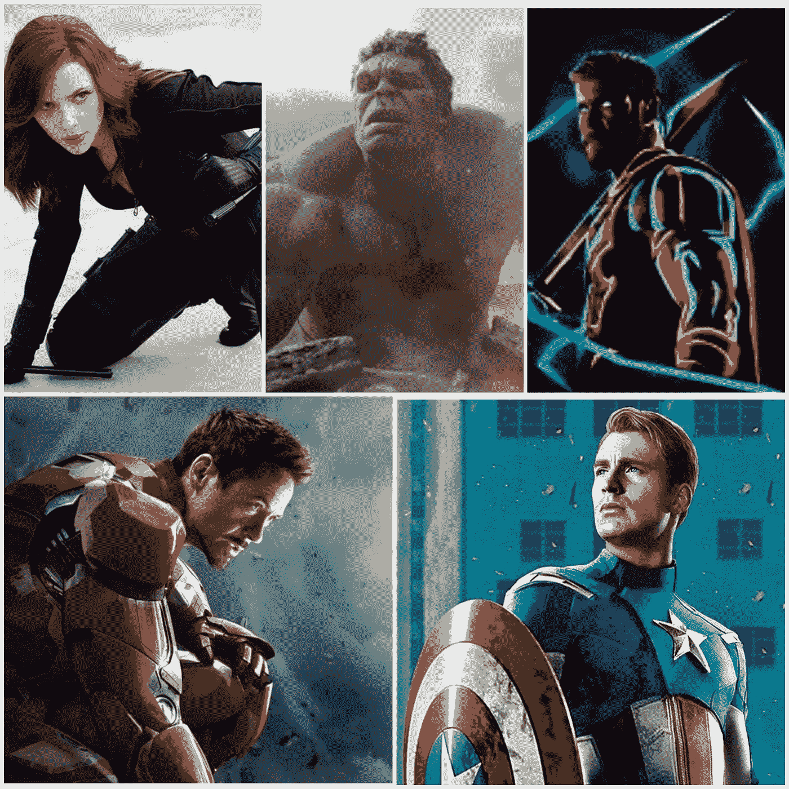
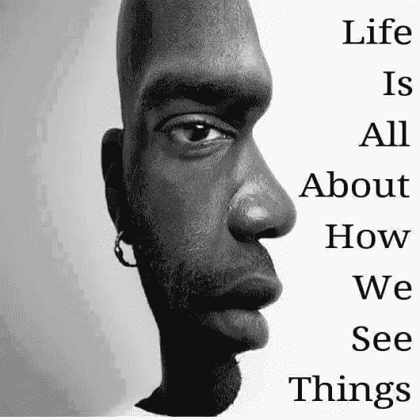
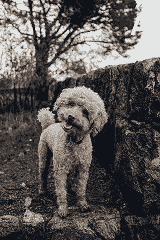
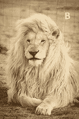
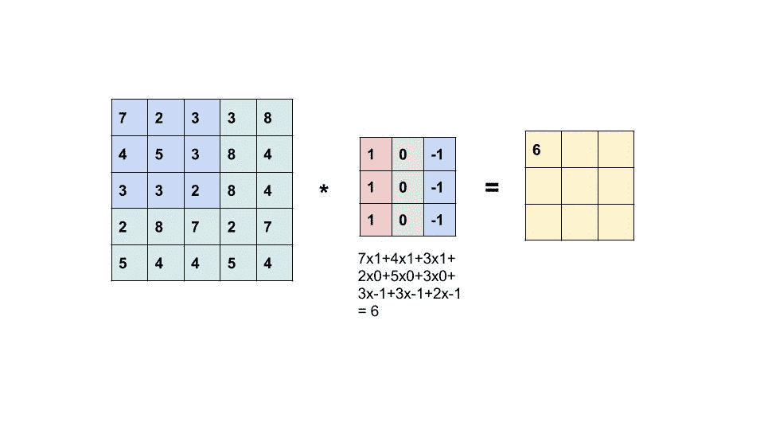
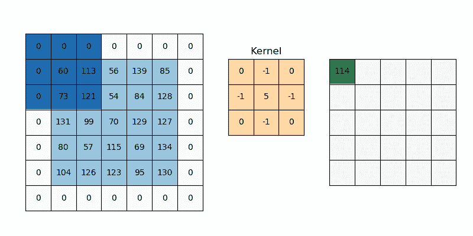
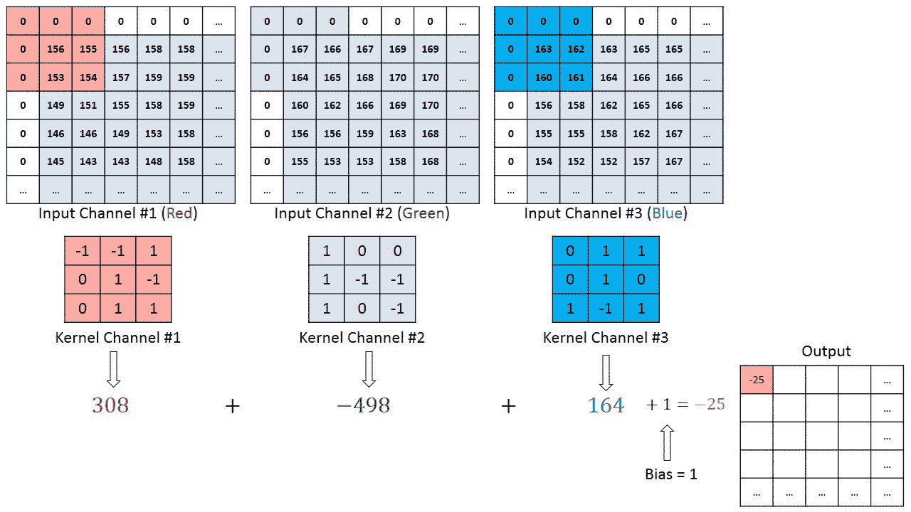
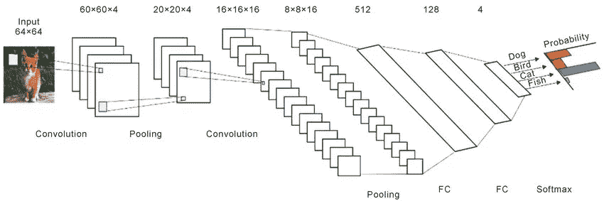
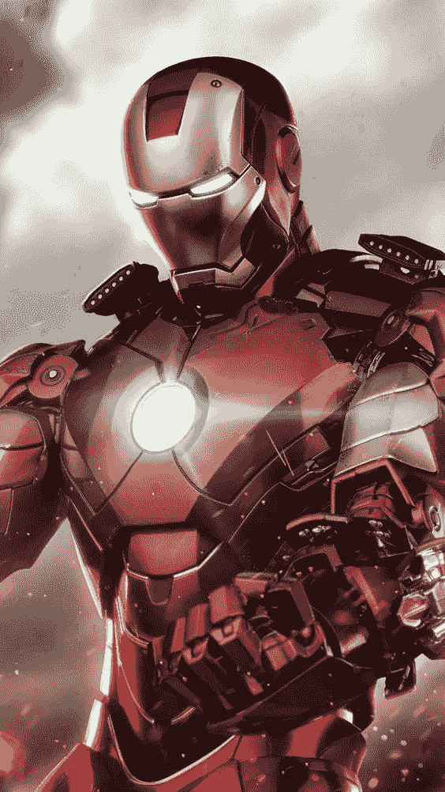

# 基于 CNN 的图像分类

> 原文：<https://towardsdatascience.com/image-classification-cnn-cf53e5e5c176?source=collection_archive---------41----------------------->

## **使用 CNN 和代码**对漫威字符进行分类



数据集中使用的漫威人物(来源: [Instagram](https://www.instagram.com/marvel.fans.united/) ，作者创建的拼贴)

# 我们怎么看？

在深入探讨**背后的技术细节之前，让我们先来谈谈生物。他们是如何识别和感知图像的。我们每秒钟看到多幅图像，我们能够处理它，我们能够在未来识别它。所有这一切都归功于**人脑**，世界上最强大的机器。让我们来谈谈我们是如何感知图像的，以便更好地理解 **CNN** 。看看下面的图片**



来源: [Pinterest](https://in.pinterest.com/pin/61783826116053603/)

我们可以看到两幅图像

*   右脸的男人
*   一个面向我们的男人

基于我们对图像的聚焦我们看到不同的视图，我们的大脑太强大了，它自动识别模式并帮助我们识别物体。这是 CNN 背后的基本原理，它搜索模式并区分图像。



狮子狗(图片来源:Fredrik hlander 在 [Unsplash](https://unsplash.com/s/photos/poodle?utm_source=unsplash&utm_medium=referral&utm_content=creditCopyText) 拍摄)狮子(图片来源:Arleen wiese 在 [Unsplash](https://unsplash.com/s/photos/lion?utm_source=unsplash&utm_medium=referral&utm_content=creditCopyText) 拍摄)

考虑上面的图像，我们能够通过观察一些模式来识别 A 和 B。我们能够做到这一点是因为我们在过去看到过这些图像，我们的大脑观察到了其中的一些模式，这有助于我们区分它们。如果我们问一个孩子或一个一生中从未见过狮子或狗的人。他能对上述图像进行分类吗？肯定**没有**。

上图不仅适用于 **CNN** 也普遍适用于**机器学习**。让我们关注 CNN，因为这篇文章就是关于它的。我们向 **CNN** 发送一堆图像进行训练， **CNN** 在其中寻找与人类相似的模式，因此当我们要求 CNN 识别这些图像时，它将能够识别其中的**模式**。因此，如果我们将图像发送给未经训练的 CNN，它也会像人类一样失败。

# CNN 步行道:

如何让机器读取图像？是困扰我们大多数人的常见问题，这是**图像处理的第一步。**


[计算机视觉如何工作。在最左边我们有一个图像，像素值是根据亮度分配的](/everything-you-ever-wanted-to-know-about-computer-vision-heres-a-look-why-it-s-so-awesome-e8a58dfb641e)

机器通过**像素值读取图像。**每幅图像都是像素值的组合，改变像素值会改变图像。这些像素值在输入 CNN 之前必须经过处理。像素值的数量取决于图像的大小，因此如果图像的大小太大，又会出现问题。一个完全连接的网络会将二维像素阵列展平为一维阵列，并根据像素值识别图像。

# 卷积层:

卷积层与汇集来拯救我们。它从图像中提取某些特征并缩小图像的尺寸。



一个过滤器在没有填充的二维图像上的卷积(来源:Pinterest

我们把 6*6 矩阵的图像转换成 3*3 矩阵。我们的权重初始化为 3*3 矩阵。加权矩阵穿过我们图像，并产生 3*3 矩阵的卷积输出。权重覆盖我们的图像中的所有像素值至少一次，并且执行逐元素乘法。

当您查看元素乘法以获得卷积层时，另一个问题出现了，边缘处的像素值仅被覆盖一次。借助**衬垫**可以解决这个问题。



[2D 图像上的滤波器与填充的卷积](http://www.michaelfxu.com/neural%20networks%20series/neural-networks-pt3-cnn/)

当我们应用填充时，图像的大小保持不变。类似于[**【MLP】**](https://en.wikipedia.org/wiki/Multilayer_perceptron)**学习权重，即最小化**损失函数**或帮助模型正确预测图像。我们不会在实际应用中只使用一个滤镜，滤镜数量的使用会影响**旋绕层**的深度。卷积输出的深度取决于我们使用的**滤波器**的数量。**

# ****彩色图像的卷积层:****

**每幅彩色图像都可以用红色**、蓝色**和绿色**的组合来表示。我们把它分成三层，并遵循同样的程序应用于灰度图像的情况。****

****

**[用 3x3x3 内核对彩色图像矩阵进行卷积运算](/a-comprehensive-guide-to-convolutional-neural-networks-the-eli5-way-3bd2b1164a53)**

# ****汇集层:****

**池化的唯一目的是减小图像的大小。**大多数情况下首选最大池**。池在每个层上独立运行，因此卷积层的深度保持不变。您可以观察到我们一次应用两个**步长**。尺寸随着**步数**的增加而减小。**

****

**Gif 由[谷歌开发者](https://developers.google.com/machine-learning/practica/image-classification/convolutional-neural-networks)**

# ****输出层:****

**我们的最终目标是预测一幅图像是否属于某个特定的类别。但是卷积层给了我们一个 3 D 激活图，使用卷积层不容易获得输出类，所以我们需要将其展平以产生所需数量的输出类。进行前向和反向传播以减少损耗。**

****

**来源:[研究门](https://www.researchgate.net/figure/Example-CNN-architecture_fig3_322957424)**

**正如我们可以观察到的，我们在开始时应用**卷积**以从中提取有用的特征，随后是**最大汇集**以减小图像的大小，随后是**展平**，最后输出预测图像属于特定类别的概率。**

# ****使用 CNN 对图像进行分类:(代码)****

**五个漫威角色被选中，分别是黑寡妇、钢铁侠、雷神、美国队长和绿巨人。按照 **70: 30** 的比例划分训练和测试装置，并观察性能。**

****

**钢铁侠(来源: [Pinterest](https://in.pinterest.com/pin/AYIgZDx6HmT1VOIiLXVWR6p1f9eEVX1ZTjCn8_PcAAeEZtG6PH_HmUg/)**

```
from zipfile import ZipFile
filename= "marvel.zip"
with ZipFile(filename,'r')as zip:
zip.extractall()
```

**您可以忽略前三个块，因为它处理图像加载和导入依赖项。由 5 个漫威角色组成的 zip 文件在上面的代码块中被加载和提取。**

```
#Importing
import os
import numpy as np
import glob
import shutil
import matplotlib.pyplot as plt
import tensorflow as tf
from tensorflow.keras.models import Sequential
from tensorflow.keras.layers import Dense, Conv2D, Flatten, Dropout, MaxPooling2D
from tensorflow.keras.preprocessing.image import ImageDataGenerator
base_dir = os.path.join(os.path.dirname(filename), 'marvel')
```

**所有必需的依赖项都会被导入，如果在导入这些依赖项时出现错误，您必须安装它。使用 pip 安装(Jupyter 笔记本)**

```
# Accessing the images and setting 0.7 of images for training and the rest for testingclasses=['Black Widow','Captain America','Hulk','Iron Man','Thor']
for m in classes:
img_path = os.path.join(base_dir, m)
images = glob.glob(img_path + '/*.jpg')
num_train = int(round(len(images)*0.7))
train, val = images[:num_train], images[num_train:]# Creating separate directories for training datafor t in train:
if not os.path.exists(os.path.join(base_dir, 'train', m)):
os.makedirs(os.path.join(base_dir, 'train', m))
shutil.move(t, os.path.join(base_dir, 'train', m))# Creating separate directories for validating datafor v in val:
if not os.path.exists(os.path.join(base_dir, 'val', m)):
os.makedirs(os.path.join(base_dir, 'val', m))
shutil.move(v, os.path.join(base_dir, 'val', m))
```

**在上面的代码块中，为训练和验证数据创建了单独的目录。训练和验证数据按照 **70:30** 的比例分割。所有的图像扩展名都被转换成 **jpg** 。**

```
train_dir = os.path.join(base_dir, 'train')
val_dir = os.path.join(base_dir, 'val')
```

**为培训和验证创建了两个目录。**

```
# Setting batch size and a constant image shapebatch_size = 130IMG_SHAPE = 150# Rescaling the images so all the values lie between 0 and 1 and applying horizontal flip and training the dataimage_gen = ImageDataGenerator(rescale=1./255, horizontal_flip=True)train_data_gen = image_gen.flow_from_directory(batch_size=batch_size,directory=train_dir,shuffle=True,target_size=(IMG_SHAPE,IMG_SHAPE))# Rescaling the images so all the values lie between 0 and 1 and rotating and training the dataimage_gen = ImageDataGenerator(rescale=1./255, rotation_range=45)train_data_gen = image_gen.flow_from_directory(batch_size=batch_size,directory=train_dir,shuffle=True,target_size=(IMG_SHAPE, IMG_SHAPE))#Rescaling and zooming the dataimage_gen_train = ImageDataGenerator(rescale=1./255,rotation_range=45,width_shift_range=.15,height_shift_range=.15,horizontal_flip=True,zoom_range=0.5)train_data_gen = image_gen_train.flow_from_directory(batch_size=batch_size,directory=train_dir,shuffle=True,target_size=(IMG_SHAPE,IMG_SHAPE),class_mode='sparse')
```

**由于收集的图像大小不同，因此对图像进行**调整**大小。选择 150 * 150 的图像尺寸。图像的像素值范围从 **0 到 255，**为了提供更好的结果，像素值被**重新缩放**，因此所有值都位于 0 和 1 之间。不同的技术如**水平翻转**、**缩放**、**旋转**都是在现有的一组图像上进行。**

```
image_gen_val = ImageDataGenerator(rescale=1./255)val_data_gen = image_gen_val.flow_from_directory(batch_size=batch_size,directory=val_dir,target_size=(IMG_SHAPE, IMG_SHAPE),class_mode='sparse')model = Sequential()model.add(Conv2D(16, 3, padding='same', activation='relu', input_shape=(IMG_SHAPE,IMG_SHAPE, 3)))model.add(MaxPooling2D(pool_size=(2, 2)))model.add(Conv2D(32, 3, padding='same', activation='relu'))model.add(MaxPooling2D(pool_size=(2, 2)))model.add(Conv2D(64, 3, padding='same', activation='relu'))model.add(MaxPooling2D(pool_size=(2, 2)))# Adding dropout to turn down some neuronsmodel.add(Flatten())model.add(Dropout(0.2))model.add(Dense(512, activation='relu'))model.add(Dropout(0.2))model.add(Dense(5, activation='softmax'))
```

**卷积和最大池应用于数据集，在将其发送到输出层之前，模型被**展平**。剔除用于防止图像的**过拟合**。**

```
model.compile(optimizer='adam',loss='sparse_categorical_crossentropy',metrics=['accuracy'])epochs = 120history = model.fit_generator(train_data_gen,steps_per_epoch=int(np.ceil(train_data_gen.n / float(batch_size))),epochs=epochs,validation_data=val_data_gen,validation_steps=int(np.ceil(val_data_gen.n / float(batch_size))))
```

**模型**编译**观察性能。您可以使用**超参数**来获得最佳结果。**

**github(代码)的链接附在下面**

**[](https://github.com/VishnuBhaarath/Computervisionprojects/blob/master/Imageclassification.ipynb) [## VishnuBhaarath/计算机视觉项目

### permalink dissolve GitHub 是 4000 多万开发人员的家园，他们一起工作来托管和审查代码，管理…

github.com](https://github.com/VishnuBhaarath/Computervisionprojects/blob/master/Imageclassification.ipynb)**