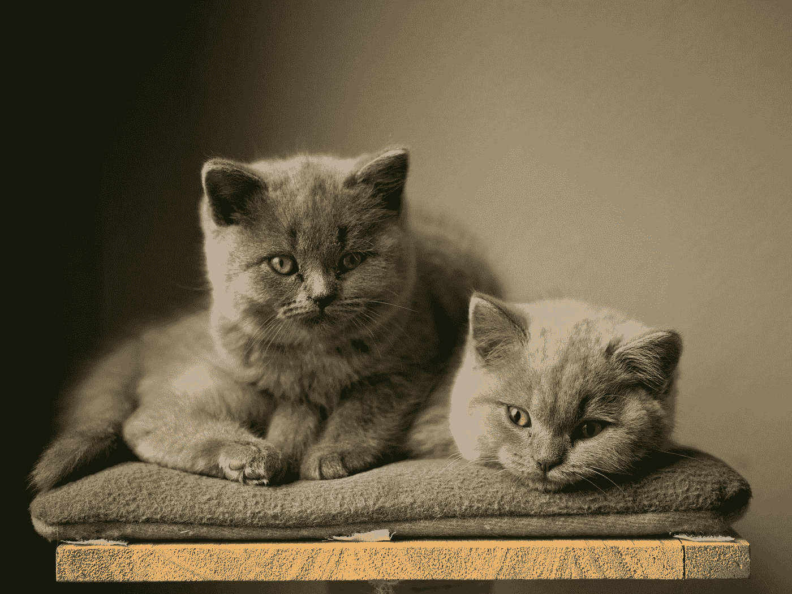
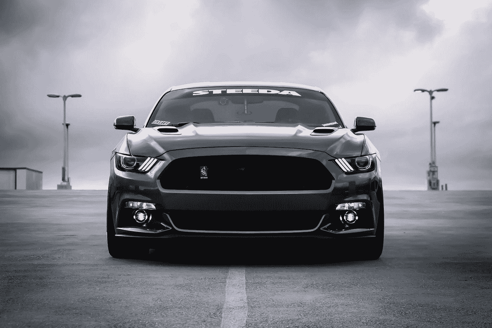
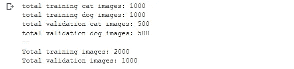
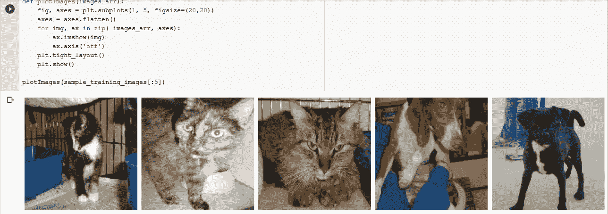
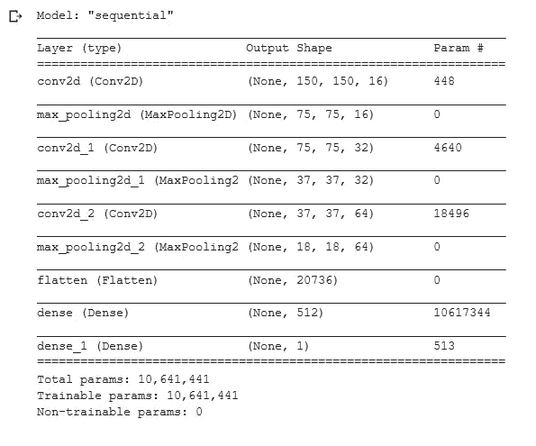
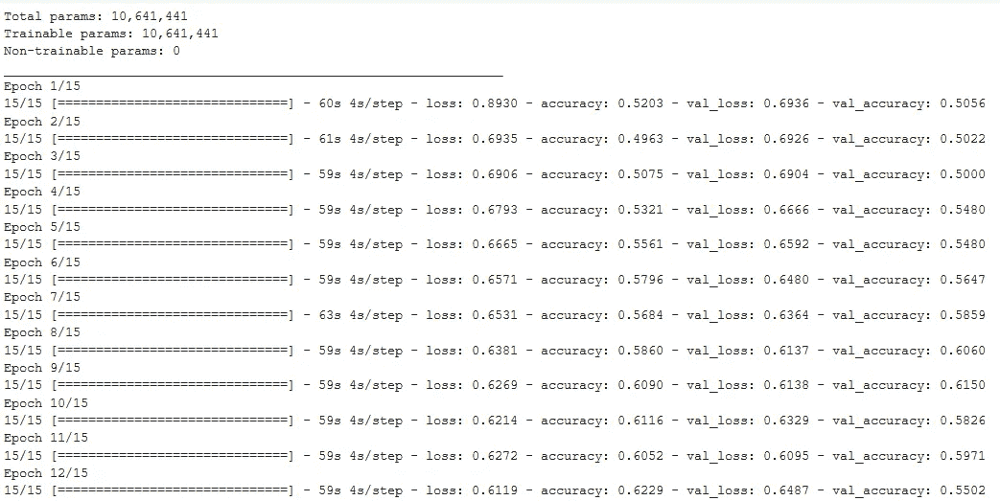
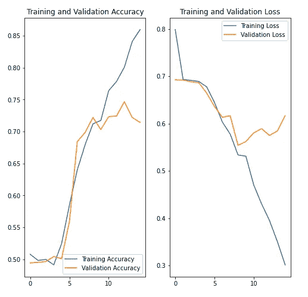
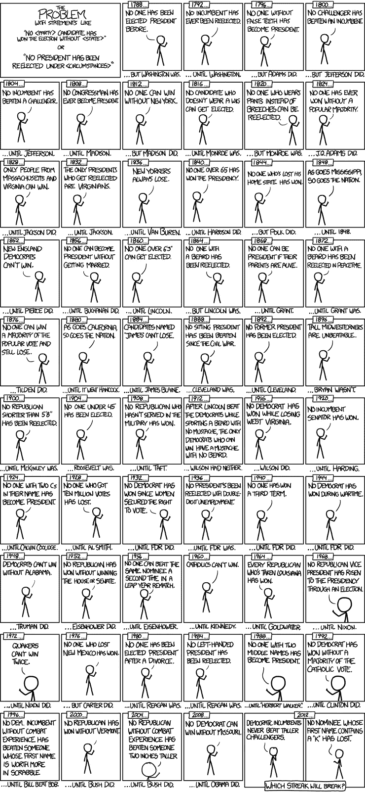
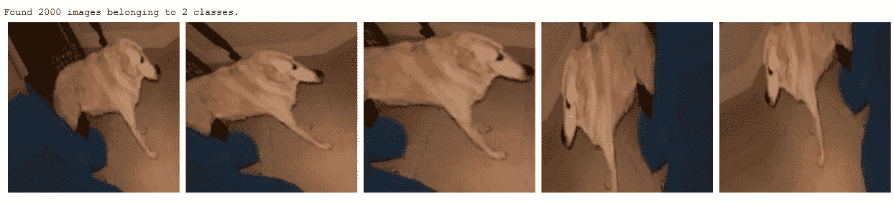
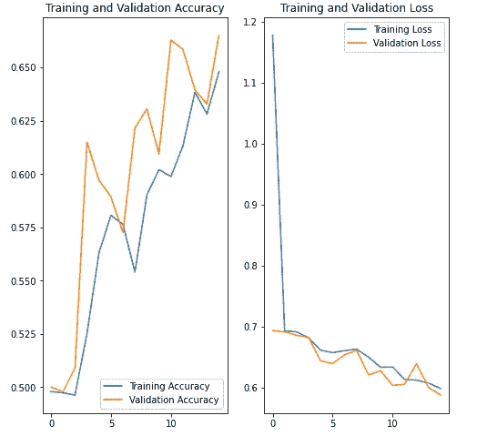

# 数据科学中的图像分类

> 原文：<https://towardsdatascience.com/image-classification-in-data-science-422855878d2a?source=collection_archive---------26----------------------->

## 什么是数据科学中的图像分类和用 Python 构建我们自己的图像分类器



在 [Unsplash](https://unsplash.com?utm_source=medium&utm_medium=referral) 上由 [René Peters](https://unsplash.com/@cosiman?utm_source=medium&utm_medium=referral) 拍摄的照片

欢迎阅读“Python 数据科学”迷你系列的第 2 部分！在这一课中，我们将讨论什么是图像分类，并训练一个图像分类器，它可以相当准确地识别猫和狗(反之亦然)。

# 什么是图像分类？



照片由[乔伊·班克斯](https://unsplash.com/@joeyabanks?utm_source=medium&utm_medium=referral)在 [Unsplash](https://unsplash.com/?utm_source=medium&utm_medium=referral) 拍摄

考虑上面的图像。我相信我们都同意这是一辆*车。但是退一步，分析一下你是如何得出这个结论的——你看到了一张图片，你*将*归类到它所属的类别(在这个例子中是一辆汽车)。简而言之，这就是图像分类的全部内容。*

潜在地，给定图像可以被分类成无数种类(例如，汽车可以被分类成轿车、掀背车、SUV 等。反过来，它们又可以被分为奥迪、玛莎拉蒂甚至丰田。手动检查和分类图像是一个非常繁琐的过程，当你面对大量的图像，比如 10，000 甚至 100，000 张时，这几乎是不可能的。

> *图像分类是获取输入(如图片)并输出类别(如“猫”)或输入是特定类别的概率(该输入有 90%的概率是猫)的过程。*

你可以看着一张照片，知道你在看一只猫，但计算机如何才能学会这样做呢？

用卷积神经网络！

我已经在 CNN 上写了一篇文章，值得一读，尤其是如果你是数据科学的新手。

事实证明，

> *计算机不像人类那样看图像。他们看到的是一个像素矩阵，每个像素有三个分量:红、绿、蓝(听说过 RGB 吗？)*

因此，对我们来说，1000 像素的图像对计算机来说将有 3000 像素。这 3000 个像素中的每一个都将被赋予一个值或强度。结果是 3000 个精确像素强度的矩阵，计算机必须以某种方式将其解释为一个或多个对象。

对于黑白图像，像素被解释为 2D 阵列(例如，2x2 像素)。每个像素的值都在 0 到 255 之间。(零全黑，255 全白。灰度存在于这些数字之间。)基于这些信息，计算机可以开始处理这些数据。

对于彩色图像(红色、绿色和蓝色的组合)，这是一个 3D 阵列。每种颜色的值都在 0 到 255 之间。可以通过组合三层中每一层的值来找到颜色。

# 设置图像数据的结构

在数据科学中，我们构建的图像分类器必须经过*训练*才能识别对象/模式——这向我们的分类器显示了准确(或大致)要识别的内容。

想象一下我给你看下面的图像:


由[卢卡·布拉沃](https://unsplash.com/@lucabravo?utm_source=medium&utm_medium=referral)在 [Unsplash](https://unsplash.com/?utm_source=medium&utm_medium=referral) 上拍摄

有一个船屋，一艘小船，小山，一条河和其他物体。你会注意到它们，但你*不会*确切知道我指的是什么对象。现在，如果我给你看另一张照片:


本杰明·沃罗斯在 [Unsplash](https://unsplash.com/?utm_source=medium&utm_medium=referral) 上拍摄的照片

另一个:


Kurt Cotoaga 在 [Unsplash](https://unsplash.com/?utm_source=medium&utm_medium=referral) 上拍摄的照片

你会认识到我想让你认识一座“山”。通过展示前两张图片，我基本上训练了你的大脑在第三张图片中识别一座山。

对计算机来说，这个过程(几乎)是一样的——我们的数据需要有特定的格式。我们将在本文的后面看到这一点，但是请记住这些要点。

我们的模型将在“训练”集中存在的图像上训练，并且标签预测将在测试集图像上发生。

# 构建我们的模型

对于本文，我将使用 Google Colab——一种基于 Jupyter 笔记本的免费云服务，支持免费 GPU。

> *Colab 提供了一个 GPU，而且完全免费。说真的！*

这篇文章的全部代码可以在这里找到。

## 导入包和加载数据

在本文中，我们将利用 Kaggle 的[狗对猫](https://www.kaggle.com/c/dogs-vs-cats/data)数据集的过滤版本。你可以从[这里](https://storage.googleapis.com/mledu-datasets/cats_and_dogs_filtered.zip)下载数据集的存档版本。

数据集具有以下目录结构:

```
**cats_and_dogs_filtered**
|__ **train**
    |______ **cats**: [cat.0.jpg, cat.1.jpg, cat.2.jpg ....]
    |______ **dogs**: [dog.0.jpg, dog.1.jpg, dog.2.jpg ...]
|__ **validation**
    |______ **cats**: [cat.2000.jpg, cat.2001.jpg, cat.2002.jpg ....]
    |______ **dogs**: [dog.2000.jpg, dog.2001.jpg, dog.2002.jpg ...]
```

接下来，我们将为训练集和验证集分配具有适当文件路径的变量。

如果您想知道猫和狗的图像在训练和验证目录中，请使用以下代码:



如果您得到了不同的输出，不要担心——您可能使用了不同的数据集

## 准备我们的数据

我们的图像必须被格式化成经过适当预处理的浮点张量，然后才能提供给网络。

## 可视化训练图像

我们现在将从训练生成器中提取一批图像，然后用`matplotlib`绘制其中的五幅。



5 幅训练图像

## 创建模型

## 编译模型

在本文中，我们将使用 *ADAM* 优化器和*二元交叉熵*损失函数。



## 训练我们的模型

我们将使用`ImageDataGenerator`类的`fit_generator`方法来训练我们的网络。

让它运行—这需要一些时间。要有耐心！



## 用图可视化训练结果



培训和验证图

从图中可以看出，训练精度和验证精度相差很大，模型在验证集上仅达到大约 **70%** 的精度。

# 过度拟合

在上面的图中，训练精度随时间线性增加，而验证精度在训练过程中停滞在 70%左右。此外，训练和验证准确性之间的差异也很明显——这是*过度拟合*的迹象。

> *当训练样本数量较少时，模型有时会从训练样本的噪声(不需要的细节)中学习。这对新示例的模型性能有负面影响。这种现象被称为过度拟合。*



过度拟合选举优先级(来源: [XKCD](https://xkcd.com/1122/)

这意味着模型将很难对新数据集进行概化。

在训练过程中有多种方法来对抗过度适应。在本文中，我们将使用*数据扩充*并将*退出*添加到我们的模型中。

## 数据扩充

过度拟合通常发生在训练样本数量很少的时候。解决这个问题的一个方法是增加数据集，使其具有足够数量的训练示例。

> *我们的目标是，在训练阶段，我们的模型永远不会看到同一个图片两次。这有助于将它暴露给数据的更多方面，这将最终提高它的识别准确性。*

## 扩充和可视化数据

在本文中，我们将对数据集应用随机*****旋转*** *和* ***缩放*** 增强，并查看单个图像在转换后的样子。**

****

## **创建验证数据生成器**

**一般来说，我们只对训练样本应用数据扩充。在这种情况下，我们将重新缩放验证图像，并将其转换为批次。**

# **拒绝传统社会的人**

**另一种减少过拟合的技术是将*下降*引入网络。**

> ***Dropout 是正则化的一种形式，它从你的神经网络中随机剔除单元(即神经元),因此在每次迭代中，你都以一个更小的神经网络结束工作。***

**这里的直觉是:**不能依赖任何一个特征，要把权重分散开来。****

**当您对图层应用“丢弃”时，它会在训练过程中随机丢弃(设置为零)输出单位的数量。它接受一个分数作为输入，比如 0.1、0.3 等。(这意味着从它所应用的层中随机丢弃 10%或 30%的输出单元)。**

## **创建一个有辍学者的新网络**

## **可视化新模型**

**你会注意到过度拟合比以前明显减少了。在对模型进行更多时期的训练后，精确度应该会上升。**

****

**更精确的模型**

**就是这样！我们已经成功地建立了一个图像分类器来识别图像中的猫和狗。与所有神经网络一样，我们无法达到 100%的准确性，但我们能够通过将模型暴露于相同数量的图像来提高模型的准确性水平，但使用了*增强功能*，如旋转、翻转和缩放。**

**[](https://github.com/jasmcaus/image-classifier-python) [## jasmcaus/图像分类器-python

### 训练一个神经网络，以相当高的准确度识别猫和狗，整个细节都在本…

github.com](https://github.com/jasmcaus/image-classifier-python)** 

**一如既往，非常感谢您的阅读！请告诉我你的想法或者希望我接下来在评论中写些什么。我也乐于接受批评！**

**下期帖子再见！😄**