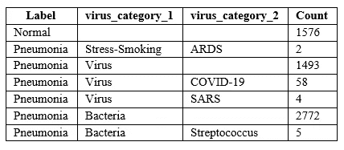
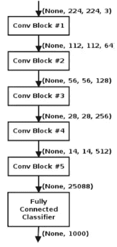
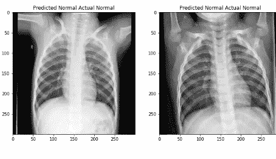

# X 射线扫描的图像分类

> 原文：<https://towardsdatascience.com/image-classification-of-x-ray-scans-ffaf970783f9?source=collection_archive---------33----------------------->

## 通过人工智能检测新冠肺炎症状

***编者按:*** [*走向数据科学*](http://towardsdatascience.com/) *是一份以数据科学和机器学习研究为主的中型刊物。我们不是健康专家或流行病学家，本文的观点不应被解释为专业建议。想了解更多关于疫情冠状病毒的信息，可以点击* [*这里*](https://www.who.int/emergencies/diseases/novel-coronavirus-2019/situation-reports) *。*

医疗保健行业正处于巨大的范式转变之中，技术是驱动力。在这一转变中，尽管人工智能已经取得了巨大的进步，但它还没有成熟到可以进行最终的诊断；它仅仅是为了帮助医疗专业人员给出他们的最终诊断。根据[世界卫生组织(世卫组织)](https://www.who.int/docs/default-source/coronaviruse/clinical-management-of-novel-cov.pdf)，重症新冠肺炎最常见的诊断是重症肺炎。这是这个项目背后的关键驱动力。为了帮助对新冠肺炎的研究，我使用了我在哥伦比亚大学的第一门人工智能课程中学到的关于[数据集](https://www.kaggle.com/praveengovi/coronahack-chest-xraydataset)的概念，将肺部 X 射线扫描分类为正常或肺炎感染的肺部。

来源:作者

外行人不可能如上所述区分正常人的肺和肺炎感染者的肺。

让我们戴上博士帽，深入研究数据集吧！

资料来源: [Giphy](https://media.giphy.com/media/jwYCtnPDSgrXa/giphy.gif)

## *数据文件包含以下文件夹:*

**Train:** 这个文件夹有 5309 张图片，每张图片都以图片 id 命名，例如 IM-0131–0001.jpeg

**测试:**这个文件夹以类似的方式存储了 624 张图像

**Chest _ x ray _ Corona _ metadata . CSV:**这具有从图像 id 到标签的映射，即从 IM-0131–0001.jpeg 到正常。有些图像没有贴图，因此被丢弃

**Chest _ x ray _ Corona _ dataset _ summary . CSV:**该 excel 文件包含属于每个类别的图像数量的明细

来源:作者

使用 python 对图像进行了处理并存储在本地。通过改变尺寸(300 x 300)和格式(PNG)使它们变得一致。

来源:作者

该标签用于在 python 中重命名图像，以便于分类。选择这些维度是为了平衡信息损失(太小)和训练模型时更高的计算时间(太大)之间的权衡。

处理后的图像被推送到 Google drive，因为模型训练必须在 Collab (GPU 支持和 25 GB RAM)上完成。**正常**图像标记为 1，**肺炎**图像标记为 0。训练图像被转换成从 0 到 255(像素)的数字数组，并与它们的标签一起存储在一个列表中，以传递给神经网络。20%的训练数据被保留用于验证(超参数调整)。

遵循的**网络** 架构是一个流行的、有效的、简单的架构，叫做 [VGGnet](https://arxiv.org/pdf/1409.1556.pdf) 。

来源:[快照](https://www.slideshare.net/sujitpal/transfer-learning-and-fine-tuning-for-cross-domain-image-classification-with-keras/9)(爱思唯尔)

这里使用的架构是图中所示的较小版本，但有趣的是，随着我们越往下，滤波器的尺寸越大。使用了以下过滤器:

32 → 64 → 128 → 512 → 1

隐藏层均由 Relu(校正线性单位)激活函数激活。二维卷积网络使用大小为[3，3]的核。这指定了二维卷积窗口的高度和宽度。滤波器大小[32]是输出维度的大小(卷积中输出滤波器的数量)。输入形状为[300，300，1]。前两个维度是图像的大小，最后一个维度是图像中通道的数量(1 表示图像为灰度)。

在编译网络之前，进行**数据扩充**以增加输入图像的数量。Keras 有一个图像数据生成器，这是一个标准的工具。生成器有助于重新缩放像素值以及生成新形式的图像。例如，放大和缩小、按特定角度旋转会创建同一图像的相似版本，并增加数据的大小。x 射线图像水平翻转的想法在这里[得到了验证](https://arxiv.org/pdf/1711.05225.pdf)。使用生成器，像素值也被缩放到 0 和 1 之间。

损失函数被设置为**二进制交叉熵**当输出取二进制值时，选择的优化器是学习率为 0.0001 的**亚当**，选择的度量是**准确度**。网络的其他规范在 [GitHub](https://github.com/aneeshgoel/Image-Classification-of-Lung-X-Rays) 上的代码中。

来源:作者

**历元的数量**被认为是 60。可以看到，精度在大约 50 个时期后趋于稳定，我们可以认为权重已经得到了相当好的优化。可以通过像提前停止这样的方法来进一步微调这些时期。

使用这些权重，在 624 幅测试图像上的准确率为 **92.1%** 。下面是结果的快照，其中每个图像的标题显示了实际的和预测的标签(代码中有更多的结果)。

来源:作者

来源:作者

# TL；速度三角形定位法(dead reckoning)

对于未来的范围，如果有更多的新冠肺炎病例和其他病毒的标记图像，可以进行多级分类。神经网络是数据饥渴模型，有了海量的数据集，可以建立更深层次的网络，结果会好得多。此外，使用交叉验证(5 倍)来监控样本外性能可能是一个好主意，因为这将更能代表学习。也可以对时期的数量进行微调，以提高测试集的准确性。

在结束语中，我要再次强调这样一个事实，即人工智能算法应该作为做出重要决策的补充支持，特别是在医疗保健等领域(至少在我们到达终结者时代之前)！

来源: [Giphy](https://media.giphy.com/media/t6lAkVXWvuANMv5Pqa/giphy.gif)