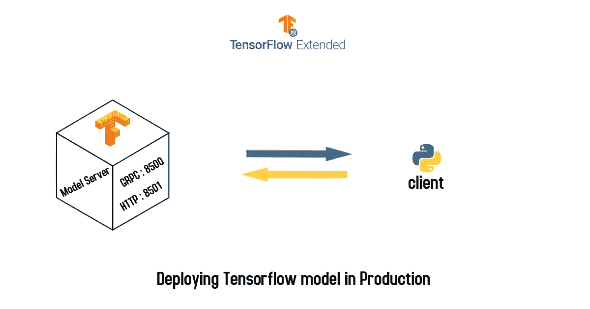

# 基于 gRPC 或 REST 调用推理的张量流图像分类

> 原文：<https://towardsdatascience.com/image-classification-on-tensorflow-serving-with-grpc-or-rest-call-for-inference-fd3216ebd4f3?source=collection_archive---------13----------------------->

## 通过 gRPC 或 rest API 调用为生产和推理中的影像分类模型提供服务



使用[后墙](https://www.postermywall.com/)创建的图像

Tensorflow 提供了多种部署模型的方法。我已经探索了为生产中的模型服务的大多数方法。我一直在寻找一个简单、安全、健壮的解决方案，它应该既能在边缘设备上访问，也能在用其他编程语言编写的服务器上访问。模型服务器非常适合我的需求。我通过 REST API 连接边缘设备，并对我的另一台服务器进行内部 RPC 调用。我还能够为不同的设备提供不同的版本，我可以很容易地从中央服务器控制这些设备。在本文中，我演示了如何以两种方式调用模型服务器，并找出哪种方法适合您的问题陈述。

# 我们开始吧

我们将部署一个在 Keras 上训练的图像分类器。为了让我们的模型在模型服务器上运行，我们需要以下面提到的特定格式导出我们的权重。

```
model_name/
    version/
        saved_model.pb
        variables/
           variables.index
           variables.data-000-of-n
```

在 TensorFlow 2 中我们可以用`tf.keras.models.save_model`函数直接导出训练好的模型。

```
MODEL_DIR = './cat_dog_classifier'
version = 1
export_path = os.path.join(MODEL_DIR, str(version))tf.keras.models.save_model(
    model,
    export_path,
    overwrite=True,
    include_optimizer=True,
    save_format=None,
    signatures=None,
    options=None
)
```

# 验证元图和签名定义

我们将使用`saved_model_cli`工具来检查图形。这将有助于找出输入和输出节点名称。

```
saved_model_cli show --dir ./cat_dog_classifier/1/ --all
```

# 安装模型服务器

```
*echo "deb [arch=amd64]* [*http://storage.googleapis.com/tensorflow-serving-apt*](http://storage.googleapis.com/tensorflow-serving-apt) *stable tensorflow-model-server tensorflow-model-server-universal" | sudo tee /etc/apt/sources.list.d/tensorflow-serving.list && \
curl* [*https://storage.googleapis.com/tensorflow-serving-apt/tensorflow-serving.release.pub.gpg*](https://storage.googleapis.com/tensorflow-serving-apt/tensorflow-serving.release.pub.gpg) *| sudo apt-key add -*sudo apt-get updatesudo apt-get install tensorflow-model-server
```

# 运行模型服务器

我们将在 grpc 的默认端口 8500 和 HTTP 的默认端口 8501 上运行模型服务器。如果需要，您还可以指定不同的端口。

假设您的终端位置与模型文件夹位于同一文件夹中。

```
export MODEL_DIR=$(pwd)/cat_dog_classifiertensorflow_model_server --port=8500 --rest_api_port=8501 --model_name=cat_dog_classifier --model_base_path="${MODEL_DIR}"
```

在使用您保存的模型成功运行模型服务器之后，您将获得与您的模型类似的输出。

> 2020–06–30 15:22:57.309568:I tensor flow _ serving/core/loader _ harness . cc:87]成功加载可服务版本{ name:cat _ dog _ classifier version:1 }
> 2020–06–30 15:22:57.311296:I tensor flow _ serving/model _ servers/server . cc:355]运行 gRPC model server 0 . 0 . 0:8500

# 图像推理

## 拨打 GRPC 电话

**必要进口:**

```
import grpc
import numpy as np
import nsvision as nv
import tensorflow as tf
from tensorflow_serving.apis import predict_pb2
from tensorflow_serving.apis import prediction_service_pb2_grpc
```

**设置 gRPC 通道:**

```
label = ['cat', 'dog']
GRPC_MAX_RECEIVE_MESSAGE_LENGTH = 4096 * 4096 * 3
channel = grpc.insecure_channel('localhost:8500', options=[('grpc.max_receive_message_length', GRPC_MAX_RECEIVE_MESSAGE_LENGTH)])
stub = prediction_service_pb2_grpc.PredictionServiceStub(channel)
grpc_request = predict_pb2.PredictRequest()
grpc_request.model_spec.name = 'cat_dog_classifier'
grpc_request.model_spec.signature_name = 'serving_default'
```

**预测图像的输出:**

确保为 gRPC 请求对象指定了正确的输入和输出。如果你想知道你的模型的输入输出键是什么，你可以使用元数据来检查，元数据可以通过在浏览器中调用一个系统化的 URL 来找到。在这种情况下，它是:

`[http://localhost:8501/v1/models/cat_dog_classifier/metadata](http://localhost:8501/v1/models/cat_dog_classifier/metadata)`

我的输入层名称是`conv2d_input`和输出层名称是`dense_1`，但它会因型号而异。

```
image = nv.imread('golden-retriever-royalty-free-image-506756303-1560962726.jpg',resize=(150,150),normalize=True)
image = nv.expand_dims(image,axis=0)
grpc_request.inputs['conv2d_input'].CopyFrom(tf.make_tensor_proto(image, shape=image.shape))
result = stub.Predict(grpc_request,10)
result = int(result.outputs['dense_1'].float_val[0])
print(label[result])
#This printed 'dog' on my console
```

## 进行 REST API 调用

Rest API 比 grpc 需要更少的库和设置。

**进口:**

```
import json
import requests
import nsvision as nv
```

**为 REST 调用创建 JSON:**

```
label = ['cat','dog']
image = nv.imread('cat.2033.jpg',resize=(150,150),normalize=True)
image = nv.expand_dims(image,axis=0)
data = json.dumps({ 
    "instances": image.tolist()
})
headers = {"content-type": "application/json"}
```

**预测图像的输出:**

REST API 调用需要一个 URL 用于 POST 调用，模型服务器已经为 API 调用指定了一个 URL 格式:
`http://host_ip:port/version_number/models/model_name:predict`

在这种情况下，API URL 将是:

`[http://localhost:8501/v1/models/cat_dog_classifier:predict](http://localhost:8501/v1/models/cat_dog_classifier:predict)`

```
response = requests.post('[http://localhost:8501/v1/models/cat_dog_classifier:predict'](http://localhost:8501/v1/models/cat_dog_classifier:predict'), data=data, headers=headers)
result = int(response.json()['predictions'][0][0])
print(label[result])
#This printed 'cat' on my console
```

由于它是一个 REST API，您可以将端点连接到 javascript 等 web 客户端或 Android、Ios 等边缘设备或 Raspberry Pi 或 Jetson Nano 等物联网设备。

## Github 资源库:

[](https://github.com/novasush/image-classifier-in-production) [## 生产中的图像分类器

### 该存储库包含在模型服务器上部署生产中的 Keras 模型的代码，以及使用 GRPC 或 HTTP…

github.com](https://github.com/novasush/image-classifier-in-production) 

# 这是所有的乡亲