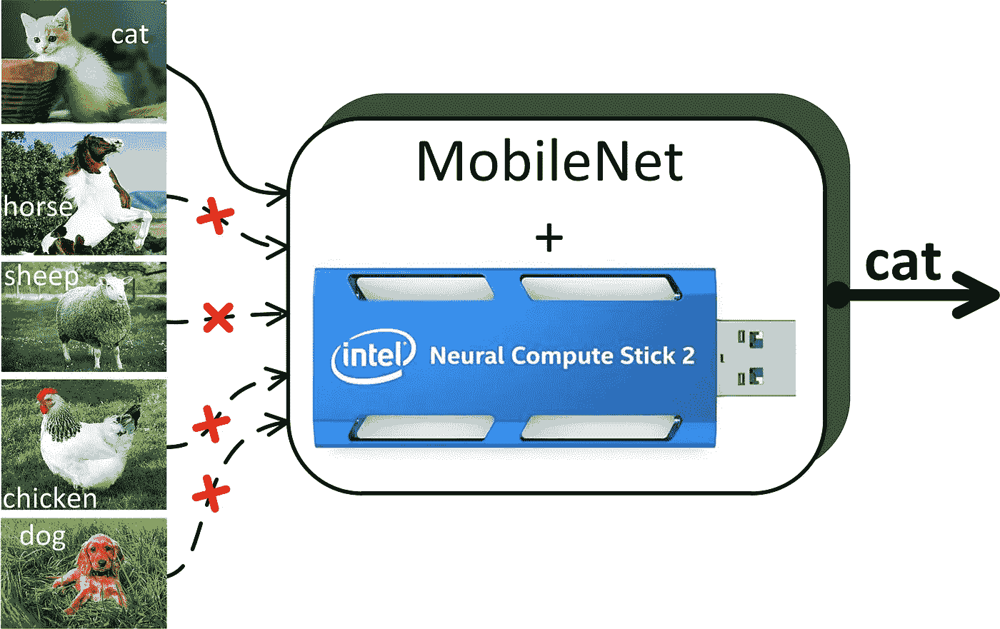
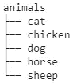
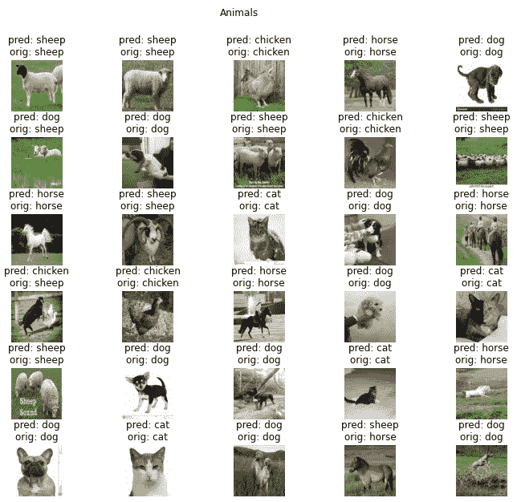
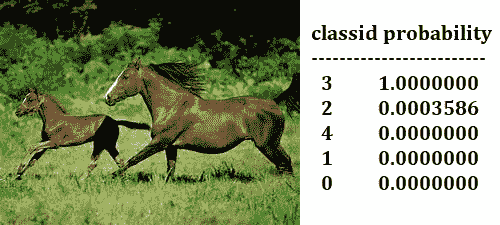
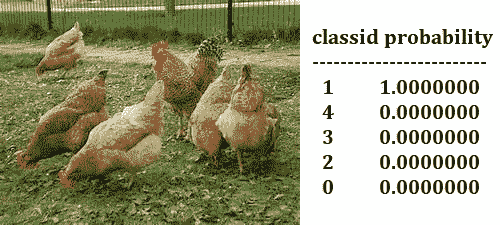

# 采用英特尔神经计算棒 2 (NCS2)的图像分类管道

> 原文：<https://towardsdatascience.com/image-classification-pipeline-with-intel-neural-compute-stick-2-ncs2-2a69aab8b570?source=collection_archive---------27----------------------->

## 借助这份全面的指南，使用 NCS2 从数据集到影像分类



图片由 Oleksii Sheremet 使用 [Adobe Photoshop](https://www.adobe.com/ru/products/photoshop.html) 创建

**简介**

我们将在这个故事中讲述的内容:

*   安装 OpenVINO toolkit for Ubuntu。
*   用 Google Colab 进行数据预处理和模型训练。
*   将张量流模型保存为协议缓冲区(pb)格式。
*   将张量流模型转换成中间表示。
*   使用 NCS2 设备运行训练好的模型并获得预测。

在过去的几年里，机器学习已经被积极地引入到工业任务解决方案中。机器学习可以让你解决人类无法应对的问题。这可以在难以到达地方、在危险的化学生产中、在辐射增加的条件下等工作。机器学习适用于人类智能也可以应用，但无效的领域:预测关键故障、预防突发设备故障、视情维修、预测设备剩余寿命。

通常，在工业企业中，没有机会使用工作站进行数据分析和处理。因此，需要能够容易地连接到现有设备(通常是工业微型计算机)的特殊装置。计算模块 [NCS2](https://ark.intel.com/content/www/us/en/ark/products/140109/intel-neural-compute-stick-2.html) 就是这样的设备之一。

我们公司 [AI Labs](http://ai-labs.org/) 定期收到解决一些与机器学习相关的工业问题的请求。不久前，我们有机会利用第二次全国人口普查提供的机会。因此，我使用 NCS2 开发了一个图像分类管道。我愿意与读者分享这项工作的成果。

**安装 OpenVINO toolkit for Ubuntu**

首先你需要下载并安装当前版本的 [OpenVINO](https://docs.openvinotoolkit.org/) 。你可以从[这里](https://software.intel.com/content/www/us/en/develop/tools/openvino-toolkit/choose-download/linux.html)得到 OpenVINO。你可以在这里找到详细的安装指南[。快速安装指南:](https://docs.openvinotoolkit.org/latest/openvino_docs_install_guides_installing_openvino_linux.html)

1.  转到包含下载的档案的文件夹(例如， *Downloads* ):

```
cd ~/Downloads/
```

2.打开包装。tgz 文件(其中 *<版本>* 是下载存档的版本，你会在文件名中看到):

```
tar -xvzf l_openvino_toolkit_p_<version>.tgz
```

3.进入 *l_openvino_toolkit_p_ <版本>* 目录:

```
cd l_openvino_toolkit_p_<version>
```

4.以 root 用户身份运行安装脚本:

```
sudo ./install.sh
```

5.按照屏幕上的说明进行操作。

6.通过编辑*设置环境变量。bashrc* 文件。转到用户目录并打开*。bashrc* 文件进行编辑(例如，用 *nano* ):

```
cd ~
nano .bashrc
```

将下面一行添加到。bashrc 文件，保存并重新加载:

```
source /opt/intel/openvino/bin/setupvars.sh
source .bashrc
```

仅此而已。已经准备好了使用 NCS2 进行本地工作的所有必要功能。您可以执行数据预处理和模型训练。

**使用 Google Colab 进行数据预处理和模型训练**

[Animals-10](https://www.kaggle.com/alessiocorrado99/animals10) 数据集用于解决分类问题。为了简化问题，从动物中选择 5 个类别(动物种类)-10:猫、狗、鸡、马、羊。与每个类别相关的图像被分组到相应的文件夹中(“猫”、“狗”、“鸡”、“马”、“羊”)。模型是在 Google Colab 中训练出来的。让我们仔细看看。

首先，您需要安装一个适合与 NCS2 配合使用的 TensorFlow 版本:

```
!pip install tensorflow==1.15.2
```

导入库:

```
import tensorflow.compat.v1 as tf
import tensorflow_hub as hub
import matplotlib.pylab as plt
import numpy as np
```

将 Google Drive(包含数据集)安装到 Google Colab:

```
from google.colab import drive
drive.mount(‘/content/drive’)
```

转到上传数据的目录(“动物”):

```
%cd ‘drive/My Drive/animals’
```

文件夹结构应该如下所示:



Oleksii Sheremet 使用[树](https://en.wikipedia.org/wiki/Tree_(command))命令创建图像

创建类别(标签)列表:

```
image_dir = 'animals'
import osclass_labels = []
for x in tf.gfile.Walk(image_dir):
    try:
        y = os.path.basename(x[0])
        if y != 'animals':
            class_labels.append(y)
    except:
        pass
print(class_labels)
```

我们得到以下列表:

```
[‘cat’, ‘chicken’, ‘dog’, ‘horse’, ‘sheep’]
```

基于这个列表，索引“0”对应于猫的图像，“1”对应于鸡，“2”对应于狗，“3”对应于马，“4”对应于羊。

设置图像的尺寸(224 x 224)。在训练模型时，我们使用 [ImageDataGenerator](https://www.tensorflow.org/api_docs/python/tf/keras/preprocessing/image/ImageDataGenerator) 从文件夹中创建图像流。

```
IMAGE_SIZE = (224,224)image_generator = tf.keras.preprocessing.image.ImageDataGenerator(rescale=1/255, validation_split=0.2)training_set = image_generator.flow_from_directory(str(image_dir),                                              target_size=IMAGE_SIZE, subset='training')validation_set = image_generator.flow_from_directory(str(image_dir),                                              target_size=IMAGE_SIZE, subset='validation')
```

正在检索预训练的 MobileNet 网络:

```
feature_extractor = tf.keras.applications.MobileNet(weights='imagenet', 
                                include_top=False,
                                input_shape=(IMAGE_SIZE+(3,))) 
feature_extractor.trainable=False
```

构建模型:

```
try:
    del model
except:
    passx=feature_extractor.output
x=tf.keras.layers.GlobalAveragePooling2D()(x)classifier=tf.keras.layers.Dense(label_batch.shape[1],activation='softmax')(x)model=tf.keras.Model(inputs=feature_extractor.input,outputs=classifier)model.build((None,)+IMAGE_SIZE+(3,))
model.summary()
```

编译模型:

```
model.compile(
    optimizer=tf.keras.optimizers.Adam(),
    loss=tf.keras.losses.CategoricalCrossentropy(from_logits=True),
    metrics=['acc'])
```

收集日志的回调方法:

```
class CollectBatchStats(tf.keras.callbacks.Callback):
  def __init__(self):
    self.batch_losses = []
    self.batch_acc = []
    self.validation_losses = []
    self.validation_acc = []def on_train_batch_end(self, batch, logs=None):
    self.batch_losses.append(logs['loss'])
    self.batch_acc.append(logs['acc'])
    try:
        self.validation_losses.append(logs['val_loss'])
        self.validation_acc.append(logs['val_acc'])
    except:
        self.validation_losses.append(None)
        self.validation_acc.append(None)
    self.model.reset_metrics()
```

训练模型:

```
steps_per_epoch = np.ceil(training_set.samples/training_set.batch_size)batch_stats_callback = CollectBatchStats()history = model.fit_generator(training_set, epochs=5,
                              steps_per_epoch=steps_per_epoch,
                              validation_data=validation_set,
                              callbacks = [batch_stats_callback])
```

检查预测:

```
for image_batch, label_batch in validation_set:
    print("Image batch shape: ", image_batch.shape)
    print("Label batch shape: ", label_batch.shape)
    break
```

我们有以下形状:

```
Image batch shape:  (32, 224, 224, 3)
Label batch shape:  (32, 5)
```

我们可以得到预测和它们的类别:

```
predictions = model.predict(image_batch)
predicted_class = np.argmax(predictions, axis=-1)
```

将结果可视化:

```
plt.figure(figsize=(12,10))
plt.subplots_adjust(hspace=0.5)
for n in range(30):
    plt.subplot(6,5,n+1)
    plt.imshow(image_batch[n])
    plt.title(f'pred: {class_labels[predicted_class[n]]}\norig: {class_labels[np.array(label_batch[n]).argmax()]}')
    plt.axis('off')
_ = plt.suptitle("Animals")
```



图像由 Oleksii Sheremet 使用 [matplotlib](https://matplotlib.org/) 模块创建

**将 TensorFlow 模型保存为协议缓冲区(pb)格式**

冻结并保存模型:

```
from tensorflow.compat.v1.keras import backend as Ksession = K.get_session()
graph = session.graph
with graph.as_default():
    freeze_var_names = list(set(v.op.name for v in tf.global_variables()).difference([]))
    output_names = [out.op.name for out in model.outputs]
    output_names += [v.op.name for v in tf.global_variables()]
    input_graph_def = graph.as_graph_def()
    for node in input_graph_def.node:
        node.device = ""
    frozen_graph = tf.graph_util.convert_variables_to_constants(session, input_graph_def, output_names, freeze_var_names)
tf.train.write_graph(frozen_graph, "animals", "animals.pb", as_text=False)
```

因此，训练好的模型被保存到 *animals.pb* 文件中。

**将张量流模型转换为中间表示法**

有详细的[教程](https://docs.openvinotoolkit.org/latest/openvino_docs_MO_DG_prepare_model_convert_model_Convert_Model_From_TensorFlow.html)关于转换张量流模型。若要转换训练好的模型，您需要执行下面描述的操作。

进入*模型 _ 优化器*文件夹(需要 *mo_tf.py* ):

```
cd ~/intel/openvino/deployment_tools/model_optimizer
```

使用以下命令运行 *mo_tf.py* (请注意，您必须使用 255 的缩放因子，与图像预处理阶段相同):

```
python mo_tf.py --input_model <path_to_model>/animals.pb --batch 1 --scale 255
```

如果转换成功，您将在控制台中看到以下消息:

```
[ SUCCESS ] Generated IR version 10 model.
[ SUCCESS ] XML file: /home/user_name/intel/openvino_2020.4.287/deployment_tools/model_optimizer/./animals.xml
[ SUCCESS ] BIN file: /home/user_name/intel/openvino_2020.4.287/deployment_tools/model_optimizer/./animals.bin
[ SUCCESS ] Total execution time: 31.81 seconds.
[ SUCCESS ] Memory consumed: 370 MB.
```

因此，作为转换的结果，我们得到 3 个文件: *animals.xml* 和 *animals.bin，animals.mapping* 。建议将这些文件复制到一个单独的文件夹中(例如， *test_folder* )。

**用 NCS2 设备运行训练好的模型并获得预测**

要在 NCS2 上检查模型的性能，可以使用*classification _ sample . py*脚本，它包含在 open vino(/home/user _ name/Intel/open vino/deployment _ tools/inference _ engine/samples/python/classification _ sample/classification _ sample . py)中。将这个脚本复制到包含 3 个训练好的模型文件的文件夹中( *animals.xml，animals.bin，animals.mapping* )。此外，为了检查功能，您可以将几幅图像(例如，*001.jpeg*和*002.jpeg*)复制到同一个文件夹中。

将 NCS2 连接到 USB，进入 *test_folder* 并运行( *MYRIAD* 键在 NCS2 上运行模型):

```
python classification_sample.py -m animals.xml -i 001.jpeg -d MYRIAD
```

在控制台中测试图像和 NCS2 的输出:



图片由 Oleksii Sheremet 使用 [Adobe Photoshop](https://www.adobe.com/ru/products/photoshop.html) 创建

```
python classification_sample.py -m animals.xml -i 002.jpeg -d MYRIAD
```



图片由 Oleksii Sheremet 使用 [Adobe Photoshop](https://www.adobe.com/ru/products/photoshop.html) 创建

从给出的例子中可以看出，分类是正确的。图像*001.jpeg*显示一匹马(classid=3)，图像*002.jpeg*显示一只鸡(classid=1)。

**结论**

所展示的管道允许您快速通过从数据预处理和模型训练到基于 NCS2 模块的测试的所有阶段。实践表明，NCS2 很好地处理了图像分类任务，可以推荐用于解决简单的工业分类任务。

**参考文献**

[英特尔神经计算棒 2](https://ark.intel.com/content/www/us/en/ark/products/140109/intel-neural-compute-stick-2.html)

[OpenVINO 工具包](https://docs.openvinotoolkit.org/)

[MobileNets:用于移动视觉应用的高效卷积神经网络](https://arxiv.org/pdf/1704.04861.pdf)

[MobileNet](https://github.com/fchollet/deep-learning-models/releases/tag/v0.6)