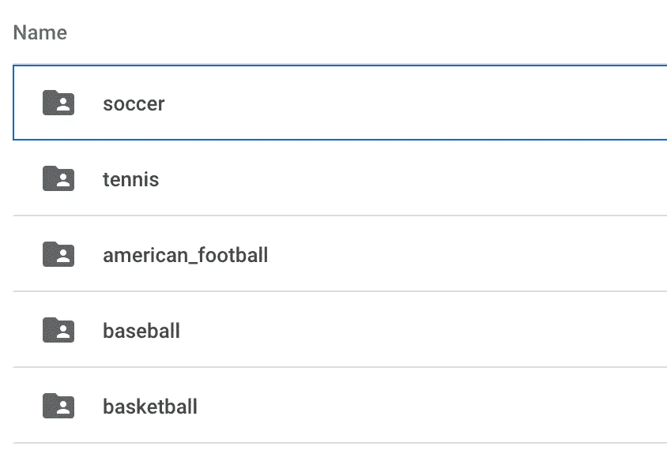
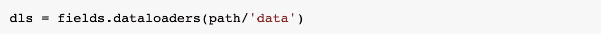
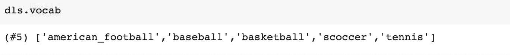
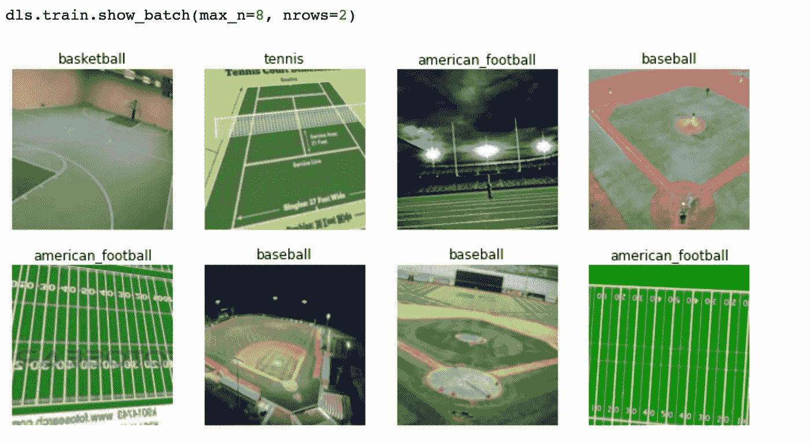
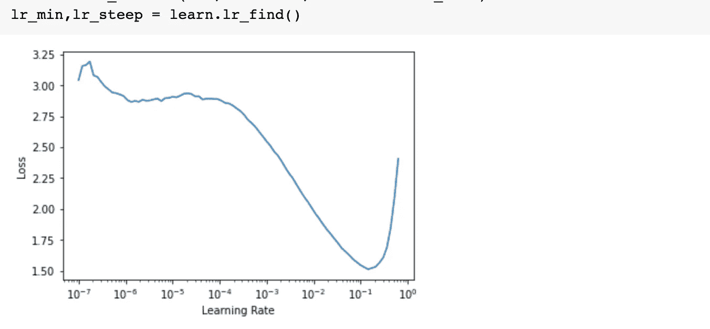
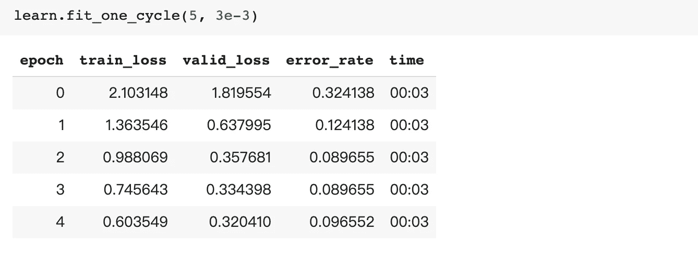
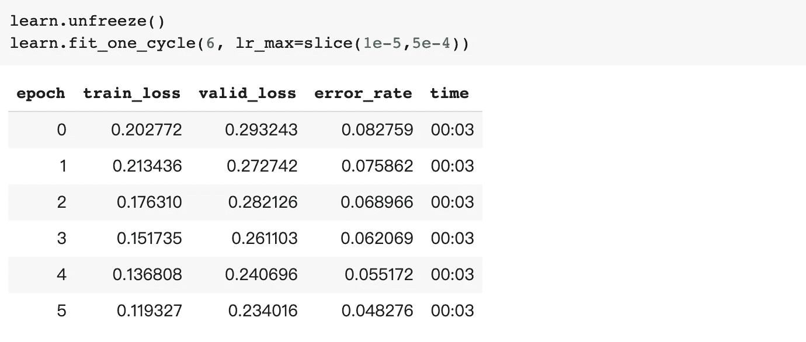
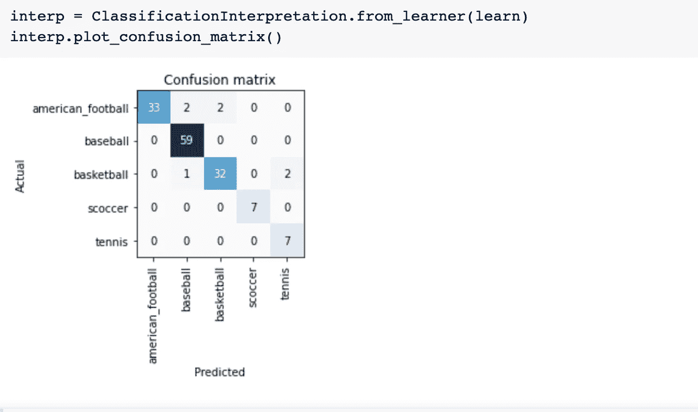
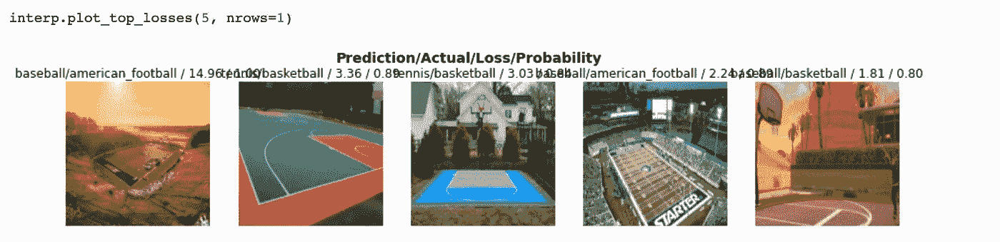

# 在 Colab 上使用 Fastai v2 进行图像分类

> 原文：<https://towardsdatascience.com/image-classification-using-fastai-v2-on-colab-33f3ebe9b5a3?source=collection_archive---------18----------------------->

## 一步一步的指导训练和分类图像，只需几行代码


瑞安·卡彭特在 [Unsplash](https://unsplash.com?utm_source=medium&utm_medium=referral) 上拍摄的照片

# 介绍

[Fastai](https://www.fast.ai/) 是一个基于 PyTorch 构建的库，用于深度学习应用。他们的使命是让深度学习更容易使用，并让更多来自各种背景的人参与进来。他们还为 Fastai 提供免费课程。

Fastai v2 于 8 月发布，我将使用它来构建和训练一个深度学习模型，在 Colab 上对不同的运动领域进行分类，只需几行代码。

# 数据收集

首先，我需要收集图像供模型学习。我希望有一个模型来分类不同的运动领域:棒球，篮球，足球，网球和美式足球。我搜索并下载了这些图片，保存在不同的文件夹中，然后上传到 Google Drive。



文件夹包含运动场图片。(图片由作者提供)

# 设置 Colab 环境

一旦数据集准备好了，我就可以开始 Colab 的工作了。

首次升级 fastai，

```
!pip install fastai --upgrade -q
```

并导入`fastai.vision`，

```
from fastai.vision.all import *
```

然后安装 Google Drive 并设置路径

```
from google.colab import drive
drive.mount(‘/content/gdrive’, force_remount=True)
root_dir = ‘gdrive/My Drive/Colab Notebooks/’
base_dir = root_dir + ‘ball_class’
path=Path(base_dir)
```

现在我们准备好出发了。

# 数据块和数据加载器

Fastai 提供了一个中级 API: DataBlock 来处理数据，它非常容易使用。

```
fields = DataBlock(blocks=(ImageBlock, CategoryBlock),
   get_items=get_image_files,
   get_y=parent_label,
   splitter=RandomSplitter(valid_pct=0.2, seed=42),
   item_tfms=RandomResizedCrop(224, min_scale=0.5),
   batch_tfms=aug_transforms())
```

可以使用不同的`blocks`，在这种情况下，我们使用`ImageBlock`作为 x，使用`CategoryBlock`作为标签。对于不同的应用，也可以使用其他块，例如 MultiCategoryBlock、MaskBlock、PointBlock、BBoxBlock、BBoxLblBlock。

我使用 fastai 中的`get_image_files`函数获得图像的路径作为 x，并使用`parent_label`方法找到文件夹名称作为标签。fastai 中有一些内置函数，你也可以自己写函数来做这个。

然后我用`RandomSplitter`分割训练和验证数据集。

然后使用`RandomResizedCrop`将图像调整为 224，使用`aug_transforms()`进行数据扩充。

这是 Fastai 数据块的一种模板，它非常灵活，你可以根据你的情况改变它。你可以在这里找到详细的 [tutoria](https://docs.fast.ai/tutorial.datablock) l。

准备好数据块后，我们可以创建数据加载器:



并使用`vocab`检查标签



展示一些带有标签的图片



# 火车

现在我们准备好训练了。

我使用 resnet34 创建了一个 CNN 学习者:

```
learn = cnn_learner(dls, resnet34, metrics=error_rate)
```

并使用`lr_find()`找到合适的学习率



然后我们可以使用`fit_one_cycle`训练模型



只有经过 5 个历元，我们才能达到> 90%的准确率。

现在我们可以解冻网络，训练整个网络。



让我们来看看，仅仅经过几个纪元，我们就达到了 95%的准确率。

# 解释

我们也可以解释这个模型。混淆矩阵可以用以下公式绘制:



我们也可以用这个来看损失最高的图像。



本文展示了一个使用 fastai 进行图像分类的简单快捷的例子。使用这个强大的库可以创建更复杂和有趣的应用程序。

感谢阅读，编码快乐。