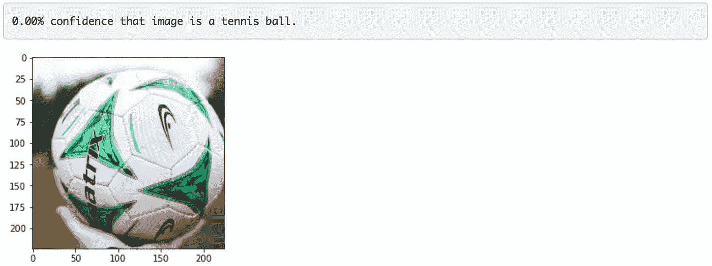
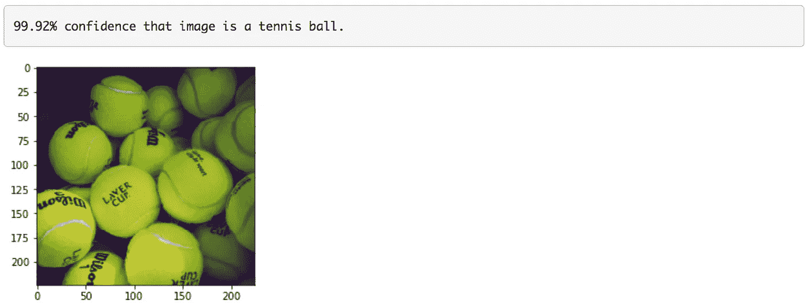

# 基于 GluonCV 的图像分类

> 原文：<https://towardsdatascience.com/image-classification-using-gluoncv-f6ae5401d6ae?source=collection_archive---------59----------------------->

## 使用 GluonCV 的预训练图像分类网络实现网球检测器

在[的上一篇文章](/object-detection-using-gluoncv-b7940670ba54)中，我们讨论了使用 GluonCV 的物体检测。在本文中，我们将讨论如何实现一个二值图像分类器，使用 GluonCV 的预训练图像分类网络对给定图像是否是网球进行分类。我们一步一步地实现机器学习管道，从加载和转换输入图像，到加载和使用预训练的模型。

1.  **导入库**

为了开始一些初始设置，我们将导入包并设置数据的路径。

```
import mxnet as mx
import gluoncv as gcv
import matplotlib.pyplot as plt
import numpy as np
import os
from pathlib import Path
```

**2。加载图像**

为了加载图像，让我们实现一个函数，在给定文件路径的情况下从磁盘加载图像。该函数应该返回一个 8 位图像数组，这是在 MXNet 的 NDArray 格式和 HWC 布局(即高度，宽度，然后通道)。

```
def **load_image**(filepath):
    image = mx.image.imread(filepath)
    return image
```

**3。变换图像**

加载图像后，我们应该转换图像，以便它可以用作预训练网络的输入。我们计划在 **ImageNet 上使用预先训练好的网络。**因此，图像转换应遵循用于 **ImageNet** 预训练的相同步骤。图像应通过以下方式进行转换:

1.  将最短尺寸调整为 224。例如(448，1792) -> (224，896)。
2.  裁剪到尺寸为(224，224)的中心正方形。
3.  将图像从 HWC 布局转换为 CHW 布局。
4.  使用 ImageNet 统计数据标准化图像(即每个颜色通道的平均值和方差)。
5.  创建一批 1 个图像。

这可以使用下面的函数来实现。

```
def **transform_image**(array):
    image = gcv.data.transforms.presets.imagenet.transform_eval(array)
    return image
```

**4。加载模型**

我们将使用已经在 ImageNet 上预先训练好的 **MobileNet 1.0** 图像分类模型。该模型可以从 GluonCV 模型动物园加载，如下所示:

```
def **load_pretrained_classification_network**():
    model = gcv.model_zoo.get_model('MobileNet1.0', pretrained=True, root = M3_MODELS)
    return model
```

**5。使用型号**

加载图像后，下一个任务是通过预训练的网络传递变换后的图像，以获得所有 ImageNet 类的预测概率(现在忽略网球类)。

提示 1 :不要忘记你通常是在处理一批图像，即使你只有一张图像。

提示 2:记住我们网络的直接输出不是概率。

```
def **predict_probabilities**(network, data):
    prediction = network(data)
    prediction = prediction[0]
    probability = mx.nd.softmax(prediction)
    return probability
```

**6。查找类别标签**

在 imageNet 中有 1000 个类。对于网球分类，我们需要找到与网球相关的概率(在 1000 个类别中)。这可以通过实现返回给定类标签的索引的函数来完成(例如，`admiral`是索引`321`)。

```
def **find_class_idx**(label):
    for i in range(len(network.classes)):
        if label == network.classes[i]:
            return i
```

使用上面的函数来查找网球的正确索引，您应该实现一个函数来从网络计算的 1000 个类概率中分割网球的计算概率。它还应该将概率从 MXNet `NDArray`转换为 NumPy `float32`。我们将使用它作为图像是一个网球的置信度得分。

```
def **slice_tennis_ball_class**(pred_probas):
    tennis_prob = pred_probas[find_class_idx('tennis ball')]
    return tennis_prob.astype('float32').asscalar()
```

**7。网球图像分类**

把所有的碎片放在一起，我们就可以对一个图像进行分类，可以分辨出一个图像是不是网球。这可以通过创建一个名为`TennisBallClassifier`的类来实现整个分类管道来实现。您应该注意到，预训练模型在初始化期间被加载一次，然后它应该在`classify`方法中使用。

```
class **TennisBallClassifier**():
    def **__init__**(self):
        self._network = load_pretrained_classification_network()

    def **classify**(self, filepath):
        image = **load_image**(filepath)
        transformed_image = **transform_image**(image)
        self._visualize(transformed_image)
        probabilities = **predict_probabilities**(self._network, transformed_image)
        pred_proba = **slice_tennis_ball_class**(probabilities)   
        print('{0:.2%} confidence that image is a tennis ball.'.format(pred_proba))
        return pred_proba

    def **_visualize**(self, transformed_image):
        chw_image = transformed_image[0].transpose((1,2,0))
        chw_image = ((chw_image * 64) + 128).clip(0, 255).astype('uint8')
        plt.imshow(chw_image.asnumpy())classifier = TennisBallClassifier()
filepath = Path(M3_IMAGES, 'erik-mclean-D23_XPbsx-8-unsplash.jpg')
pred_proba = classifier.classify(filepath)
np.testing.assert_almost_equal(pred_proba, 2.0355723e-05, decimal=3)
```



```
filepath = Path(M3_IMAGES, 'marvin-ronsdorf-CA998Anw2Lg-unsplash.jpg')
pred_proba = classifier.classify(filepath)
np.testing.assert_almost_equal(pred_proba, 0.9988895, decimal=3)
```



因此，使用预先训练的模型，我们可以正确地分类图像是否是网球。如上所示，在对足球进行分类时，我们看到该模型给出了 0%的置信度认为它是网球，而对网球图像进行了 99.9%置信度的正确分类。

> 成为媒体会员[这里](https://medium.com/@rmesfrmpkr/membership)支持独立写作，每月 5 美元，获得媒体上的所有故事。