# 利用 Python 中的张量流进行图像分类

> 原文：<https://towardsdatascience.com/image-classification-using-tensorflow-in-python-f8c978824edc?source=collection_archive---------33----------------------->

## 什么是图像分类，如何使用 Python 中的 TensorFlow 进行图像分类？

来源: [Pixabay](https://pixabay.com/illustrations/artificial-intelligence-brain-think-3382507/)

**简介**

在[之前的帖子](/deep-learning-with-tensorflow-5d3a7a8c55cd)中，我们看到了如何在一个简单的数据集上使用 TensorFlow。在这个例子中，我们将使用 TensorFlow 进行图像分类。我们将要使用的数据集是 MNIST 数据集，它是张量流数据集的一部分。

**什么是图像分类？**

图像分类是指计算机视觉中可以根据图像的视觉内容对图像进行分类的过程。例如，图像分类算法可以被设计成辨别图像是否包含人形。

**导入库**

首先，我们需要导入所需的库。在本例中，我们需要:

*   **Numpy**—Python 编程语言的库，增加了对大型多维数组和矩阵的支持，以及对这些数组进行操作的大量高级数学函数。
*   **TensorFlow** —一个免费的开源软件库，用于数据流和跨一系列任务的差异化编程。
*   **TensorFlow 数据集—** 一组随时可用的数据集，使用 TensorFlow 或其他 Python ML 框架。

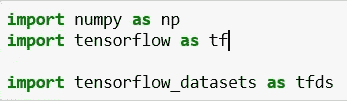

**加载和解包数据**

现在，我们需要加载数据。MNIST 数据库由具有手写数字的 28×28 大小的图像组成。

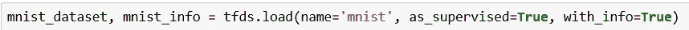

此外，我们需要解开数据——我们这样做是因为我们需要培训、验证和测试集。

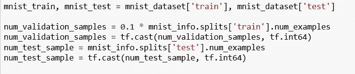

**缩放图像**

我们将定义一个函数来缩放图像。我们这样做是因为 RGB 值(红、绿、蓝)每个都是 8 位。每种颜色的范围是 0-255(2⁸= 256 种可能性)。组合范围是 256*256*256。通过除以 255，0–255 范围可以描述为 0.0–1.0 范围，其中 0.0 表示 0 (0x00)，1.0 表示 255 (0xFF)。

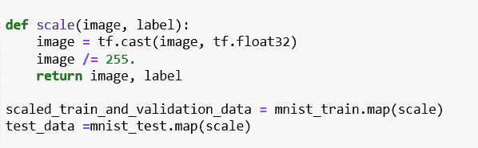

**洗牌数据**

因为数据可能在一个部分中包含相同的值，所以我们需要对其进行混排。缓冲区大小是一个标量，它影响转换的随机性。它维护一个 buffer_size 元素的缓冲区，并从该缓冲区中随机选择下一个元素(如果下一个输入元素可用，则用下一个输入元素替换它)，而不是对整个数据集进行洗牌。洗牌后，我们需要批量数据集。批处理将数据集的 n 个连续元素堆栈到单个元素中的最简单形式是使用 batch 方法。Dataset.batch()转换正是这样做的。

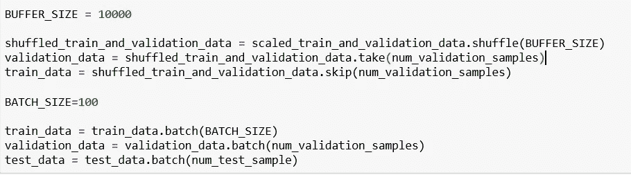

**概述模型**

我们需要定义输出大小—在我们的例子中，我们期望输出从 0 到 9，所以大小将是 10。

接下来，我们需要定义隐藏层的大小。隐藏层的大小应介于输入层和输出层的大小之间。在这种情况下，隐藏层大小将为 50。

唯一剩下的事情就是定义模型。本例中的模型是使用 keras 定义的。顺序模型是层的线性堆叠。当我们定义模型时，我们需要为隐藏层和输出层选择激活函数。如果你想了解更多关于激活功能的内容，在之前的帖子里有完整的解释—[https://towardsdatascience . com/deep-learning-with-tensor flow-5d 3a 7 a 8 c 55 CD](/deep-learning-with-tensorflow-5d3a7a8c55cd)

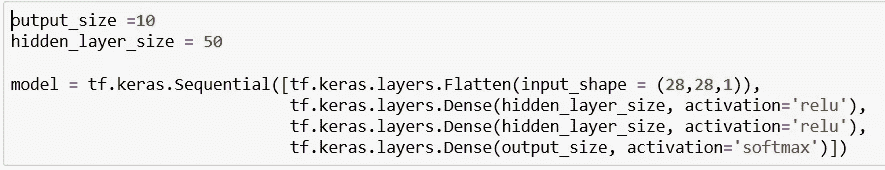

**编译模型**

在这一步中，我们将为培训配置模型。Compile 定义了损失函数、优化器和指标。我们需要一个编译好的模型来训练(因为训练使用了损失函数和优化器)。

*   优化器:优化算法或策略负责减少损失，并尽可能提供最准确的结果。在这个例子中，我们使用了一种叫做 Adam 的优化算法。Adam 是一种优化算法，可以用来代替经典的随机梯度下降过程，根据训练数据迭代地更新网络权重。
*   **损失**:这是一种评估特定算法对给定数据的建模程度的方法。如果预测与实际结果相差太多，损失函数就会产生一个非常大的数字。分类交叉熵和稀疏分类交叉熵具有相同的损失函数，唯一的区别是，当输入是一次热编码时，我们使用分类交叉熵，当输入是整数时，我们使用稀疏分类交叉熵。
*   **指标**:指标是用来判断模型性能的函数。

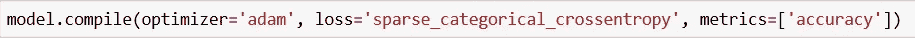

**训练模型**

当我们拟合模型时，我们实际上是在为固定数量的历元(数据集上的迭代)训练模型。我们需要定义批量大小、最大时期和提前停止。

*   **批量** —一次正向/反向传递中训练样本的数量
*   **时期数** —训练模型的时期数。一个历元是对所提供的整个 x 和 y 数据的迭代。
*   **提前停止** —当监测的数量停止提高时，停止训练。耐心是一个数字，它定义了产生无改善的监控量的时期数，在此之后训练将停止。

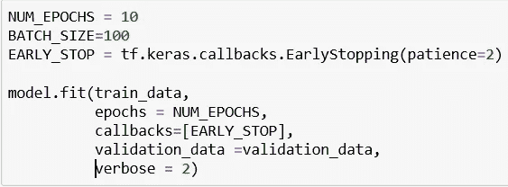

**结果**

我们可以通过 epoch 监控训练过程。使用训练和验证集，每个历元给我们提供关于准确性和损失的信息。

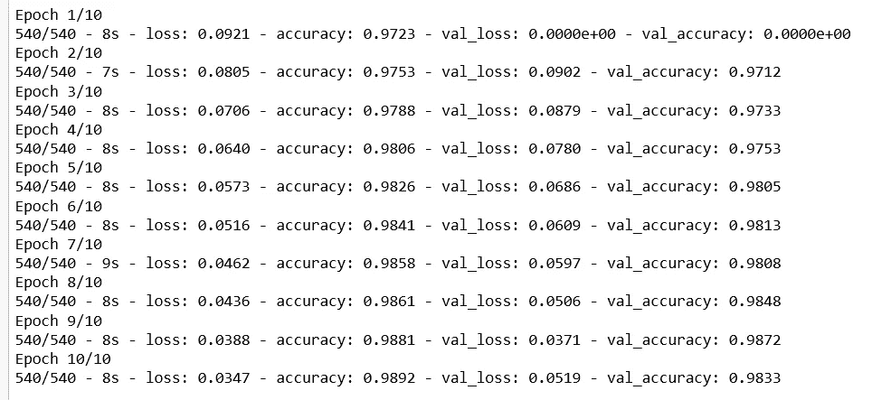

**评估模型**

该函数返回测试集上模型的损失值和度量值。在这个函数中，输入数据将是我们的测试集。我们可以打印测试损失和测试准确度——在这个例子中，我们的准确度接近 97%。

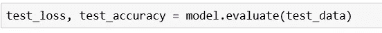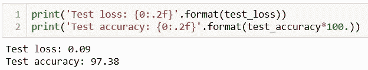

**结论**

这只是图像分类的一个简单例子。我们可以对图像进行许多更复杂的修改。例如，我们可以对图像应用各种过滤器，这些过滤器使用数学算法来修改图像。有些过滤器非常容易使用，而有些则需要大量的技术知识。

如果你对这个话题感兴趣，请随时联系我。

领英简介:[https://www.linkedin.com/in/ceftimoska/](https://www.linkedin.com/in/ceftimoska/)

博文原文可从以下链接获得:[https://interworks . com . MK/image-class ification-using-tensor flow-in-python/](https://interworks.com.mk/image-classification-using-tensorflow-in-python/)

另外，你可以在下面的链接中找到另一篇类似的博文:[https://interworks.com.mk/focusareas/data-management/](https://interworks.com.mk/focusareas/data-management/)