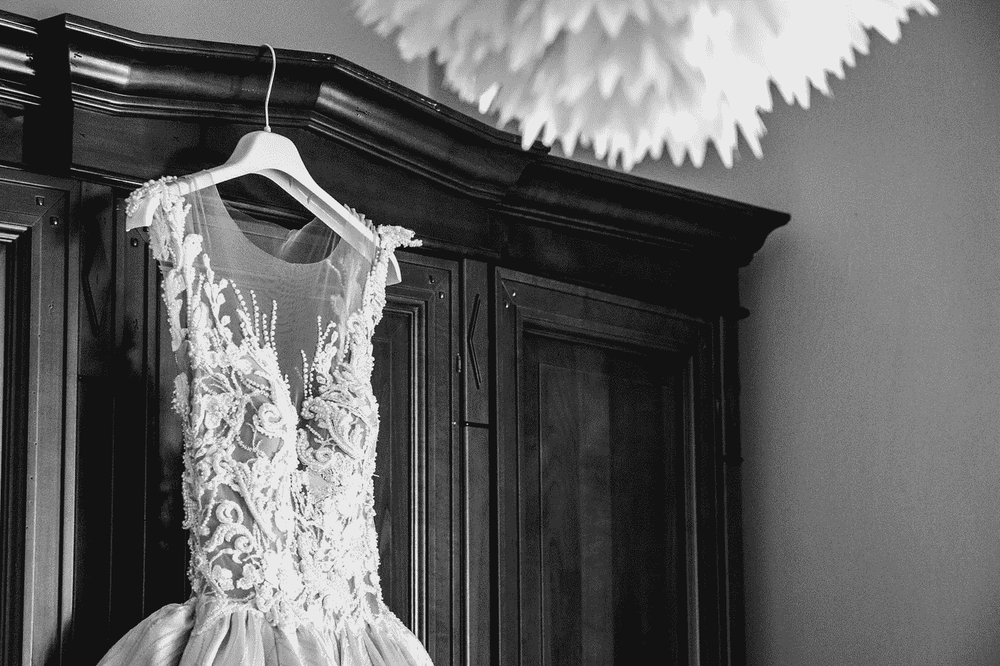
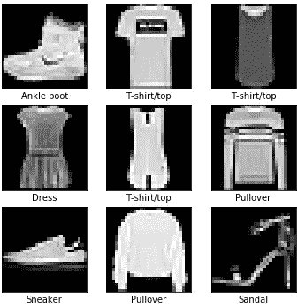
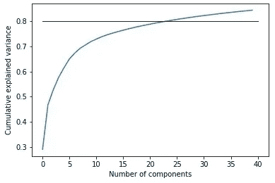
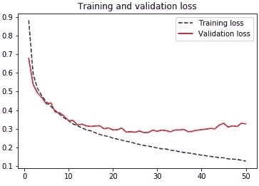
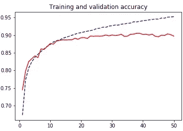

# 时尚 MNIST 图像分类:为什么卷积神经网络优于传统的机器学习算法

> 原文：<https://towardsdatascience.com/image-classification-with-fashion-mnist-why-convolutional-neural-networks-outperform-traditional-df531e0533c2?source=collection_archive---------14----------------------->

在最近十年，随着深度学习的发现，图像分类领域经历了一次复兴。传统的机器学习方法已经被更新更强大的深度学习算法所取代，例如卷积神经网络。然而，要真正理解和欣赏深度学习，我们必须知道为什么它在其他方法失败的地方成功了。在本文中，我们试图通过在时尚 MNIST 数据集上应用各种分类算法来回答其中的一些问题。

因贾·帕夫里奇在 [Unsplash](https://unsplash.com/s/photos/female-clothes?utm_source=unsplash&utm_medium=referral&utm_content=creditCopyText) 拍摄的照片

**数据集信息**时尚 MNIST 于 2017 年 8 月由 Zalando Fashion 的研究实验室推出。它的目标是作为测试机器学习算法的新基准，因为 MNIST 变得太容易了，被过度使用了。MNIST 由手写数字组成，而时尚 MNIST
则由 10 种不同的服装物件的图像组成。每个图像具有以下属性:

*   其尺寸为 28 × 28 像素。
*   相应地旋转并以灰度表示，整数值范围从 0 到 255。
*   用黑色表示的空白区域，值为 0。

在数据集中，我们区分以下服装对象:

*   t 恤/上衣
*   裤子
*   套衫
*   连衣裙
*   外套
*   凉鞋
*   衬衫
*   运动鞋
*   包
*   踝靴

**探索性数据分析**由于数据集是作为 Keras 库的一部分提供的，并且图像已经过处理，因此我们不需要进行太多的预处理。我们所做的唯一改变是将图像从 2D 阵列转换成 1D 阵列，因为这使得它们更容易处理。

数据集由 70000 幅图像组成，其中 60000 幅作为训练集，10000 幅作为测试集。像在原始 MNIST 数据集中一样，项目是均匀分布的(每个训练集 6000 个，测试集中 1000 个)。

不同服装的图片示例。作者照片。

然而，一幅图像仍然有 784 个维度，所以我们转向主成分分析(PCA)，看看哪些像素是最重要的。我们设置了 80%累积方差的传统基准，该图告诉我们，仅用大约 25 个主成分(PC 总数的 3%)就可以做到这一点。然而，这并不奇怪，因为我们可以在上面的照片中看到，在每个图像中有许多共享的未使用空间，不同类别的服装有不同的黑色图像部分。后者可能与以下事实有关:大约 70%的累积方差仅由 8 个主成分解释。

解释的累积差异百分比。作者照片。

我们将在逻辑回归、随机森林和支持向量机中应用主成分。

图像分类问题只是分类问题的一小部分。使用最多的图像分类方法是深度学习算法，其中一种是卷积神经网络。其余采用的方法将是常用分类方法的一个小集合。由于分类标签是均匀分布的，没有错误分类的惩罚，我们将使用准确性度量来评估算法。

**卷积神经网络(CNN)** 我们采用的第一种方法是 CNN。由于图像是灰度的，我们只应用了一个通道。我们选择了以下架构:

*   两个卷积层，32 和 64 个滤波器，3 × 3 内核大小，以及 relu 激活。
*   选择轮询层来操作尺寸为 2 × 2 的瓦片，并选择其中的最大元素。
*   两组密集层，第一组选择 128 个特征，具有 relu 和 softmax 激活。

这个架构没什么特别的。事实上，这是我们可以用于 CNN 的最简单的架构之一。这向我们展示了这类方法的真正威力:用一个基准结构获得很好的结果。

对于损失函数，我们选择分类交叉熵。为了避免过度拟合，我们从训练集中选择了 9400 幅图像作为我们参数的验证集。我们使用了新型优化器 adam，它改进了
标准梯度下降法，并对每个参数使用不同的学习率，批量大小等于 64。该模型被训练了 50 个时期。我们在下图中展示了精确度和损耗值。

作者照片。

作者照片。

我们看到该算法在 15 个周期后收敛，它没有被过度训练，所以我们对它进行了测试。获得的测试精度等于
89%，这是所有方法中获得的最好结果！

在讨论其他方法之前，让我们解释一下卷积层的作用。一个直观的解释是，第一层捕捉直线，第二层捕捉曲线。在这两层上，我们应用了最大池，它选择内核中的最大值，将衣服部分与空白空间分开。通过这种方式，我们获得了数据的代表性。在其他情况下，神经网络自己执行特征选择。在最后一个池层之后，我们得到一个人工神经网络。因为我们正在处理分类问题，最后一层
使用 softmax 激活来获得类别概率。由于类别概率遵循一定的分布，交叉熵表示与网络优选分布的距离。

**多项式逻辑回归**由于像素值是分类变量，我们可以应用多项式逻辑回归。我们以 one vs rest 的方式应用它，训练十个二元逻辑回归分类器，我们将使用它们来选择项目。为了不过度训练，我们使用了 L2 正则化。我们在这个算法上得到 80%的准确率，比卷积神经网络低 9%。但我们必须考虑到，这种算法适用于居中且正常旋转的灰度图像，有很多空白空间，因此它可能不适用于更复杂的图像。

**最近邻居和质心算法**我们使用了两种不同的最近距离算法:

*   k-最近邻
*   最近质心

最近质心算法找到每一类元素的平均值，并将测试元素分配给被分配了最近质心的类。这两种算法都是针对 L1 和 L2 距离实现的。k-最近算法的准确率为 85%，而质心算法的准确率为 67%。这些结果是在 k=12 时获得的。k-最近邻的高精度告诉我们，属于同一类的图像往往在图像上占据相似的位置，并且也具有相似的像素强度。虽然最近邻获得了良好的结果，但它们的性能仍然比 CNN 差，因为它们不在每个特定特征的邻域中操作，而质心失败，因为它们不能区分相似外观的对象(例如套头衫与 t 恤/上衣)

**随机森林**为了选择用于估计的最佳参数，我们使用平方根(bagging)和全部数量的特征、基尼和熵标准以及具有最大深度 5 和 6 的树来执行网格搜索。网格搜索建议我们应该使用具有熵标准的特征的平方根数量(两者都是分类任务所期望的)。然而，所获得的准确性仅等于 77%，这意味着随机森林对于该任务来说不是特别好的方法。失败的原因是主成分不代表图像可以拥有的矩形分区，随机森林在其上操作。同样的推理也适用于全尺寸图像，因为树会太深，失去可解释性。

**支持向量机(SVM)** 我们使用径向和多项式核来应用 SVM。径向核有 77%的准确率，而多项式核失败得很惨，只有 46%的准确率。虽然图像分类不是他们的强项，但对于其他二元分类任务仍然非常有用。他们最大的警告是，他们需要特征选择，这会降低准确性，如果没有它，他们的计算成本会很高。此外，他们以一对一的方式应用多类分类，这使得有效地创建分离超平面变得更加困难，从而在处理非二进制分类任务时失去了价值。

**结论**在本文中，我们对一个图像分类问题应用了多种分类方法。我们已经解释了为什么 CNN 是我们可以采用的最佳方法，以及为什么其他方法会失败。CNN 是最实用且通常是最准确的方法的一些原因是:

*   他们可以通过层次转移学习，保存推论，并在随后的层次上做出新的推论。
*   在使用该算法之前不需要特征提取，它是在训练期间完成的。
*   它识别重要的特征。

然而，他们也有自己的警告。众所周知，它们在旋转和缩放不同的图像上是失败的，但在这里不是这样，因为数据是经过预处理的。尽管其他方法无法在该数据集上给出良好的结果，但它们仍然用于与图像处理相关的其他任务(锐化、平滑等)。).

代码:[https://github . com/raden jeci 153/Stat _ ML/blob/master/project . ipynb](https://github.com/radenjezic153/Stat_ML/blob/master/project.ipynb)