# 影像分类器-使用 Monk 库进行房屋类型分类

> 原文：<https://towardsdatascience.com/image-classifier-house-room-type-classification-using-monk-library-d633795a42ef?source=collection_archive---------24----------------------->

## 关于如何使用 Monk 库解决计算机视觉分类问题的文章。

这篇文章是一个关于如何使用 Monk 库来分类房间类型的教程，比如客厅、餐厅等等。

详细教程可在 [GitHub](https://github.com/Tessellate-Imaging/monk_v1/blob/master/study_roadmaps/4_image_classification_zoo/Classifier%20-%20House%20room%20type%20Claasification.ipynb) 上获得。

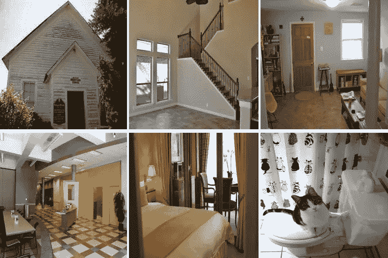

数据集中的一些样本图像

## 关于数据集

*   该数据集包含总共 145436 幅图像，分为七类，即“外部”、“卧室”、“厨房”、“起居室”、“内部”、“浴室”、“餐厅”。
*   可以从[这里](https://drive.google.com/file/d/0BxDIywue_VABY1dRcFVvZ3BodnM/view?usp=sharing)下载。

## 关于 Monk 库和 Monk 如何让图像分类变得简单

*   编写更少的代码，创建端到端的应用程序。
*   只学习一种语法，使用任何深度学习库——py torch、Mxnet、Keras、TensorFlow 等，创建应用。
*   通过多个实验轻松管理您的整个项目。

## 这座图书馆是为谁而建的

*   学生:使用我们的综合学习路线图无缝学习计算机视觉。
*   研究人员和开发人员:创建和管理多个深度学习项目。
*   Kaggle、Codalab、HackerEarth、AiCrowd 等上的比赛参与者。

# 目录

1.  安装 Monk

2.将预训练模型用于部分房屋分类数据集

3.从头开始训练分类器

*   *使用 ResNet 变体训练部分 house 分类器*
*   *了解在 ResNets 变体之间切换时发生的所有差异。*
*   *理解更大更深的网络并不总是意味着更好的结果*
*   *在这个实验中，您将使用 mxnet 后端*

4.结论。

# 1.安装 Monk

```
*#using cuda10.0 download monk using following command***pip install -U monk-gluon-cuda100**
```

更多安装方法请访问 [Monk 库](https://github.com/Tessellate-Imaging/monk_v1#installation)。

# 2.使用预先训练好的模型进行演示

首先，从 google drive 下载预先训练好的模型。

```
**! wget --load-cookies /tmp/cookies.txt "https://docs.google.com/uc?export=download&confirm=$(wget --save-cookies /tmp/cookies.txt --keep-session-cookies --no-check-certificate 'https://docs.google.com/uc?export=download&id=10SrowcOJp8GWqEB21BfCIinqUCHS7PMv' -O- | sed -rn 's/.*confirm=([0-9A-Za-z_]+).*/\1\n/p')&id=10SrowcOJp8GWqEB21BfCIinqUCHS7PMv" -O cls_house_scene_trained.zip && rm -rf /tmp/cookies.txt**
```

上面会下载预训练模型的 zip 文件，命名为 cls_house_scene_trained.zip，现在我们要解压文件了。

```
**! unzip -qq cls_house_scene_trained.zip**
```

导入***monk . glon _ prototype****用于使用和尚库。*

```
**#Using mxnet-gluon backend*

*# When installed using pip*
**from** **monk.gluon_prototype** **import** **prototype***
```

*让我们以推断模式加载模型，对演示数据进行分类。*

```
**# Load project in inference mode*

**gtf = prototype(verbose=1);
gtf.Prototype("Task", "gluon_resnet18_v1_train_all_layers", eval_infer=True);***
```

## *根据一些样本推断*

```
***img_name = "workspace/test/2.jpg"
predictions = gtf.Infer(img_name=img_name);
from IPython.display import Image
Image(filename=img_name, height=300, width=300)***
```

**

```
***img_name = "workspace/test/3.jpg"
predictions = gtf.Infer(img_name=img_name);
from IPython.display import Image
Image(filename=img_name, height=300, width=300)***
```

*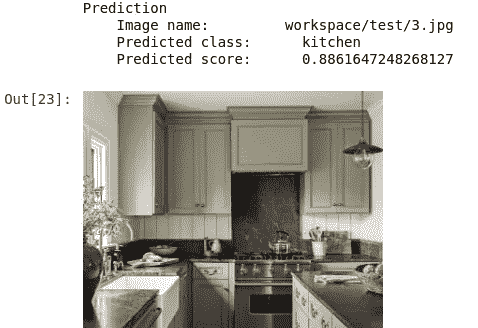*

```
***img_name = "workspace/test/6.jpg"
predictions = gtf.Infer(img_name=img_name);
from IPython.display import Image
Image(filename=img_name, height=300, width=300)***
```

*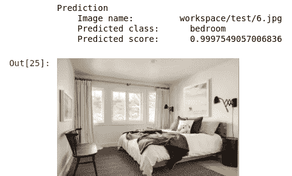*

*更多例子请访问[笔记本](https://github.com/Tessellate-Imaging/monk_v1/blob/master/study_roadmaps/4_image_classification_zoo/Classifier%20-%20House%20room%20type%20Claasification.ipynb)。*

# *3.**从头开始训练自定义分类器***

## *什么是 ResNet？*

*来自[https://towards data science . com/an-overview-of-resnet-and-its-variants-5281 e2f 56035](/an-overview-of-resnet-and-its-variants-5281e2f56035)*

```
*- The core idea of ResNet is introducing a so-called “identity shortcut connection” that **skips one or more layers**
- The deeper model should not produce a training error higher than its shallower counterparts.
- solves the problem of **vanishing gradients** as network depth increased*
```

*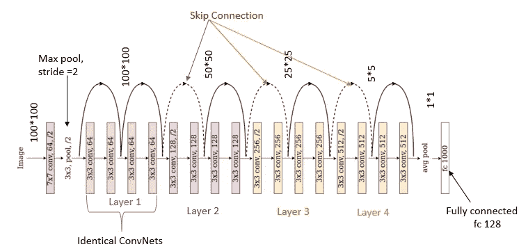*

*ResNet18 架构*

## *近期内容*

1.  *加载数据集*
2.  *训练模型采用 resnet18_v1(只训练最后一层)架构进行迁移学习。*
3.  *训练模型采用 resnet18_v1(训练所有层)架构进行迁移学习。*
4.  *训练模型采用 resnet18_v2(只训练最后一层)架构进行迁移学习。*
5.  *训练模型采用 resnet34_v1(只训练最后一层)架构进行迁移学习。*
6.  *比较所有的型号。*

## *1.加载数据集*

*数据集学分:[https://omidpoursaeed . github . io/publication/vision-based-real-estate-price-estimate/](https://omidpoursaeed.github.io/publication/vision-based-real-estate-price-estimation/)*

*步骤 1:下载数据集。*

```
***! wget --load-cookies /tmp/cookies.txt "https://docs.google.com/uc?export=download&confirm=$(wget --save-cookies /tmp/cookies.txt --keep-session-cookies --no-check-certificate 'https://docs.google.com/uc?export=download&id=0BxDIywue_VABY1dRcFVvZ3BodnM' -O- | sed -rn 's/.*confirm=([0-9A-Za-z_]+).*/\1\n/p')&id=0BxDIywue_VABY1dRcFVvZ3BodnM" -O dataset.zip && rm -rf /tmp/cookies.txt***
```

*步骤 2:解压缩数据集。*

```
***! unzip -qq dataset.zip***
```

## *2.训练模型采用 resnet18_v1(只训练最后一层)架构进行迁移学习。*

*步骤 1:加载实验并插入数据。更多详情请访问[。](https://clever-noyce-f9d43f.netlify.app/#/quick_mode/quickmode_gluon)*

```
**# Load experiment*
**monk_gln = prototype(verbose=1);
monk_gln.Prototype("Task", "gluon_resnet18_v1");** *# Insert data and set params in default mode*
**monk_gln.Default(dataset_path="Train", 
            model_name="resnet18_v1", 
            freeze_base_network=True,
            num_epochs=10);***
```

*步骤 2:训练模型。*

```
**#Start Training*
**monk_gln.Train();***
```

## *3.训练模型采用 resnet18_v1(训练所有层)架构进行迁移学习。*

*步骤 1:加载实验并插入数据。更多详情[请访问](https://clever-noyce-f9d43f.netlify.app/#/quick_mode/quickmode_gluon)。参数***freeze _ base _ network****将被设置为 false 以训练所有层。**

```
***# Load experiment*
**monk_gln = prototype(verbose=1);
monk_gln.Prototype("Task", "gluon_resnet18_v1_train_all_layers");**

*# Insert data and set params in default mode*
**monk_gln.Default(dataset_path="Train", 
            model_name="resnet18_v1", 
            freeze_base_network=False,
            num_epochs=10);****
```

**步骤 2:训练模型。**

```
***#Start Training*
**monk_gln.Train();****
```

## **4.训练模型采用 resnet18_v2(只训练最后一层)架构进行迁移学习。**

**步骤 1:加载实验并插入数据。欲了解更多详情[，请访问](https://clever-noyce-f9d43f.netlify.app/#/quick_mode/quickmode_gluon)。**

```
***# Load experiment* **monk_gln = prototype(verbose=1);
monk_gln.Prototype("Task", "gluon-resnet18_v2");**

*# Insert data and set params in default mode*
**monk_gln.Default(dataset_path="Train", 
            model_name="resnet18_v2", 
            freeze_base_network=True,
            num_epochs=10);****
```

**步骤 2:训练模型。**

```
***#Start Training*
**monk_gln.Train()****
```

## ****5。训练模型采用 resnet34_v1(** 只训练最后一层)**架构进行迁移学习。****

**步骤 1:加载实验并插入数据。更多详情请访问。**

```
***# Load experiment* **monk_gln = prototype(verbose=1);
monk_gln.Prototype("Task", "gluon-resnet18_v2");***# Insert data and set params in default mode*
**monk_gln.Default(dataset_path="Train", 
            model_name="resnet34_v1", 
            freeze_base_network=True,
            num_epochs=10);****
```

**步骤 2:训练模型。**

```
***#Start Training*
**monk_gln.Train()****
```

## **6.比较所有的模型。**

**步骤 1:使用 Monk 库的比较类。更多详情请访问。**

```
***# Invoke the comparison class*
**from** **monk.compare_prototype** **import** **compare****
```

**步骤 2:创建和管理比较实验。提供项目名称。**

```
****gtf = compare(verbose=1);
gtf.Comparison("Comparison-1");****
```

**这将按照以下结构创建文件和目录**

```
**workspace
    |
    |--------comparison
                    |
                    |
                    |-----Compare-1
                                |
                                |------stats_best_val_acc.png
                                |------stats_max_gpu_usage.png
                                |------stats_training_time.png
                                |------train_accuracy.png
                                |------train_loss.png
                                |------val_accuracy.png
                                |------val_loss.png                    
                    |-----comparison.csv (Contains necessary details of all experiments)**
```

**步骤 3:将实验添加到比较对象中。**

*   **第一个参数——项目名称。**
*   **第二个参数——实验名称。**

```
***#add the models trained above.* **gtf.Add_Experiment("Task", "gluon_resnet18_v1");
gtf.Add_Experiment("Task", "gluon_resnet18_v1_train_all_layers");
gtf.Add_Experiment("Task", "gluon-resnet18_v2");
gtf.Add_Experiment("Task", "gluon-resnet34_v1");****
```

**步骤 4:运行分析。该步骤生成七幅图像。**

```
****gtf.Generate_Statistics();****
```

**步骤 5:可视化研究比较指标。**

*   **训练准确度曲线**

```
****from IPython.display import Image
Image(filename="workspace/comparison/Comparison-1/train_accuracy.png")****
```

**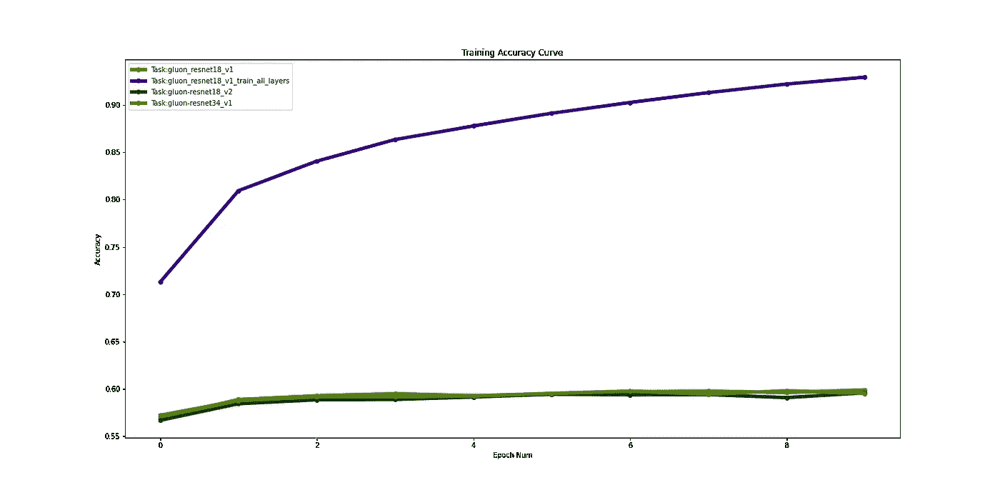**

*   **训练损失曲线**

```
****Image(filename="workspace/comparison/Comparison-1/train_loss.png")****
```

**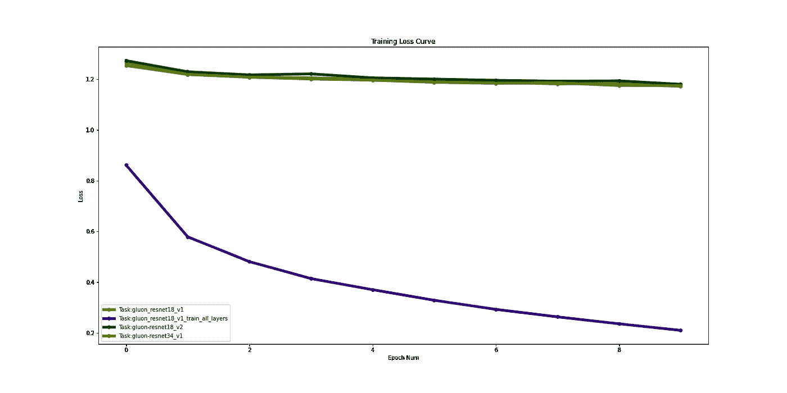**

*   **验证准确度曲线**

```
****Image(filename="workspace/comparison/Comparison-1/val_accuracy.png")****
```

**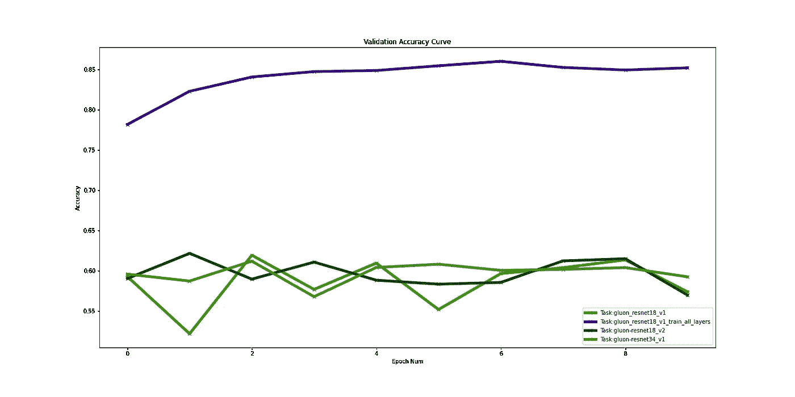**

*   **验证损失曲线**

```
****Image(filename="workspace/comparison/Comparison-1/val_loss.png")****
```

**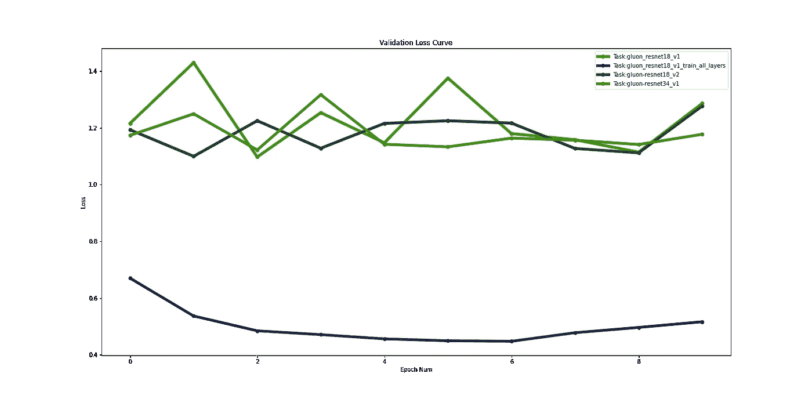**

*   **培训时间被占用**

```
****Image(filename="workspace/comparison/Comparison-1/stats_training_time.png")****
```

**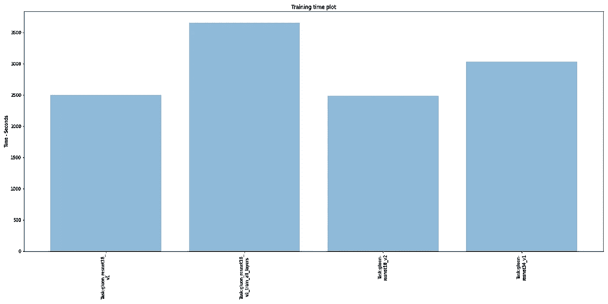**

*   **最大 GPU 使用率**

```
****Image(filename="workspace/comparison/Comparison-1/stats_max_gpu_usage.png")****
```

**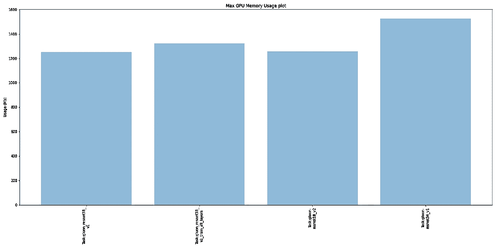**

*   **最佳验证准确性**

```
****Image(filename="workspace/comparison/Comparison-1/stats_best_val_acc.png")****
```

**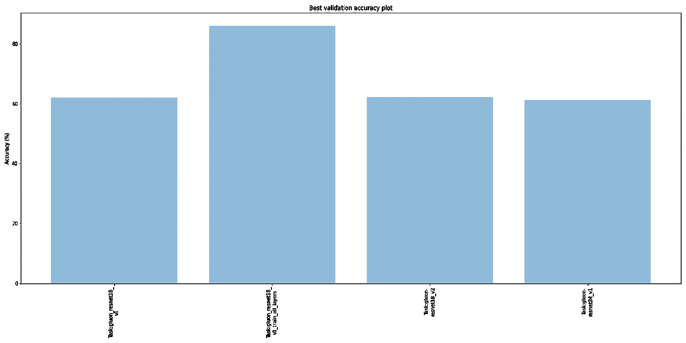**

# **结论**

1.  **Monk library 让学生、研究人员和竞争对手可以非常轻松地创建深度学习模型，并尝试不同的超参数调整来提高模型的准确性。**
2.  **预先训练的模型可以直接下载使用，而无需进入模型创建部分。**
3.  **从上面的图表中，我们可以看到，在这个数据集中，所有层都是可训练的模型比其他模型更准确。但这并不总是正确的，所以直到明智的尝试两者。**
4.  **此外，与仅最后一层可训练的模型相比，所有层可训练时所花费的时间大约多 40%。**

## **感谢阅读。请给出你的建议。**

****

**Rohit 是一个 BTech。最后一年学生。他有机器学习和深度学习的知识。他有兴趣在人工智能和人工智能领域工作。目前，他在 Tessellate Imaging 担任计算机视觉实习生。在 [LinkedIn](https://www.linkedin.com/in/rohit96/) 上和他联系。**