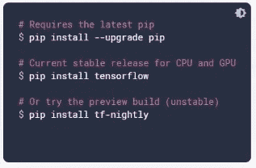

# 使用张量流的图像分类器

> 原文：<https://towardsdatascience.com/image-classifier-using-tensorflow-a8506dc21d04?source=collection_archive---------56----------------------->

## 如何创建图像分类器的分步指南

[杰瑞米·托马斯](https://unsplash.com/@jeremythomasphoto?utm_source=unsplash&utm_medium=referral&utm_content=creditCopyText)在 [Unsplash](https://unsplash.com/s/photos/space?utm_source=unsplash&utm_medium=referral&utm_content=creditCopyText) 上拍照

如果你不知道卷积神经网络是如何工作的，看看我下面的博客，它解释了 CNN 中的层和它的目的

 [## 卷积神经网络简介

### 关于卷积神经网络如何工作的直觉

medium.com](https://medium.com/dataseries/introduction-to-convolutional-neural-networks-5a227f61dd50) 

我们将在猫狗数据集上工作，这意味着我们的网络将预测提供的图像是猫还是狗。您可以在下面找到数据集和代码的链接

 [## 猫和狗

### 训练 DL 模型的猫狗数据集

www.kaggle.com](https://www.kaggle.com/tongpython/cat-and-dog)  [## ajaymuktha/深度学习

### 这个知识库包含了神经网络算法——ajaymuktha/deep learning

github.com](https://github.com/ajaymuktha/DeepLearning/blob/master/Convolutional%20Neural%20Networks/cnn.py) 

为了便于计算，我从数据集中提取了大约 10，000 张图像，制作了一个验证文件夹，并放置了一些猫和狗的随机图像，以测试训练后的分类器。

数据集包含两个文件夹 **Train** 和 T **est。**训练文件夹包含两个文件夹，由用于训练的猫和狗的图像组成。测试文件夹也由两个文件夹组成，这两个文件夹由用于评估模型的猫和狗的图像组成。训练集由 8000 幅猫狗图像组成，测试集由 2000 幅猫狗图像组成

# 安装 Tensorflow

如果你的 PC 或笔记本电脑没有 GPU，你可以使用 Google Colab，或者使用 Jupyter Notebook。如果您使用您的系统，请升级 pip，然后安装 TensorFlow，如下所示

tensorflow.org

# 导入依赖项

在上面几行代码中，我只是导入了这个过程中需要的所有库

# 数据再处理

## 训练集的预处理

我们将在训练图像上应用一些变换以避免过度拟合，如果我们不执行，我们将在训练集和测试集的准确性之间得到很大的差异。

我们执行一些几何变换，如水平翻转图像，垂直翻转，放大，缩小和许多其他可以执行的操作，我们应用它，这样我们的模型就不会过度学习我们的训练图像。我们使用 **ImageDataGenerator** 类执行上述方法。

**train_datagen** 是 ImageDataGenerator 类的实例，它将对训练集中的图像应用所有变换，rescale 方法将对图像中的所有像素应用特征缩放，使其在 0 到 1 的范围内。现在我们需要将它连接到我们的训练数据集。

**flow_from_directory** 将把图像增强过程连接到我们的训练集。我们需要提到我们的训练集的路径。**目标尺寸**是应该输入神经网络的图像尺寸。**批量大小**被定义为一批中图像的数量，**类模式**将是二进制的，因为我们只有两个输出，要么是猫，要么是狗。

## 预处理测试集

我们不为测试集应用变换，因为我们只使用它们来评估，对我们的测试集做的唯一任务是重新缩放图像，因为在训练部分，我们定义了可以馈入网络的图像的目标大小。

现在我们定义从目录中导入测试图像的测试集。我们定义的批量大小、目标大小和班级模式与训练集中提到的相同。

照片由[文森特·所罗门](https://unsplash.com/@vincentiu?utm_source=unsplash&utm_medium=referral&utm_content=creditCopyText)在 [Unsplash](https://unsplash.com/s/photos/space?utm_source=unsplash&utm_medium=referral&utm_content=creditCopyText) 上拍摄

# 构建 CNN

卷积神经网络是一系列连续的层，所以这里我们用一个连续的类来定义它

## **卷积层**

我们使用**添加一个**方法来添加层，首先我们添加卷积层 Conv2D 类，我们需要在其中传递三个参数

**filters** →图像需要应用的特征检测器的数量，也称为内核。

**内核大小** →需要根据行数和列数为您的特征检测器定义一个内核大小。

**input_shape** →每当我们在任何深度学习模型中添加第一层时，我们都需要指定 input_shape，因为我们在处理图像时需要提供我们上面在训练集中提到的目标大小，3 是指 RGB 通道。

**激活 _ 功能** →我们需要指定触发机制的激活功能。

## 联营

这里，我们考虑最大池类，我们需要指定两个参数

**pool_size** →这是我们为卷积层中获得的特征检测器申请的帧的大小。

步幅→帧在所有四个方向上应该移动的量

现在，我们将第二个卷积层应用于我们的网络

## 变平

这里，我们将所有卷积和最大池层转换为一维，这将成为全连接层的输入。

## 全连接层

我们传递到稠密层的参数是作为单元的隐藏神经元的数量，我们使用的激活函数是 relu。

## 输出层

输出单元的数量将是 1，因为我们将只预测一个类，并且激活函数将是 sigmoid 激活函数。

# 训练 CNN

## 编译 CNN

我们考虑采用两个参数的编译方法，一个是编译器 adam，一个是损失函数 binary_crossentropy，我们选择度量作为精确度。

## **训练 CNN**

我们将使用 fit 方法通过训练集进行训练，并使用测试集来评估模型。我们将运行 25 个时期。

## 预言；预测；预告

让我们通过拍摄一个随机图像来进行预测，为此，我们导入基本的库 NumPy …和 image 来执行图像操作。我们使用 **load_img** 函数来加载 PIL 格式的图像，我们提到了测试图像的路径，并且它应该与训练图像具有相同的大小。然后，我们使用 img_array 函数将图像转换为模型期望的数组进行预处理。

我们的 CNN 模型被训练成一批图像，而不是一个单独的图像，所以我们需要增加一个额外的维度。我们将增加一个额外的维度来访问单独的图像。我们使用 NumPy 中的 **expand_dim** 函数来实现。

我们对测试图像使用 predict 方法，还从批量大小中访问图像的标签，并使用 if-else 条件来检查图像是猫还是狗。

这就是现在，希望你喜欢这个关于猫和狗分类的教程，在我的下一个博客中，我将向你解释递归神经网络的重要性，并从头实现它的一个应用。

如果你想知道人工神经网络如何与应用程序一起工作，请查看我下面的博客:

 [## 人工神经网络导论

### 你深度学习的第一步

towardsdatascience.com](/introduction-to-artificial-neural-networks-ac338f4154e5)  [## 用 Tensorflow 构建人工神经网络

### 如何使用 TensorFlow 构建神经网络的分步教程

towardsdatascience.com](/building-an-ann-with-tensorflow-ec9652a7ddd4)