# 用 PyTorch 实现图像聚类

> 原文：<https://towardsdatascience.com/image-clustering-implementation-with-pytorch-587af1d14123?source=collection_archive---------6----------------------->

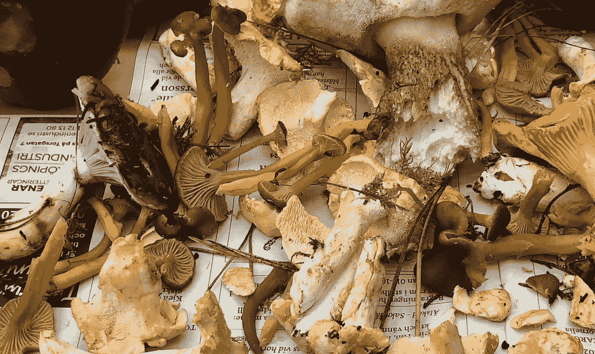

报纸上的蘑菇，作者图片

## 用于蘑菇照片聚类的深度卷积神经网络的逐行教程实现

使用深度卷积神经网络(DCNN)的监督图像分类现在是一个既定的过程。通过预训练的模板模型加上微调优化，许多有意义的应用都可以获得非常高的精确度，例如最近对医学图像的研究[，该研究使用](https://pubmed.ncbi.nlm.nih.gov/31926806/)[模板 Inception v3 模型](https://pytorch.org/hub/pytorch_vision_inception_v3/)，对日常物体的图像进行预训练，在前列腺癌诊断上达到 99.7%的精确度。

对于*无监督的*图像机器学习来说，目前的技术水平远没有解决。

*聚类*是无监督机器学习的一种形式，其中项目的集合——在这种情况下是图像——根据数据集合*本身*中的某种结构进行分组。最终出现在同一聚类中的图像应该比不同聚类中的图像更相似。

图像数据可能很复杂——变化的背景、视野中的多个对象——所以一对图像比另一对图像更相似意味着什么并不明显。没有一个*基础事实*标签，通常不清楚是什么让一种聚类方法比另一种更好。

一方面，无监督的问题因此比有监督的问题更模糊。优化没有既定的正确答案。另一方面，最有趣的东西是从模糊的问题、假设的产生、问题的发现、修补中产生的。为数据和分析工作流的这些领域提供新功能的工具值得我们花费时间和精力。

我将描述一种最近的图像聚类方法的实现(庄*等* 自 2019 年起 [*局部聚集*)。这是近年来发表的许多可能的 DCNN 聚类技术之一。](https://arxiv.org/abs/1903.12355)

我使用 PyTorch 库来展示这个方法是如何实现的，并在整篇文章中提供了几个详细的代码片段。完整的代码可在[回购](https://github.com/anderzzz/monkey_caput)中获得。

尽管图像聚类方法不像它们的监督兄弟一样在标准库中容易获得，PyTorch 仍然能够顺利实现这个非常复杂的方法。因此，我能够探索、测试和轻轻戳一下 DCNNs 在应用于集群任务时能做什么这个谜一样的问题。

我的目标是展示如何从几个概念和方程出发，使用 PyTorch 得出可以在计算机上运行的非常具体的东西，并指导进一步的创新和对任何任务的修补。

我将把这个应用到真菌的图像上。为什么是真菌？你以后会明白的。

## 但是首先…实现一个 VGG 自动编码器

在讨论聚类方法之前，我将实现一个自动编码器(AE)。AEs 有各种各样的应用，[包括降维](https://science.sciencemag.org/content/313/5786/504.abstract)，而且本身也很有趣。它们在图像聚类中的作用将在后面变得清楚。

用 PyTorch 库实现基本 AEs 并不困难(参见[的](https://analyticsindiamag.com/how-to-implement-convolutional-autoencoder-in-pytorch-with-cuda/)和[的](https://afagarap.works/2020/01/26/implementing-autoencoder-in-pytorch.html)中的两个例子)。我将实现特定的 AE 架构，这是 [SegNet](https://arxiv.org/pdf/1511.00561.pdf) 方法的一部分，它建立在 [VGG 模板卷积网络](https://www.geeksforgeeks.org/vgg-16-cnn-model/)之上。VGG 定义了一种架构，最初是为监督影像分类而开发的。

AE 的架构如下图所示。

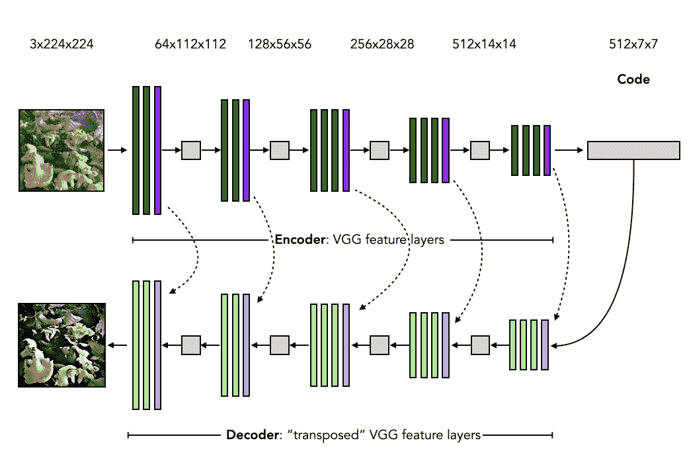

作者图片

图像自动编码的步骤是:

1.  输入图像(左上)通过以下方式处理
2.  一个*编码器*，由带归一化和 ReLU 激活的卷积层(绿色)和最大池层(紫色)组成，直到
3.  获得一个较低维度的*代码*,然后由
4.  一个*解码器*，由带归一化和 ReLU 激活的转置卷积层(浅绿色)和非卷积层(浅紫色)加上一个不带归一化或激活的最终卷积层(黄色)组成，直到
5.  获得与输入尺寸相同的输出图像。

是时候将这种设计写入代码了。

我首先创建一个编码器模块。第一行，包括初始化方法，如下所示:

编码器的架构与 VGG-16 卷积网络的特征提取层相同。因此，该部分[在 PyTorch 库](https://pytorch.org/docs/stable/torchvision/models.html#classification)，`torchvision.models.vgg16_bn`中很容易获得，参见代码片段中的第 19 行。

与 VGG 的规范应用不同，代码是*而不是*进入分类层的。最后两层`vgg.classifier`和`vgg.avgpool`因此被丢弃。

编码器的层需要一次调整。在解码器的非池化层中，来自编码器的最大池化层的*池化索引*必须可用，这在前面的图像中用虚线箭头表示。VGG-16 的模板版本不生成这些指数。然而，可以重新初始化池层来实现这一点。这就是`EncoderVGG`模块的`_encodify`方法所要完成的。

由于这是一个 PyTorch 模块(从`nn.Module`继承而来)，所以需要一个`forward`方法通过`EncoderVGG`的实例来实现小批量图像数据的向前传递:

该方法按顺序执行编码器中的每一层，并在创建池索引时收集它们。在执行编码器模块之后，代码连同一个*有序的*池索引集合一起被返回。

接下来是解码器。

这是 VGG-16 网络的“转置”版本。我使用惊吓引号，因为解码器层看起来很像反向的编码器，但严格来说，它不是一个逆或转置。

解码器模块的初始化有点复杂:

`_invert_`方法在编码器*的层上反向*迭代。

编码器中的卷积(图像中的绿色)被解码器中相应的转置卷积(图像中的浅绿色)替换。`nn.ConvTranspose2d`是 PyTorch 中的库模块，它对数据进行上采样，而不是像更广为人知的卷积运算那样进行下采样。更多解释见[此处](https://naokishibuya.medium.com/up-sampling-with-transposed-convolution-9ae4f2df52d0)。

编码器中的 max-pooling(紫色)被相应的 unpooling(浅紫色)替换，或者`nn.MaxUnpool2d`表示 PyTorch 库模块。

解码器`forward`是:

代码是输入，还有编码器创建的池索引列表。每当执行非池化层时，池化索引一次取一个，相反。这样，关于编码器如何执行最大池化的信息被传送到解码器。

因此，在镜像编码器层的转置层之后，`forward`的输出是与输入到编码器的图像的张量形状相同的张量。

完整的自动编码器模块实现为编码器和解码器实例的基本组合:

产生与相应输入非常相似的输出的 AE 的一组参数是一组好的参数。我使用 AE 的输入和输出之间每个像素的每个通道的均方误差来量化这一点，作为目标函数，或 PyTorch 库中的`nn.MSELoss`。

使用定义的 AE 模型加上可微分的目标函数，PyTorch 的强大工具被部署用于反向传播，以获得梯度，随后是网络参数优化。培训是如何实施的我就不赘述了(好奇的读者可以看看[回购](https://github.com/anderzzz/monkey_caput)中的`ae_learner.py`)。

## 编码器按特征压缩图像，并且是聚类的起点

在训练 AE 之后，它包含可以在较低维度中近似表示图像数据集的重现的较高级特征的编码器。对于真菌的图像数据集，这些特征可以是在几个蘑菇图像之间共享的形状、边界和颜色。换句话说，编码器体现了蘑菇形加上典型背景的紧凑表示。

因此，就这些高级特征而言*非常*相似的两幅图像应该对应于比任何一对随机码都更接近的码，例如通过欧几里德距离或余弦相似性来测量。

另一方面，图像向低维的压缩是高度非线性的。因此，大于某个相当小的阈值的两个代码之间的距离被认为对相应的图像没有什么影响。这对于创建定义明确、清晰的集群来说并不理想。

作为 AE 一部分的编码器是一个起点。编码器接下来将被改进，通过利用学习到的蘑菇状*和*来创建代码，从而将图像压缩成代码，这些代码也形成固有的良好集群。

## 关于局部聚集损失的几个词和方程

[*局部聚集* (LA)方法](https://arxiv.org/abs/1903.12355)定义了一个目标函数来量化一组代码的聚集程度。目标函数不像有监督的机器学习方法那样直接引用关于图像内容的基本事实标签。更确切地说，目标函数量化了编码图像数据*本质上*如何服从明确定义的聚类。

以这种方式获得的明确定义的聚类应该创建有意义的聚类，这不是不言而喻的，也就是说，看起来相似的图像通常是同一聚类的一部分。这就是为什么需要实现和测试。

首先，从 LA 出版物中获得一些关于实现什么的定义。

洛杉矶的集群目标是:

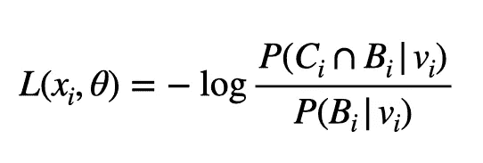

该方程中的 *xᵢ* 为图像张量， *θ* 表示编码器的参数。右手边的 *vᵢ* 是对应 *xᵢ* 的代码。两组 *Cᵢ* 和 *Bᵢ* 由集合中其他图像的编码组成，分别命名为*近邻*和*背景近邻*到 *vᵢ* 。

对于一组代码 *A* ，概率 *P* 被定义为:

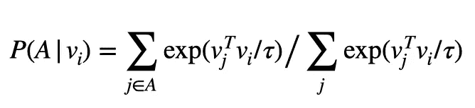

换句话说，指数势定义了概率，其中一个代码 *vⱼ* 贡献的概率密度越大，与 *vᵢ* 的点积越大。因此，由与 *vᵢ* 相似(在点积意义上)的大部分其他代码组成的集合 *A* 定义了 *vᵢ* 可能是其成员的集群。

标量τ被称为*温度*，并且定义了点积相似性的标度。

对于给定的真菌图像集合， *{xᵢ}* ，目标是找到使集合的聚类目标最小化的参数 *θ* 。洛杉矶论文的作者提出了为什么这个目标有意义的论点。我不会在这里重复这个论点。简而言之，与该集群的互补码相比，分配给一个集群的代码越清晰，该集群目标的值就越低。

## 如何将 LA 目标实现为自定义损失函数？

在上面关于 AE 的部分中，描述了自定义编码器模块。缺少的是 LA 的目标函数，因为它不是 PyTorch 中库损失函数的一部分。

需要实现自定义损失函数模块。

损失函数模块的初始化将初始化多个 [*scikit-learn*](https://scikit-learn.org/stable/) 库函数，这些库函数需要在`forward`方法中定义背景和近邻集合。

`NearestNeighbors`实例提供了计算数据点最近邻的有效方法。这将用于定义集合 *B* 。`KMeans`实例提供了计算数据点集群的有效方法。这些将用于定义集合 *C* 。一旦处理了模块的执行，这将变得更加清楚。

说到这里:`LocalAggregationLoss`的必用`forward`法。

正向方法接受当前版本的编码器产生的小批量代码，加上所述代码在完整数据集中的索引。由于在创建小批量时通常会打乱数据，因此索引可以是一个不连续的整数列表，尽管其数量与小批量代码的大小相同(由`assert`语句检查)。

`forward`有两个主要部分。首先，评估相邻集 B、C 及其交集。第二，为给定的一批代码和集合计算概率密度，然后将概率密度聚集成如上定义的 LA 群集目标函数的对数概率的比率。

## 《前进》中的“记忆库”是什么？

LA 的创造者们采用了一种*记忆库*的技巧，他们将其归因于吴等人的另一篇[论文](https://arxiv.org/pdf/1808.04699.pdf)。这是处理 LA 目标函数的梯度依赖于数据集的所有代码的梯度的一种方式。

所述函数的适当梯度将必须计算如下各项:

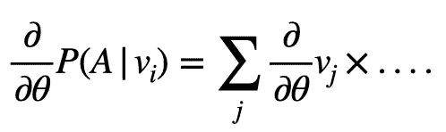

右手边所有代码的总和意味着必须计算大量的张量，并且为了反向传播而一直保存这些张量。迭代小批量图像对效率没有帮助，因为无论如何都必须计算代码相对于解码器参数的复杂梯度。

因为聚类的质量将一个图像与数据集的所有其他图像联系起来，而不是一个*固定的*基本事实标签，所以这种纠结是可以理解的。

记忆库技巧相当于将当前小批量中的代码之外的其他代码视为常量。因此，与其他代码的衍生物的纠缠消失了。只要近似的梯度足够好以引导优化朝向最小值，这就是有用的近似。

memory bank 类实现为:

它由与要聚类的数据集相同维数和相同数量的单元数据向量组成(由 [Marsaglia 的方法](https://mathworld.wolfram.com/HyperspherePointPicking.html)在超球面上统一初始化)。因此，涉及具有生成 512 维代码的编码器的一千个图像的任务，意味着在 512 维的实坐标向量空间中的一千个单位向量的存储体。一旦一组新的向量连同相应的索引被提供给存储体，存储器就以某种混合速率`memory_mixing_rate`被更新。该类还包含一个方便的方法，用于将整数索引集合转换为整个数据集的布尔掩码。

请注意，记忆库只处理数字。记忆库无法连接到 PyTorch 张量的反向传播机器。存储体被更新，但是通过运行平均值，而不是直接作为反向传播的一部分。

它是存储在`LocalAggregationLoss`的`memory_bank`属性中的`MemoryBank`的一个实例。

## 背景邻居和近邻集合是如何创建的？

又回到了`LocalAggregationLoss`的`forward`法。我使用先前初始化的 scikit-learn 类实现了邻居集的创建。

`_nearest_neighbours`和`_intersecter`相当简单。前者依赖于寻找最近邻居的方法。它会考虑存储体中的所有数据点。

`_close_grouper`对存储体中的数据点进行多次聚类。作为感兴趣点 vᵢ的相同聚类的一部分的那些数据点定义了近邻集合 Cᵢ.洛杉矶论文的作者鼓励使用多重聚类运行，其中聚类包含随机成分，因此通过执行多重运行，他们消除了噪声。

举例来说，下图中的红点是其他代码海洋中感兴趣的代码。记忆库当前状态的聚类将兴趣点放在其他点的聚类中(中间图像中的绿色)。最近邻定义了另一组相关数据点(右图中的紫色部分)。`_nearest_neighbours`和`_close_grouper`为小批量中的每个代码创建这两个集合，并将集合表示为布尔掩码。

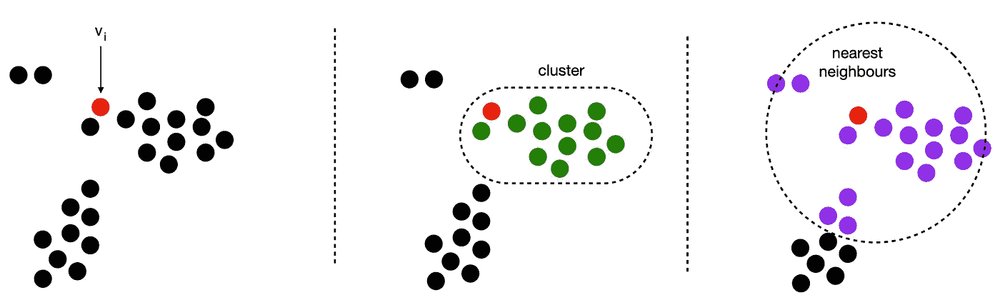

作者图片

## 计算概率密度，使得 PyTorch 反向传播机器可以计算梯度

对于批中每个代码 vᵢ的两个集合(Bᵢ和 Bᵢ与 Cᵢ相交),是时候计算概率密度了。这个密度应该也可以用 PyTorch 方法来区分。

它的实现方式如下:

在第 14–16 行中，所有不同的点积都是在小批量的代码和存储体子集之间计算的。`np.compress`将掩码应用于存储体向量。

`torch.matmul`计算所有的点积，将小批量维度考虑在内。还要注意张量`codes`包含了编码器数学运算的记录。因此，随着额外 PyTorch 操作的执行，该记录被扩展，最终，这使得 [PyTorch 的反向传播机制](https://pytorch.org/docs/stable/notes/autograd.html)、`autograd`能够相对于编码器的所有参数来评估损耗标准的梯度。

从概念上讲，第 25–27 行也发生了同样的操作，但是在这个子句中，mini-batch 维被显式迭代。当 [numpy 数组不能被广播](https://numpy.org/doc/stable/user/basics.broadcasting.html#module-numpy.doc.broadcasting)时，这是需要的，这是粗糙数组的情况(至少目前是这样)。

## 将模型和损失放在一起

综上所述，类似于下面的代码可以让特定数据集、VGG 编码器和 LA 得到训练。

我在讨论中省略了如何准备数据(我放在`fungidata`文件中的操作)。详情可在[回购](https://github.com/anderzzz/monkey_caput)中找到。对于本讨论，将`dataloader`视为返回真菌`inputs['image']`的小批量图像以及它们在更大数据集`inputs['idx']`内的相应索引就足够了。用来自作为自动编码器一部分的预训练编码器的标准化代码初始化存储体代码。

训练循环是功能性的，虽然被简化了，细节见`la_learner`文件，虽然没有什么不寻常的被使用。

我使用稍微修改过的编码器版本，`EncoderVGGMerged`。它是`EncoderVGG`的子类。

这个类在编码器的结尾附加了一个应用于代码的合并层，所以它是一个一维向量。

我展示了应用于一个 RGB 64x64 图像作为输入的聚类的编码器模型。

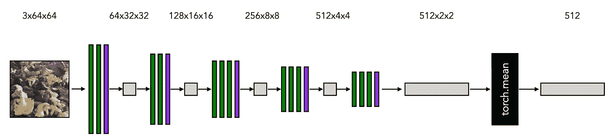

作者图片

接下来，我展示了创建`output`和`loss`变量的模型的一个小批量图像的向前传递。

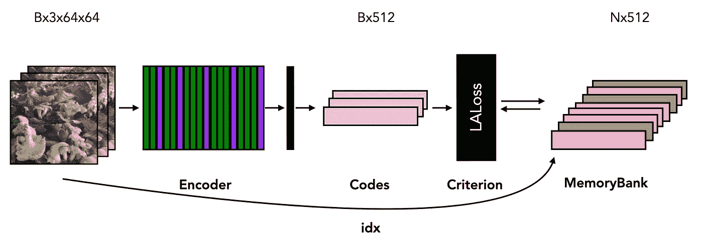

作者图片

图中的 LALoss 模块与存储体交互，考虑了小批量图像在大小为 *N* 的总数据集中的索引。它构建存储体的当前状态的聚类和最近邻，并将小批量代码与这些子集相关联。

`backward`通道执行反向传播，从 LA 标准的损耗输出开始，然后遵循涉及代码的数学运算，通过链式法则，获得 LA 目标函数相对于编码器参数的近似梯度。

## 关于真菌图像的一句话

我将把这种方法应用于真菌的图像。我的理由:

1.  我使用的软件库不是为这个特定任务开发或预先训练的。我希望测试使用通用库工具处理特定图像任务的场景。
2.  真菌的外观在形状、颜色、大小、光泽、结构细节以及它们的典型背景(秋叶、绿色苔藓、土壤、采摘者的手)方面各不相同。信号和噪声都是变化的。
3.  真菌图像位于明显物体和图像之间的最佳位置，人类凭直觉识别这些明显物体的原因我们很少能清楚地表达出来(例如狗、猫和汽车)，而图像的信息内容需要深厚的领域专业知识才能掌握(例如肿瘤活检、锂电极形态学)。我相信这有助于理解方法。
4.  丹麦真菌学会(2016 *)提供了非常好的[带注释的众包开放数据](https://svampe.databasen.org)。(丹麦真菌记录数据库，由 Frø slev，t .，Heilmann-Clausen，J .，Lange，c .，ssø，t .，Petersen，J.H .，Sø chting，u .，Jeppesen，T.S .，Vesterholt，J。，在线*[*www . svampeaatlas . dk*](http://www.svampeatlas.dk))。

作为一个额外的奖励，真菌的生物学和文化是显著的——一个有趣的文化组成部分是[决策启发法如何在蘑菇觅食者中进化](http://journal.sjdm.org/20/200330/jdm200330.pdf),以便在可食用和致命之间导航。我可以想象一些非常有趣的机器学习的测试案例，这些测试案例基于从真菌照片中创建的图像数据。

数据库中的三幅图像如下所示。

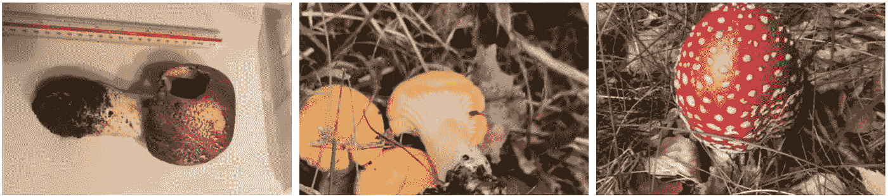

从左到右:桌上的姬松茸(王子)；叶间三条鸡油菌(金鸡油菌)；草中鹅膏睫毛膏(飞木耳)。图片来自*丹麦真菌记录数据库*(见上文)。

## 说明性测试运行和探索

LA 的一个缺点是它涉及几个超参数。遗憾的是，我没有足够的 GPU 待命，所以我必须将自己限制在超参数和真菌图像选择的许多可能变化中的极少数。

我在这篇文章中的重点是概念和方程的实现(加上一个真菌图像数据的插件)。因此，我在这里追求例证和灵感，我将把进一步的结论留给高层次的观察。

我在鸡油菌和木耳蘑菇上训练 AE，裁剪为 224x224。利用随机梯度下降优化器，AE 最终收敛，尽管对于某些优化参数，训练陷入次优。经过训练的 AE 的输入和输出的一个例子如下所示。

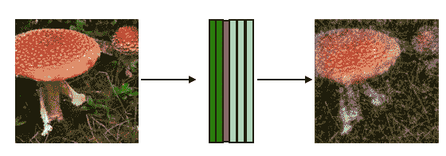

作者图片

保真度有明显的损失，尤其是在周围的草地中，尽管在解码输出中清晰的红色帽子被粗略地恢复。

以 AE 的编码器为起点，针对 LA 物镜进一步优化编码器。使用相同的一组蘑菇形图像，温度为 0.07，混合率为 0.5(如在原始论文中)，并且聚类的数量设置为要聚类的图像数量的大约十分之一。因为我的图像数据集相当小，所以我设置背景邻居来包括数据集中的所有图像。具有 LA 目标的编码器的训练最终收敛。

下面显示了一组说明性的图像:

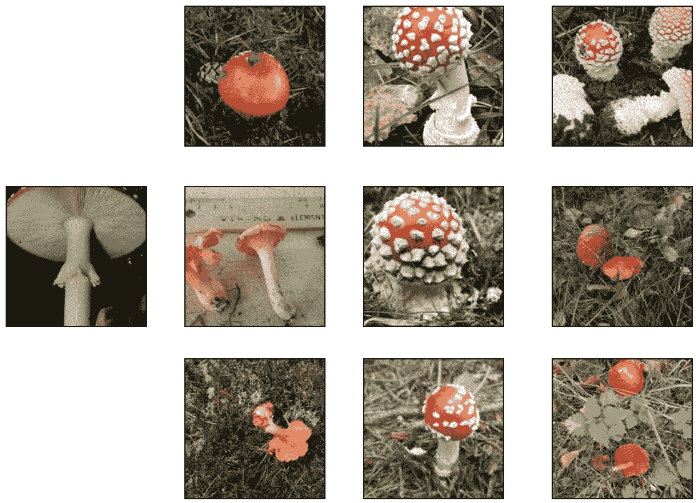

来自丹麦真菌记录数据库的图片。

这是直观的，明确的白点帽飞木耳集群。但是，该群集也包含外观差异很大的图像。和检查其他集群，白点飞木耳帽偶尔出现在其他集群。

下面显示了另一个说明性的集群。

*图片来自丹麦真菌记录数据库。*

这些图像有一些共同之处，将它们与典型的图像区分开来:较暗的颜色，主要来自背景中的棕色树叶，尽管右下角较暗的蘑菇(*黑色鸡油菌*或*黑色小号*)很突出。

但同样，符合这一粗略标准的图像也出现在其他聚类中，这表明还有其他非线性关系编码，这使得上述图像对应于相对接近和不同的代码，而其他图像则没有。可解释性比平常更难。

我还注意到许多集群只包含一个图像。改变进入 k-means 聚类的聚类质心的数量会对此产生影响，但随后也会出现非常大的图像聚类，对于这些图像聚类，很难提供对共有特征的直观解释。

这些是其他运行生成的说明性结果。至少在我这里进行的几次有限的运行中，LA 的最小化创建了最多适度对应的图像簇，至少在我看来是自然的分组。

鉴于深度神经网络的灵活性，我希望有很多方法可以将图像压缩到清晰的聚类中，就我的眼睛而言，不能保证这些方法体现了有用的意义。与基础事实标签的情况不同，在基础事实标签的情况下，神经网络的灵活性在优化之前被引导向我们定义为有用的目标，优化器在这里可以自由地找到要利用的特征，以使聚类质量高。

也许需要一个不同的归纳偏差来更好地限制灵活性的部署，以便最小化 LA 目标函数？就我的视觉认知而言，也许 LA 目标函数应该与一个附加目标相结合，以防止它偏离一些可感知的范围？也许我应该使用标准化的图像，如某些医学图像、护照照片或固定透视相机，将图像中的变化限制在较少的高级特征上，这样编码就可以在聚类中利用这些特征？或者，我所担心的问题的真正答案可能是在这个问题上投入更多的 GPU，并找出超参数的完美组合？

当然都是猜测。不过，多亏了 PyTorch，从概念和方程到原型和创作的道路上的障碍比固定的模板解决方案要低。

## 脚注

*   常规的警告:我对 LA 的实现旨在与原始出版物一样，但是误解或错误的可能性永远不可能完全为零。
*   我没有花费任何精力来优化实现。我可能忽略了 PyTorch 和/或 NumPy 技巧，它们可以提高 CPU 或 GPU 的速度。