# 使用卷积自动编码器的图像彩色化

> 原文：<https://towardsdatascience.com/image-colorization-using-convolutional-autoencoders-fdabc1cb1dbe?source=collection_archive---------8----------------------->

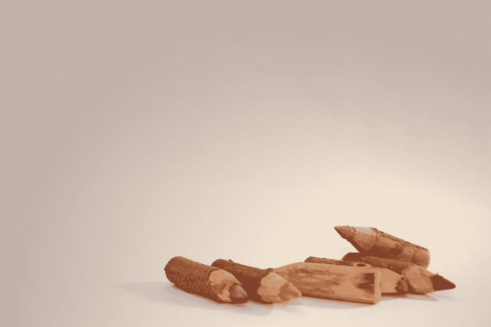

来源: [unsplash](https://unsplash.com/photos/yjTxnh7bsdw)

## 使用 Python 中的深度学习对来自老派视频游戏的图像进行着色的案例研究

最近，我完成了 Udacity 的机器学习工程师 Nanodegree 的顶点项目。因为我知道这个项目需要花费大量的时间和精力，所以我想做一些我真正感兴趣的事情。很长一段时间以来，我一直打算熟悉计算机视觉的一个领域，即图像彩色化。我是(从我记事起就是)一个电子游戏的狂热爱好者，这就是为什么在这个项目中，我想做一些贴近我内心的东西。

最近，我在互联网上看到一个[的帖子](https://www.theverge.com/2019/4/18/18311287/ai-upscaling-algorithms-video-games-mods-modding-esrgan-gigapixel)，显示通过使用深度学习可以提高仿真视频游戏的质量。所谓仿真，我指的是在一个不同于游戏最初设计的系统上使用专用软件运行游戏。一个例子可能是在 PC 上玩任天堂 64 游戏。通过在仿真器软件中嵌入预先训练的神经网络，可以将分辨率升级到 4K 或者增加纹理的质量/清晰度。真正令人惊讶的是，这些解决方案适用于所有游戏，而不仅仅是他们直接接受训练的一两个游戏。

当然，对于顶点来说，做这么大规模的项目太过雄心勃勃，所以我不得不把它缩小一点。当我开始我的视频游戏冒险时，我玩的是 Game Boy Color，除了新的彩色游戏外，它也适用于上一代产品——灰度游戏男孩。从那个时代获得灵感，我试图使用深度学习来给灰度图像着色，因此模拟器(结合在许多类似游戏上训练的网络)可能会接近实时地给输出着色。

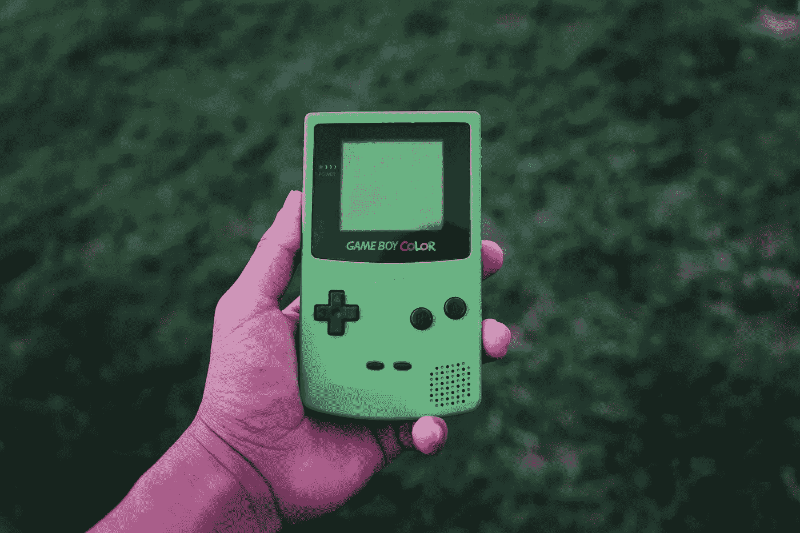

来源: [unsplash](https://unsplash.com/photos/1qx2J3TsRsk)

Nanodegree 专注于在使用 AWS 基础设施(SageMaker)的同时使用 PyTorch 构建和部署模型，但是本文中描述的所有模型也可以在本地或使用 Google Colab 进行训练。

在这篇文章中，我描述了我解决着色问题的方法，以及为了完成这个项目我必须采取的步骤。由于代码库相当长，我不会在文章中包含代码，而是让您参考包含复制项目所需的所有文件的 [GitHub](https://github.com/erykml/video_games_colorization) 库。

# 1.方法学

在展示实际的实现之前，我想对我在项目中遵循的方法提供一个高层次的概述。这就是为什么我认为首先熟悉以下概念是有意义的。

**Lab 色彩空间**

在我的[上一篇文章](/computer-vision-101-working-with-color-images-in-python-7b57381a8a54)中，我提供了用 Python 处理图像和不同颜色空间的快速介绍。我强烈建议在继续之前快速阅读，因为这将使理解一切变得更容易。为了以防万一，我也将在这里快速回顾一下。

到目前为止，最流行的图像表现方式是 **RGB** 。但是也有不同的方法可用，其中之一是 **Lab 颜色空间**(也称为 CIELAB)。

简而言之， *Lab* 颜色空间将颜色表示为三个值:

*   *L* :从 0(黑色)到 100(白色)范围内的亮度，这实际上是一幅灰度图像——它不完全等同于将 RGB 转换为灰度，但已经足够接近了
*   *a* :绿-红色谱，数值范围为-128(绿色)~ 127(红色)
*   *b* :蓝黄色光谱，数值范围为-128(蓝色)~ 127(黄色)

从上面的描述中我们可以得出的直接结论是，通过使用 *Lab* 颜色空间，我们可以同时解决两个问题——我们将灰度图像作为输入，颜色通道的复杂性从三个减少到两个(与 RGB 相比)。

**自动编码器**

自动编码器是一种神经网络架构，类似于主成分分析等技术，它们都试图降低输入数据的维度。然而，正如我们将看到的，自动编码器可以做得更多。它们由两部分组成:

*   编码器-将输入数据转换为低维表示(也称为潜在向量/表示)。为了实现这个目标，编码器必须只学习数据中最重要的特征。
*   解码器—从低维表示中恢复输入。

下图显示了自动编码器网络的基本架构。

自动编码器的基本模式。来源:[维基百科](https://en.wikipedia.org/wiki/Autoencoder#/media/File:Autoencoder_structure.png)

在这个项目中，我训练自动编码器最小化损失函数，这是输入数据和解码输出之间的差异的度量。通常，潜在表示可以用作提取的特征，类似于来自 PCA 的主成分。然而，在我们的例子中，我们感兴趣的是解码输出。

训练自动编码器时要注意的一件重要事情是，当潜在表示大于输入数据时，它们有记住输入的倾向。

**卷积神经网络**

卷积层的目标是通过应用卷积滤波来提取潜在的特征。卷积层读取输入(例如 2D 图像)并将(特定形状的)内核拖到图像上。内核表示我们想要在图像中定位的特征。对于每一步，输入乘以核的值，然后对结果应用非线性激活函数。通过这种方式，原始输入图像被转换为过滤图。

来源: [GitHub](https://github.com/vdumoulin/conv_arithmetic/blob/master/gif/arbitrary_padding_no_strides.gif)

卷积和池(聚合)层可以相互堆叠，以提供多层抽象。许多流行的图像分类架构都是以类似的方式构建的，如 AlexNet、VGG-16 或 ResNet。

另一方面，我强烈推荐下面的[资源](https://ezyang.github.io/convolution-visualizer/index.html)，用于交互式可视化卷积如何根据各种参数工作，如步幅、填充内核大小和膨胀。此外，安德烈·卡帕西的这段视频对 CNN 做了很好的介绍。

对于 capstone 项目，我将 CNN 与自动编码器结合起来，并有效地使用了一类称为卷积自动编码器的架构。这种网络的输入是灰度图像(1 个通道)，而输出是表示颜色的 2 层( *a* / *b* 层的 *Lab* 表示)。

# 2.构建数据集

对于着色项目，我使用了我从小最喜欢的游戏之一— *Wario Land 3* 。为了获得数据集，我从 YouTube[上截取了一段视频。我找到了一个 *longplay* (整个游戏的完整播放，只显示实际的游戏屏幕)，所以下载后，我可以很容易地从视频中提取每 *x-* 帧，以获得完整的彩色图像数据集。我在之前的](https://www.youtube.com/watch?v=btnFUbexxEE)[文章](/the-easiest-way-to-download-youtube-videos-using-python-2640958318ab)中详细记录了这个过程。

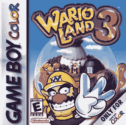

来源:[维基百科](https://en.wikipedia.org/wiki/Wario_Land_3#/media/File:Warioland3.jpg)

视频每秒播放 24 帧，我每 58 帧提取一次。这样做总共产生了 7640 幅图像。提取的帧存储为 JPG 图像，每个图像的大小为 288x320 像素。

在对图像进行更多的技术分析之前，值得一提的是，目前收集数据的方法存在哪些潜在问题。通过从显示整个游戏的视频中提取每第 x 帧，我们还可以得到:

*   所有游戏内菜单
*   介绍/标题屏幕
*   信用
*   画面转换——在游戏中切换画面/阶段时，下一个画面/阶段加载时通常会有一个短暂的淡出画面

总之，这会给数据集带来一些噪声。这个问题的一个潜在解决方案是剪掉视频的第一个/最后一个 *X* 秒，以删除介绍/演职员表。为了简单起见，我没有这样做，而是将所有帧留在数据集中。

是时候更详细地描述数据集了。首先，我呈现一个提取图像的预览:

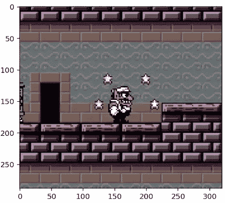

捕获的图像为 288x320

Game Boy Color 的屏幕分辨率为 144x160(因此拍摄的视频已经放大了 2 倍)。转到调色板，Game Boy Color 的系统使用 15 位 RGB 调色板(多达 32，768 种可能的颜色)。实际上，不使用任何特殊的编程技术就可以呈现多达 56 种颜色，而完整的 32，768 种颜色需要一些技巧。

当前的标准是 24 位 RGB 颜色空间，其中每个颜色通道都表示为 0 到 255 之间的数字。这种表示总共产生大约 1670 万种颜色组合。

GBC 的颜色有点“有限”是我选择它作为目标平台的原因之一，因为这种图像比新一代游戏机或真实照片的图像更容易着色。

# 3.数据准备

在这一部分中，我主要关注应用于数据的转换。再次重申，下载的数据被编码为 RGB 图像。因此，每个图像都被表示为一个维数为[3，288，320]的数组，其中 0-255 范围内的数字描述了给定通道的强度。正如我之前提到的，使用*实验室*颜色空间的想法是为了降低问题的复杂性，所以自动编码器的实际输出是一个大小为[2，288，320]的数组。

在下图中，我展示了我之前展示的图像的*实验室*表示:

在讨论了 *Lab* 色彩空间之后，我描述了准备数据的两个步骤。

**培训/验证分割**

对于这个项目，我做了 90-10 的训练-验证分割。验证数据不用于训练，仅用于评估每个时期后的网络性能。

**预处理步骤**

所有的预处理步骤都在一个定制的 PyTorch `ImageFolder`中完成，以使过程尽可能简单高效。我采取的步骤是:

*   将图像裁剪为 224 x224——在我尝试的一个架构中，ResNet-18 的前几层被用作编码器。为了将更改保持在最低限度，我将所有图像裁剪为 224x224(因为这是该架构中使用的图像大小)。然而，网络的输入必须改变以接受单通道图像。为了训练，我随机截取了一些图像。对于验证，中间裁剪，保证验证样本始终相同。
*   此外，训练图像有 50%的概率被水平翻转。
*   我基于 *Lab* 色彩空间将 RGB 输入图像转换为两幅图像——大小为 224x224 的灰度级( *L* 层)输入和作为输出的 *a/b* 层(形状:[2，224，224])。
*   在将图像编码为 *Lab* 之后，我将图层标准化，类似于在[1]和[2]中所做的。我将 *L* 通道除以 100，因此值在[0，1]的范围内。然后，我将 *a/b* 通道中的值除以 128，结果在[-1，1]范围内，适合 *tanh* 激活函数(网络最后一次激活)。我还试验了一种不同的变换——通过先加 128 然后除以 255，将 *a/b* 层归一化到范围[0，1]。在这种情况下， *ReLU* 或 *Sigmoid* 激活功能适用于最后一层。然而，从经验上看，第一种方法效果更好。

上述步骤中的所有数据分割和预处理都是使用预先指定的种子完成的，以确保项目的可重复性。

# 4.模型和培训

在这个项目中，我训练了三个不同的模型(名为 V0，V1，V2，尽管它们不是前面模型的明确扩展)，尽管我也试验了许多不同的模型。下面我提供了模型的简短描述。

**v 0 型—基准**

该模型的架构基于[1]中提出的架构。作为一个例子，作者用它来说明一个关于给一个图像着色的观点。我决定使用这个模型作为我的基准，因为它是我在互联网上找到的最简单的彩色自动编码器。我相信这将是一个很好的基准，类似于评估高级分类器与基本分类器(如逻辑回归或决策树)的性能。

下图总结了该模型的架构:

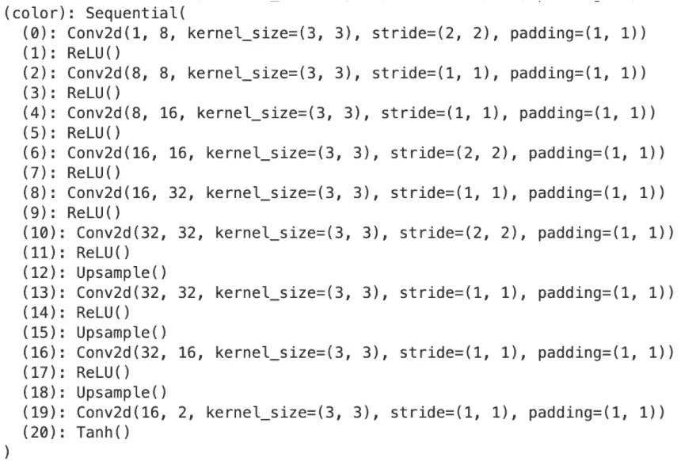

模型 V0 的架构

在网络中，我没有使用池层来减少输入的维数。相反，我在一些卷积层中使用了步长 2。原因是池层增加了信息密度，但同时扭曲了图像。这在图像分类任务中可能无关紧要，在这些任务中，我们只关心图像中某些特征的存在，然而，对于着色网络来说，这是有区别的。此外，我使用填充来控制图像尺寸的减小。

上采样是使用不可学习的插值完成的。在这种情况下，这是一个 2 倍的上采样(实际上是图像大小的两倍)，并使用了最近邻插值算法。

**模特 V1**

该模型基于[1]中介绍的“beta”架构。在满足于这种架构之前，我试图一字不差地重建“beta”版本，然而，该模型根本没有学习。我怀疑潜在的表现形式太大了，模型没有学习到任何有用的特征。这就是为什么我把它的通道数缩小了 2 倍。下图展示了该架构的细节:

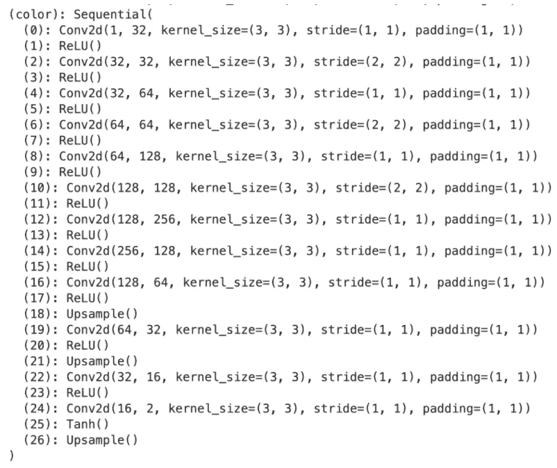

我没有描述该网络的更多细节，因为它类似于 V0 模型。

**模特 V2**

最后一个模型是对[3]中提出的模型的一个微小修改。作者将 ResNet-18 的前几层组合起来作为编码器，它从灰度图像中提取特征(网络的输入也必须被修改以接受 1 通道图像)。为了简洁起见，我没有包括详细的规格，因为图像会很大。

然后，作者使用了一个类似于我们在[1]和[2]中已经看到的解码器。摘要如下。与以前的模型相比，该解码器的不同之处在于卷积后增加了批量归一化层。

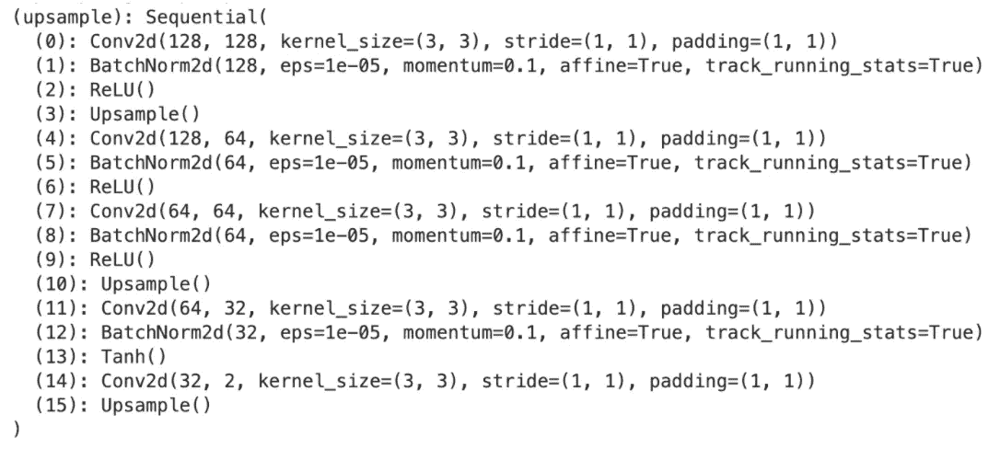

**训练详情**

我通过寻找和实现一些着色的自动编码器*开始了这个项目，然而，我后来不得不创建一个我将坚持的框架。原因是我有效地结合了一些不同的方法，每种方法都使用了稍微不同的方式来预处理图像，应用变换等。*

为了使结果具有可比性，我满足于框架的一个变体，并以类似的方式训练所有的模型。

我在途中做出的一些决定包括:

*   统一的训练方法—相同损失(MSE)、优化器(RMSprop)、学习率(0.001)、最大历元数(30)等。
*   在*实验室*转换的基础上增加一个额外的标准化步骤，这就是为什么我不得不将网络中的一些最终激活函数修改为 *tanh*
*   使用一组变换(随机裁剪、水平翻转、居中裁剪)来扩充数据集。我的项目所基于的一些例子不包括任何转换。

我试图使代码尽可能灵活，以便于实验。这就是为什么为了方便起见， *Lab* 图像的归一化被参数化。

**评估指标**

很难选择一个好的评价标准，因为颜色在很大程度上是主观的，不同的版本可以被认为是可接受的。这就是为什么经常需要人工观察的原因。在文献中([1]，[3])，用于训练彩色化神经网络的流行解决方案是使用均方误差(MSE)作为损失函数。在这个项目中，我遵循了同样的方法。

MSE 损失函数带来了一些问题，这是由彩色化问题是多峰的事实引起的——单个灰度图像可能对应于许多可接受的彩色图像。这导致当模型更喜欢选择不饱和的颜色时，因为它们比明亮、鲜艳的颜色更不容易出错(这会导致高 MSE 的惩罚)。

这就是为什么研究不同的评价函数绝对是一个值得探索的领域。一些论文[4]还探索了将图像彩色化作为分类问题(而不是建议的回归)来构建的想法，并使用诸如准确度之类的度量作为损失函数。

在本文中，我给出了不同时期(15、30 和最好的一个，以防不是最后一个)所选网络架构的 MSE。此外，我还展示了彩色图像以供视觉检查。

# 5.结果

为了评估彩色化自动编码器的性能，我首先分别针对 3 个模型中的每一个，检查训练/验证损失在各个时期的演变。

**v 0 型**

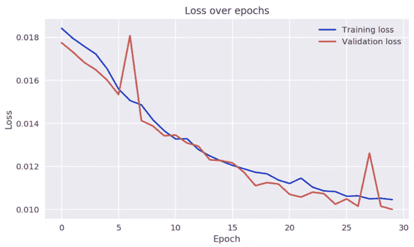

在图像中，我们可以看到损失开始趋于平稳，但是，如果训练更多的时期，损失可能仍然会减少。此外，在验证损失中有两个奇怪的峰值，这是[1]的作者在使用 ADAM 优化器时也注意到的。对他来说，使用 RMSprop 优化器解决了这个问题。

**型号 V1**

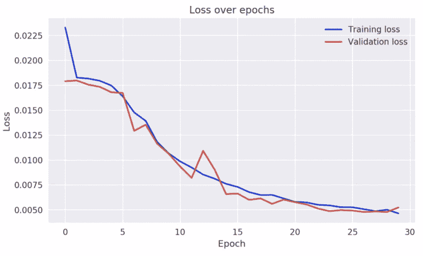

这些模型比 V0 模型开始时损失更高，可能是由于可学习参数的数量更多。不过最终还是在 30 个纪元内取得了较好的表现。此外，我们可以观察到随着训练时间的推移，验证损失有一个较小的峰值。

**模特 V2**

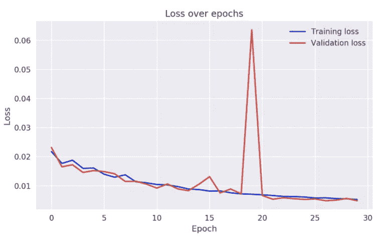

对于最复杂的模型(就可学习参数的数量而言)，上图中唯一突出的是验证损失的巨大峰值。我没有太注意它，因为它只发生了一次，其余的训练是稳定的。虽然，知道它的确切原因会很有趣。

作为下一步，我比较所有模型在第 15、30 个时期和最佳时期(如果不是最后一个时期)的验证集 MSE。

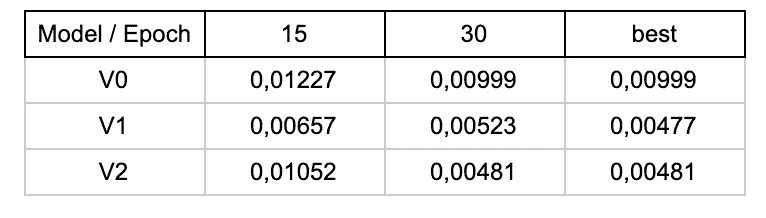

总的来说，在考虑的模型中，V1 模型的验证损失最低。此外，V1 和 V2 模型都优于基准，这是有道理的，因为它的架构简单。

最后，我展示了视觉检查的结果。这些图像来自验证集(在训练期间没有看到)，并且是从各个模型的最佳时期获得的。

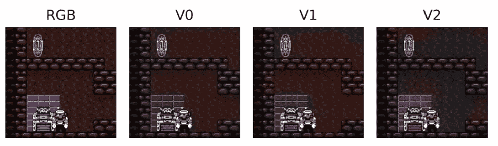

V2 模型设法捕捉到了宝箱周围方块的颜色，然而，却错误地给宝箱本身着色。

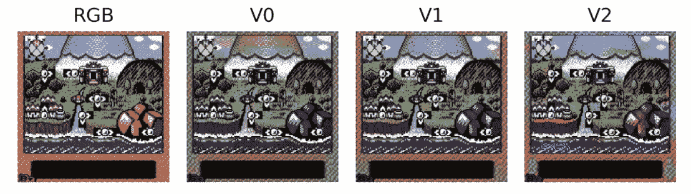

V1 模型在地图着色方面做得最好，V2 的图像有点“恍惚”，图像中有各种亮点。

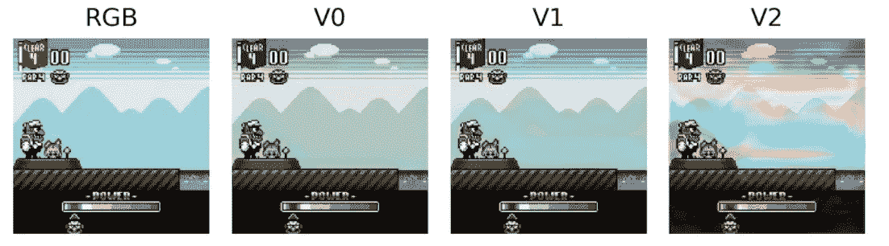

V1 模型在捕捉背景方面做得很好，而 V2 模型正在努力决定使用哪种颜色。

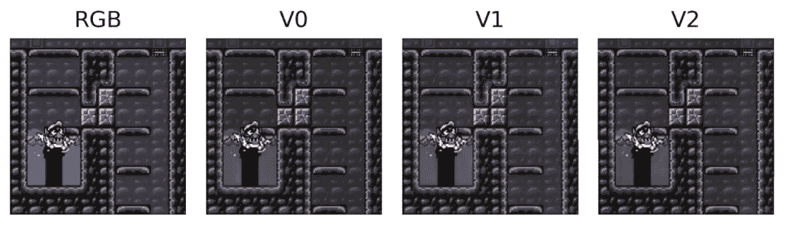

所有的模型都设法捕捉到了紫色的碎片。

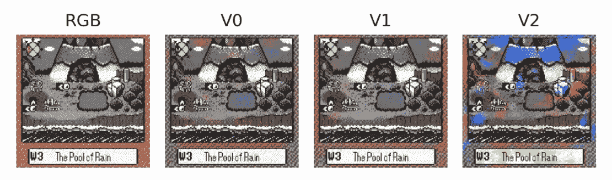

最后一个比较棘手，因为地图的碎片实际上接近灰度。模特 V2 试图给地图上色，而 V1 基本上保持了原样，只正确地给框架上色。

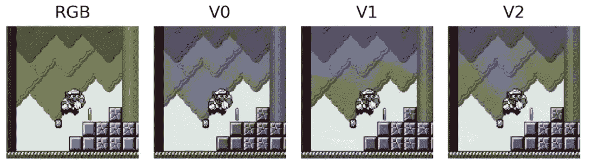

V1 和 V2 非常接近捕捉森林的绿色，而记住破碎的块是紫色的。模型还正确地将树干染成了棕色。

模特们试图给上面的图像着色，但结果并不那么*完美*。一个潜在的原因是，这是一种独一无二的图像，所以很难使用任何潜在的特征来获得正确的颜色。

总而言之，这些模型在给灰度图像着色方面做得相当不错。神经网络似乎已经获得了一些图案，如紫色的破块、宝箱周围的紫色瓷砖、黄色的硬币、绿色的森林等。此外，更先进的模型(V1/V2)明显优于基准。然而，V2 模型是相当不稳定的，并且经常导致明亮和不匹配的颜色。

在 [GitHub](https://github.com/erykml/video_games_colorization) repo 中，我也尝试将 *Wario Land 3* 上训练的模型应用于来自 *Wario Land 2* 的图像，然而性能相当差。原因可能是游戏的风格有点不同，而且开发者没有重用以前游戏中的很多精灵/模型——这对玩家来说当然很好:)你可以在下面看到一些例子。

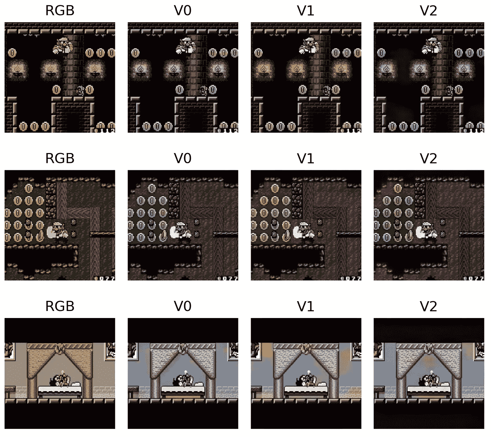

# **6。结论**

总之，我真的很喜欢在这个项目中工作，我学到了很多东西。这个项目决不是完整和详尽的。图像着色绝对不是一件容易的事情，我没有从所有的角度去探索，主要是因为时间的限制。因此，我列出了一些进一步扩展的想法:

*   应用数据清理，例如，过滤掉具有高百分比纯白色/黑色像素的图像。这可能表明这些是一些屏幕转换，将它们包含在数据集中可能会给模型带来不必要的噪声。
*   该项目可以扩展到捕获一个以上的视频游戏，可能来自同一流派(例如，像 *Wario Land* 这样的平台游戏)，以提高性能和覆盖潜在的过度拟合。
*   使用可训练的放大层(转置卷积层)而不是不可训练的层。
*   从预先训练好的网络中进行迁移学习。
*   用甘斯做实验。

我真的希望将来回到这个项目，至少尝试一下我上面提到的一些想法。

你可以在我的 [GitHub](https://github.com/erykml/video_games_colorization) 上找到本文使用的代码。一如既往，我们欢迎任何建设性的反馈。你可以在[推特](https://twitter.com/erykml1?source=post_page---------------------------)或评论中联系我。

# 参考

[1][https://blog . Floyd hub . com/colorizing-b-w-photos-with-neural-networks/](https://blog.floydhub.com/colorizing-b-w-photos-with-neural-networks/)

[2]f .巴尔达萨雷、D. G .莫林和 l .罗德斯-吉拉奥(2017 年)。深度考拉化:使用 CNN 和 inception-resnet-v2 的图像彩色化。arXiv 预印本 arXiv:1712.03400。

[https://lukemelas.github.io/image-colorization.html](https://lukemelas.github.io/image-colorization.html)

[https://ezyang.github.io/convolution-visualizer/index.html](https://ezyang.github.io/convolution-visualizer/index.html)

[https://github.com/vdumoulin/conv_arithmetic](https://github.com/vdumoulin/conv_arithmetic)