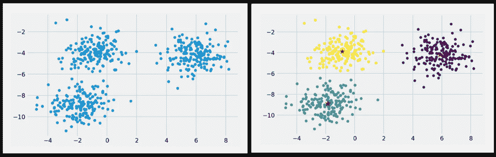
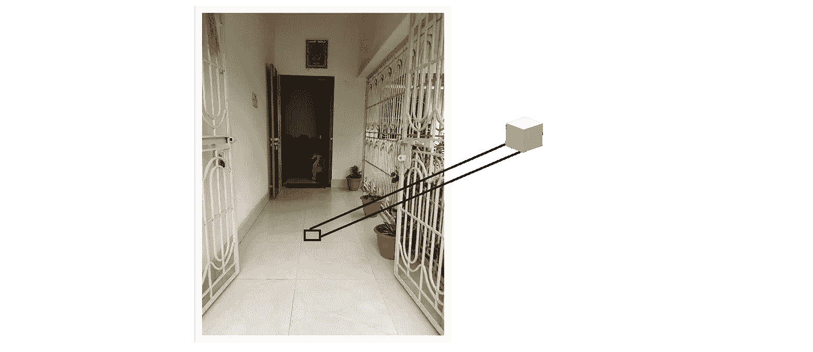
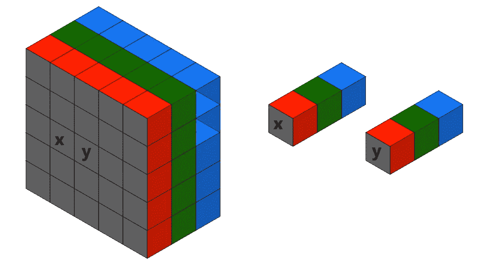
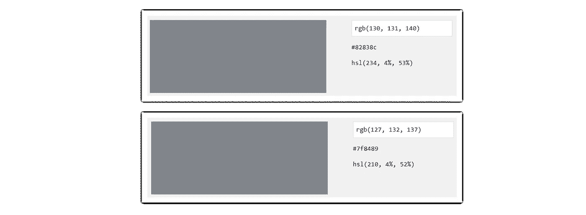
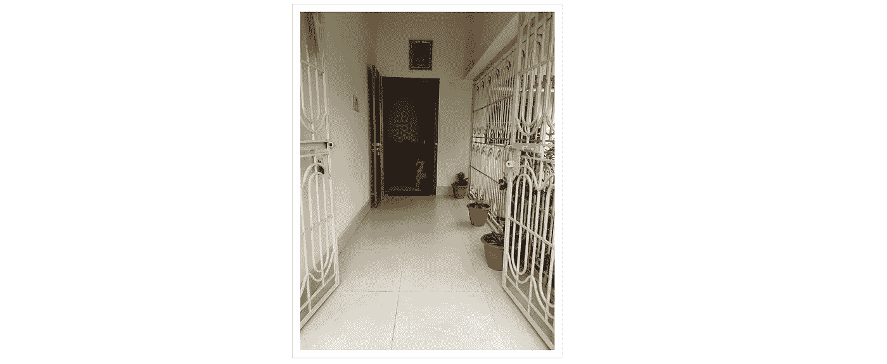
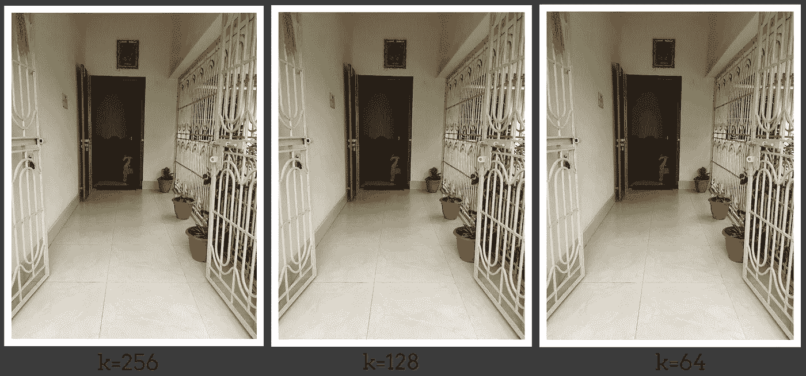
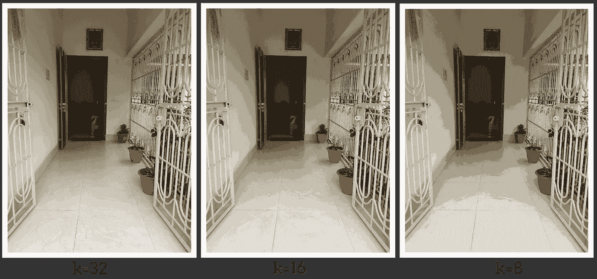
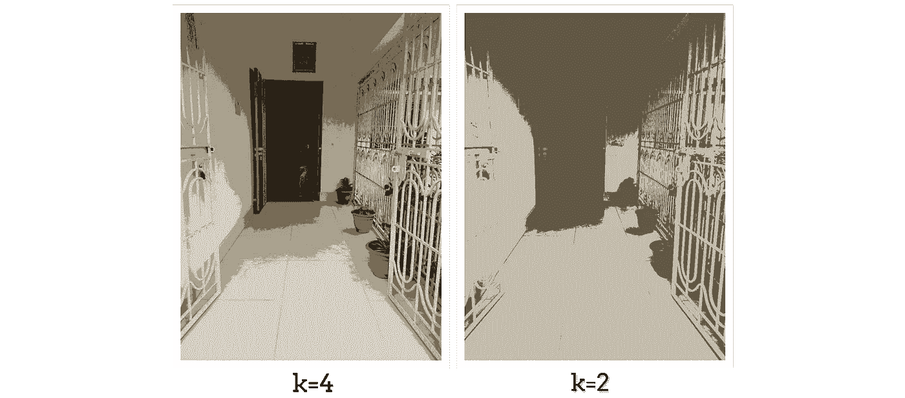
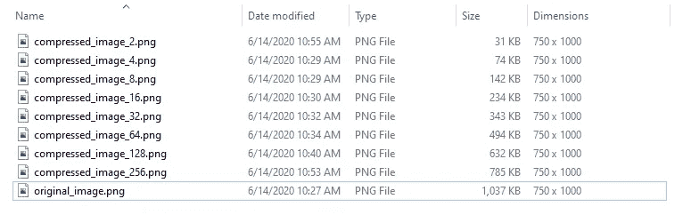

# 基于 K-均值聚类的图像压缩

> 原文：<https://towardsdatascience.com/image-compression-using-k-means-clustering-aa0c91bb0eeb?source=collection_archive---------8----------------------->

## 使用 k 均值聚类算法的图像压缩的概述和实现，以及不同 k 值的压缩图像的比较

在 [Unsplash](https://unsplash.com?utm_source=medium&utm_medium=referral) 上拍摄的 [ThisisEngineering RAEng](https://unsplash.com/@thisisengineering?utm_source=medium&utm_medium=referral)

图像压缩是一种应用于数字图像的数据压缩，不会将图像质量降低到不可接受的水平。文件大小的减小允许在给定数量的磁盘或内存空间中存储更多的图像。它还减少了通过互联网发送图像或从网页下载图像所需的时间。

## 图像压缩是如何工作的？[1]

[I](https://en.wikipedia.org/wiki/Algorithm) 图像压缩算法利用视觉感知和图像数据的统计特性来提供卓越的结果。有两种图像压缩方法—无损和有损。让我们快速浏览一下它们。

> **无损压缩:**

这是一种用来减小文件大小的方法，同时*保持与压缩前*相同的质量。无损压缩不会损害数据的质量，并且文件可以恢复到原始形式。在这种类型的压缩中，文件的大小不会改变。用于无损压缩的算法有:

*   行程编码
*   霍夫曼编码
*   算术编码

> **有损压缩:**

有损压缩是一种消除不明显数据的压缩方法。为了使照片更小，有损压缩会丢弃照片中不太重要的部分。压缩文件无法完全还原为原始形式。在这种类型的压缩中，数据质量会受到影响，数据大小也会发生变化。有损压缩主要用于图像、音频和视频压缩，不同的有损压缩算法有:

*   离散余弦变换
*   分形压缩
*   变换编码

我们将使用 **K 均值聚类**技术进行图像压缩，这是一种压缩的**变换方法。**使用 K 均值聚类，我们将对图像中存在的颜色进行量化，这将进一步帮助压缩图像。

## 什么是 K-Means 聚类？

K-Means 算法是一种基于质心的聚类技术。这种技术将数据集聚类成 k 个不同的聚类。k-means 聚类算法中的每个聚类都由其质心点表示。

**左图:**数据集图，**右图:**三均值聚类结果图，**(图 1)**

上图(图 1)描述了如何使用 k=3 的 k 均值聚类算法为给定数据集形成 3 个聚类。

此外，[阅读本文](/understanding-k-means-k-means-and-k-medoids-clustering-algorithms-ad9c9fbf47ca)了解更多关于 k-Means 聚类算法的知识。

 [## 了解 K-means、K-means++和 K-medoids 聚类算法

### 了解 K-means、K-means++和 K-Medoids 聚类算法及其关系的概述。这篇文章…

towardsdatascience.com](/understanding-k-means-k-means-and-k-medoids-clustering-algorithms-ad9c9fbf47ca) 

## K-Means 聚类技术是如何压缩图像的？

在彩色图像中，每个像素的大小为 3 字节(RGB)，其中每种颜色的强度值可以从 0 到 255。根据组合学，可以表示的颜色总数是 256*256*256(等于 16，777，216)。实际上，我们在一幅图像中只能看到比上述数字少得多的几种颜色。因此 k-Means 聚类算法利用了人眼的视觉感知，并且使用很少的颜色来表示图像。具有不同强度值(RGB 值)的颜色对于人眼来说似乎是相同的。K-Means 算法利用了这一优势，并剔除了相似的颜色(在一个聚类中靠得很近)。下面是这种工作方式的一个例子:

从输入图像中选择一些像素，**(图像 2)**

在上面的图像(图像 2)中，选取了几个像素，并在后续图像中进行了扩展，以继续说明。

**左:**上面拾取的像素的最大化图像，**右:**两个附近的像素 x 和 y **，(图像 3)**

从输入图像(图像 2)中拾取的像素在(图像 3)的左侧部分被扩展。在(图 3)的右侧，选取了两个邻近的像素(名称为“x”和“y”)。

如果“x”和“y”像素的 RGB 值分别为(130，131，140)和(127，132，137 ),那么下面是人眼如何看到这些两像素颜色的图示。下图显示的是从 [w3schools](https://www.w3schools.com/colors/colors_rgb.asp) 得到的 RGB 色彩强度。

**上图:**颜色为 RGB(130，131，140)**下图:**颜色为 RGB(127，132，137)**(图 4)**

在上面的图像(图像 4)中，观察到对于 RGB 值的一些变化，颜色对于人眼来说是相似的。因此，k-Means 聚类可以将这两种颜色结合在一起，并可以用一个与人眼几乎相同的质心点来表示。

图像的初始尺寸是 750*1000 像素。对于每个像素，图像具有表示 RGB 强度值的三维。RGB 亮度值的范围从 0 到 255。由于亮度值有 256 个值(2 * 8)，所以存储每个像素值所需的存储量是 3*8 位。

最后，图像的初始大小为(750*1000*3*8)比特。

颜色组合的总数等于(256*256*256)(等于 16，777，216)。由于人眼无法一次感知如此多的颜色，所以我们的想法是将相似的颜色组合在一起，用更少的颜色来表现图像。

我们将使用 k-Means 聚类来寻找 k 个颜色，这些颜色将代表其相似的颜色。这些 k 色将是算法中的质心点。然后我们将每个像素值替换为它的质心点。与总的颜色组合相比，仅使用 k 值形成的颜色组合将非常少。我们将尝试不同的 k 值，并观察输出图像。

如果 k=64，则输出图像的最终大小将是(750*1000*6 + 64*3*8)位，因为强度值的范围是 2**6。

如果 k=128，则输出图像的最终大小将是(750*1000*7 + 128*3*8)位，因为强度值的范围是 2**7。

因此，观察到图像的最终尺寸在很大程度上比原始图像减小。

## 实施:

(作者代码)

> **实施的逐步演练:**

*   **图像输入**(第 6-8 行) **:** 从磁盘加载图像。
*   **重塑输入图像**(第 15 行) **:** 输入图像的大小为(rows，cols，3)，将所有像素值扁平化为大小为(rows*cols)的单一维度，每个像素的维度为 3 代表 RGB 值。展平图像的大小将为(rows*cols，3)。
*   **聚类**(第 18–19 行) **:** 实现 k-Means 聚类算法，找到代表其周围颜色组合的 k-形心点。
*   **将每个像素替换为其质心点**(第 22–23 行) **:** (行*列)数量的像素的所有颜色组合现在由其质心点表示。将每个像素的值替换为其质心点。
*   **重塑压缩图像**(第 26 行) **:** 将(rows*cols，3)维度的压缩图像重塑为原始(rows，cols，3)维度。
*   **输出压缩图像**(第 29–31 行) **:** 显示输出图像并保存到磁盘。

## 结果和观察:

> **原图:**

**原始图像**

> **不同“k”值的压缩图像:**

以上 8 幅图像描述了不同 k 值的压缩图像的结果

以下是所有输入和输出图像的详细信息:

输入图像( **original_image.png** )和输出压缩图像( **compressed_image_k.png** )的细节

> **从上图中观察到:**

*   所有压缩图像( *compressed_image_k.png* )的尺寸与输入图像( *original_image.png* )的尺寸相同。
*   压缩图像的尺寸随着 k 的减小而减小。
*   对于 k=32，64，128，256 的值，输出的压缩图像看起来相当好并且失去颜色，并且人眼不可见。与 k=32 的原始图像相比，压缩图像的大小减小了几乎 3 倍。
*   对于 k=16，8 的值，输出的压缩图像丢失了许多颜色，并且有损压缩对于人眼是可见的。
*   对于 k=4，2 的值，输出的压缩图像丢失了几乎所有的颜色，并且图像的内容也丢失了。

**参考文献:**

[1]keycdn.com，(2018 . 11 . 21)，什么是图像压缩？[htps://www . key dn . com/support/what-is-image-compression](https://www.keycdn.com/support/what-is-image-compression)

> 感谢您的阅读！