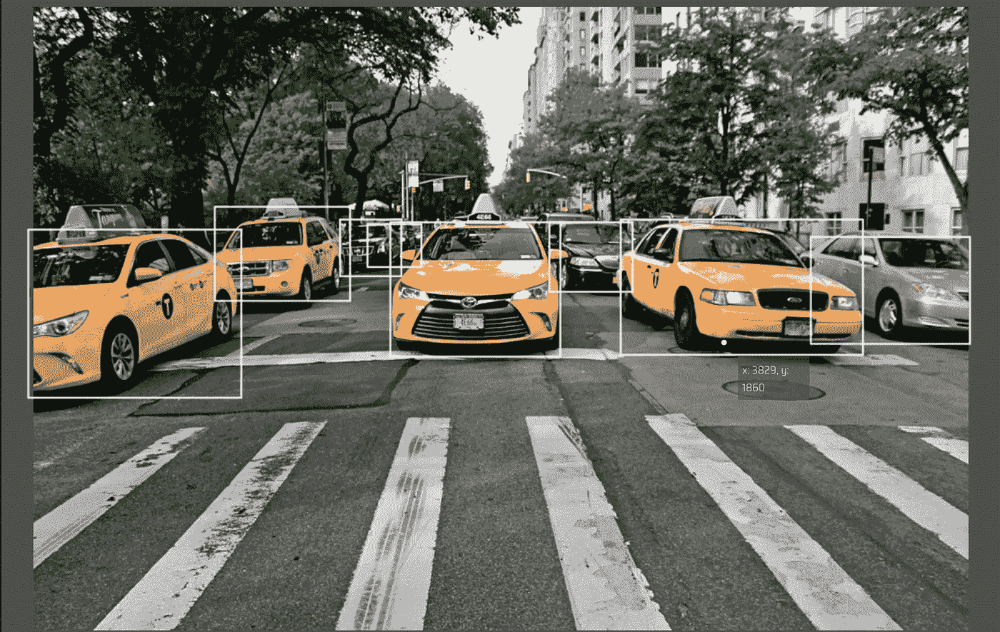
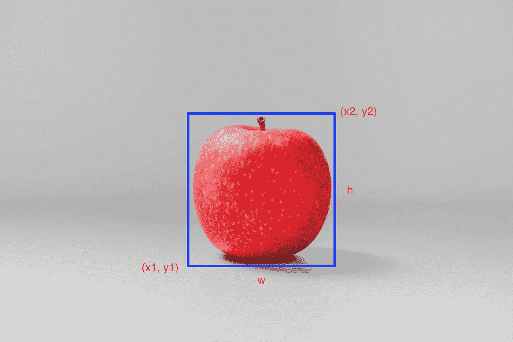
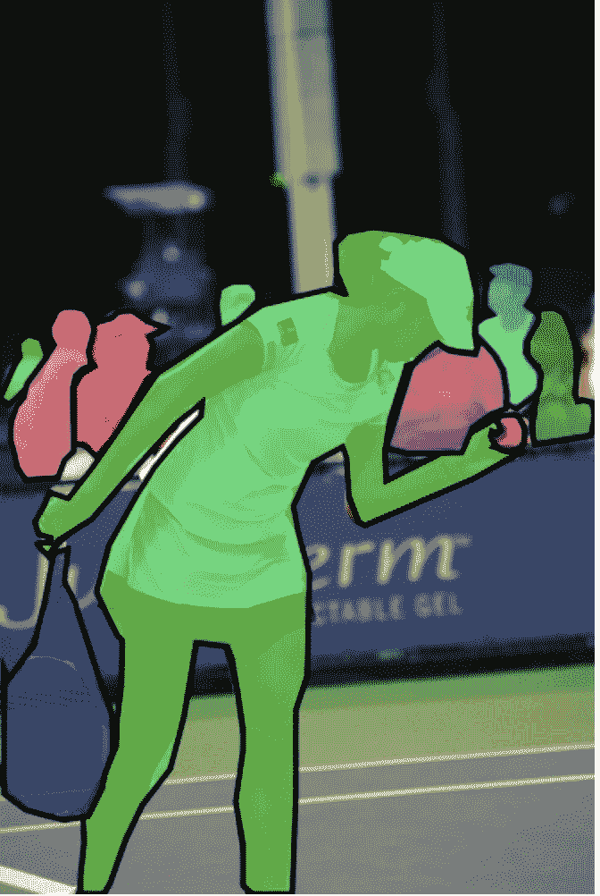
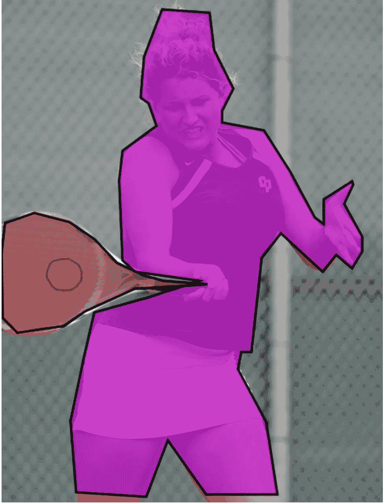
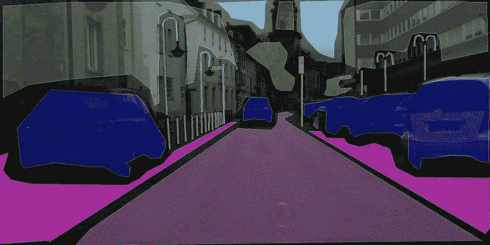
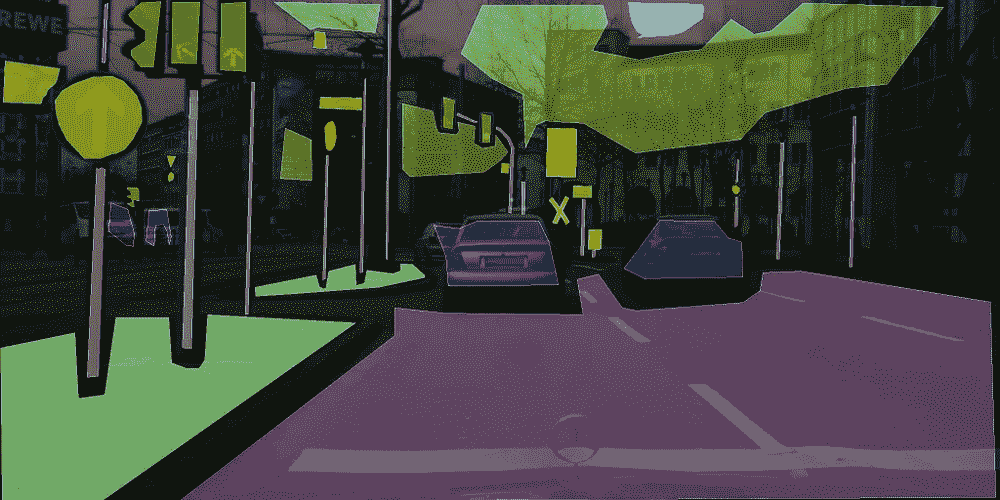
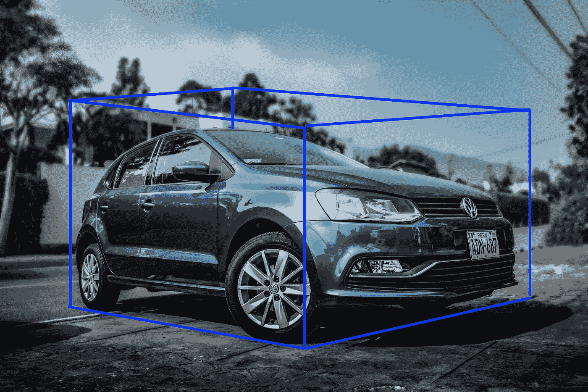
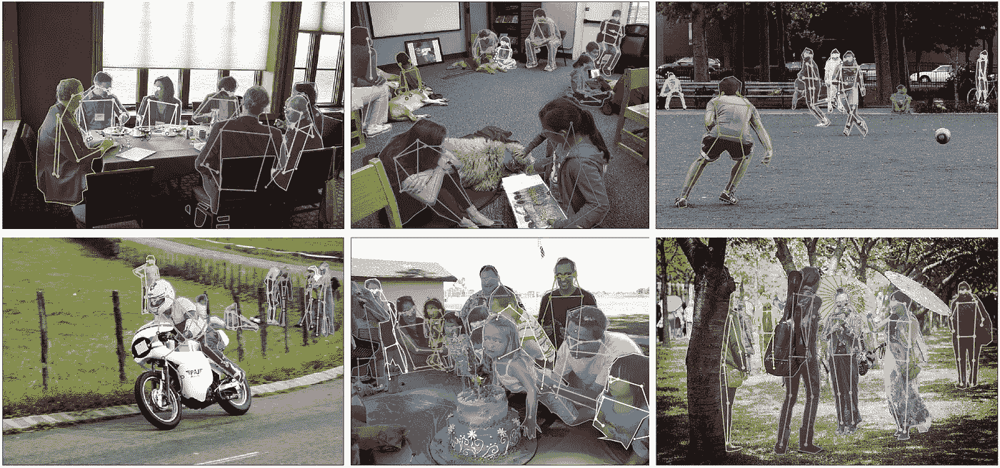

# 图像数据标签和注释—您需要知道的一切

> 原文：<https://towardsdatascience.com/image-data-labelling-and-annotation-everything-you-need-to-know-86ede6c684b1?source=collection_archive---------1----------------------->

## 了解不同类型的注释、注释格式和注释工具


贴有标签的蓝莓瓶(照片由[王思然·哈德森](https://unsplash.com/@hudsoncrafted?utm_source=unsplash&utm_medium=referral&utm_content=creditCopyText)在 [Unsplash](https://unsplash.com/?utm_source=unsplash&utm_medium=referral&utm_content=creditCopyText) 上拍摄)

数据标记是监督机器学习任务中的一个重要步骤。 **Garbage In Garbage Out** 是机器学习社区常用的一个短语，意思是训练数据的质量决定了模型的质量。用于数据标记的注释也是如此。如果你给一个孩子看一个西红柿，并说这是一个土豆，下一次孩子看到一个西红柿，很可能他会把它归类为土豆。正如机器学习模型以类似的方式学习一样，通过查看示例，模型的结果取决于我们在训练阶段输入的标签。

数据标记是一项需要大量手工工作的任务。如果你能为你的项目找到一个好的开放数据集，那就是标签，运气在你这边！但大多数情况下，情况并非如此。很有可能要自己去经历数据标注的过程。

在本帖中，我们将探讨图像的注释类型、常用的注释格式以及一些可用于图像数据标注的工具。

# 图像注释类型

在开始图像注释之前，了解现有的不同注释类型是很有用的，这样您就可以为您的用例选择正确的类型。

以下是几种不同类型的注释:

**包围盒:**包围盒是计算机视觉中最常用的注释类型。边界框是用于定义目标对象位置的矩形框。它们可以由矩形左上角的𝑥和𝑦轴坐标以及右下角的𝑥和𝑦轴坐标来确定。边界框通常用于对象检测和定位任务。



被检测汽车的边界框(原始照片由 [Patricia Jekki](https://unsplash.com/@jekkilicious?utm_source=unsplash&utm_medium=referral&utm_content=creditCopyText) 在 [Unsplash](https://unsplash.com/?utm_source=unsplash&utm_medium=referral&utm_content=creditCopyText) 上拍摄)

边界框通常由两个坐标(x1，y1)和(x2，y2)表示，或者由一个坐标(x1，y1)和边界框的宽度(w)和高度(h)表示。*(见下图)*



显示坐标 x1、y1、x2、y2、宽度(w)和高度(h)的边框(图片由 [Unsplash](https://unsplash.com/?utm_source=unsplash&utm_medium=referral&utm_content=creditCopyText) 上的 [an_vision](https://unsplash.com/@anvision?utm_source=unsplash&utm_medium=referral&utm_content=creditCopyText) 拍摄)

**多边形分割:**物体并不总是矩形的。根据这一想法，多边形分割是另一种类型的数据注释，其中使用复杂的多边形而不是矩形来以更精确的方式定义对象的形状和位置。



来自 COCO 数据集的图像的多边形分割([来源](http://cocodataset.org/#explore))

**语义分割:**语义分割是一种逐像素的标注，其中图像中的每个像素都被分配到一个类别。这些类别可以是行人、汽车、公共汽车、道路、人行道等。，且每个像素携带一个语义含义。

语义分割主要用于环境背景非常重要的情况。例如，它被用于自动驾驶汽车和机器人，因为模型可以了解他们正在操作的环境。



来自 Cityscapes 数据集的图像的语义分割([来源](https://www.cityscapes-dataset.com/examples/#coarse-annotations)

**3D 长方体:** 3D 长方体类似于具有关于对象的附加深度信息的边界框。因此，有了 3D 长方体，你可以获得物体的 3D 表示，允许系统在 3D 空间中区分体积和位置等特征。

3D 长方体的一个用例是在自动驾驶汽车中，它可以使用深度信息来测量物体与汽车的距离。



图像上的三维长方体标注(原图由[何塞·卡巴贾尔](https://unsplash.com/@jocac?utm_source=unsplash&utm_medium=referral&utm_content=creditCopyText)在 [Unsplash](https://unsplash.com/?utm_source=unsplash&utm_medium=referral&utm_content=creditCopyText) 上拍摄)

**关键点和界标:**关键点和界标注释用于通过在图像上创建点来检测小物体和形状变化。这种类型的注释对于检测面部特征、面部表情、情绪、人体部位和姿势是有用的。



COCO 数据集的关键点注释示例([来源](http://cocodataset.org/images/keypoints-splash-big.png)

**直线和样条:**顾名思义，这种类型的注释是通过使用直线和样条来创建的。它通常用于自动驾驶汽车的车道检测和识别。


道路上的线标注(原图由[卡斯滕·沃思](https://unsplash.com/@karsten_wuerth?utm_source=unsplash&utm_medium=referral&utm_content=creditCopyText)在 [Unsplash](https://unsplash.com/?utm_source=unsplash&utm_medium=referral&utm_content=creditCopyText) 上拍摄)

# 图像注释格式

谈到图像注释，没有单一的标准格式。以下是几种常用的注释格式:

**COCO:** COCO 有五种注释类型:用于[对象检测](http://cocodataset.org/#detection-2019)、[关键点检测](http://cocodataset.org/#keypoints-2019)、[素材分割](http://cocodataset.org/#stuff-2019)、[全景分割](http://cocodataset.org/#panoptic-2019)、[图像字幕](http://cocodataset.org/#captions-2015)。使用 [JSON](http://json.org/) 存储注释。

对于对象检测，COCO 遵循以下格式:

```
annotation{"id" : int,"image_id": int,"category_id": int,"segmentation": RLE or [polygon],"area": float,"bbox": [x,y,width,height],"iscrowd": 0 or 1,}categories[{"id": int,"name": str,"supercategory": str,}]
```

**Pascal VOC:** Pascal VOC 在 XML 文件中存储注释。下面是一个用于对象检测的 Pascal VOC 注释文件的例子。

```
<annotation> 
  <folder>Train</folder> 
  <filename>01.png</filename>      
  <path>/path/Train/01.png</path> 
  <source>  
    <database>Unknown</database> 
  </source>
  <size>  
    <width>224</width>  
    <height>224</height>  
    <depth>3</depth>   
  </size> 
  <segmented>0</segmented> 
  <object>  
    <name>36</name>  
    <pose>Frontal</pose>  
    <truncated>0</truncated>  
    <difficult>0</difficult>  
    <occluded>0</occluded>  
    <bndbox>   
      <xmin>90</xmin>   
      <xmax>190</xmax>   
      <ymin>54</ymin>   
      <ymax>70</ymax>  
    </bndbox> 
  </object>
</annotation>
```

**YOLO:** 在 YOLO 标注格式中，为同一目录下的每个图像文件创建一个同名的`.txt`文件。每个`.txt`文件包含相应图像文件的注释，即对象类别、对象坐标、高度和宽度。

`<object-class> <x> <y> <width> <height>`

对于每个对象，创建一个新行。

以下是 YOLO 格式的注释示例，其中图像包含两个不同的对象。

```
0 45 55 29 67
1 99 83 28 44
```

# 图像注释工具

以下是可用于注释图像的工具列表:

1.  有道理。艾
2.  [贴标](https://github.com/tzutalin/labelImg)
3.  [VGG 图像注释器](https://gitlab.com/vgg/via)
4.  [拉贝梅](http://labelme.csail.mit.edu/Release3.0/)
5.  [可扩展](https://scalabel.ai)
6.  [矩形标签](https://rectlabel.com)

# 摘要

在这篇文章中，我们讨论了什么是数据注释/标签，以及为什么它对机器学习很重要。我们查看了 6 种不同类型的图像注释:包围盒、多边形分割、语义分割、3D 长方体、关键点和界标、线条和样条线，以及 3 种不同的注释格式:COCO、Pascal VOC 和 YOLO。我们还列出了一些可用的图像注释工具。

在下一篇文章中，我们将详细介绍如何注释图像数据。

敬请期待！

*你常用什么图像标注类型？你用哪种格式来注释你的图像？* ***在下面留下你的想法作为评论。***

原载于*[*www.xailient.com/blog*](https://www.xailient.com/post/image-data-labelling-and-annotation)*。**

*找一个**预先训练好的人脸检测模型**。点击这里下载。*

*[查看这篇文章](https://www.xailient.com/post/obstacle-to-robust-object-detection)了解更多关于创建一个健壮的对象检测模型的细节。*

****参考文献:****

*[](https://hackernoon.com/illuminating-the-intriguing-computer-vision-uses-cases-of-image-annotation-w21m3zfg) [## 计算机视觉的图像标注类型及其用例

### 有许多类型的计算机视觉图像注释，每一种注释技术…

hackernoon.com](https://hackernoon.com/illuminating-the-intriguing-computer-vision-uses-cases-of-image-annotation-w21m3zfg) [](https://hackernoon.com/the-best-image-annotation-platforms-for-computer-vision-an-honest-review-of-each-dac7f565fea) [## 计算机视觉的最佳图像注释平台(对每个平台的诚实评论)

### 需要标注计算机视觉数据集？我们人类在循环中可以分享一些关于最佳注释的见解…

hackernoon.com](https://hackernoon.com/the-best-image-annotation-platforms-for-computer-vision-an-honest-review-of-each-dac7f565fea) [](https://lionbridge.ai/articles/image-annotation-tools-for-computer-vision/) [## 24 款最佳计算机视觉图像注释工具| Lionbridge AI

### 图像注释是在图像中手动定义区域并为这些区域创建基于文本的描述的过程

lionbridge.ai](https://lionbridge.ai/articles/image-annotation-tools-for-computer-vision/) 

***关于作者***

Sabina Pokhrel 在 Xailient 工作，这是一家计算机视觉初创公司，已经建立了世界上最快的边缘优化物体探测器。*