# 基于吉布斯采样的图像去噪

> 原文：<https://towardsdatascience.com/image-denoising-with-gibbs-sampling-mcmc-concepts-and-code-implementation-11d42a90e153?source=collection_archive---------20----------------------->

## 概念和代码实现

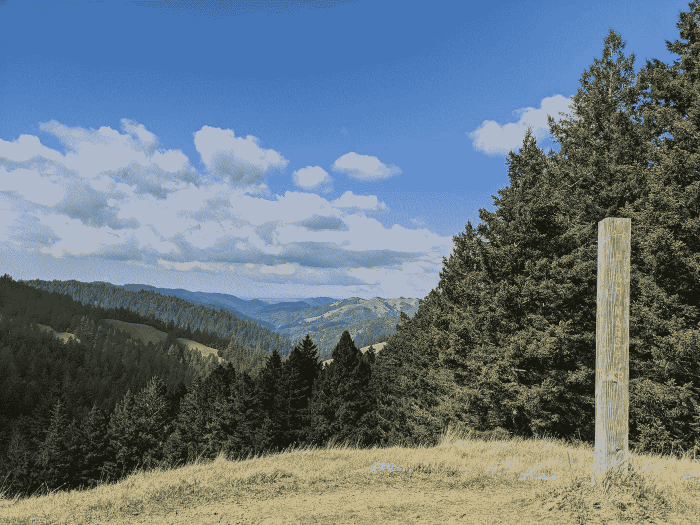

作者照片

在本教程中，我将向你展示如何实现吉布斯采样算法去噪图像。

我们的目标是通过使用吉布斯采样(一种马尔可夫链蒙特卡罗(MCMC)方法)从受损图像(右)中去除噪声来恢复真实图像(左)。

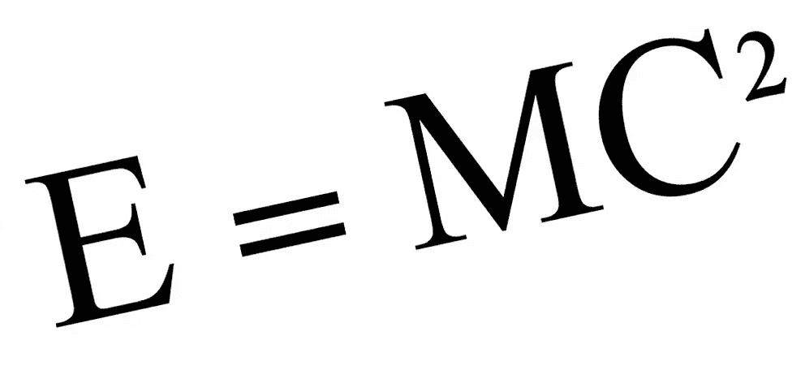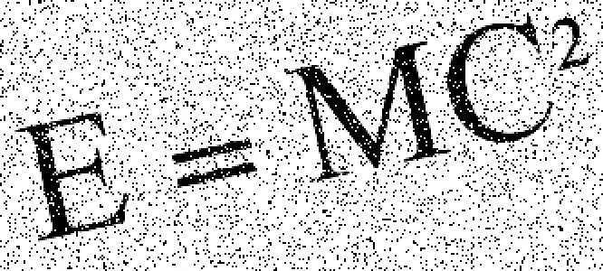

本教程分为三个部分:

1.  MCMC 和 Gibbs 抽样的理论概念
2.  这个问题的数学推导
3.  Python 中的代码实现

# MCMC 和 Gibbs 抽样

马尔可夫链蒙特卡罗(MCMC)是一种采样方法，用于通过从概率分布中随机采样并构建马尔可夫链来近似感兴趣参数的后验分布。

Gibbs 采样是一种 MCMC 算法，它生成样本的马尔可夫链，每个样本都与其直接邻居一起计算。例如，在贝叶斯网络中，每个样本仅依赖于其父节点、共同父节点和子节点；在马尔可夫随机场中，每个样本都与其马尔可夫毯相关联。这个独立性属性简化了问题，因为为了获得状态 s 的样本值，我们只需要条件概率 **P(s|s_neighbors)** 。

MCMC 算法通常有一个预烧期，在此期间样本可能不准确。因此，在预烧期后收集样本，并使用蒙特卡罗方法估计后验概率。

# 数学演绎

吉布斯采样的应用之一是图像去噪。对于我们的图像去噪问题，给定一个有噪声的图像 **X** ，目标是将其恢复到原始图像 **Y** ，未知。

我们知道一个噪声图像数组 **X *= {xij}*** ，其中***xij∈{-1，+1}*** 表示第 I 行第 j 列的像素，图像是黑白的， ***xij* = 1** 对应黑色， ***xij =* -1** 对应白色。

原始图像(无噪声) **Y** 与有噪声图像 **X** 大小相同，其中***yij*∈{-1，+1}** 表示添加噪声前 xij 的值。

去噪可以被视为概率推断，其中我们通过最大化后验分布 **p(Y|X)** 来执行最大后验(MAP)估计。由贝叶斯定理我们得到:****p(Y | X)= p(X | Y)p(Y)/p(X)***。在日志空间，这可以重写为:*

*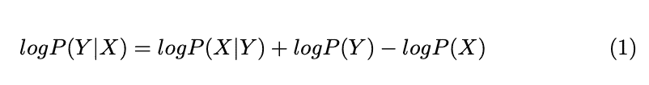*

*既然给定了 X，最大化 **log p(Y|X)** 本质上等价于最小化**—log p(X | Y)—log p(Y)**，这就是这个问题中的损失函数。*

*用于图像去噪的经典结构是成对 MRF，如下图所示。每个节点 ***yij*** 与其对应的输出 xij 和 4 个直接邻居(上、下、左、右)相连。因此，给定像素 ***yij、*** 的 5 个邻居，我们可以确定 ***yij*** 的概率分布，而无需查看其他像素。请注意，边缘上的像素具有较少的邻居。例如，y11 的邻居是 y12、y21 和 x11。为了方便起见，我们可以在实现算法时用 0 填充边缘，这样所有像素都有 5 个邻居。*

*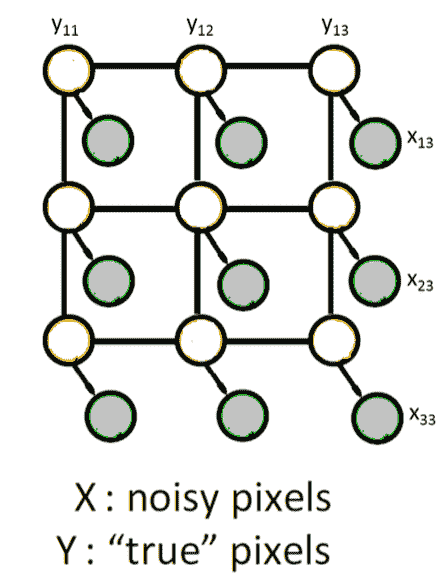*

*假设我们的后验偏好是黑色，我们想要最大化的后验是 **p(Y=1|Y_neighbors)** ，其中 **Y= { *yij* }对于 i = 1，…，N，j = 1，…，M** 。 **Y** 和 **X** 的联合概率为:*

*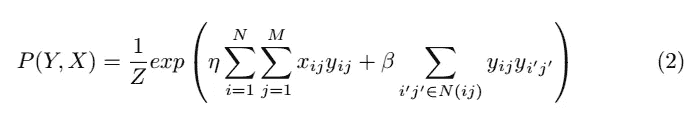*

*其中 ita( ***η*** )和 beta( ***β*** )是我们的超参数，Z 是归一化常数。 **N(ij)** 是 ***yij*** 除 ***xij*** 外的对应邻居。*

*使用贝叶斯规则，我们可以从联合分布中得到后验分布，如下所示:*

*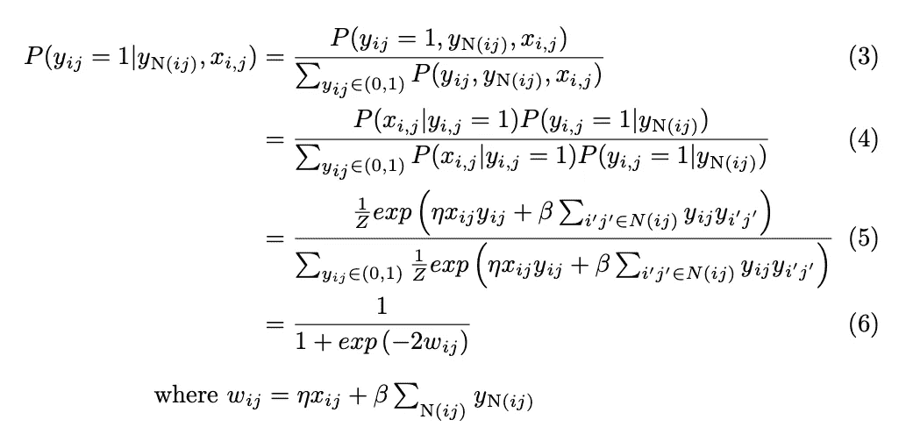*

*我们还可以得到损失函数**—log p(X | Y)——log p(Y)，**写为:*

*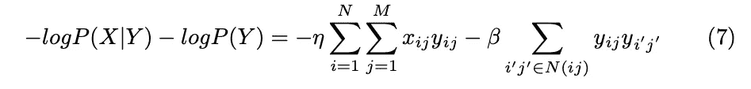*

*我们称之为能量，因为损失相当于玻尔兹曼分布中的能量，其中具有较低能量的状态总是具有较高的概率。*

*有了所有的数学方程式，现在我们可以开始了！*

*在下一节中，我们将学习如何在 Python 中实现 Gibbs 采样来恢复图像。*

# *代码实现*

*首先，我编写了一些伪代码来演示吉布斯采样的高级逻辑:*

*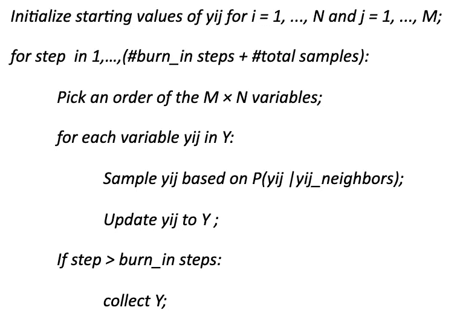*

*现在让我们深入研究代码！*

*函数`denoise_image()`是入口函数。它调用另一个函数 get_posterior 来获得估计的后验概率 **p(Y=1|Y_neighbor)** 。将阈值设置为 0.5，我们可以从后验得到恢复的图像数组 Y。接下来，我们剥离图像数组的边缘并返回它。下面的 load_image 函数解释了为什么我们需要剥离数组。*

*在`load_image()`中，我们首先将 PNG 图像读入一个 numpy 数组，然后将 RGB 图像转换为灰度，并将像素重新缩放为{-1，1}。在这里，我们添加 0 填充到边缘，以帮助我们在以后搜索每个像素的邻居时处理拐角情况。*

*现在我们可以跳到`get_posterior`函数中的主要逻辑实现。*

*在加载噪声图像 **X** 并随机初始化恢复图像 **Y** 之后，我们开始循环采样 **Y** 并计算后验概率 **P(Y|Y_neighbor)** 。*

*在每一步，我们迭代 I，j，通过调用函数`sample_y()`对 **Y** 中的每个像素 ***yij*** 进行采样，并用采样值 ***yij*** 更新 **Y** 。我们还跟踪能量(等式 6)，以便稍后可以可视化收敛。当老化期结束时，我们对 Y 中的 *yij* 的事件 ***yij* = 1 的总发生次数进行求和。***

*一旦采样完成，我们使用蒙特卡罗方法来获得后验概率，这实质上是将 **Y** 的聚合值除以总样本数。*

*每个样品 ***yij*** 是怎么得到的？我们来看看函数`sample_y()`。*

*`sample_y()`功能需要 4 个输入:行和列索引 I 和 j、恢复图像阵列 **Y** 和噪声图像阵列 **X** 。该函数搜索 ***yij*** 的邻居***yij _ neighbors***并根据**等式(5)** 计算条件概率**P(*yij = 1 | yij _ neighbors*)**。*

****yij*** (1 或-1)的值用条件概率采样并由函数返回。*

*最后，我们有两个助手函数。*

*`plot_energy()`将节省的能量可视化，`save_image()`帮助将去噪后的图像 numpy 数组转换为 PNG 图像。*

*现在，让我们把所有东西放在`main`模块中。*

*我们指定超参数 ita( ***η*** )和 beta( ***β*** )、总样本数和老化步骤。我们还设置了一个日志路径来记录能量。*

*来自`denoise_image()`的输出降噪 _img 是恢复的图像阵列 **Y** 。*

*经过 100 步老化和 1000 步采样，我们可以看到我们的吉布斯采样做了一个体面的工作恢复损坏的图像，如下所示。*

*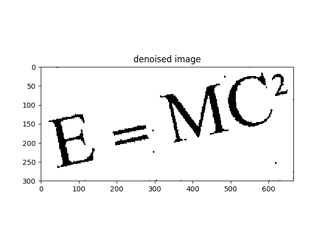*

*我们也可以检查能量汇聚。从下图中，我们发现虽然图像 **Y** 被随机初始化，但是能量很快收敛到一个低值。*

*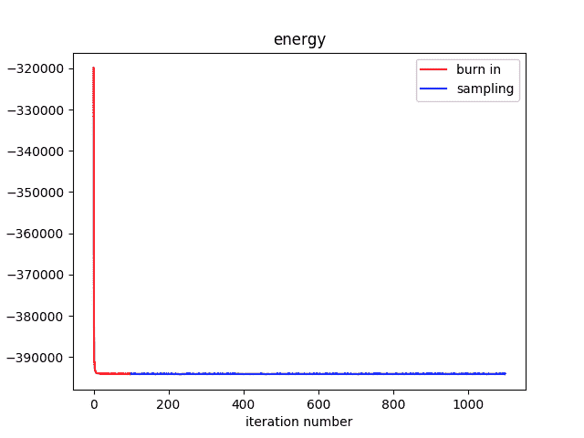*

*就是这样！你可以在我的 [Github](https://github.com/VXU1230/Medium-Tutorials/tree/master/mcmc_gibbs) 上找到完整的代码实现。*

# *我们从这篇文章中学到了什么*

1.  *马尔可夫链蒙特卡罗(MCMC)和吉布斯抽样；*
2.  *基于成对马尔可夫随机场模型的地图推理:*
3.  *如何在 Python 中对图像去噪应用 Gibbs 采样*

*我希望你喜欢这篇文章:)*

# *参考*

1.  *[马尔可夫随机场和吉布斯采样用于图像去噪](http://stanford.edu/class/ee367/Winter2018/yue_ee367_win18_report.pdf)*
2.  *[采样方法](https://ermongroup.github.io/cs228-notes/inference/sampling/)*