# 基于 OpenCV 和 Python 的图像增强技术

> 原文：<https://towardsdatascience.com/image-enhancement-techniques-using-opencv-and-python-9191d5c30d45?source=collection_archive---------5----------------------->

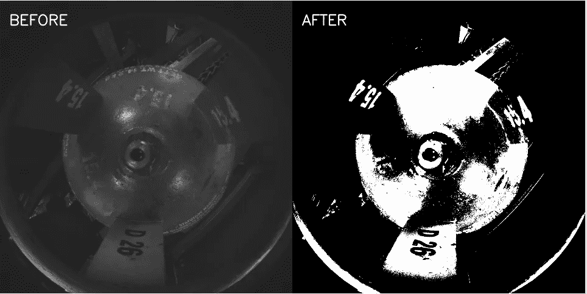

作者图片

在这篇博文中，我将展示如何使用图像处理技术从低分辨率/模糊图像/低对比度图像中提高质量并提取有意义的信息。

让我们开始这个过程:

我有一个在传送带上运行的从仓库中取出的液化石油气钢瓶的样本图像。我的目的是找出石油气瓶的批号，以便我可以更新有多少石油气瓶已经过质量检查。

步骤 1:导入必要的库

```
**import** cv2
**import** numpy **as** np
**import** matplotlib.pyplot **as** plt
```

步骤 2:加载图像并显示示例图像。

```
img= cv2.imread(**'cylinder1.png'**)
img1=cv2.imread(**'cylinder.png'**)
images=np.concatenate(img(img,img1),axis=1)
cv2.imshow(**"Images"**,images)
cv2.waitKey(0)
cv2.destroyAllWindows()
```

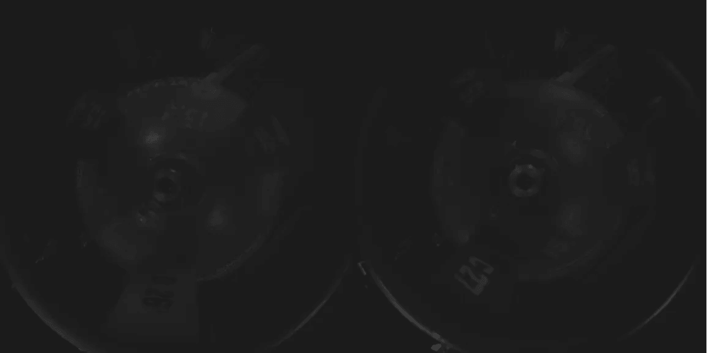

作者提供的(a)批次-D26 (b)批次 C27 的液化石油气钢瓶图片

正如你所看到的，图像的对比度很差。我们几乎认不出批号。这是雷电条件不合适的仓库常见的问题。进一步将讨论对比度受限的自适应直方图均衡化，并尝试在数据集上实验不同的算法。

步骤 3:将图像转换成灰度图像

```
gray_img=cv2.cvtColor(img,cv2.COLOR_BGR2GRAY)
gray_img1=cv2.cvtColor(img1,cv2.COLOR_BGR2GRAY)
```

步骤 4:现在我们找出灰度图像的直方图，并寻找强度的分布。

```
hist=cv2.calcHist(gray_img,[0],**None**,[256],[0,256])
hist1=cv2.calcHist(gray_img1,[0],**None**,[256],[0,256])
plt.subplot(121)
plt.title(**"Image1"**)
plt.xlabel(**'bins'**)
plt.ylabel(**"No of pixels"**)
plt.plot(hist)
plt.subplot(122)
plt.title(**"Image2"**)
plt.xlabel(**'bins'**)
plt.ylabel(**"No of pixels"**)
plt.plot(hist1)
plt.show()
```

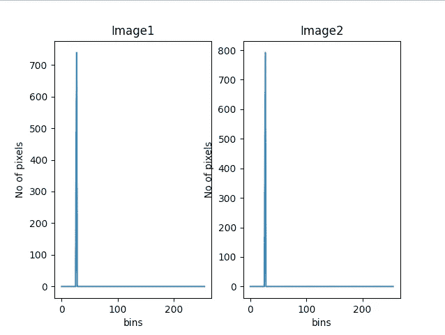

步骤 5:现在我们将使用 cv2.equalizeHist()函数来均衡给定灰度图像的对比度。cv2.equalizeHist()函数使亮度正常化，同时增加对比度。

```
gray_img_eqhist=cv2.equalizeHist(gray_img)
gray_img1_eqhist=cv2.equalizeHist(gray_img1)
hist=cv2.calcHist(gray_img_eqhist,[0],**None**,[256],[0,256])
hist1=cv2.calcHist(gray_img1_eqhist,[0],**None**,[256],[0,256])
plt.subplot(121)
plt.plot(hist)
plt.subplot(122)
plt.plot(hist1)
plt.show()
```

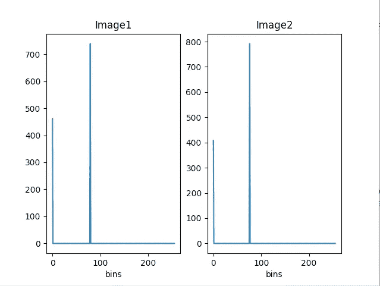

步骤 6:显示灰度直方图均衡化的图像

```
eqhist_images=np.concatenate((gray_img_eqhist,gray_img1_eqhist),axis=1)
cv2.imshow(**"Images"**,eqhist_images)
cv2.waitKey(0)
cv2.destroyAllWindows()
```

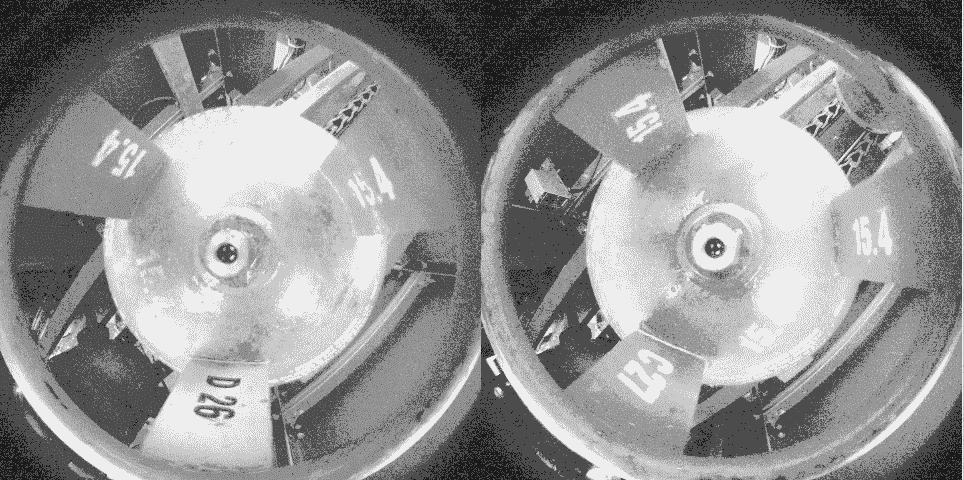

灰度直方图均衡化

让我们进一步深入了解 CLAHE

第七步:

对比度受限的自适应直方图均衡化

该算法可用于提高图像的对比度。该算法通过创建图像的几个直方图来工作，并使用所有这些直方图来重新分配图像的亮度。CLAHE 可以应用于灰度图像和彩色图像。有两个参数需要调整。

1.  设定对比度限制阈值的限幅限制。默认值为 40
2.  tileGridsize 设置行和列中标题的数量。在应用 cla 时，图像被分成称为图块(8*8)的小块，以便执行计算。

```
clahe=cv2.createCLAHE(clipLimit=40)
gray_img_clahe=clahe.apply(gray_img_eqhist)
gray_img1_clahe=clahe.apply(gray_img1_eqhist)
images=np.concatenate((gray_img_clahe,gray_img1_clahe),axis=1)
cv2.imshow(**"Images"**,images)
cv2.waitKey(0)
cv2.destroyAllWindows()
```

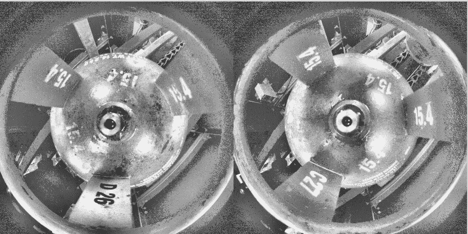

克拉赫

第八步:

阈值技术

阈值化是一种简单而有效的方法，用于将图像分割成前景和背景。最简单的阈值处理方法是，如果像素强度小于某个预定义的常数(阈值)，则用黑色像素替换源图像中的每个像素，如果像素强度大于阈值，则用白色像素替换。不同类型的阈值是:-

cv2。THRESH_BINARY

cv2。阈值 _ 二进制 _INV

cv2。TRUNC 阈值

cv2。阈值为零

cv2。THRESH_TOZERO_INV

cv2。OTSU 阈值

cv2。阈值三角形

尝试更改阈值和 max_val 以获得不同的结果。

```
th=80
max_val=255
ret, o1 = cv2.threshold(gray_img_clahe, th, max_val, cv2.THRESH_BINARY)
cv2.putText(o1,**"Thresh_Binary"**,(40,100),cv2.FONT_HERSHEY_SIMPLEX,2,(255,255,255),3,cv2.LINE_AA)
ret, o2 = cv2.threshold(gray_img_clahe, th, max_val, cv2.THRESH_BINARY_INV)
cv2.putText(o2,**"Thresh_Binary_inv"**,(40,100),cv2.FONT_HERSHEY_SIMPLEX,2,(255,255,255),3,cv2.LINE_AA)
ret, o3 = cv2.threshold(gray_img_clahe, th, max_val, cv2.THRESH_TOZERO)
cv2.putText(o3,**"Thresh_Tozero"**,(40,100),cv2.FONT_HERSHEY_SIMPLEX,2,(255,255,255),3,cv2.LINE_AA)
ret, o4 = cv2.threshold(gray_img_clahe, th, max_val, cv2.THRESH_TOZERO_INV)
cv2.putText(o4,**"Thresh_Tozero_inv"**,(40,100),cv2.FONT_HERSHEY_SIMPLEX,2,(255,255,255),3,cv2.LINE_AA)
ret, o5 = cv2.threshold(gray_img_clahe, th, max_val, cv2.THRESH_TRUNC)
cv2.putText(o5,**"Thresh_trunc"**,(40,100),cv2.FONT_HERSHEY_SIMPLEX,2,(255,255,255),3,cv2.LINE_AA)
ret ,o6=  cv2.threshold(gray_img_clahe, th, max_val,  cv2.THRESH_OTSU)
cv2.putText(o6,**"Thresh_OSTU"**,(40,100),cv2.FONT_HERSHEY_SIMPLEX,2,(255,255,255),3,cv2.LINE_AA)

final=np.concatenate((o1,o2,o3),axis=1)
final1=np.concatenate((o4,o5,o6),axis=1)

cv2.imwrite(**"Image1.jpg"**,final)
cv2.imwrite(**"Image2.jpg"**,final1)
```

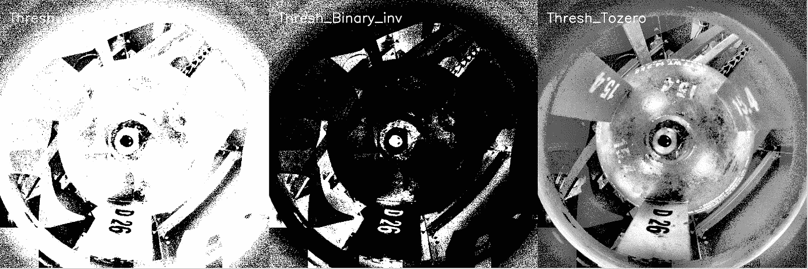

Thresh_Binary_inv，Thresh_Binary_inv，Thresh_Tozero

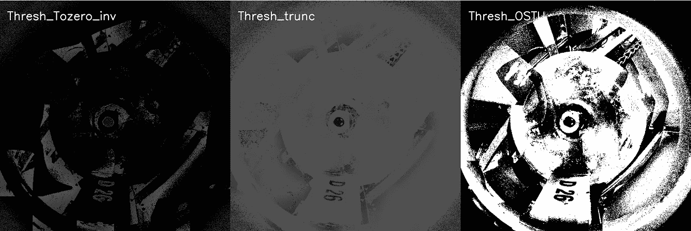

Thresh_Tozero_inv，Thresh_trunc，Thresh_OSTU

步骤 9:自适应阈值

在上一节中，我们已经使用全局阈值应用了 cv2.threshold()。正如我们所看到的，由于图像不同区域的光照条件不同，获得的结果不是很好。在这些情况下，您可以尝试自适应阈值处理。在 OpenCV 中，自适应阈值处理由函数 **cv2.adapativeThreshold()** 执行

该功能将自适应阈值应用于 src 阵列(8 位单通道图像)。maxValue 参数设置满足条件的 dst 图像中的像素值。adaptiveMethod 参数设置要使用的自适应阈值算法。

cv2。ADAPTIVE _ THRESH _ MEAN _ C:T(x，y)阈值计算为(x，y)的 blockSize x blockSize 邻域的**均值**减去 C 参数。
cv2。ADAPTIVE _ THRESH _ GAUSSIAN _ C:T(x，y)阈值计算为(x，y)的 blockSize x blockSize 邻域的**加权和**减去 C 参数。

blockSize 参数设置用于计算像素阈值的邻域的大小，它可以取值 3、5、7…等等。

C 参数只是从平均值或加权平均值中减去的常数(取决于 adaptive method 参数设置的自适应方法)。通常，该值为正值，但也可以为零或负值。

```
gray_image = cv2.imread(**'cylinder1.png'**,0)
gray_image1 = cv2.imread(**'cylinder.png'**,0)
thresh1 = cv2.adaptiveThreshold(gray_image, 255, cv2.ADAPTIVE_THRESH_MEAN_C, cv2.THRESH_BINARY, 11, 2)
thresh2 = cv2.adaptiveThreshold(gray_image, 255, cv2.ADAPTIVE_THRESH_MEAN_C, cv2.THRESH_BINARY, 31, 3)
thresh3 = cv2.adaptiveThreshold(gray_image, 255, cv2.ADAPTIVE_THRESH_GAUSSIAN_C, cv2.THRESH_BINARY, 13, 5)
thresh4 = cv2.adaptiveThreshold(gray_image, 255, cv2.ADAPTIVE_THRESH_GAUSSIAN_C, cv2.THRESH_BINARY, 31, 4)
thresh11 = cv2.adaptiveThreshold(gray_image1, 255, cv2.ADAPTIVE_THRESH_MEAN_C, cv2.THRESH_BINARY, 11, 2)
thresh21 = cv2.adaptiveThreshold(gray_image1, 255, cv2.ADAPTIVE_THRESH_MEAN_C, cv2.THRESH_BINARY, 31, 5)
thresh31 = cv2.adaptiveThreshold(gray_image1, 255, cv2.ADAPTIVE_THRESH_GAUSSIAN_C, cv2.THRESH_BINARY, 21,5 )
thresh41 = cv2.adaptiveThreshold(gray_image1, 255, cv2.ADAPTIVE_THRESH_GAUSSIAN_C, cv2.THRESH_BINARY, 31, 5)

final=np.concatenate((thresh1,thresh2,thresh3,thresh4),axis=1)
final1=np.concatenate((thresh11,thresh21,thresh31,thresh41),axis=1)
cv2.imwrite(**'rect.jpg'**,final)
cv2.imwrite(**'rect1.jpg'**,final1)
```

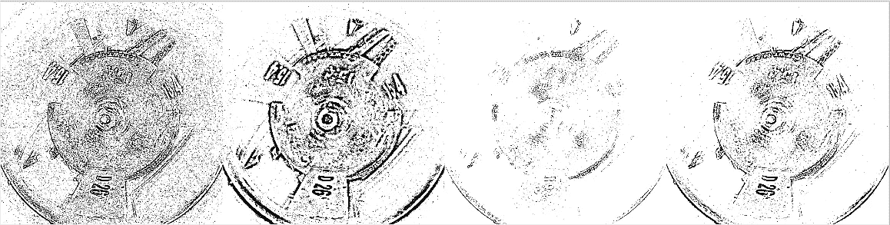

自适应阈值

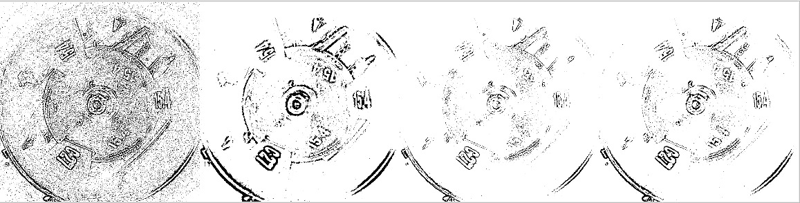

自适应阈值

第十步:

OTSU 二值化

Otsu 的二值化算法，这是一种处理双峰图像的好方法。双峰图像可以通过包含两个峰值的直方图来表征。Otsu 的算法通过最大化两类像素之间的方差来自动计算分离两个峰值的最佳阈值。等效地，最佳阈值使类内方差最小化。Otsu 的二值化算法是一种统计方法，因为它依赖于从直方图中获得的统计信息(例如，平均值、方差或熵)

```
gray_image = cv2.imread(**'cylinder1.png'**,0)
gray_image1 = cv2.imread(**'cylinder.png'**,0)
ret,thresh1 = cv2.threshold(gray_image,0, 255,  cv2.THRESH_BINARY+cv2.THRESH_OTSU)
ret,thresh2 = cv2.threshold(gray_image1,0, 255,  cv2.THRESH_BINARY+cv2.THRESH_OTSU)

cv2.imwrite(**'rect.jpeg'**,np.concatenate((thresh1,thresh2),axis=1))
```

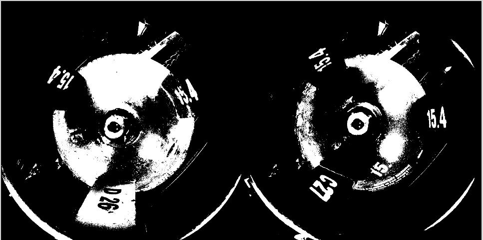

OTSU 二值化

现在，我们已经从低对比度图像中清楚地识别出批号。希望你觉得这篇博客内容丰富且有趣。

谢谢大家！！

请继续关注我的下一篇博客…

你可以通过下面的链接访问我以前的博客

在我的 Youtube 频道上关注我

[https://www.youtube.com/channel/UCSp0BoeXI_EK2W0GzG7TxEw](https://www.youtube.com/channel/UCSp0BoeXI_EK2W0GzG7TxEw)

在此与我联系:

领英:[https://www.linkedin.com/in/ashishban...](https://www.linkedin.com/in/ashishban...)

github:[https://github.com/Ashishb21](https://github.com/Ashishb21)

中:[https://medium.com/@ashishb21](https://medium.com/@ashishb21)

网址:[http://techplanetai.com/](http://techplanetai.com/)

电子邮件:techplanetai@gmail.com ashishb21@gmail.com

关注我的 Youtube 频道，观看与技术相关的视频

https://www.youtube.com/channel/UCSp0BoeXI_EK2W0GzG7TxEw

[](/building-python-source-with-opencv-and-opencv-contrib-ba95d709eb) [## 用 OpenCV 和 OpenCV Contrib 构建 Python 源代码

### 从源代码在 Ubuntu 14.0 LTS 上安装 Python 3.7

towardsdatascience.com](/building-python-source-with-opencv-and-opencv-contrib-ba95d709eb) [](/indian-actors-classification-using-deep-neural-networks-8552573f39aa) [## 使用深度神经网络的印度演员分类

### 如果你需要使用深度网络对你最喜欢的演员进行分类，该怎么办？

towardsdatascience.com](/indian-actors-classification-using-deep-neural-networks-8552573f39aa)