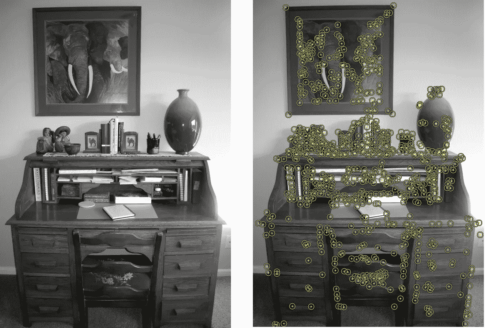
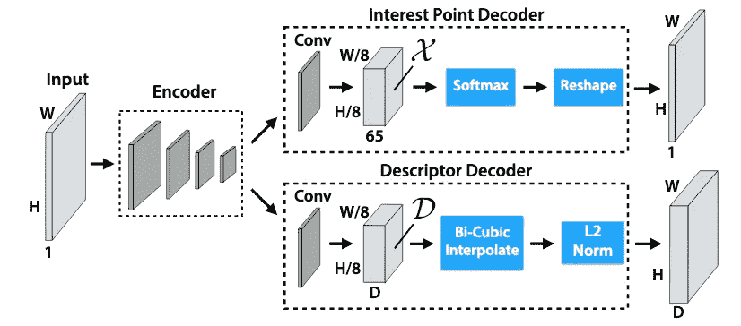
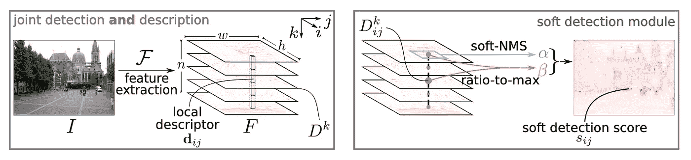
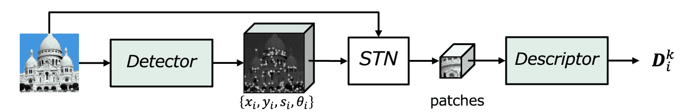
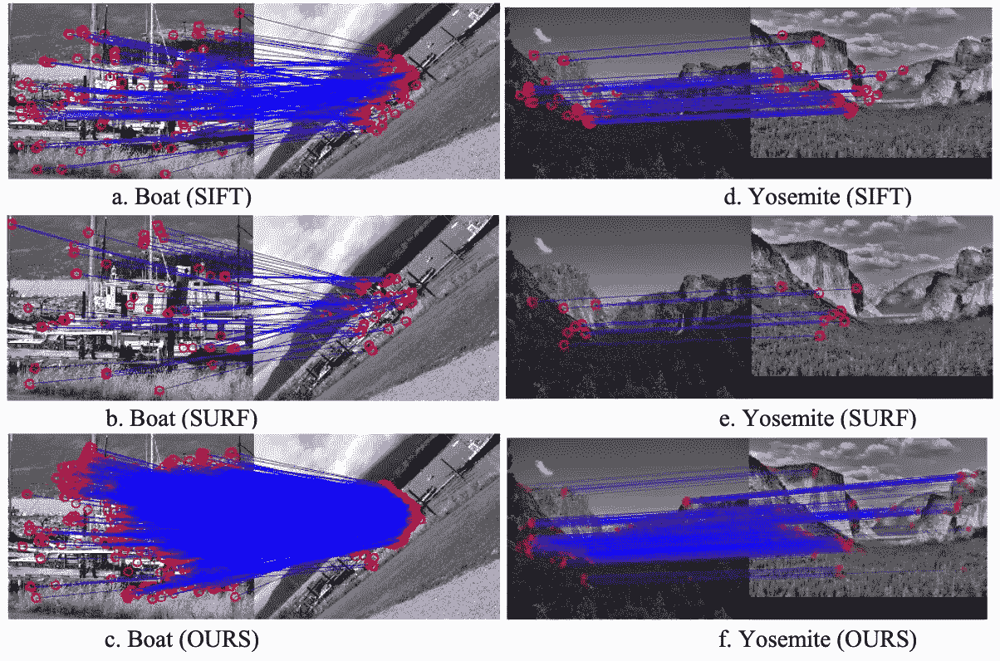
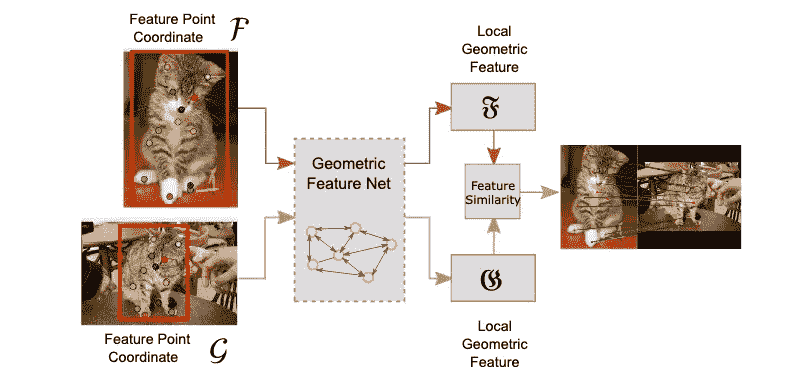

# 图像特征提取:传统和深度学习技术

> 原文：<https://towardsdatascience.com/image-feature-extraction-traditional-and-deep-learning-techniques-ccc059195d04?source=collection_archive---------1----------------------->

## 简要的综述着重于给出用于特征提取的传统和深度学习技术的概述

特征提取是计算机视觉中的一项重要技术，广泛用于以下任务:

*   物体识别
*   图像对齐和拼接(创建全景)
*   三维立体重建
*   机器人/自动驾驶汽车导航
*   还有更多…

## 什么是特性？

特征是图像中帮助识别对象的部分或模式。例如，一个正方形有四个角和四条边，它们可以被称为正方形的特征，它们帮助我们人类识别它是一个正方形。特征包括像角、边、感兴趣点的区域、脊等属性。

如下图所示，黄色点表示使用哈里斯检测技术检测到的特征。

[(src:https://commons . wikimedia . org/wiki/File:Writing _ Desk _ with _ Harris _ detector . png](https://commons.wikimedia.org/wiki/File:Writing_Desk_with_Harris_Detector.png))

## 传统特征检测技术一瞥

用于特征检测的传统计算机视觉技术包括:

*   **Harris 角点检测—** 使用高斯窗口函数来检测角点。([阅读更多](https://docs.opencv.org/3.4/dc/d0d/tutorial_py_features_harris.html))
*   **Shi-Tomasi 角点检测器—** 作者修改了 Harris 角点检测中使用的评分函数，以实现更好的角点检测技术([阅读更多信息](https://docs.opencv.org/3.4/d4/d8c/tutorial_py_shi_tomasi.html))
*   **尺度不变特征变换(SIFT)——**与前两种不同，这种技术是尺度不变的。([阅读更多](https://docs.opencv.org/3.4/da/df5/tutorial_py_sift_intro.html))
*   **加速鲁棒特征(SURF)——**顾名思义，这是 SIFT 的更快版本。([阅读更多](https://docs.opencv.org/3.4/df/dd2/tutorial_py_surf_intro.html))
*   **加速分段测试(FAST)的特征—** 这是一种比 SURF 更快的角点检测技术。([阅读更多](https://docs.opencv.org/3.4/df/d0c/tutorial_py_fast.html))
*   **二元鲁棒独立基本特征(BRIEF)——**这只是一个特征描述符，可用于任何其他特征检测器。这种技术通过将浮点数形式的描述符转换为二进制字符串来减少内存使用。([阅读更多](https://docs.opencv.org/3.4/dc/d7d/tutorial_py_brief.html))
*   **定向快速旋转简报(ORB)** — SIFT 和 SURF 已获专利，OpenCV 实验室的这种算法是它们的免费替代品，它使用快速关键点检测器和简报描述符。([阅读更多](https://docs.opencv.org/3.4/d1/d89/tutorial_py_orb.html))

## 深度学习特征提取技术一瞥

传统的特征提取器可以由卷积神经网络(CNN)代替，因为 CNN 具有提取复杂特征的强大能力，这些复杂特征更详细地表达了图像，学习特定于任务的特征，并且更有效。在这方面已经做了许多工作。下面列出了其中的一些:

*   **SuperPoint:自我监督的兴趣点检测和描述** ( [论文](https://arxiv.org/pdf/1712.07629.pdf) ) —作者提出了一个完全卷积的神经网络，它在单次正向传递中计算 SIFT 样的兴趣点位置和描述符。它使用 VGG 式编码来提取特征，然后使用两个解码器，一个用于点检测，另一个用于点描述。

超点架构(src:[https://arxiv.org/pdf/1712.07629.pdf](https://arxiv.org/pdf/1712.07629.pdf)

*   **D2 网:一个可训练的 CNN，用于局部特征的联合描述和检测** [【论文】](https://arxiv.org/pdf/1905.03561.pdf)——作者提出了一个单一的卷积神经网络，它既是密集特征描述符，又是特征检测器。

检测并描述 https://arxiv.org/pdf/1905.03561.pdf 的 D2 网络

*   **LF-Net:从图像中学习局部特征** ( [论文](https://papers.nips.cc/paper/7861-lf-net-learning-local-features-from-images.pdf) ) **—** 作者建议使用稀疏匹配深度架构，并在具有相对姿态和深度图的图像对上使用端到端训练方法。他们在第一幅图像上运行检测器，找到最大值，然后优化权重，以便在第二幅图像上运行时，产生清晰的响应图，在正确的位置具有尖锐的最大值。

LF-Net(src:[https://papers . nips . cc/paper/7861-LF-Net-learning-local-features-from-images . pdf](https://papers.nips.cc/paper/7861-lf-net-learning-local-features-from-images.pdf))

*   **基于深度学习的图像特征匹配** ( [论文](https://ieeexplore.ieee.org/abstract/document/8780936))——他们采用一种深度卷积神经网络(CNN)模型，在图像特征点匹配中关注图像块。

与 SIFT 和 SURF 相比的结果(src:[https://ieeexplore.ieee.org/abstract/document/8780936](https://ieeexplore.ieee.org/abstract/document/8780936))

*   **特征匹配问题的深度图形特征学习** ( [论文](https://openaccess.thecvf.com/content_ICCV_2019/papers/Zhang_Deep_Graphical_Feature_Learning_for_the_Feature_Matching_Problem_ICCV_2019_paper.pdf) ) —他们建议使用图形神经网络将特征点的坐标转换为局部特征，这样就可以很容易地使用简单的推理算法进行特征匹配

图神经网络(src:[https://open access . the CVF . com/content _ ICCV _ 2019/papers/张 _ Deep _ Graphical _ Feature _ Learning _ for _ the _ Feature _ Matching _ Problem _ ICCV _ 2019 _ paper . pdf](https://openaccess.thecvf.com/content_ICCV_2019/papers/Zhang_Deep_Graphical_Feature_Learning_for_the_Feature_Matching_Problem_ICCV_2019_paper.pdf)

## **结论**

虽然看起来用于特征提取的深度学习技术对缩放、遮挡、变形、旋转等更加鲁棒，并且已经突破了使用传统计算机视觉技术的极限，但这并不意味着计算机视觉技术已经过时。

## 放弃

这是一篇简短的文章，重点是概述传统的和深度学习的特征提取技术。如果你认为我可能错过了一个应该提到的算法，请在评论中留下它(将在这里加上适当的学分)。

## **参考文献**

[https://www . cs . UBC . ca/research/FLANN/uploads/FLANN/FLANN _ manual-1 . 8 . 4 . pdf](https://www.cs.ubc.ca/research/flann/uploads/FLANN/flann_manual-1.8.4.pdf)

[https://arxiv.org/pdf/1712.07629.pdf](https://arxiv.org/pdf/1712.07629.pdf)

[https://arxiv.org/pdf/1905.03561.pdf](https://arxiv.org/pdf/1905.03561.pdf)

[https://arxiv.org/ftp/arxiv/papers/1910/1910.13796.pdf](https://arxiv.org/ftp/arxiv/papers/1910/1910.13796.pdf)

[https://papers . nips . cc/paper/7861-lf-net-learning-local-features-from-images . pdf](https://papers.nips.cc/paper/7861-lf-net-learning-local-features-from-images.pdf)

【https://ieeexplore.ieee.org/abstract/document/8780936 

[https://open access . the CVF . com/content _ ICCV _ 2019/papers/张 _ Deep _ Graphical _ Feature _ Learning _ for _ the _ Feature _ Matching _ Problem _ ICCV _ 2019 _ paper . pdf](https://openaccess.thecvf.com/content_ICCV_2019/papers/Zhang_Deep_Graphical_Feature_Learning_for_the_Feature_Matching_Problem_ICCV_2019_paper.pdf)

[https://docs . opencv . org/3.4/DC/d0d/tutorial _ py _ features _ Harris . html](https://docs.opencv.org/3.4/dc/d0d/tutorial_py_features_harris.html)

[https://docs . opencv . org/3.4/D4/d8c/tutorial _ py _ Shi _ tomasi . html](https://docs.opencv.org/3.4/d4/d8c/tutorial_py_shi_tomasi.html)

[https://docs . opencv . org/3.4/da/df5/tutorial _ py _ sift _ intro . html](https://docs.opencv.org/3.4/da/df5/tutorial_py_sift_intro.html)

[https://docs . opencv . org/3.4/da/df5/tutorial _ py _ sift _ intro . html](https://docs.opencv.org/3.4/da/df5/tutorial_py_sift_intro.html)

[https://docs . opencv . org/3.4/df/dd2/tutorial _ py _ surf _ intro . html](https://docs.opencv.org/3.4/df/dd2/tutorial_py_surf_intro.html)

[https://docs.opencv.org/3.4/df/d0c/tutorial_py_fast.html](https://docs.opencv.org/3.4/df/d0c/tutorial_py_fast.html)

[https://docs.opencv.org/3.4/dc/d7d/tutorial_py_brief.html](https://docs.opencv.org/3.4/dc/d7d/tutorial_py_brief.html)

[https://docs.opencv.org/3.4/d1/d89/tutorial_py_orb.html](https://docs.opencv.org/3.4/d1/d89/tutorial_py_orb.html)